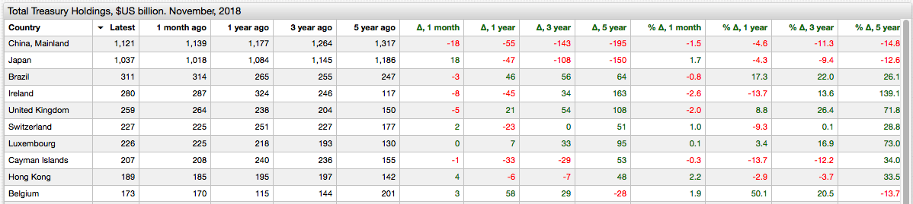

# Foreign U.S. Treasury Holders: France, Italy, and End of Year Positioning. November 2018

## Overview

* Does France know something special about the treasuries?
* Italy maintains an overall stable level, however the share of short maturities has increased rapidly.
* China and Japan, the two largest holders, offset each other.
* With 85% of treasuries sold, Russia reduced its portfolio to $13 billion, 70% of which is held in short-term T-Bills.

## Dataset

* [TIC Data](http://ticdata.treasury.gov/Publish/slt3d_globl.txt).
* The next dataset update, covering the entire calendar year of 2018, is scheduled for [February 15](https://home.treasury.gov/news/press-releases/sm600).

## Keywords

`offset`, `delta`, `merge-columns`, `csv`

## Graphics

* Top-N countries by U.S. debt holdings, November 2018.

[](https://apps.axibase.com/chartlab/42a161bc/8/)



* Uptick by France in second half of 2018 continues.

[](https://apps.axibase.com/chartlab/6ad4415b)


* Italy allocates more to short-term maturities.


* Substantial differences in maturity allocations among countries are observable.

[](https://apps.axibase.com/chartlab/42a161bc/10)


## Syntax Features

* [`merge-columns`](https://axibase.com/docs/charts/widgets/series-table/#merge-columns) setting to merge multiple series into one row.

```ls
# merge base and offset series into a single row, one per country
merge-columns = a.tags.country == b.tags.country
```

* [`time-offset`](https://axibase.com/docs/charts/widgets/shared/#time-offset) setting to load series with a time lag.

```ls
[series]
  # load series with 1 month lag
  time-offset = 1 month  
```

* [`csv`](https://axibase.com/docs/charts/syntax/control-structures.html#csv) setting to create a list of objects with the same properties for iteration.

```ls
csv offsets = alias,offset,label
      now,0 month,Now
      m1,1 month,1 month ago
      y1,1 year,1 year ago
      y3,3 year,3 years ago
      y5,5 year,5 years ago
endcsv
```
