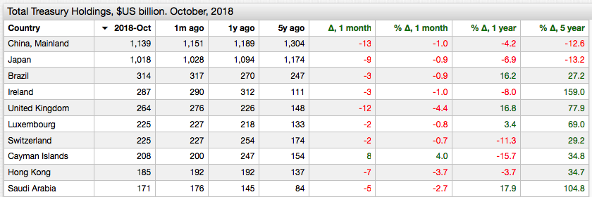

# Major Foreign Holders Reducing U.S. Treasury Holdings

## Overview

* October 2018 marks the first month when all major foreign holders, except Cayman Islands, reduced their US treasury holdings.

## Keywords

`offset`, `delta`, `merge-columns`

## Graphics

* Top-N countries by U.S. debt holdings, October 2018

[](https://apps.axibase.com/chartlab/42a161bc/4/)



## Syntax Features

* [`merge-columns`](https://axibase.com/docs/charts/widgets/series-table/#merge-columns) setting to merge multiple series into one row.

```ls
  # merge base and offset series into a single row, one per country
  merge-columns = a.tags.country == b.tags.country
```

* [`time-offset`](https://axibase.com/docs/charts/widgets/shared/#time-offset) setting to load series with a time lag.

```ls
[series]
  # load series with 1 month lag
  time-offset = 1 month  
```