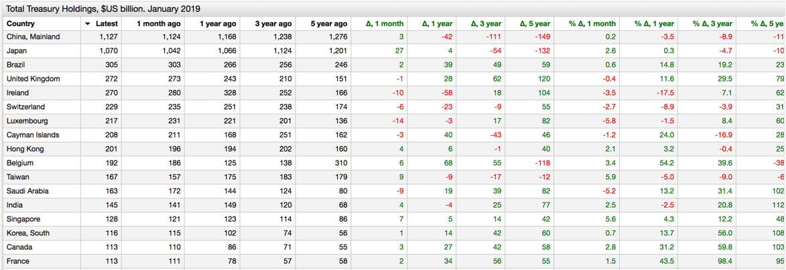
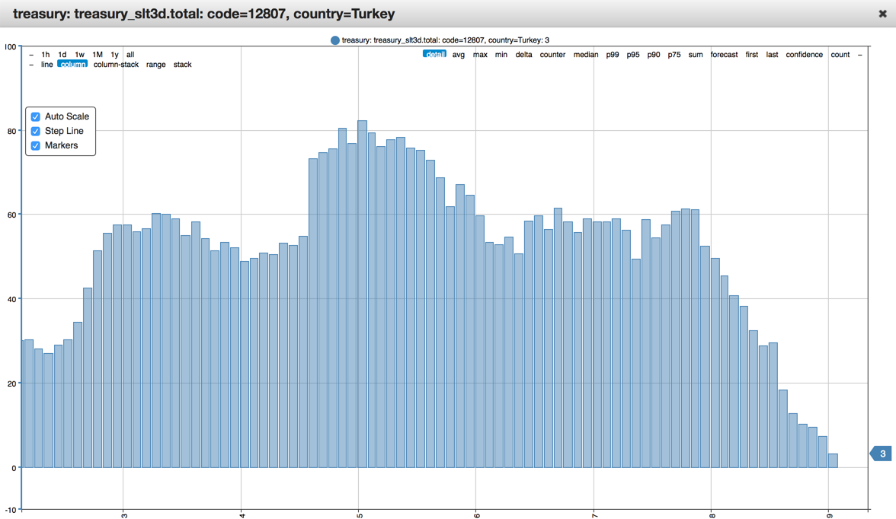

# Foreign U.S. Treasury Holders. January 2019

## Overview

* Norway's growing long-term treasury position makes sense in light of [reduced exposure](https://www.bloomberg.com/news/articles/2017-11-16/norway-s-1-trillion-wealth-fund-wants-out-of-oil-and-gas-stocks) to the oil and gas exploration sector.
* Turkey's long-term holdings are  `-93.6%` y-o-y. Is the currency crisis the only explanation or the country is following the precedent set by Russia?
* Brazil has been rapidly growing its holdings (`+14.8%` y-o-y). Is the policy set to continue under the new president?

## Graphics

* Top-N countries by U.S. debt holdings, December 2018.

[](https://apps.axibase.com/chartlab/42a161bc/12/)



* Roller-coaster by Turkey.



## Dataset

* [TIC Data](http://ticdata.treasury.gov/Publish/slt3d_globl.txt).

## Keywords

`offset`, `delta`, `merge-columns`, `csv`

## Syntax Features

* [`merge-columns`](https://axibase.com/docs/charts/widgets/series-table/#merge-columns) setting to merge multiple series into one row.

```ls
# merge base and offset series into a single row, one per country
merge-columns = a.tags.country == b.tags.country
```

* [`time-offset`](https://axibase.com/docs/charts/widgets/shared/#time-offset) setting to load series with a time lag.

```ls
[series]
  # load series with 1 month lag
  time-offset = 1 month  
```

* [`csv`](https://axibase.com/docs/charts/syntax/control-structures.html#csv) setting to create a list of objects with the same properties for iteration.

```ls
csv offsets = alias,offset,label
      now,0 month,Now
      m1,1 month,1 month ago
      y1,1 year,1 year ago
      y3,3 year,3 years ago
      y5,5 year,5 years ago
endcsv
```
