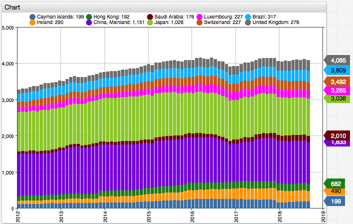
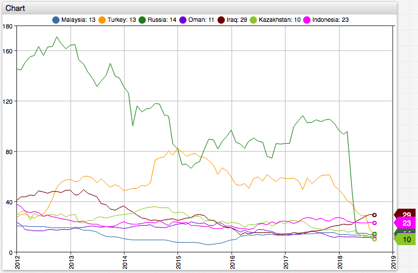
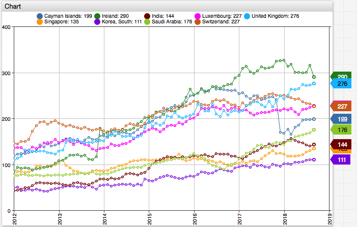

# U.S. Treasury Holdings Series Filter

## Overview

* Filtering data is an important task of any visualization with the aim of presenting evidence with the smallest amount of ['digital ink'](https://en.wikipedia.org/wiki/Edward_Tufte).
* This note illustrates several techniques to identify interesting series in the U.S. debt [foreign portfolio holdings](https://www.treasury.gov/resource-center/data-chart-center/tic/Pages/ticsec2.aspx) reported by the U.S. Treasury Department.
* The techniques rely on basic statistical and analytical functions to reduce visual clutter and to spot outliers.

## Keywords

`filter`, `visibility`, `opacity`, `enable`, `disable`, `hide`

## Graphics

* Top-N countries by U.S. debt holdings

[](https://apps.axibase.com/chartlab/42a161bc/3/)



* Countries with substantially **decreasing** holdings.

[](https://apps.axibase.com/chartlab/42a161bc/1/)



* Countries with substantially **increasing** holdings.

[](https://apps.axibase.com/chartlab/42a161bc/2/)



## Syntax Features

* [`display`](https://axibase.com/docs/charts/widgets/shared/#display) setting to hide the series both from the chart and the legend.

```ls
[series]
  # Show only top-10 countries by last reported portfolio size
  display = value >= top(10)
```

```ls
[series]
  # Hide countries (both in charts and legend) with maximum holdings during the 10 year period of less than $10B
  display = max('10 year') > 10000
```

* [`enabled`](https://axibase.com/docs/charts/widgets/shared/#enabled) setting to hide the series in the chart while allowing the user to manually show the series by clicking on its legend.

```ls
[series]
  # Show countries with greater than $100B current holdings and with 50%+ increase over the 10-year interval
  enabled = value > 100000 && last('10 year') / first('10 year') > 1.5
```