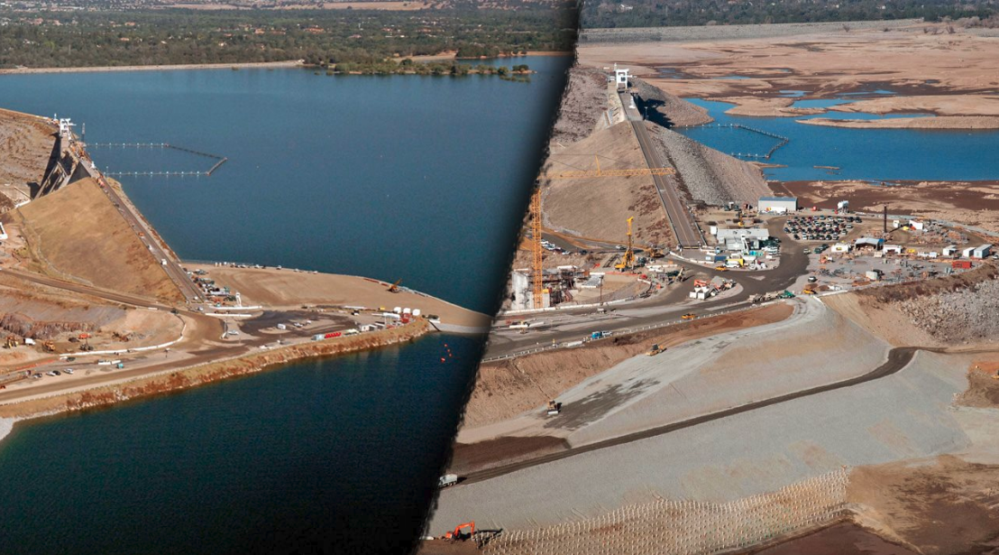
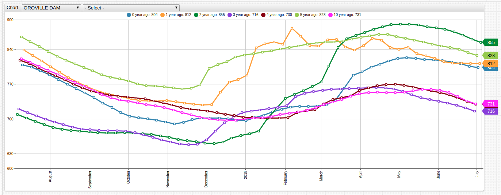
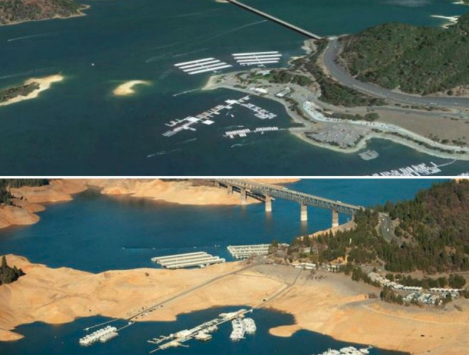
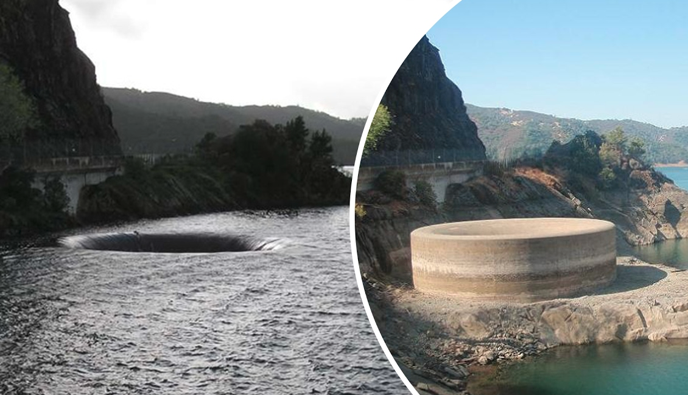
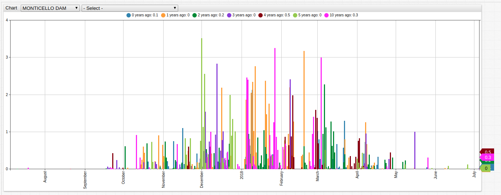
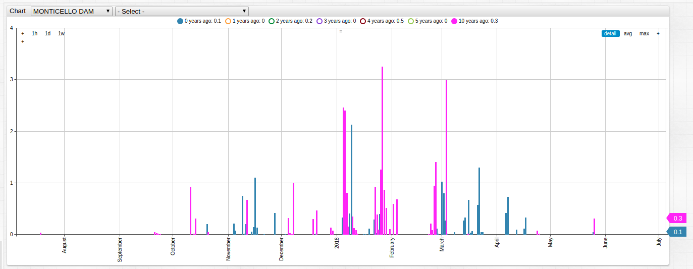
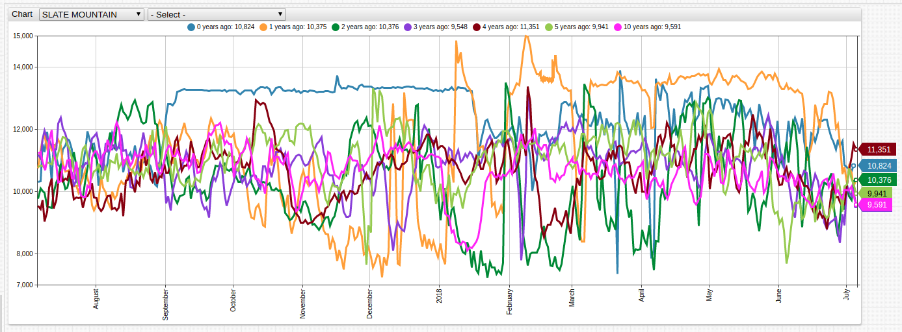

# California Water Portals

## Introduction

California tracks a number of water-related metrics concerning dams and reservoirs throughout the state. 2011 to 2014 was one of the driest periods in recorded Californian history. The resulting drought lasted until early 2017, when the number of affected countries began to diminish for the first time since 2011.

A number of factors contributed to the drought:

* Diminished rainfall, only `2/3` of the expected amount of rain fell during 2013.
* Record high temperatures during 2014, thought to be the product of either cyclical weather patterns, human-induced global climate change, or a combination of the two.
* Lack of an [El Niño Southern Oscillation](https://en.wikipedia.org/wiki/El_Ni%C3%B1o) (ENSO) cool weather cycle, known for bringing tropical conditions such as rainfall and humidity to the region.
* The state neglected to expand many of its reservoir facilities in recent years to accommodate the growing population citing environmental concerns.

The drought resulted in widespread water usage mandates across most counties in the state and once again brought the lack of comprehensive water management systems in California into focus.

Many of following portals show areas where the state has begun to recover from one of the worst recorded dry periods since United States settlers began living there in the middle of the nineteenth century while other bring to light issues that still need to be addressed.

> A complete portal with all recorded metrics and locations is available in the [Complete California Water Portal](#complete-california-water-portal) section. For instructions on recreating these portals locally, see [Validation](#validation).

## Keywords

`add-meta`, `time-offset`, `list`, `replace-value`, `drop-down`, `change-field`, `options`

---

## Reservoir Levels

Dams are built to flood valleys and create water reserves. At the height of the drought in 2014 many areas saw marked decreases in reservoir levels which have still yet to recover.


The above photographs show the Folsom reservoir, the main reservoir responsible for providing water to Sacramento, the capital of the state, in July 2011 and January 2014, respectively.

This portal tracks Folsom reservoir levels using a `time-offset` setting to display variable year data together.

```ls
list ofs = 0, 1, 2, 3, 4, 5, 10
for offs in ofs
  [series]
    label = @{offs} years ago
    time-offset = @{offs} year
```


[](https://apps.axibase.com/chartlab/002d531e#fullscreen)

The `3 years ago` trend line shows that the Folsom reservoir contained comparable water at the height of the drought as the `10 years ago` trend line representing 2008 when the state was in the midst of a [different drought](https://en.wikipedia.org/wiki/Droughts_in_California#2007%E2%80%932009).

The same 3-year period wrecked havoc on Bidwell Marina located on Lake Oroville which is almost unrecognizable as one location in the pictures below.



Despite heavy rainfall which sparked the [Oroville Dam crisis](../../research/oroville-dam/README.md), whereby the main and emergency spillways of the dam were heavily damaged, prompting almost 200 thousand citizens to be evacuated by local authorities,  water levels have continued to decline in Lake Oroville.

To compensate for the increased rainfall, use an [aggregation function](https://axibase.com/docs/charts/configuration/aggregators.html#aggregators) to smooth the trend lines. Each marker denotes the user-defined period of `1 week`.

```ls
[widget]
  group-statistic = avg
  group-period = 1 week
```



[](https://apps.axibase.com/chartlab/df8c25dc#fullscreen)

> Open either visualization to explore reservoir level data  for all recorded locations.

---

## Inflow Versus Outflow

Rainfall is one means of contributing to the capacity of a reservoir. The other primary contributing factor is tributary and parent river water flow. Many rivers reliant strictly on rainfall go dry in the summer, but many flow year round as snow melts in the mountains and eventually reach a man-made reservoir or larger body of water. This water flow is called inflow.

Reservoir stores are used for irrigation, human-use, or electricity-generating purposes, the aggregate total of which is called outflow.

Lake Shasta is considered the keystone of the [Central Valley Project](https://en.wikipedia.org/wiki/Central_Valley_Project), one of the largest water management programs in the state and managed by the federal government. Lake Shasta is also a popular recreation destination.


[](https://apps.axibase.com/chartlab/fb03cb3e#fullscreen)

Both inflow and outflow have been steadily decreasing. Previous year data is of a much higher magnitude than any other recorded year, evidence of just how desperately needed the increased rainfall of 2017 really was.

The effects of the drought did not pass over Lake Shasta.



Millerton Lake is a man-made reservoir which serves as the border between Madera and Fresco County and is used for irrigation and recreation. The lake is formed by the Friant Dam on the San Joaquin River and covers roughly 1,675 square miles.

The same trends present at Lake Shasta with respect to inflow and outflow were present at Millerton Lake as well. An additional feature of the Millerton Lake data which is not present in Lake Shasta data is the relative location of current year data. While current year inflow is among the lowest of recorded sample, current year outflow is the second greatest of the observed period.


[](https://apps.axibase.com/chartlab/29f77a22)

> Open either visualization to explore inflow and outflow data for all recorded locations using the drop-down lists.


---

## Precipitation

Rainfall is one of the largest contributors to and reasons for effective reservoir systems. While the rainfall serves to enrich the rivers which lead to the reservoir, the reservoir also serves as a physical barrier protecting downriver inhabitants from flooding and other ill effects of storm-caliber rainfall.

With the exception of 2017 precipitation levels, California continues to be mired in a more than decade-long drought which see less and less rainfall every year.

Lake Berryessa is another member of the family of water bodies contributing to sustaining the electrical grid in the San Francisco bay area, and precipitation levels continue to decrease every year. An interesting feature of the lake is the unique spillway known as the Glory Hole. This 200-foot sheer drop channels excess water from the reservoir but experienced a decade of inactivity during the period of limited rains.



The lake is dammed by the Monticello Dam, where detailed precipitation data is tracked.



[](https://apps.axibase.com/chartlab/c0dadeb1#fullscreen)

Immediately visible is that current year data is barely noticeable among other samples. Use the `time period` labels at the top of the visualization to compare `10 years ago` and `0 years ago` or open the **ChartLab** portal where other data is excluded.

```ls
list ofs = 0, 10
for offs in ofs
```



[](https://apps.axibase.com/chartlab/675bcffc#fullscreen)

---

## Conclusion

Historian and California resident Victor Davis Hanson writes [at length](http://victorhanson.com/wordpress/the-underbelly-of-the-california-drought/#more-8695) about the problems facing California if legislators choose to continue to ignore the potentially imminent water crisis. Each drought season appears to be worse than the previous as the population of the state continues to grow and the number of viable water resources decrease almost unchecked.

The dangers of a water shortage in one of the most populous states in the country (and home to Axibase Headquarters, no less) can bring to a grinding halt Silicon Valley, a place which has long considered itself above, or at least unaffected by, the machinations of the natural world.

It seems that Mother Nature desires to remind Bay Area technocrats just how wrong they really are.

## Complete California Water Portal

This portal contains two drop-down lists with all recorded metrics for all recorded locations. Open the portal and explore the complete dataset.



[](https://apps.axibase.com/chartlab/b9d5fe13#fullscreen)

> Note that not all metrics are available for all locations. Stored data is based on its availability from the State of California.

## Validation

California Water Portals data is not uniform for all sites. Many sites are missing data or contain inconsistent data sets. Download the data used for this article from `cdec.water.gov`.

1. Install [ATSD](https://axibase.com/docs/atsd/installation/) or launch the database [Docker image](https://axibase.com/docs/atsd/installation/docker.html).
1. Import data using [CSV Parser](https://axibase.com/docs/atsd/api/data/ext/csv-upload.html).
1. Review the [**ChartLab** tutorial](../../tutorials/shared/chartlab.md).