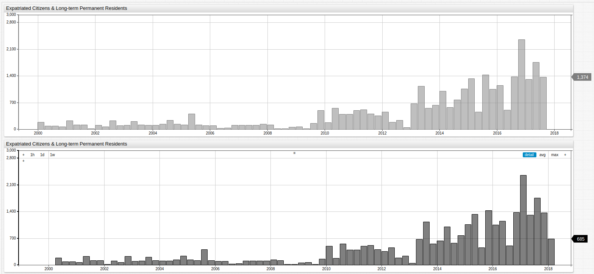
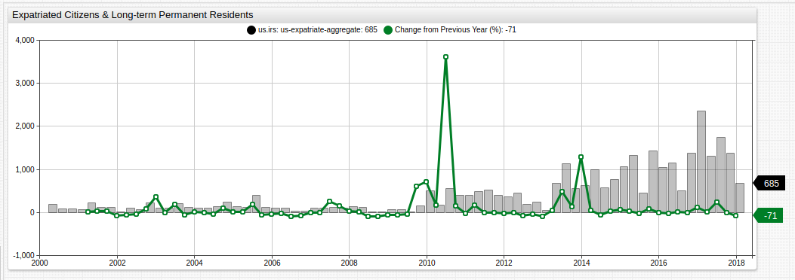
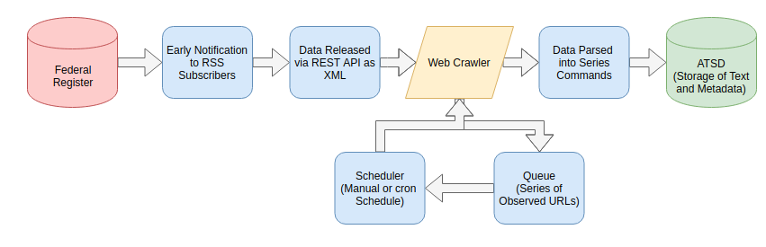

# Tracking Expatriation with ChartLab, SQL, and Web Crawler in ATSD


### Introduction

Each year the Internal Revenue Service of the United States releases expatriation information about American citizens via the [Federal Register](https://www.federalregister.gov/), the government's self-described daily journal. It's interesting to note that the reason the IRS publishes this informaton, or tracks it all, is to levy the [Expatriation Tax](https://www.irs.gov/individuals/international-taxpayers/expatriation-tax). The tax doesn't apply to just anyone who decides to leave the country and renounce their citizenship, only to those soon-to-be-former citizens who qualify as "covered expatriates."

A covered expatriate must meet one of the following criteria:

* Your average annual net income tax for the 5 years ending before the date of expatriation or termination of residency is more than a specified amount that is adjusted for inflation ($151,000 for 2012, $155,000 for 2013, $157,000 for 2014, and $160,000 for 2015).
* Your net worth is $2 million or more on the date of your expatriation or termination of residency.
* You fail to certify on Form 8854 that you have complied with all U.S. federal tax obligations for the 5 years preceding the date of your expatriation or termination of residency.

As observed [last year](/../master/Expatriation_Q2), citizens from the United States were leaving the country at previously unseen levels against the backdrop of one of the more contentious recent presidential elections.


[](https://apps.axibase.com/chartlab/61a855b0#fullscreen)

*Fig 1.* Open the ChartLab visualization above to compare the previous quarter's data (upper visualization) to the current quarter's data (lower visualization). 

### ChartLab

ChartLab is a visualization sandbox that features convenient syntax with robust output. The above visualization may be manipulated to produce several impressions of the same dataset by any level of user. Although not required, a basic understanding of any programming language is helpful when using ChartLab.

A number of built-in [statistical functions](https://github.com/axibase/atsd/blob/master/rule-engine/functions-statistical.md) are already supported in any ChartLab instance, and [user-defined functions](https://github.com/axibase/atsd-use-cases/blob/master/how-to/shared/trends.md#user-defined-functions) may be added to a local ATSD instance. Follow these [instructions](https://github.com/axibase/charts/blob/master/syntax/udf.md#deploying-function-files) to upload a user-defined function as a JavaScript file.


[](https://apps.axibase.com/chartlab/a14a69a4#fullscreen)

*Fig 2.* The above visualization uses the `ChangeFromPreviousYear` user-defined function. While the absolute value of U.S. expatriates was the greatest during 2016-2017, the greatest relative change was actually obsevered several years ago.

While the underlying function is quite complex:

```sql
value = var v = value('cpi'); var p = value('prev_cpi'); if(p!=null && v!=null) return (v / p - 1) * 100
```

The syntax required in the ChartLab UI is simple:

```sql
value = fred.PercentChangeFromYearAgo('raw')
```

> View the complete [`fred.js`](https://github.com/axibase/atsd-use-cases/blob/master/how-to/shared/trends.md#fred-library) library here.

Customized data monitoring in ATSD is possible using [`alert-expressions`](https://axibase.com/products/axibase-time-series-database/visualization/widgets/time-chart/#tab-id-14) whereby user-specified parameters may be defined to trigger alarms based on incoming data.

Here, alert expressions are applied are to static data, but they may be easily applied to dynamic data and used for systems monitoring as seen in this [example](https://apps.axibase.com/chartlab/67aa3b61) which is monitoring one of the Axibase servers right now.


[](https://apps.axibase.com/chartlab/95617f2b)

*Fig 3.* The `alert-expression` used here highlights quarters where the percent change from the previous year was greater than 50% in red, and quarter where it was less than -10% in green.

The syntax for the `alert-expression` above is shown here:

```sql
    alert-expression = value > 50 ? 4000 : value < -10 ? -100 : 0
    alert-style = if (alert > 50) return 'color:red'
    alert-style = if (alert < -10) return 'color:green'
```

For more information about ChartLab syntax or to explore other features see the complete [ChartLab documentation](https://axibase.com/products/axibase-time-series-database/visualization/widgets/).

### SQL

Axibase Time Series Database features the funcionality of an SQL-like tool called [SQL Console](https://github.com/axibase/atsd/blob/master/sql/README.md). Expatriation data may be queried to create tabular representations not typically available in non-relational databases, thus negating the traditionally-understood sacrifice in data consistency associated with such modern databases.

```sql
SELECT date_format(time, 'yyyy') AS "Year", 
  count(value) AS "Year Total", 
  count(value)-lag(count(value)) AS "Y-o-Y Change", 
  100*(count(value)-lag(count(value)))/lag(count(value)) AS "Y-o-Y Change, %"
FROM "us-expatriate-counter"
  WHERE entity = 'us.irs' AND datetime <= '2018-01-01T00:00:00Z'
GROUP BY period(1 YEAR, END_TIME)
  ORDER BY period(1 YEAR, END_TIME)
```

| Year | Year Total | Y-o-Y Change | Y-o-Y Change, % | 
|------|------------|--------------|-----------------| 
| 2000 | 430        | null         | null            | 
| 2001 | 488        | 58.00        | 13.49           | 
| 2002 | 503        | 15.00        | 3.07            | 
| 2003 | 550        | 47.00        | 9.34            | 
| 2004 | 631        | 81.00        | 14.73           | 
| 2005 | 745        | 114.00       | 18.07           | 
| 2006 | 279        | -466.00      | -62.55          | 
| 2007 | 470        | 191.00       | 68.46           | 
| 2008 | 229        | -241.00      | -51.28          | 
| 2009 | 741        | 512.00       | 223.58          | 
| 2010 | 1531       | 790.00       | 106.61          | 
| 2011 | 1780       | 249.00       | 16.26           | 
| 2012 | 932        | -848.00      | -47.64          | 
| 2013 | 2999       | 2067.00      | 221.78          | 
| 2014 | 3411       | 412.00       | 13.74           | 
| 2015 | 4273       | 862.00       | 25.27           | 
| 2016 | 5398       | 1125.00      | 26.33           | 
| 2017 | 5128       | -270.00      | -5.00           | 

*Fig 4.* The table above shows the results of a query which tracks absolute and percentile year-on-year change in expatriate numbers, similar to the *Fig 2* and *Fig 3* above.

The above query uses several [`LAG`](https://github.com/axibase/atsd/tree/master/sql#lag) clauses to quickly select the previous value, offset by one index position, when creating comparative tables like the one shown here.

Likewise, data may be tracked by quarter using the query below:

```sql
SELECT CEIL(CAST(date_format(time, 'M') AS NUMBER)/3) AS "Quarter", date_format(time, 'yyyy') AS "Year", 
  count(value) AS "Quarter Total"
FROM "us-expatriate-counter"
  WHERE entity = 'us.irs' AND date_format(time, 'yyyy-MM') >= '2013-01' AND datetime <= now
GROUP BY period(1 QUARTER)
  ORDER BY period(1 QUARTER)
```

```sql
| Quarter | Year | Quarter Total | 
|---------|------|---------------| 
| 1       | 2013 | 679           | 
| 2       | 2013 | 1129          | 
| 3       | 2013 | 560           | 
| 4       | 2013 | 631           | 
| 1       | 2014 | 999           | 
| 2       | 2014 | 576           | 
| 3       | 2014 | 775           | 
| 4       | 2014 | 1061          | 
| 1       | 2015 | 1331          | 
| 2       | 2015 | 459           | 
| 3       | 2015 | 1426          | 
| 4       | 2015 | 1057          | 
| 1       | 2016 | 1154          | 
| 2       | 2016 | 506           | 
| 3       | 2016 | 1379          | 
| 4       | 2016 | 2359          | 
| 1       | 2017 | 1313          | 
| 2       | 2017 | 1756          | 
| 3       | 2017 | 1374          | 
| 4       | 2017 | 685           | 
```

*Fig 5.* Tracked by quarter, expatriation data since 2013 is shown in the table above.

The above query uses a [`CAST`](https://github.com/axibase/atsd/tree/master/sql#cast) clause and [`CEIL`](https://github.com/axibase/atsd/tree/master/sql#mathematical-functions) mathematical function to rename each quarter. A `CAST` clause allows incoming data to be output as either a string or number, depending on need.

### Web Crawler

A web crawler is a tool similar to those used by indexing services like Google, Bing, or Duck Duck Go which searches a URL or collection of URLs looking for a specifically-defined piece of information. In the case of a search engine, this is usually a set of keywords and parameters input by a user into a search bar on the companies site. In the case of expatriation data and ATSD, Axibase developers have written a [Web Crawler](https://github.com/axibase/atsd-data-crawlers/tree/irs-expatriation-data-crawler#irs-expatriation-statistics-data-crawler) specifically for the task of tracking Federal Register publications for new expatriation data releases.

The Web Crawler operates according to the following workflow:


