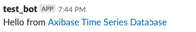
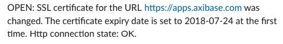
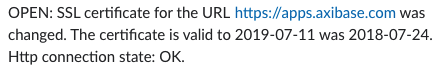
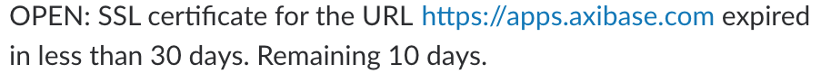
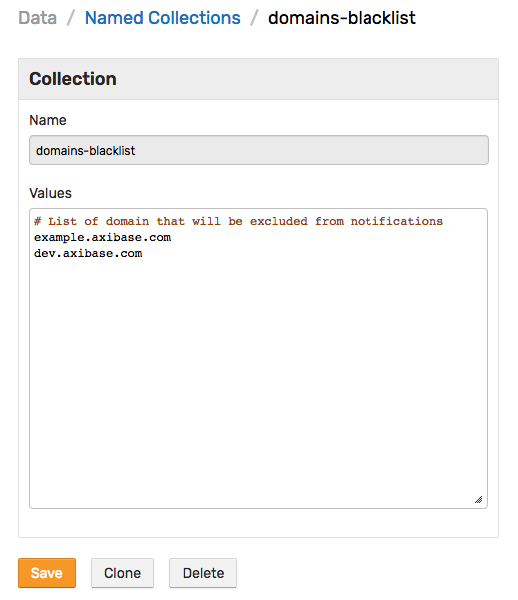

# How to Monitor SSL Certificates Expiry Dates for subdomains

## Overview

[Axibase Collector](https://github.com/axibase/axibase-collector/#overview) provides tools to collect information about SSL certificates. The data stored in [ATSD](https://github.com/axibase/atsd) can be useful to monitor SSL certificates for the subdomains of a top domain and notify a user via [Slack](https://slack.com/) using web notifications triggered by the [rule engine](https://github.com/axibase/atsd/tree/master/rule-engine#overview) that norify when the certificate's expiry date is approaching or when the date has been changed. The list of subdomains can be queried using SQL from the database used by [crt.sh](https://crt.sh) portal created by [Comodo](https://www.comodo.com) Group.

### Tools and resources

The following tools and resources are used in this tutorial:

- [crt.sh](https://crt.sh) - Certificate Transparency Log search engine using for retrieving information about SSL certificates which the Comodo Group has issued. The portal provides open access to their database;

- [atsd-sandbox](https://github.com/axibase/dockers/tree/atsd-sandbox#overview) - Docker image running *ATSD* and *Collector* on one machine.

## Procedure

1. [Prepare job and rules for domain](#prepare-files-for-domain);

2. [Configure and launch ATSD Sandbox](#configure-and-launch-atsd-sandbox);

3. [Begin receiving notifications](#receive-notification).

### Prepare files for domain

Create a directory where the tutorial's files will be stored and in the terminal navigate to the newly-created directory.

```bash
mkdir tutorial && cd ./tutorial
```

### Configure Slack Notifications

ATSD Sandbox may pass a path to a file containing web notification properties as the parameters.
Specify actual Bot User OAuth Access `token` and `channels` for notifications in `slack.properties` file. For more information about the configuration, you can follow this [reference](https://github.com/axibase/dockers/tree/atsd-sandbox#web-notifications-configuration).

```bash
touch slack.properties && printf "token=xoxb-************-************************\nchannels=general\n" > slack.properties
```

### Configure and launch ATSD Sandbox

Current job file contains placeholder `${ENV.TOP_DOMAIN}` domain name instead of a real domain name. Set `TOP_DOMAIN` environment variable to real domain name and *Collector* will replace it with variable name during import process. In the following command changes `TOP.DOMAIN` is set to [axibase.com](https://axibase.com).

Start *ATSD Sandbox* passing procedure to the configuration's files paths by pre-defining [environment variables](https://github.com/axibase/dockers/tree/atsd-sandbox#container-parameters) in the sandbox launch command:

```bash
docker run -d -p 8443:8443 -p 9443:9443 -p 8081:8081 \
  --name=atsd-sandbox \
  --volume $(pwd):/import \
  --env TOP_DOMAIN=axibase.com \
  --env ATSD_IMPORT_PATH='https://raw.githubusercontent.com/axibase/atsd-use-cases/dev-howto-monitor-ssl-for-domains/how-to/atsd-sandbox/monitor-ssl-expiry-dates/resources/ssl-certificates-files.tar.gz' \
  --env COLLECTOR_IMPORT_PATH='https://raw.githubusercontent.com/axibase/atsd-use-cases/dev-howto-monitor-ssl-for-domains/how-to/atsd-sandbox/monitor-ssl-expiry-dates/resources/job_http_subdomains-ssl-certificates.xml' \
  --env SLACK_CONFIG="slack.properties" \
  axibase/atsd-sandbox:latest
```

### Receive Notifications

If the procedure was properly completed, ATSD will send a test notification to Slack.



After that, *Collector* will run the imported job and *ATSD* should receive newly-collected data and notify that certificate date was set to some date.

 

In case of changing SSL certificate you will receive following notification:



If certificate's expiration is approaching and number of remaining days is less than 30 you will receive a appropriate notification.



#### Disable Unnecessary Notifications

To disable notifications for a list of domains, edit the collection containing the blacklist.

To open the collection login to the *ATSD* interface located on `https://localhost:8443` with default credentials:

```properties
user=axibase
password=axibase
```

Using menu go to `Data > Named Collections` page and select `domains-blacklist`. The list contains domains - one per line. For example, the following list:



contains two elements: `example.axibase.com`, `dev.axibase.com`. And after saving the list notifications for these domains will be turned off.

## Troubleshooting

If you didn't receive any notifications within 1-2 minutes, review *ATSD Sandbox* `start.log` file with the following command to ensure proper execution.

```bash
docker logs atsd-sandbox
```
