# Enhancing Route53 Health Status Alarms with ATSD

## Overview

Route53 may be configured to send email notifications based on customizable [rules](https://github.com/axibase/atsd/tree/master/rule-engine#rule-engine) whereby the system monitors incoming data from endpoint health checks and notifies specified users via email with reports upon endpoint failure or continual timeout. Follow this process to enable email notifications from Route53.

## Initial Configuration

1. In the Amazon Web Services interface, navigate to Route53 by opening the **Services** drop-down menu in the upper toolbar and clicking **Route53** under the **Networking and Content Delivery** section.

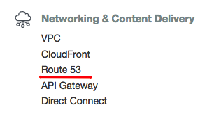

2. Select **Health Checks** from the toolbar on the left and click **Create Health Check**. Note that if you have not yet set up Route53 services with your AWS account, you will need to click through an introductory screen before completing this step.

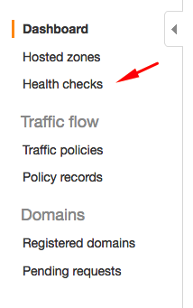

3. Configure a new end point health check on the form shown below. Specify the **Domain Name** to monitor the status of a specific website and define the path you would like to monitor. Click **Next**.

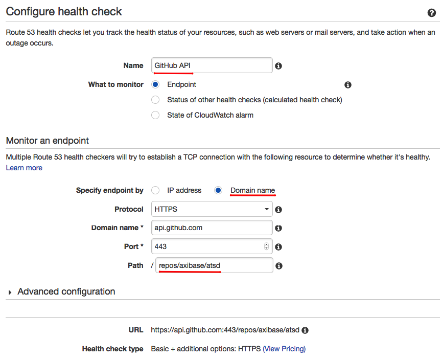

4. On the following page, configure an alarm based on the newly created health check.

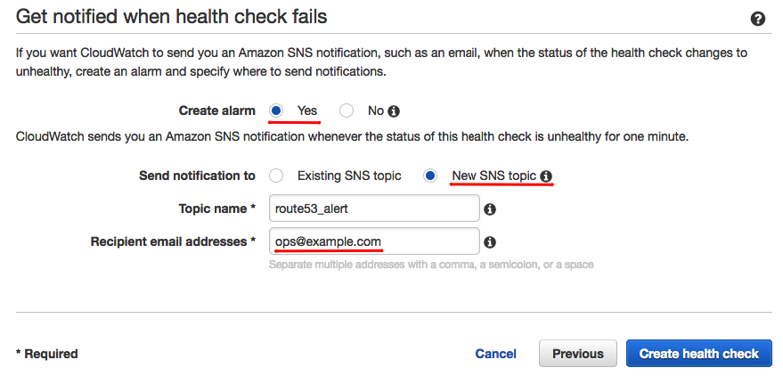

5. Once you have configured the new health check and alarm, the email address you indicated will be sent a confirmation email. The health check will not be executed until you confirm the new alert. Once the health check begins to execute, be sure that the monitored site is showing 100% health under the **Monitoring** tab.

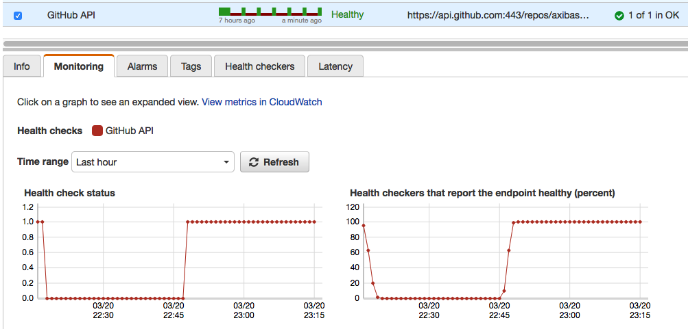

6. Under the **Health Checkers** tab, review information in the **Status** column for each of the **Health Checker Regions** and resolve any issues.

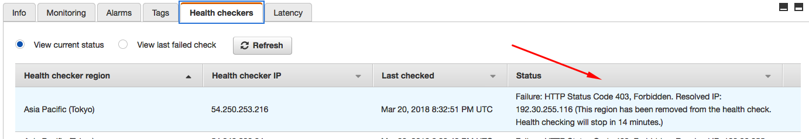

7. If you haven't already done so, configure the new alarm's notification target by navigating to the **Alarms** tab and clicking the **Edit** button in the **Actions** column. Select the appropriate **Notification Target** from the drop-down menu and existing targets.

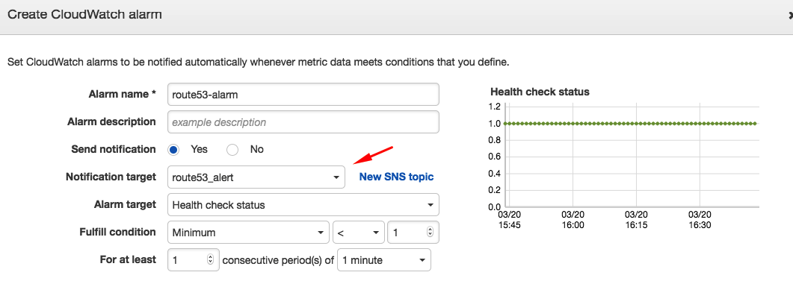

8. Should the endpoint become unhealthy and the alarm be triggered, the specified email address will recieve an email notification from AWS similar to the one shown below.

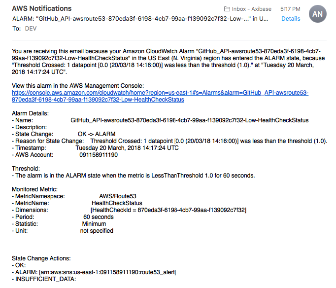

Your health checks and alarms are now fully functioning. Complete the process below to enhance Route53 alarms with your local ATSD instance.

## ATSD Configuration

ATSD may be configured to monitor AWS Route53 health checks and send detailed downtime reports featuring data visualization portal and comprehensive outage information. 

1. Open the **Services** drop-down menu and navigate to the **Simple Notification Service** page in the **Application Integration** section of the menu.


2. Open the **Topics** page from toolbar on the left, and click the Amazon Resource Name (ARN) link of the alert which you would like to integrate with ATSD. 

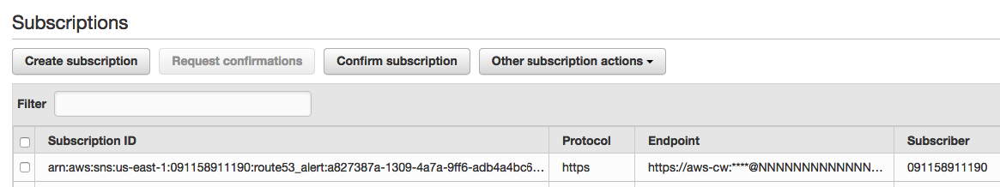

3. In the **Subscriptions** section of the **Topic Details** page, click **Create Subscription** to enable enriched emails with contextual information. Click **Create Subscription** and use the following webhook in the **endpoint** field:

```
https://atsd_hostname/api/v1/messages/webhook/aws-cw?type=webhook&entity=aws-cw&command.date=Timestamp&json.parse=Message&exclude=Signature;SignatureVersion;SigningCertURL;SignatureVersion;UnsubscribeURL;MessageId;Message.detail.instance-id;Message.time;Message.id;Message.version
```

> Replace **atsd_hostname** with a valid hostname in the webhook above. 

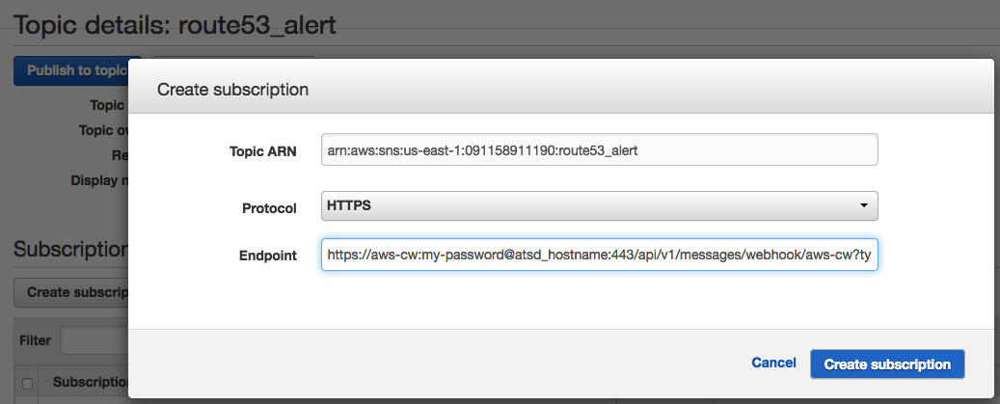

> Replace **atsd_hostname** and **my**

4. Import the following [rule](rule-aws-cloudwatch-alarm.xml) to your local ATSD instance. For instructions on importing a new rule see the following [walkthrough](walkthrough.url).

5. Configure the ATSD Mail Client as described [here](/../../../../axibase/atsd/blob/master/administration/setting-up-email-client.md)

You're ready to start receiving detailed notifications about endpoint health status alerts on any internet connected device. Follow the auxillary procedures below to further enhance this functionality to send messages directly to your local machine or smartphone messenger service. 

### Alarm Notifications in [Slack](https://slack.com/)

* Configure your local ATSD instance to output messages to **Slack Messenger** by following [this procedure](/../../../../axibase/atsd/blob/master/rule-engine/notifications/slack.md). Now, your alarm notifications will be sent via Slack messages as well as email.

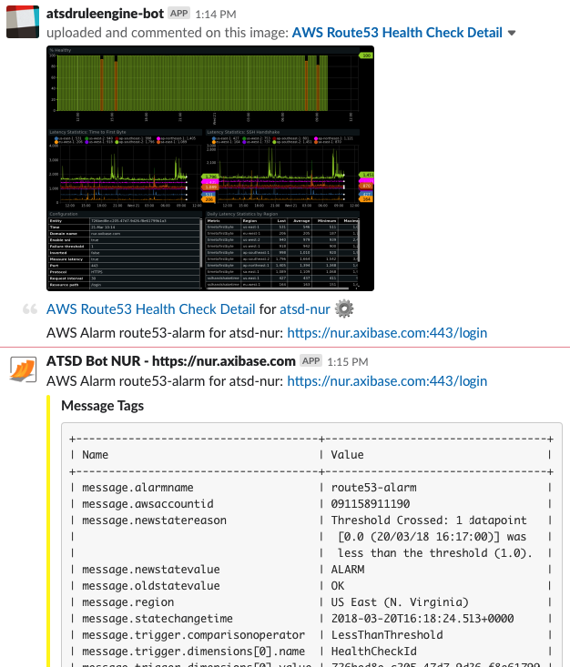

### Alarm Notifications in [Telegram](https://telegram.org/)

* Configure your local ATSD instance to output messages to **Telegram Messenger** by following [this procedure](/../../../../axibase/atsd/blob/master/rule-engine/notifications/telegram.md). Now, your alarm notifications will be sent via Telegram messages as well as email.

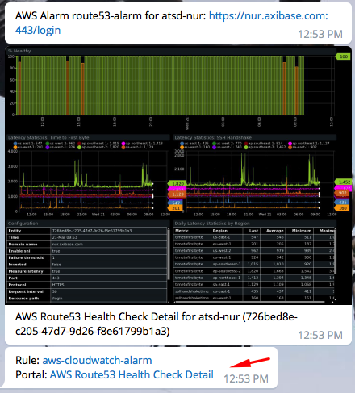

## Advanced Configuration

* To configure advanced settings, expand the **Alerts** menu and select **Rules**. Follow the procedure described [here](/../../../../axibase/atsd/blob/master/rule-engine/web-notifications.md#attachments) to include detailed reports and portals in your alert emails.

* Enable the **Attach Details** option to include detailed email reports upon alarm notification:

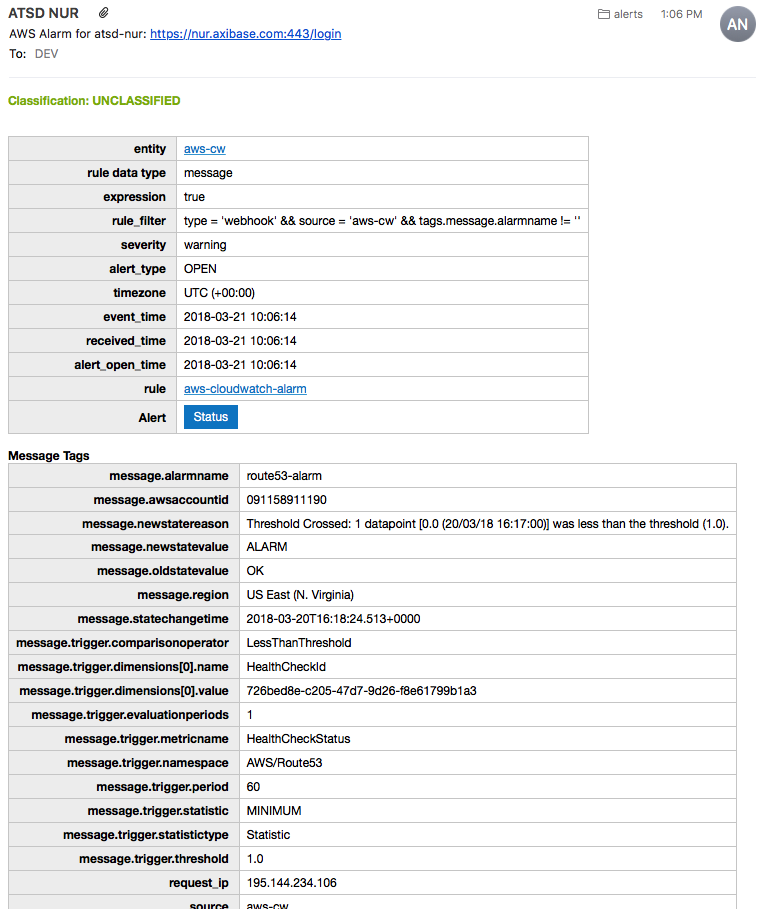

* Enable the **Attach Portals** option to include complete health check portals upon alarm notification (not only unhealthy endpoints):

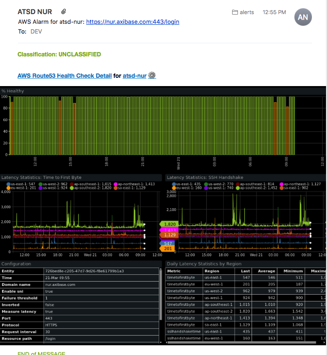
