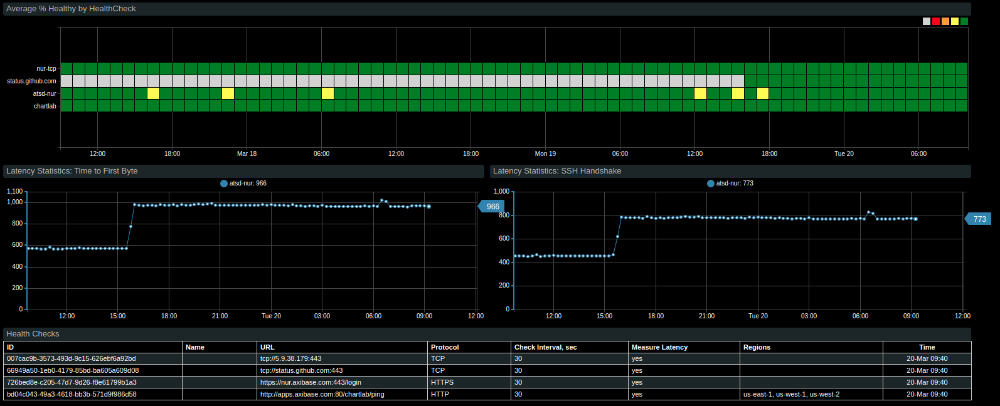

# Tracking Application Latency Issues with ATSD and Route53

## Introduction

Amazon Web Services' Route 53 networking and content delivery tool supports worldwide endpoint health checks which may be 
monitored using ATSD and Axibase Collector to historize data for longer intervals than the two weeks which are
recorded by Route 53.

Additionally, using latency checks to monitor connectivity issues at each of these endpoints can provide valuable insight
for System Administrators who need to diagnose whether an endpoint itself is unhealthy or the target application is not 
performing as expected and causing connection timeouts. 

Integrate your instance of ATSD with Route 53 as described [here](README.md) to enable availabilty reports before beginning this process. 

### Prerequisites

* Create an AWS [IAM account](https://github.com/axibase/axibase-collector/blob/master/jobs/aws-iam.md) to query CloudWatch 
statistics with [Route 53](https://aws.amazon.com/route53/?nc2=h_m1) enabled.
* 4 GB of available RAM for ATSD sandbox containers.
* [Integration](route53-health-checks/README.md) of ATSD and Amazon Web Services.

## Import AWS Route53 Connection Time Latency Portal Configuration

Once you have integrated your instance of ATSD with Amazon Wed Services, upload the following [portal configuration](resources/aws-route53-connection-time-latency.xml) to visualize endpoint monitoring.

From the **AWS Route53** tab in ATSD, open the **Portals** drop-down menu and select **Create**.

From the **AWS Route53** tab, click **View Portal**.

## Import Entity View Configuration

## Results

### AWS Entity View

### Route 53 Regional Connections Portal

