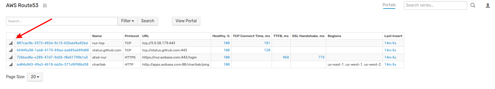

# Tracking Application Latency Issues with ATSD and Route53

## Introduction

Amazon Web Services' Route 53 networking and content delivery tool supports worldwide endpoint health checks which may be 
monitored using ATSD and Axibase Collector to historize data for longer intervals than the two weeks which are
recorded by Route 53.

Additionally, using latency checks to monitor connectivity issues at each endpoint can provide valuable insight
for system administrators who need to diagnose whether an endpoint itself is unhealthy or the target application is not 
performing as expected and causing connection timeouts. Look at the figure below for tips about interpreting latency data.

> In the above figure, latency spikes indicated by green arrows show regional connectivity issues. Your application is functioning as expected. The group of latency spikes indicated by the red arrow (showing latency issues across all regions) indicate the issue is more likely from the target application, which is unable to connect to any endpoint effectively. 

Health checks are available for HTTP, HTTPS, and TCP protocols and may be executed from a variety of regions for resiliency.

> Note that **Latency Graphs** must be enabled through AWS, they will be disabled by default. 

Integrate your instance of ATSD with Route 53 as described [here](README.md) to enable availabilty reports before beginning this process. 

### Prerequisites

* Integrate your instance of ATSD with Route 53 as described [here](README.md) to enable availabilty reports before beginning this process. 

## Import AWS Route53 Connection Time Latency Portal Configuration

Once you have configured your instance of ATSD to work with Amazon Web Services, upload the following [portal configuration](resources/aws-route53-connection-time-latency.xml) to visualize endpoint monitoring.

From the **AWS Route53** tab in ATSD, open the **Portals** drop-down menu and select **Create**.

The application supports direct xml upload from the local machine, or copy/paste the configuration from the [resources](resources) folder in to the configuration window. Click **Save**.

## Import Entity View Configuration

Upload the following entity view [configuration](resources/entity-views.xml) to ATSD. From the **Entity Views** tab, expand the operation drop-down menu and select **Create**.

Directly upload the provided xml file or copy/paste the document's contents into the text editor. Click **Save**

## Results

### AWS Route 53 Entity View and Application Latency Portal

In the **AWS Route53** tab, the newly configured entity view and portal are now accessible. Click the **Open Portal** button to monitor worldwide endpoint latency.

The Latency Portal has two windows: The first tracks average connection time (milliseconds) and the second shows real-time and historical connection data (milliseconds).

Open the ChartLab example above to see a fully functioning Latency Portal integrated with Axibase servers delivering status information from endpoints and applications across the globe.
