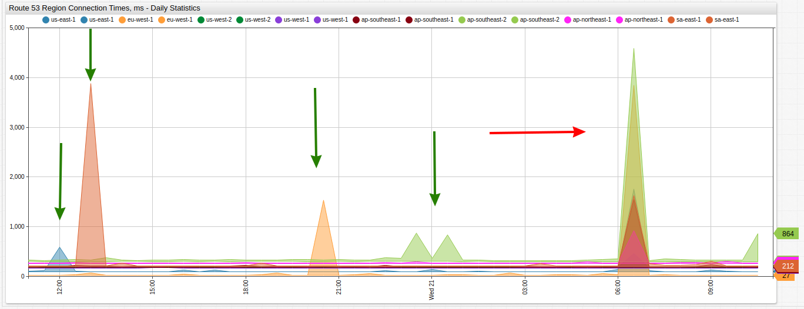
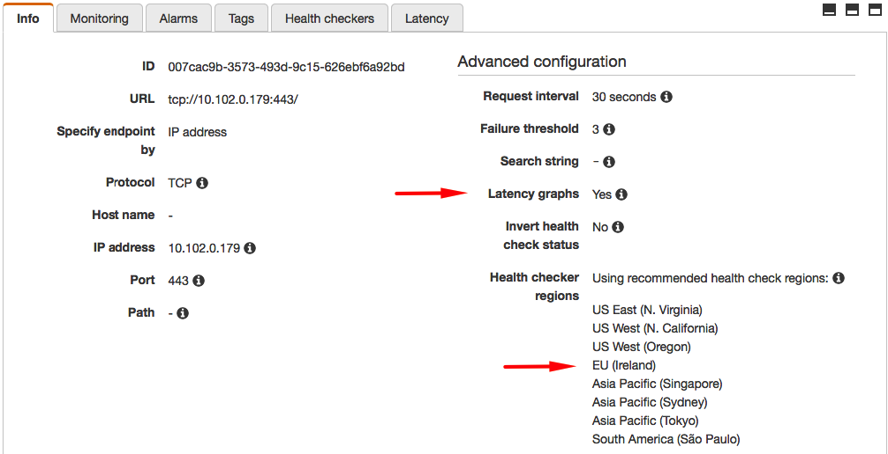

# Tracking Application Latency Issues with ATSD and Route53

## Introduction

Amazon Web Services' Route53 networking and content delivery tool supports worldwide endpoint health checks which may be monitored using ATSD and Axibase Collector to historize data for longer intervals than the two weeks which are
recorded by Route53.

Health checks are available for HTTP, HTTPS, and TCP protocols and may be executed from a variety of regions for resiliency.

Additionally, using latency checks to monitor connectivity issues from multiple regions can provide valuable insight
for system administrators who need to diagnose whether the problem is related to network infrastructure or the target application itself is unhealthy. Look at the figure below for tips about interpreting latency data.

In the above figure, latency spikes indicated by green arrows show regional connectivity issues. Your application is functioning as expected. The group of latency spikes indicated by the red arrow (showing simultaneous latency issues across **all** regions) indicate the problem is likely related to the monitored application, which is inaccessible from multiple  regions.

> Note that **Latency Graphs** are a premium feature and must be enabled through the AWS console or API.

### Prerequisites

* Install ATSD [sandbox](README.md).

## Import Latency Portal

Click on the **Portals** link in the top menu and import the [latency portal](resources/aws-route53-connection-time-latency.xml) from the XML file as described [here](../../shared/import-portal.md).

## Import Entity View

Click on the **Entity View** link in the tool menu on the left and import the [Route53 entity view](resources/entity-views.xml) from the XML file as described [here](../../shared/import-entity-view.md).

## Results

### AWS Route 53 Entity View and Application Latency Portal

In the **AWS Route53** tab, the newly configured entity view and portal are now accessible. Click the **Open Portal** button to monitor worldwide endpoint latency.

The Latency Portal has two windows: The first tracks average connection time (milliseconds) and the second shows real-time and historical connection data (milliseconds).

Open the ChartLab example above to see a fully functioning Latency Portal integrated with Axibase servers delivering status information from endpoints and applications across the globe.
