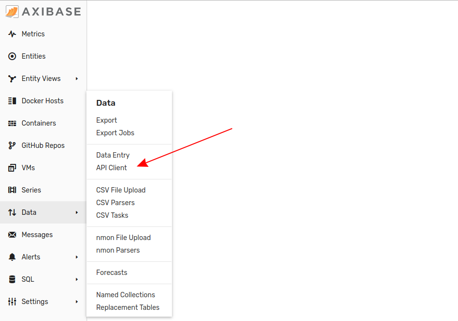

# Accessing Metadata in ATSD


Even medium-scale deployments of any time series database are likely to interact with hundreds of thousands, if not millions of series any given day; whether they are pruning old data or collecting and inserting new data, keeping track of the what is coming in and going out is important. Controlling and interpreting this massive two-way flow of information is most readily accomplished with metadata identifiers.

ATSD identifies metadata with three classifiers:

* `entity` labels and tags;
* `metric` labels and tags;
* `series` tags.

The basic unit of metadata in ATSD is the `series` command. A simple, one-line syntax that quickly identifies a particular data point.

```css
series d:{iso-date} e:{entity} t:{tag-1}={val-1} m:{metric-1}={number}
```

The `series` command identifies all metadata quantifiers. See [`series` command](https://github.com/axibase/atsd/blob/master/api/network/series.md#series-command) documentation for complete information regarding how they may be used in ATSD.

Series metadata may be invoked several ways:

* Within the ATSD user interface;
* In [**Trends**](https://trends.axibase.com/053ff165) or [**ChartLab**](https://apps.axibase.com/chartlab/e926d483) via the [Charts API](https://axibase.com/products/axibase-time-series-database/visualization/);
* Via [SQL Console](https://github.com/axibase/atsd/tree/master/sql#overview);
* Through [Data API](https://github.com/axibase/atsd/tree/master/api/data#overview).

## User Interface


From the **ATSD User Interface**, metadata is easily accessible. Open either the **Entities** or **Metrics** tab to begin exploring stored metadata. From within the **Entity** page of a specific entity, click the **Metrics** button to open the entity's associated metrics, or navigate to the **Series Tags** page.

### Entity Labels and Tags

An **Entity** is typically the organization responsible for the data being collected or the source of the data itself, such as the name of the sensor collecting it. Data collected from the [Federal Reserve Economic Research Division](https://fred.stlouisfed.org/) (FRED) of the St. Louis Federal Reserve is labeled with the entity `fred.stlouisfed.org`.

#### Entity Labels

The **Entity Label** is the simplest way to invoke a series. On the **Entities** page, they are searchable via the **Search Bar**.


Entity labels allow data from a particular source to be accessed quickly without filtering for several specific metadata quantifiers.

#### Entity Tags

Entity tags are optional categories which may be used to sub-divide a particular entity.

Consider the example of a server which hosts three development environments:

* `Production`
* `QA`
* `Testing`

The **Entity Label** for all incoming data will be the same, `server_name001`. Using **Entity Tags**, data may be filtered to include only one of these environments, if necessary. This group of tags is collectively referred to as a [**Tag Template**](#tag-templates).

#### Importing Entities via Interface

The split button at the bottom of the **Entities** page supports upload of `xml` documents. See these [instructions](../../shared/import-entity.md) for step-by-step import instructions.

### Metric Labels and Tags

Each **Entity** collects one or more **Metrics**. A **Metric** is a measurable phenomena which may quantified numerically and stored in ATSD.

#### Metric Labels

The **Metric Label** is the greatest sub-division of an **Entity**. Metrics may be explored via **Search Bar** from the **Metrics** tab.


**Metrics** associated with a specific **Entity** may also be accessed directly from a particular that entity's data page.


#### Metric Tags

Like [**Entity Tags**](#entity-tags) optionally sub-divide **Entities**, **Metric Tags** may be used to sub-divide **Metrics**.

Consider the example of a server collecting data over some time period `x`. The server is meant to deliver an hourly report of variable size. The metric `hourly_report_01` could therefore be divided into several sub-categories, `units`:

* `count`: The index position of any report delivered during time `x`;
* `bytes`: The digital size of the report delivered;
* `lines`: The number of lines present in any report.

These **Metric Tags** could be used to filter for a specific individual report, all reports greater than a specific size, or one specific line from all stored reports.

This group of tags is collectively referred to as a [**Tag Template**](#tag-templates).

#### Importing Metrics via Interface

The split button at the bottom of the **Metrics** page supports upload of `xml` documents. See these [instructions](../../shared/import-metric.md) for step-by-step import instructions.

### Series Tags

**Series Tags** are the lowest granularization of metadata in ATSD. **Series Tags** may be used in cases where neither [**Entity Tags**](#entity-tags) nor [**Metric Tags**](#metric-tags) are appropriate but further sub-division is necessary.

Consider the example of profitability data collected by the entity `stern.nyu.gov`. This data tracks 16 profitability metrics for 25 different industry sectors. To organize data based a specific metric for a specific industry would either require 400 unique **Metrics**, or 16 unique **Metrics** with 25 identical **Metric Tags** each, hardly a tenable solution. Best practice dictates the use of **Series Tags** in cases like this to minimize input or process redundancy.

**Series Tags** may be accessed from the **Metrics** page by clicking the **Series** icon for the desired **Metric**.


**Series Tags** must either be added upon data import via [CSV Parser](https://github.com/axibase/atsd/blob/master/parsers/csv/README.md), to existing data through the [**Data API**](#data-api) section of the User Interface, or to incoming data via [Collector Job](https://github.com/axibase/axibase-collector#job-types) if [Axibase Collector](https://github.com/axibase/axibase-collector#axibase-collector) is uploading data to the database.

### Tag Templates

**Tag Templates** may be added manually in the ATSD interface or [uploaded](../../shared/import-tag-template.md) from a local drive.


## ChartLab and Trends


[**ChartLab**](../../../ChartLabIntro/README.md) and [**Trends**](../../shared/trends.md) visualization services offer three ways to reference series metadata:

* Inline syntax may be used to reference [**Entity Labels**](#entity-labels) and [**Metric Labels**](#metric-labels);
* Metadata expression may be used so metadata is imported from server and then referenced with placeholder expressions;
* FreeMarker expressions may be used to import string collections of **Metric** or **Series Labels**, or **Series Tags** and then filtered client-side via inline syntax.

### Inline Syntax

Consider a simple series with only **Entity** and **Metric Labels**. This series may be referenced in **ChartLab** with inline syntax without requiring additional metadata to be imported.

```javascript
[series]
entity = nurswgvm1011
metric = cpu_busy
```


[](https://apps.axibase.com/chartlab/9b886d5f)

### Metadata Expression

In **ChartLab**, metadata may be imported by adding this statement at the `[configuration]` level:

```javascript
add-meta = true
```

In **Trends**, it is imported by default.

Consider a series with detailed metadata such as **Entity Tags**. The Entity `nurswgvn1006` monitors Axibase servers, with several such tags. Using `meta.placeholder` syntax, the imported metadata may be invoked at the `[group]` level and used to accurately label many charts without redundant syntax.

```javascript
[group]
  label-format = meta.entity.tags.app - statistic
  column-label-format = meta.entity.tags.app - statistic
  marker-format = meta.entity.tags.app - statistic
```


[](https://apps.axibase.com/chartlab/46151793)

Metadata expressions have been labeled in the **Editor** window. Read complete [Meta Data Visualization Documentation](https://axibase.com/products/axibase-time-series-database/visualization/widgets/metadata/).

### FreeMarker Expression

Similarly to [**Metadata Expressions**](#metadata-expression), [**FreeMarker Expressions**](https://freemarker.apache.org/) may be used to invoke a string collection of **Metric** or **Entity Labels**, or **Series Tags**. Consider an example such as the [`stern.nyu.gov`](#series-tags) dataset with 16 metrics collected by one entity across 25 industry sectors. Creating an inline [drop-down menu](https://axibase.com/products/axibase-time-series-database/visualization/widgets/dropdown/) featuring all of these metrics would be tedious and most likely error-ridden. The **FreeMaker** expression makes importing all **Metric Labels** trivial and repeatable using a `getMetrics` statement.

```javascript
[dropdown]
options = @{getMetrics('stern.nyu.edu')}
changefield = series.metric
```


[](https://trends.axibase.com/d99de835)

FreeMarker expressions have been labeled in the **Editor** window. Read complete [ATSD FreeMarker Expression Documentation](https://axibase.com/products/axibase-time-series-database/visualization/freemarker/).

## SQL Console


[SQL Console](https://github.com/axibase/atsd/blob/master/sql/README.md) is an SQL emulator which may be accessed in the ATSD interface and used to query stored data. Open the **SQL** menu, and select **Console**.


Accessing series metadata simply requires defining the desired metadata in a [`SELECT`](https://github.com/axibase/atsd/blob/71367ab108cc4a269c8f9a60e65327ff8c81ac5d/sql/README.md#select-expression) expression, and optionally using a `GROUP BY` expression to sort returned series by selected metadata.

### **SELECT** Metadata

This table shows all metadata parameters and their associated keywords for use in `SELECT` expressions.

|Keyword|Description|
|-|-|
|**Entity Metadata**|
|`entity`| Entity label|
|`entity.label`| Entity label|
|`entity.tags`| All entity tags, concatenated to `tag1=value;tag2=value` format.|
|`entity.tags.{name}`| Entity tag value. Returns `NULL` if specified tag doesn't exist for entity.|
|**Metric Metadata**|
|`metric`| Metric label|
|`metric.label`| Metric label|
|`metric.tags`| All metric tags, concatenated to `tag1=value;tag2=value` format.|
|`metric.tags.{name}`| Entity tag value. Returns `NULL` if specified tag doesn't exist for entity.|
|**Series Metadata**|
|`tags`| All series tags, concatenated to `tag1=value;tag2=value` format.|
|`tags.{name}`| Series tag value. Returns `NULL` if specified tag doesn't exist for entity.|

> All metadata parameters shown here will be returned in string form.

Once selected in a query, specific metadata may be filtered from the results of any query.

Consider the follow query, which expands upon the example [above](#entity-tags) concerning the single server hosting three development environments; the incoming data from all three environments is collected together via one automated [Collector Job](https://github.com/axibase/axibase-collector#job-types) but may be filtered when querying in SQL Console:

#### Production Environment

```sql
SELECT datetime, value, entity.tags
FROM cpu.busy
WHERE entity = 'nurswghbs001' AND entity.tags.monitor.env = 'Production'
```

#### Testing Environment

```sql
SELECT datetime, value, entity.tags
FROM cpu.busy
WHERE entity = 'nurswghbs001' AND entity.tags.monitor.env = 'Testing'
```

SQL queries may be [run on a schedule](https://github.com/axibase/atsd/blob/a60dbd75b27d48cc95d722c2170b7dfc46c940f5/shared/scheduling.md) and monitor any parameters. Additionally, alerts may be added to fire upon the detection of unexpected results based on parameters such as data which does not conform to [data forecasting](https://github.com/axibase/atsd/blob/master/forecasting/README.md) results or [deviation from average value](https://github.com/axibase/atsd/blob/master/rule-engine/condition.md#condition) based on [Rule Engine](https://github.com/axibase/atsd/blob/master/rule-engine/README.md) parameters. For additional examples using the `SELECT` expression to invoke series metadata, see [Documentation Examples](https://github.com/axibase/atsd/blob/71367ab108cc4a269c8f9a60e65327ff8c81ac5d/sql/examples/select-metadata.md).

### **GROUP BY** Metadata

Recall the [`stern.nyu.gov`](#freemarker-expression) dataset, which had tags and labels at every level of data. How can could this data be meaningfully sorted when being queried? With a well-formulated `GROUP BY` expression:

```sql
SELECT (LAST(value) * 100) Percent, metric Metric
FROM net_margin
GROUP BY metric, tags.industry.tobacco
```

This query will return the most recent, or [`LAST`](https://github.com/axibase/atsd/tree/master/sql#last), value of the `net_margin` metric for the **Series Tag** `industry.tobacco`:

```txt
| Percent | Metric     |
|---------|------------|
| 6.89    | net_margin |
```

Metadata identifiers may be used to target individual data points, or entire groups of tags:

```sql
SELECT (LAST(value) * 100) Percent, tags.industry_name Industry
FROM net_margin
GROUP BY tags
```

This query selects all **Series Tags** for the `net_margin` metric.

<details><summary>View the results of the above query.</summary><p>

| Percent | Industry                               |
|---------|----------------------------------------|
| 5.45    | Advertising                            |
| 7.22    | Aerospace/Defense                      |
| 7.03    | Air Transport                          |
| 3.43    | Apparel                                |
| 2.07    | Auto & Truck                           |
| 5.32    | Auto Parts                             |
| 26.03   | Bank (Money Center)                    |
| 23.82   | Banks (Regional)                       |
| 21.18   | Beverage (Alcoholic)                   |
| 10.86   | Beverage (Soft)                        |
| 4.09    | Broadcasting                           |
| 15.01   | Brokerage & Investment Banking         |
| 6.30    | Building Materials                     |
| 5.19    | Business & Consumer Services           |
| 7.88    | Cable TV                               |
| 5.77    | Chemical (Basic)                       |
| 5.58    | Chemical (Diversified)                 |
| 7.53    | Chemical (Specialty)                   |
| 12.62   | Coal & Related Energy                  |
| 5.93    | Computer Services                      |
| 14.34   | Computers/Peripherals                  |
| 4.78    | Construction Supplies                  |
| 8.54    | Diversified                            |
| 12.57   | Drugs (Biotechnology)                  |
| 14.05   | Drugs (Pharmaceutical)                 |
| 1.38    | Education                              |
| 6.21    | Electrical Equipment                   |
| -10.63  | Electronics (Consumer & Office)        |
| 6.67    | Electronics (General)                  |
| 1.99    | Engineering/Construction               |
| 11.50   | Entertainment                          |
| 4.41    | Environmental & Waste Services         |
| 3.08    | Farming/Agriculture                    |
| 26.46   | Financial Svcs. (Non-bank & Insurance) |
| 7.37    | Food Processing                        |
| 1.34    | Food Wholesalers                       |
| 5.89    | Furn/Home Furnishings                  |
| 1.27    | Green & Renewable Energy               |
| 8.52    | Healthcare Products                    |
| 2.58    | Healthcare Support Services            |
| 8.54    | Heathcare Information and Technology   |
| 5.98    | Homebuilding                           |
| 0.61    | Hospitals/Healthcare Facilities        |
| 8.25    | Hotel/Gaming                           |
| 13.90   | Household Products                     |
| 13.39   | Information Services                   |
| 2.41    | Insurance (General)                    |
| 4.85    | Insurance (Life)                       |
| 5.17    | Insurance (Prop/Cas.)                  |
| 22.54   | Investments & Asset Management         |
| 8.27    | Machinery                              |
| 6.03    | Metals & Mining                        |
| 2.25    | Office Equipment & Services            |
| 5.64    | Oil/Gas (Integrated)                   |
| -6.62   | Oil/Gas (Production and Exploration)   |
| 2.04    | Oil/Gas Distribution                   |
| 0.73    | Oilfield Svcs/Equip.                   |
| 5.25    | Packaging & Container                  |
| 2.26    | Paper/Forest Products                  |
| 13.93   | Power                                  |
| 3.55    | Precious Metals                        |
| -1.18   | Publishing & Newspapers                |
| 24.44   | R.E.I.T.                               |
| 13.45   | Real Estate (Development)              |
| 8.99    | Real Estate (General/Diversified)      |
| 5.18    | Real Estate (Operations & Services)    |
| 2.12    | Recreation                             |
| 5.26    | Reinsurance                            |
| 9.98    | Restaurant/Dining                      |
| 3.27    | Retail (Automotive)                    |
| 7.00    | Retail (Building Supply)               |
| 3.93    | Retail (Distributors)                  |
| 2.32    | Retail (General)                       |
| 1.62    | Retail (Grocery and Food)              |
| 3.72    | Retail (Online)                        |
| 3.18    | Retail (Special Lines)                 |
| 6.64    | Rubber& Tires                          |
| 18.10   | Semiconductor                          |
| 18.74   | Semiconductor Equip                    |
| -1.80   | Shipbuilding & Marine                  |
| 9.44    | Shoe                                   |
| 15.97   | Software (Entertainment)               |
| 23.83   | Software (Internet)                    |
| 14.59   | Software (System & Application)        |
| 3.51    | Steel                                  |
| 1.01    | Telecom (Wireless)                     |
| 13.76   | Telecom. Equipment                     |
| 8.38    | Telecom. Services                      |
| 43.37   | Tobacco                                |
| 4.44    | Transportation                         |
| 18.68   | Transportation (Railroads)             |
| 1.99    | Trucking                               |
| 9.48    | Utility (General)                      |
| 12.96   | Utility (Water)                        |
| 7.90    | Total Market                           |
| 6.89    | Total Market (without financials)      |
</p>
</details>

 Read complete [SQL Console Documentation](https://github.com/axibase/atsd/blob/master/sql/README.md) for more information about formulating and executing queries.

## Data API


The **Data API** is a part of the ATSD User Interface and may be used to interact directly with the database; series may be inserted and retrieved from the same window. Open the **Data** menu and select **API Client**:



### **POST** Method

The **API Client** has pre-defined templates for both inserting and retrieving metadata via **POST** method. Open the **Template** menu and select the desired action under **Message** category:


#### Insert Metadata

New series data may be entered with **Entity** or **Metric Labels** and **Series Tags** according to [syntax keywords](https://github.com/axibase/atsd/blob/master/api/data/series/insert.md).

```cs
[{
    "entity": "nurswgvml007",
    "metric": "df.disk_used_percent",
    "tags": {"file_system": "/sda"},
    "data": [
        { "t": 1526472000, "v": 10.0}
    ]
}]
```

This API request will insert the following series command:

```css
series d:2018-05-16T12:00:00Z e:nurswgvml007 t:file_system=/sda m:df.disk_used_percent=10
```

#### Query Metadata

Existing series data may be queried via **Entity** or **Metric Labels** and **Series Tags** according to [syntax keywords](https://github.com/axibase/atsd/blob/master/api/data/series/query.md).

```json
[
    {
        "startDate": "2016-02-22T13:30:00Z",
        "endDate":   "2016-02-22T13:35:00Z",
        "entity": "nurswgvml007",
        "metric": "df.disk_used_percent",
        "tags": {"file_system": "/dev/mapper/vg_nurswgvml007-lv_root",
                 "mount_point": "/"}
    }
]
```

<details><summary>View the results of the above query.</summary><p>

```json
[
  {
    "entity": "nurswgvml007",
    "metric": "df.disk_used_percent",
    "tags": {
      "file_system": "/dev/mapper/vg_nurswgvml007-lv_root",
      "mount_point": "/"
    },
    "type": "HISTORY",
    "aggregate": {
      "type": "DETAIL"
    },
    "data": [
      {
        "d": "2016-02-22T13:30:07.000Z",
        "v": 59.3024
      },
      {
        "d": "2016-02-22T13:30:22.000Z",
        "v": 59.3032
      },
      {
        "d": "2016-02-22T13:30:37.000Z",
        "v": 59.3037
      },
      {
        "d": "2016-02-22T13:30:52.000Z",
        "v": 59.3042
      },
      {
        "d": "2016-02-22T13:31:07.000Z",
        "v": 59.3047
      },
      {
        "d": "2016-02-22T13:31:22.000Z",
        "v": 59.3054
      },
      {
        "d": "2016-02-22T13:31:37.000Z",
        "v": 59.306
      },
      {
        "d": "2016-02-22T13:31:52.000Z",
        "v": 59.3063
      },
      {
        "d": "2016-02-22T13:32:07.000Z",
        "v": 59.3068
      },
      {
        "d": "2016-02-22T13:32:22.000Z",
        "v": 59.3074
      },
      {
        "d": "2016-02-22T13:32:37.000Z",
        "v": 59.3081
      },
      {
        "d": "2016-02-22T13:32:52.000Z",
        "v": 59.3084
      },
      {
        "d": "2016-02-22T13:33:07.000Z",
        "v": 59.3088
      },
      {
        "d": "2016-02-22T13:33:22.000Z",
        "v": 59.3096
      },
      {
        "d": "2016-02-22T13:33:37.000Z",
        "v": 59.3102
      },
      {
        "d": "2016-02-22T13:33:52.000Z",
        "v": 59.3106
      },
      {
        "d": "2016-02-22T13:34:07.000Z",
        "v": 59.3111
      },
      {
        "d": "2016-02-22T13:34:22.000Z",
        "v": 59.3117
      },
      {
        "d": "2016-02-22T13:34:37.000Z",
        "v": 59.3124
      },
      {
        "d": "2016-02-22T13:34:52.000Z",
        "v": 59.3128
      }
    ]
  }
]
```

</p>
</details>

Returned datasets may be abbreviated by adding a `"limit": x` control field where `x` is the maximum number of returned samples.

### **PATCH** Method

**PATCH** requests may be used to write **Entity** and **Metric Tags** to existing series.

The desired **Metric** or **Entity** should be indicated in the `Path` field, `Content-Type` should indicate `application/json`, and `PATCH` method should be selected:


#### Write Entity Tags

**Entity Tags** may be written to existing series according to [syntax keywords](https://github.com/axibase/atsd/blob/master/api/meta/entity/update.md).

With `Path` defined:

```css
/api/v1/entities/my_entity
```

And `Payload`:

```json
{
    "tags": {
        "category1": "tag1"
    }
}
```

`my_entity` will be updated with `tag1` **Tag** under `category1` **Tag Group**.

#### Write Metric Tags

**Metric Tags** may be written to existing series according to [syntax keywords](https://github.com/axibase/atsd/blob/master/api/meta/metric/update.md).

With `Path` defined:

```css
/api/v1/metrics/my_metric
```

And `Payload`:

```json
{
  "tags": {
    "category1": "tag1"
  }
}
```

`my_metric` will be updated with `tag1` **Tag** under `category1` **Tag Group**.

### **GET** Method

Existing data including **Entity** and **Metric Tags** may be retrieved using the **GET** method. The **GET** method is a single-line database search tool which queries all database entries and returns as many samples as instructed based on optional `limit` control field.

Consider the `PATH`:

```css
/api/v1/search?query=inflation&metricTags=USA&limit=10
```

The `query` parameter searches against all fields for included keywords, in this case `inflation`. Additional keywords may be added to filter for any of the supported [query parameters](https://github.com/axibase/atsd/blob/master/api/meta/misc/search.md#query-parameters). Here, the **Metric Tag** `USA` is included and the number of returned sample has been limited to 10. Only the first ten records with the keyword `inflation` and the **Metric Tag** `USA` will be returned.

<details><summary>View the results of the above request.</summary><p>

```json
{
  "recordsTotal": 164111,
  "recordsFiltered": 65,
  "time": 23,
  "query": "contents:inflation",
  "data": [
    [
      "pcetrim6m680sfrbdal",
      "Trimmed Mean PCE Inflation Rate",
      {},
      {},
      "fred.stlouisfed.org",
      null,
      {},
      {},
      {},
      1.6109161
    ],
    [
      "pcetrim12m159sfrbdal",
      "Trimmed Mean PCE Inflation Rate",
      {},
      {},
      "fred.stlouisfed.org",
      null,
      {},
      {},
      {},
      1.6109161
    ],
    [
      "pcetrim1m158sfrbdal",
      "Trimmed Mean PCE Inflation Rate",
      {},
      {},
      "fred.stlouisfed.org",
      null,
      {},
      {},
      {},
      1.6109161
    ],
    [
      "medcpim159sfrbcle",
      "Median Consumer Price Index",
      {},
      {},
      "fred.stlouisfed.org",
      null,
      {},
      {},
      {},
      1.273541
    ],
    [
      "medcpim158sfrbcle",
      "Median Consumer Price Index",
      {},
      {},
      "fred.stlouisfed.org",
      null,
      {},
      {},
      {},
      1.273541
    ],
    [
      "medcpim157sfrbcle",
      "Median Consumer Price Index",
      {},
      {},
      "fred.stlouisfed.org",
      null,
      {},
      {},
      {},
      1.273541
    ],
    [
      "medcpim094sfrbcle",
      "Median Consumer Price Index",
      {},
      {},
      "fred.stlouisfed.org",
      null,
      {},
      {},
      {},
      1.273541
    ],
    [
      "pcectpirllr",
      "Longer Run FOMC Summary of Economic Projections for the Personal Consumption Expenditures Inflation Rate, Range, Low",
      {},
      {},
      "fred.stlouisfed.org",
      null,
      {},
      {},
      {},
      1.1143484
    ],
    [
      "pcectpirhlr",
      "Longer Run FOMC Summary of Economic Projections for the Personal Consumption Expenditures Inflation Rate, Range, High",
      {},
      {},
      "fred.stlouisfed.org",
      null,
      {},
      {},
      {},
      1.1143484
    ],
    [
      "pcectpicthlr",
      "Longer Run FOMC Summary of Economic Projections for the Personal Consumption Expenditures Inflation Rate, Central Tendency, High",
      {},
      {},
      "fred.stlouisfed.org",
      null,
      {},
      {},
      {},
      1.1143484
    ]
  ]
}
```

</p>
</details>

## Conclusion

Metadata is an essential quantifier when working with time-series data. Using ATSD, valuable data components are never far from reach. The four primary methods for working with or modifying series metadata are:

* Directly from the [User Interface](#user-interface) via **Menu**;
* Via inline syntax, metadata expression, or FreeMarker expression in [**ChartLab** or **Trends**](#chartlab-and-trends);
* Using `SELECT` or `GROUP BY` statements in [SQL Console](#sql-console);
* With [Data API](#data-api).

Explore complete [ATSD Documentation](https://github.com/axibase/atsd/blob/master/README.md) to see even more options for importing, transforming, or exporting data and raise an issue in our [GitHub Repository](https://github.com/axibase/atsd-use-cases/issues) for technical difficulties. For even more tools compatible with the Data Science industry's most-often used software and services, visit our [How To](https://github.com/axibase/atsd-use-cases/blob/master/README.md#how-to) library.
