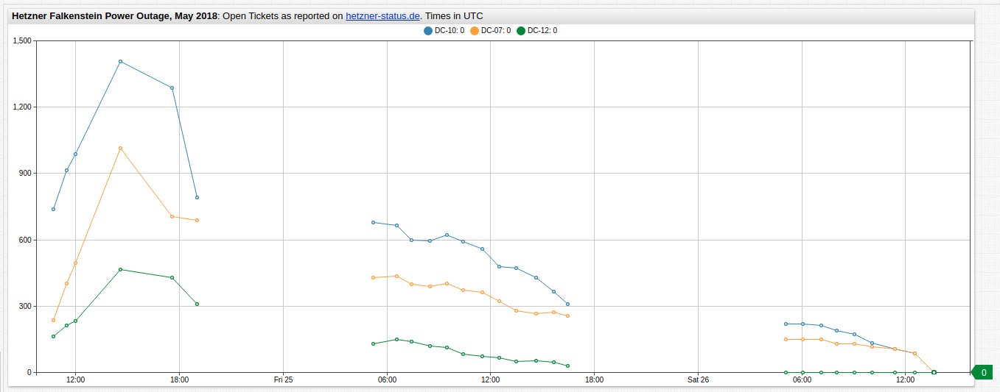
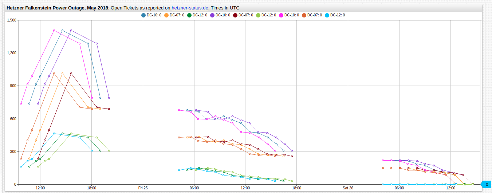
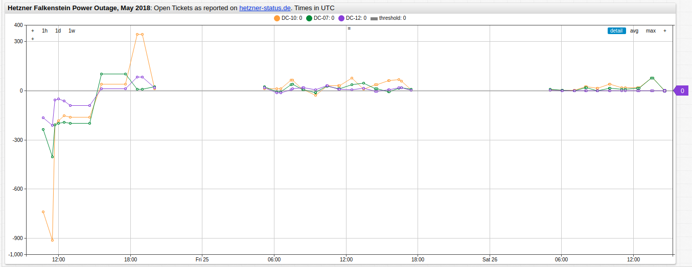
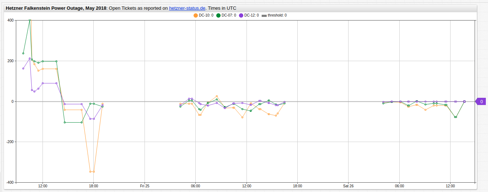

# Computing Series Delta Values in ATSD

## Purpose

[ATSD](https://axibase.com/docs/atsd/) has a number of data transformation tools which may be used to perform ad hoc data modifications inline. A critical data transformation is quickly computing delta values for a given series and returning those values in place of or alongside the raw data.

This article will cover this functionality using three essential tools in ATSD:

* [SQL Console](https://axibase.com/docs/atsd/sql/)
* [Data API Series: Query](https://axibase.com/docs/atsd/api/data/series/query.html)
* [Charts Functions](https://github.com/axibase/charts/blob/master/README.md)

With these tools, any dataset may be modified to return a new series which is composed of delta values of a particular sample relative to the sample immediately before or immediately after it.

For more information about the data used in this article, see [Resources](#resources).

## SQL Console

**SQL Console** is a structured query syntax available in the ATSD user interface. Using the [LAG](https://axibase.com/docs/atsd/sql/#lag) and [LEAD](https://axibase.com/docs/atsd/sql/#lead) functions, samples on either side of a data point may be accessed and used for calculations. Data is collected by entity `hetzner` as metric `outage-tickets` which is divided into three series tags (`DC=07`, `DC=10`, and `DC=12`), representing three unique data centers.

Consider the query:

```sql
SELECT datetime, value DC07, (LEAD(value) - value) SUB, (LAG(value) - value) ANTE
FROM "outage-tickets"
WHERE entity = 'hetzner' AND tags.dc = 07
ORDER BY datetime, tags.dc
```

This query compares raw value (`DC07`) to delta value compared to antecedent value (`ANTE`) and delta value compared to subsequent value (`SUB`).

The result set in shown here:

| datetime            | DC07 | SUB  | ANTE |
|---------------------|------|------|------|
| 2018-05-24 10:43:00 | 237  | 165  | null |
| 2018-05-24 11:29:00 | 402  | 95   | -165 |
| 2018-05-24 12:00:00 | 497  | 516  | -95  |
| 2018-05-24 14:36:00 | 1013 | -309 | -516 |
| 2018-05-24 17:35:00 | 704  | -14  | 309  |
| 2018-05-24 19:01:00 | 690  | -261 | 14   |
| 2018-05-25 05:13:00 | 429  | 8    | 261  |
| 2018-05-25 06:34:00 | 437  | -39  | -8   |
| 2018-05-25 07:25:00 | 398  | -8   | 39   |
| 2018-05-25 08:29:00 | 390  | 11   | 8    |
| 2018-05-25 09:28:00 | 401  | -27  | -11  |
| 2018-05-25 10:25:00 | 374  | -12  | 27   |
| 2018-05-25 11:30:00 | 362  | -38  | 12   |
| 2018-05-25 12:30:00 | 324  | -45  | 38   |
| 2018-05-25 13:29:00 | 279  | -13  | 45   |
| 2018-05-25 14:36:00 | 266  | 6    | 13   |
| 2018-05-25 15:38:00 | 272  | -16  | -6   |
| 2018-05-25 16:27:00 | 256  | -105 | 16   |
| 2018-05-26 05:05:00 | 151  | -2   | 105  |
| 2018-05-26 06:04:00 | 149  | 0    | 2    |
| 2018-05-26 07:06:00 | 149  | -19  | 0    |
| 2018-05-26 08:00:00 | 130  | 1    | 19   |
| 2018-05-26 09:03:00 | 131  | -14  | -1   |
| 2018-05-26 10:02:00 | 117  | -12  | 14   |
| 2018-05-26 11:22:00 | 105  | -19  | 12   |
| 2018-05-26 12:31:00 | 86   | -86  | 19   |
| 2018-05-26 13:38:00 | 0    | null | 86   |

The data samples from other data center tags may be returned by modifying the [`WHERE`](https://axibase.com/docs/atsd/sql/#where-clause) clause of the query above.

<details><summary>Result set for <code>DC10</code>:</summary>
<p>

| datetime            | DC10 | SUB  | ANTE |
|---------------------|------|------|------|
| 2018-05-24 10:43:00 | 740  | 174  | null |
| 2018-05-24 11:29:00 | 914  | 75   | -174 |
| 2018-05-24 12:00:00 | 989  | 419  | -75  |
| 2018-05-24 14:36:00 | 1408 | -122 | -419 |
| 2018-05-24 17:35:00 | 1286 | -495 | 122  |
| 2018-05-24 19:01:00 | 791  | -112 | 495  |
| 2018-05-25 05:13:00 | 679  | -15  | 112  |
| 2018-05-25 06:34:00 | 664  | -64  | 15   |
| 2018-05-25 07:25:00 | 600  | -6   | 64   |
| 2018-05-25 08:29:00 | 594  | 27   | 6    |
| 2018-05-25 09:28:00 | 621  | -30  | -27  |
| 2018-05-25 10:25:00 | 591  | -33  | 30   |
| 2018-05-25 11:30:00 | 558  | -78  | 33   |
| 2018-05-25 12:30:00 | 480  | -9   | 78   |
| 2018-05-25 13:29:00 | 471  | -41  | 9    |
| 2018-05-25 14:36:00 | 430  | -64  | 41   |
| 2018-05-25 15:38:00 | 366  | -58  | 64   |
| 2018-05-25 16:27:00 | 308  | -88  | 58   |
| 2018-05-26 05:05:00 | 220  | -2   | 88   |
| 2018-05-26 06:04:00 | 218  | -4   | 2    |
| 2018-05-26 07:06:00 | 214  | -24  | 4    |
| 2018-05-26 08:00:00 | 190  | -17  | 24   |
| 2018-05-26 09:03:00 | 173  | -40  | 17   |
| 2018-05-26 10:02:00 | 133  | -25  | 40   |
| 2018-05-26 11:22:00 | 108  | -23  | 25   |
| 2018-05-26 12:31:00 | 85   | -85  | 23   |
| 2018-05-26 13:38:00 | 0    | null | 85   |

</p>
</details>

<details><summary>Result set for <code>DC12</code>:</summary>
<p>

| datetime            | DC12 | SUB  | ANTE |
|---------------------|------|------|------|
| 2018-05-24 10:43:00 | 164  | 48   | null |
| 2018-05-24 11:29:00 | 212  | 20   | -48  |
| 2018-05-24 12:00:00 | 232  | 233  | -20  |
| 2018-05-24 14:36:00 | 465  | -36  | -233 |
| 2018-05-24 17:35:00 | 429  | -121 | 36   |
| 2018-05-24 19:01:00 | 308  | -177 | 121  |
| 2018-05-25 05:13:00 | 131  | 18   | 177  |
| 2018-05-25 06:34:00 | 149  | -9   | -18  |
| 2018-05-25 07:25:00 | 140  | -20  | 9    |
| 2018-05-25 08:29:00 | 120  | -6   | 20   |
| 2018-05-25 09:28:00 | 114  | -32  | 6    |
| 2018-05-25 10:25:00 | 82   | -9   | 32   |
| 2018-05-25 11:30:00 | 73   | -7   | 9    |
| 2018-05-25 12:30:00 | 66   | -16  | 7    |
| 2018-05-25 13:29:00 | 50   | 3    | 16   |
| 2018-05-25 14:36:00 | 53   | -7   | -3   |
| 2018-05-25 15:38:00 | 46   | -17  | 7    |
| 2018-05-25 16:27:00 | 29   | -29  | 17   |
| 2018-05-26 05:05:00 | 0    | 0    | 29   |
| 2018-05-26 06:04:00 | 0    | 0    | 0    |
| 2018-05-26 07:06:00 | 0    | 0    | 0    |
| 2018-05-26 08:00:00 | 0    | 0    | 0    |
| 2018-05-26 09:03:00 | 0    | 0    | 0    |
| 2018-05-26 10:02:00 | 0    | 0    | 0    |
| 2018-05-26 11:22:00 | 0    | 0    | 0    |
| 2018-05-26 12:31:00 | 0    | 0    | 0    |
| 2018-05-26 13:38:00 | 0    | null | 0    |

</p>
</details>

> When `LAG` or `LEAD` encounters a non-existent sample (such as the first or last sample, respectively) [`null`](https://axibase.com/docs/atsd/sql/#null) value is returned.

SQL Console may export a result set in `CSV` format so it may be uploaded into the database via [CSV Parser](https://axibase.com/docs/atsd/api/data/ext/csv-upload.html) or [Data API](https://axibase.com/docs/atsd/api/data/series/csv-insert.html).

## Series Query

The [**REST API Client**](https://axibase.com/docs/atsd/api/data/) allows you to access series directly from the [ATSD](https://axibase.com/docs/atsd/) user interface and work with the data using JSON-formatted queries. [Series: Query](https://axibase.com/docs/atsd/api/data/series/query.html) may be used to return raw data.

Consider the following `POST` request:

```json
[
  {
    "startDate": "2018-05-24T00:00:00Z",
    "endDate": "2018-05-27T00:00:00Z",
    "entity": "hetzner",
    "metric": "outage-tickets"
  }
]
```

The query will return a JSON list of for each of the three datacenters `DC07`, `DC10`, and `DC12`.

The result set for `DC07` is shown here:

```json
[
  {
    "entity": "hetzner",
    "metric": "outage-tickets",
    "tags": {
      "dc": "07"
    },
    "type": "HISTORY",
    "aggregate": {
      "type": "DETAIL"
    },
    "data": [
      {
        "d": "2018-05-24T10:43:00.000Z",
        "v": 237
      },
      {
        "d": "2018-05-24T11:29:00.000Z",
        "v": 402
      },
      {
        "d": "2018-05-24T12:00:00.000Z",
        "v": 497
      },
      {
        "d": "2018-05-24T14:36:00.000Z",
        "v": 1013
      },
      {
        "d": "2018-05-24T17:35:00.000Z",
        "v": 704
      },
      {
        "d": "2018-05-24T19:01:00.000Z",
        "v": 690
      },
      {
        "d": "2018-05-25T05:13:00.000Z",
        "v": 429
      },
      {
        "d": "2018-05-25T06:34:00.000Z",
        "v": 437
      },
      {
        "d": "2018-05-25T07:25:00.000Z",
        "v": 398
      },
      {
        "d": "2018-05-25T08:29:00.000Z",
        "v": 390
      },
      {
        "d": "2018-05-25T09:28:00.000Z",
        "v": 401
      },
      {
        "d": "2018-05-25T10:25:00.000Z",
        "v": 374
      },
      {
        "d": "2018-05-25T11:30:00.000Z",
        "v": 362
      },
      {
        "d": "2018-05-25T12:30:00.000Z",
        "v": 324
      },
      {
        "d": "2018-05-25T13:29:00.000Z",
        "v": 279
      },
      {
        "d": "2018-05-25T14:36:00.000Z",
        "v": 266
      },
      {
        "d": "2018-05-25T15:38:00.000Z",
        "v": 272
      },
      {
        "d": "2018-05-25T16:27:00.000Z",
        "v": 256
      },
      {
        "d": "2018-05-26T05:05:00.000Z",
        "v": 151
      },
      {
        "d": "2018-05-26T06:04:00.000Z",
        "v": 149
      },
      {
        "d": "2018-05-26T07:06:00.000Z",
        "v": 149
      },
      {
        "d": "2018-05-26T08:00:00.000Z",
        "v": 130
      },
      {
        "d": "2018-05-26T09:03:00.000Z",
        "v": 131
      },
      {
        "d": "2018-05-26T10:02:00.000Z",
        "v": 117
      },
      {
        "d": "2018-05-26T11:22:00.000Z",
        "v": 105
      },
      {
        "d": "2018-05-26T12:31:00.000Z",
        "v": 86
      },
      {
        "d": "2018-05-26T13:38:00.000Z",
        "v": 0
      }
    ]
  }
```

<details><summary>View the result set for <code>DC10</code> and <code>DC12</code>:</summary>
<p>

```json
[
  {
    "entity": "hetzner",
    "metric": "outage-tickets",
    "tags": {
      "dc": "10"
    },
    "type": "HISTORY",
    "aggregate": {
      "type": "DETAIL"
    },
    "data": [
      {
        "d": "2018-05-24T10:43:00.000Z",
        "v": 740
      },
      {
        "d": "2018-05-24T11:29:00.000Z",
        "v": 914
      },
      {
        "d": "2018-05-24T12:00:00.000Z",
        "v": 989
      },
      {
        "d": "2018-05-24T14:36:00.000Z",
        "v": 1408
      },
      {
        "d": "2018-05-24T17:35:00.000Z",
        "v": 1286
      },
      {
        "d": "2018-05-24T19:01:00.000Z",
        "v": 791
      },
      {
        "d": "2018-05-25T05:13:00.000Z",
        "v": 679
      },
      {
        "d": "2018-05-25T06:34:00.000Z",
        "v": 664
      },
      {
        "d": "2018-05-25T07:25:00.000Z",
        "v": 600
      },
      {
        "d": "2018-05-25T08:29:00.000Z",
        "v": 594
      },
      {
        "d": "2018-05-25T09:28:00.000Z",
        "v": 621
      },
      {
        "d": "2018-05-25T10:25:00.000Z",
        "v": 591
      },
      {
        "d": "2018-05-25T11:30:00.000Z",
        "v": 558
      },
      {
        "d": "2018-05-25T12:30:00.000Z",
        "v": 480
      },
      {
        "d": "2018-05-25T13:29:00.000Z",
        "v": 471
      },
      {
        "d": "2018-05-25T14:36:00.000Z",
        "v": 430
      },
      {
        "d": "2018-05-25T15:38:00.000Z",
        "v": 366
      },
      {
        "d": "2018-05-25T16:27:00.000Z",
        "v": 308
      },
      {
        "d": "2018-05-26T05:05:00.000Z",
        "v": 220
      },
      {
        "d": "2018-05-26T06:04:00.000Z",
        "v": 218
      },
      {
        "d": "2018-05-26T07:06:00.000Z",
        "v": 214
      },
      {
        "d": "2018-05-26T08:00:00.000Z",
        "v": 190
      },
      {
        "d": "2018-05-26T09:03:00.000Z",
        "v": 173
      },
      {
        "d": "2018-05-26T10:02:00.000Z",
        "v": 133
      },
      {
        "d": "2018-05-26T11:22:00.000Z",
        "v": 108
      },
      {
        "d": "2018-05-26T12:31:00.000Z",
        "v": 85
      },
      {
        "d": "2018-05-26T13:38:00.000Z",
        "v": 0
      }
    ]
  },
{
    "entity": "hetzner",
    "metric": "outage-tickets",
    "tags": {
      "dc": "12"
    },
    "type": "HISTORY",
    "aggregate": {
      "type": "DETAIL"
    },
    "data": [
      {
        "d": "2018-05-24T10:43:00.000Z",
        "v": 164
      },
      {
        "d": "2018-05-24T11:29:00.000Z",
        "v": 212
      },
      {
        "d": "2018-05-24T12:00:00.000Z",
        "v": 232
      },
      {
        "d": "2018-05-24T14:36:00.000Z",
        "v": 465
      },
      {
        "d": "2018-05-24T17:35:00.000Z",
        "v": 429
      },
      {
        "d": "2018-05-24T19:01:00.000Z",
        "v": 308
      },
      {
        "d": "2018-05-25T05:13:00.000Z",
        "v": 131
      },
      {
        "d": "2018-05-25T06:34:00.000Z",
        "v": 149
      },
      {
        "d": "2018-05-25T07:25:00.000Z",
        "v": 140
      },
      {
        "d": "2018-05-25T08:29:00.000Z",
        "v": 120
      },
      {
        "d": "2018-05-25T09:28:00.000Z",
        "v": 114
      },
      {
        "d": "2018-05-25T10:25:00.000Z",
        "v": 82
      },
      {
        "d": "2018-05-25T11:30:00.000Z",
        "v": 73
      },
      {
        "d": "2018-05-25T12:30:00.000Z",
        "v": 66
      },
      {
        "d": "2018-05-25T13:29:00.000Z",
        "v": 50
      },
      {
        "d": "2018-05-25T14:36:00.000Z",
        "v": 53
      },
      {
        "d": "2018-05-25T15:38:00.000Z",
        "v": 46
      },
      {
        "d": "2018-05-25T16:27:00.000Z",
        "v": 29
      },
      {
        "d": "2018-05-26T05:05:00.000Z",
        "v": 0
      },
      {
        "d": "2018-05-26T06:04:00.000Z",
        "v": 0
      },
      {
        "d": "2018-05-26T07:06:00.000Z",
        "v": 0
      },
      {
        "d": "2018-05-26T08:00:00.000Z",
        "v": 0
      },
      {
        "d": "2018-05-26T09:03:00.000Z",
        "v": 0
      },
      {
        "d": "2018-05-26T10:02:00.000Z",
        "v": 0
      },
      {
        "d": "2018-05-26T11:22:00.000Z",
        "v": 0
      },
      {
        "d": "2018-05-26T12:31:00.000Z",
        "v": 0
      },
      {
        "d": "2018-05-26T13:38:00.000Z",
        "v": 0
      }
    ]
  }
]
```

</p>
</details>

Using [Rate Processor](https://axibase.com/docs/atsd/api/data/series/rate.html), delta values between consecutive samples may be returned by adding a `"rate"` expression to the original request:

```json
[
  {
    "startDate": "2018-05-20T00:00:00Z",
    "endDate": "2018-05-27T00:00:00Z",
    "entity": "hetzner",
    "metric": "outage-tickets",
    "rate": {
      "counter": false
    }
  }
]
```

The result will show the difference between the current data sample and the sample immediately following it. The `DC07` portion of the result set is show here:

```json
[
  {
    "entity": "hetzner",
    "metric": "outage-tickets",
    "tags": {
      "dc": "07"
    },
    "type": "HISTORY",
    "aggregate": {
      "type": "DETAIL"
    },
    "rate": {
      "period": {
        "count": 0,
        "unit": "SECOND"
      },
      "counter": false,
      "order": 0
    },
    "data": [
      {
        "d": "2018-05-24T11:29:00.000Z",
        "v": 165
      },
      {
        "d": "2018-05-24T12:00:00.000Z",
        "v": 95
      },
      {
        "d": "2018-05-24T14:36:00.000Z",
        "v": 516
      },
      {
        "d": "2018-05-24T17:35:00.000Z",
        "v": -309
      },
      {
        "d": "2018-05-24T19:01:00.000Z",
        "v": -14
      },
      {
        "d": "2018-05-25T05:13:00.000Z",
        "v": -261
      },
      {
        "d": "2018-05-25T06:34:00.000Z",
        "v": 8
      },
      {
        "d": "2018-05-25T07:25:00.000Z",
        "v": -39
      },
      {
        "d": "2018-05-25T08:29:00.000Z",
        "v": -8
      },
      {
        "d": "2018-05-25T09:28:00.000Z",
        "v": 11
      },
      {
        "d": "2018-05-25T10:25:00.000Z",
        "v": -27
      },
      {
        "d": "2018-05-25T11:30:00.000Z",
        "v": -12
      },
      {
        "d": "2018-05-25T12:30:00.000Z",
        "v": -38
      },
      {
        "d": "2018-05-25T13:29:00.000Z",
        "v": -45
      },
      {
        "d": "2018-05-25T14:36:00.000Z",
        "v": -13
      },
      {
        "d": "2018-05-25T15:38:00.000Z",
        "v": 6
      },
      {
        "d": "2018-05-25T16:27:00.000Z",
        "v": -16
      },
      {
        "d": "2018-05-26T05:05:00.000Z",
        "v": -105
      },
      {
        "d": "2018-05-26T06:04:00.000Z",
        "v": -2
      },
      {
        "d": "2018-05-26T07:06:00.000Z",
        "v": 0
      },
      {
        "d": "2018-05-26T08:00:00.000Z",
        "v": -19
      },
      {
        "d": "2018-05-26T09:03:00.000Z",
        "v": 1
      },
      {
        "d": "2018-05-26T10:02:00.000Z",
        "v": -14
      },
      {
        "d": "2018-05-26T11:22:00.000Z",
        "v": -12
      },
      {
        "d": "2018-05-26T12:31:00.000Z",
        "v": -19
      },
      {
        "d": "2018-05-26T13:38:00.000Z",
        "v": -86
      }
    ]
```

<details><summary>View the result set for <code>DC10</code> and <code>DC12</code>:</summary>
<p>

```json
[
  {
    "entity": "hetzner",
    "metric": "outage-tickets",
    "tags": {
      "dc": "10"
    },
    "type": "HISTORY",
    "aggregate": {
      "type": "DETAIL"
    },
    "rate": {
      "period": {
        "count": 0,
        "unit": "SECOND"
      },
      "counter": false,
      "order": 0
    },
    "data": [
      {
        "d": "2018-05-24T11:29:00.000Z",
        "v": 174
      },
      {
        "d": "2018-05-24T12:00:00.000Z",
        "v": 75
      },
      {
        "d": "2018-05-24T14:36:00.000Z",
        "v": 419
      },
      {
        "d": "2018-05-24T17:35:00.000Z",
        "v": -122
      },
      {
        "d": "2018-05-24T19:01:00.000Z",
        "v": -495
      },
      {
        "d": "2018-05-25T05:13:00.000Z",
        "v": -112
      },
      {
        "d": "2018-05-25T06:34:00.000Z",
        "v": -15
      },
      {
        "d": "2018-05-25T07:25:00.000Z",
        "v": -64
      },
      {
        "d": "2018-05-25T08:29:00.000Z",
        "v": -6
      },
      {
        "d": "2018-05-25T09:28:00.000Z",
        "v": 27
      },
      {
        "d": "2018-05-25T10:25:00.000Z",
        "v": -30
      },
      {
        "d": "2018-05-25T11:30:00.000Z",
        "v": -33
      },
      {
        "d": "2018-05-25T12:30:00.000Z",
        "v": -78
      },
      {
        "d": "2018-05-25T13:29:00.000Z",
        "v": -9
      },
      {
        "d": "2018-05-25T14:36:00.000Z",
        "v": -41
      },
      {
        "d": "2018-05-25T15:38:00.000Z",
        "v": -64
      },
      {
        "d": "2018-05-25T16:27:00.000Z",
        "v": -58
      },
      {
        "d": "2018-05-26T05:05:00.000Z",
        "v": -88
      },
      {
        "d": "2018-05-26T06:04:00.000Z",
        "v": -2
      },
      {
        "d": "2018-05-26T07:06:00.000Z",
        "v": -4
      },
      {
        "d": "2018-05-26T08:00:00.000Z",
        "v": -24
      },
      {
        "d": "2018-05-26T09:03:00.000Z",
        "v": -17
      },
      {
        "d": "2018-05-26T10:02:00.000Z",
        "v": -40
      },
      {
        "d": "2018-05-26T11:22:00.000Z",
        "v": -25
      },
      {
        "d": "2018-05-26T12:31:00.000Z",
        "v": -23
      },
      {
        "d": "2018-05-26T13:38:00.000Z",
        "v": -85
      }
    ]
  },
{
    "entity": "hetzner",
    "metric": "outage-tickets",
    "tags": {
      "dc": "12"
    },
    "type": "HISTORY",
    "aggregate": {
      "type": "DETAIL"
    },
    "rate": {
      "period": {
        "count": 0,
        "unit": "SECOND"
      },
      "counter": false,
      "order": 0
    },
    "data": [
      {
        "d": "2018-05-24T11:29:00.000Z",
        "v": 48
      },
      {
        "d": "2018-05-24T12:00:00.000Z",
        "v": 20
      },
      {
        "d": "2018-05-24T14:36:00.000Z",
        "v": 233
      },
      {
        "d": "2018-05-24T17:35:00.000Z",
        "v": -36
      },
      {
        "d": "2018-05-24T19:01:00.000Z",
        "v": -121
      },
      {
        "d": "2018-05-25T05:13:00.000Z",
        "v": -177
      },
      {
        "d": "2018-05-25T06:34:00.000Z",
        "v": 18
      },
      {
        "d": "2018-05-25T07:25:00.000Z",
        "v": -9
      },
      {
        "d": "2018-05-25T08:29:00.000Z",
        "v": -20
      },
      {
        "d": "2018-05-25T09:28:00.000Z",
        "v": -6
      },
      {
        "d": "2018-05-25T10:25:00.000Z",
        "v": -32
      },
      {
        "d": "2018-05-25T11:30:00.000Z",
        "v": -9
      },
      {
        "d": "2018-05-25T12:30:00.000Z",
        "v": -7
      },
      {
        "d": "2018-05-25T13:29:00.000Z",
        "v": -16
      },
      {
        "d": "2018-05-25T14:36:00.000Z",
        "v": 3
      },
      {
        "d": "2018-05-25T15:38:00.000Z",
        "v": -7
      },
      {
        "d": "2018-05-25T16:27:00.000Z",
        "v": -17
      },
      {
        "d": "2018-05-26T05:05:00.000Z",
        "v": -29
      },
      {
        "d": "2018-05-26T06:04:00.000Z",
        "v": 0
      },
      {
        "d": "2018-05-26T07:06:00.000Z",
        "v": 0
      },
      {
        "d": "2018-05-26T08:00:00.000Z",
        "v": 0
      },
      {
        "d": "2018-05-26T09:03:00.000Z",
        "v": 0
      },
      {
        "d": "2018-05-26T10:02:00.000Z",
        "v": 0
      },
      {
        "d": "2018-05-26T11:22:00.000Z",
        "v": 0
      },
      {
        "d": "2018-05-26T12:31:00.000Z",
        "v": 0
      },
      {
        "d": "2018-05-26T13:38:00.000Z",
        "v": 0
      }
    ]
  }
]
```

</p>
</details>

Returned datasets may inserted via [`POST`](https://axibase.com/docs/atsd/api/data/#series) method. Unlike the `LAG` and `LEAD` functions, no `null` values will be returned in the result set, thus both queries are able to combined into one request.

## Charts Functions

[**ChartLab**](../../../ChartLabIntro/README.md) and [**Trends**](../../shared/trends.md) are data-visualization services that rely on data-processing, storage, and management tasks by [ATSD](https://axibase.com/docs/atsd/) to create in-depth visualizations using  an easy-to-understand syntax. One of these syntactical options is the ability to perform inline, ad hoc data modifications that may be shown independently or alongside raw data.

The `outage-tickets` dataset is visualized here in **ChartLab**:



[](https://apps.axibase.com/chartlab/bcb50586#fullscreen)

> Note that outage ticket reports only occurred during local business hours thus [`disconnect-count`](https://axibase.com/products/axibase-time-series-database/visualization/widgets/time-chart/#tab-id-12) setting has been applied to compensate for empty periods without returning `0` values.

[Charts API](https://github.com/axibase/charts) supports [`time-offset`](https://axibase.com/products/axibase-time-series-database/visualization/widgets/time-chart/) settings, which may be used to access antecedent or subsequent data samples directly from the **Editor Window**, `time-offset` may be a negative or positive integer, representing past or future time, respectively. Myriad [Time Units](https://axibase.com/docs/atsd/api/data/series/time-unit.html) are supported.

Thus:

`time_offset = 1 HOUR` will shift the trend line the right and:

`time_offset = -1 HOUR` will shift the trend line to the left.

Data is sampled approximately hourly, this chart shows three series in triplicate: raw data (3 series), data offset an hour into the future (3 series), and data offset an hour in the past (3 series).



[](https://apps.axibase.com/chartlab/2b1d19bf#fullscreen)

Offset series may be given an [`alias`](https://axibase.com/products/axibase-time-series-database/visualization/widgets/configuring-the-widgets/#series) and used for inline calculations using [`value`](https://axibase.com/products/axibase-time-series-database/visualization/widgets/configuring-the-widgets/#series) settings.

Consider the syntax for expressing delta from antecedent value:

```javascript
[widget]
  title = <b>Hetzner Falkenstein Power Outage, May 2018</b>: Open Tickets as reported on <a href='https://hetzner-status.de/en.html' target=_blank>hetzner-status.de</a>. Times in UTC
  type = chart

  [series]
  # unmodified series data
    alias = raw
    display = false

  [series]
    time-offset = 1 HOUR
    alias = plus
    display = false

   [series]
     value = value('plus') - value('raw')
```

Each series is defined at the `[configuration]` level and modified at the `[series]` level. As shown above, **ChartLab** supports inline HTML as well.

**Change from Antecedent Datapoint:**



[](https://apps.axibase.com/chartlab/b168da7c)

**Change from Subsequent Datapoint:**



[](https://apps.axibase.com/chartlab/b168da7c)

[Inheritance](https://axibase.com/products/axibase-time-series-database/visualization/widgets/inheritance/) is used to eliminate redundant syntax when possible.

## Resources

ATSD tools allow users to perform meaningful data modification on the fly, without robust syntax.

* View complete [ATSD Documentation](https://axibase.com/docs/atsd/);
* Review [database](../../../README.md#atsd) walkthrough guides;
* Explore useful [tools](../../../README.md#how-to) which rely on ATSD.

This article sources data from [Hetzner Online](https://www.hetzner-status.de/en.html), a virtual and dedicated server provider used by [Axibase](https://axibase.com). Due to a recent [power-supply disruption](../../../Chart_of_the_Day/hetzner-outage/README.md) they experienced a surge of incoming tickets, which we logged in our database and used for this article.