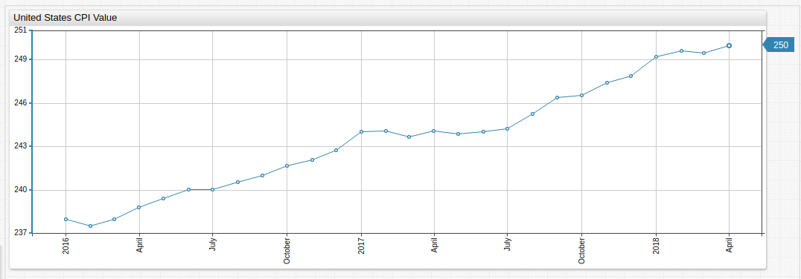
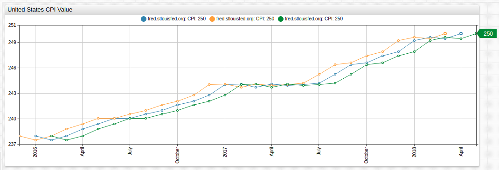
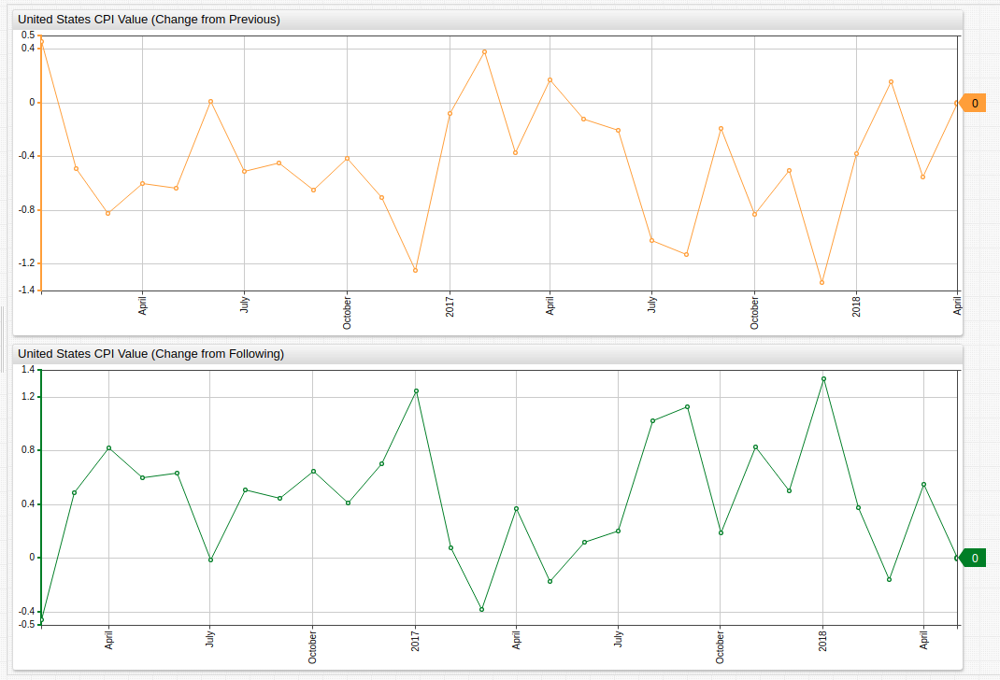

# Computing Series Delta Values in ATSD

## Purpose

[ATSD](https://axibase.com/products/axibase-time-series-database/) has a number of data transformation tools which may be used to perform *ad hoc* data modifications inline. A critical data transformation is the ability to quickly compute delta values for a given series and return those value in place of the raw data.

This article will cover this functionality using three essential tools in ATSD:

* [SQL Console](https://github.com/axibase/atsd/blob/master/sql/README.md)
* [Data API Series: Query](https://github.com/axibase/atsd/blob/master/api/data/series/query.md#series-query)
* [Charts Functions](https://github.com/axibase/charts/blob/master/README.md)

With these tools, any dataset may be modified to return a new series which is composed of deviation value for the current data point either to the sample immediately before or immediately after it.

## SQL Console

**SQL Console** is an structured query syntax available in the ATSD user interface. Using the [LAG](https://github.com/axibase/atsd/tree/master/sql#lag) and [LEAD](https://github.com/axibase/atsd/tree/master/sql#lead) functions, samples on either side of a data point may be accessed and used for calculations.

Consider the query:

```sql
SELECT datetime, value
FROM cpi
WHERE entity = 'fred.stlouisfed.org' AND datetime >= '2017-01-01T00:00:00Z'
```

This query returns [Consumer Price Index](../../../Analysis/CPI_PPI/README.md) values for the United States from 2017 onward, without additional modifications. The result set is shown here:

| datetime   | value |
|------------|-------|
| 2017-01-01 | 244   |
| 2017-02-01 | 244   |
| 2017-03-01 | 244   |
| 2017-04-01 | 244   |
| 2017-05-01 | 244   |
| 2017-06-01 | 244   |
| 2017-07-01 | 244   |
| 2017-08-01 | 245   |
| 2017-09-01 | 246   |
| 2017-10-01 | 247   |
| 2017-11-01 | 247   |
| 2017-12-01 | 248   |
| 2018-01-01 | 249   |
| 2018-02-01 | 250   |
| 2018-03-01 | 249   |
| 2018-04-01 | 250   |

Using the `LAG` or `LEAD` functions, or both, the delta value for each of these entries may be returned alongside raw data.

```sql
SELECT datetime as "Datetime", value AS "Raw", (LEAD(value) - value) AS "Leading Diff", (LAG(value) - value) AS "Trailing Diff"
FROM cpi
WHERE entity = 'fred.stlouisfed.org' AND datetime >= '2017-01-01T00:00:00Z'
```

This query returns the same data as seen above, but also includes delta values for data leading and following the current sample.

| Datetime   | Raw | Leading Diff | Trailing Diff |
|------------|-----|--------------|---------------|
| 2017-01-01 | 244 | 0            | null          |
| 2017-02-01 | 244 | -0           | -0            |
| 2017-03-01 | 244 | 0            | 0             |
| 2017-04-01 | 244 | -0           | -0            |
| 2017-05-01 | 244 | 0            | 0             |
| 2017-06-01 | 244 | 0            | -0            |
| 2017-07-01 | 244 | 1            | -0            |
| 2017-08-01 | 245 | 1            | -1            |
| 2017-09-01 | 246 | 0            | -1            |
| 2017-10-01 | 247 | 1            | -0            |
| 2017-11-01 | 247 | 0            | -1            |
| 2017-12-01 | 248 | 1            | -0            |
| 2018-01-01 | 249 | 0            | -1            |
| 2018-02-01 | 250 | -0           | -0            |
| 2018-03-01 | 249 | 1            | 0             |
| 2018-04-01 | 250 | null         | -1            |

> When `LAG` encounters the first sample and `LEAD` encounters the final sample, for which no trailing or leading sample may be found, `null` value is returned.

Raw data may be removed from the result set by removing the `value` parameter from the [`SELECT`](https://github.com/axibase/atsd/tree/master/sql#select-expression) expression.

```sql
SELECT datetime as "Datetime", (LEAD(value) - value) AS "Leading Diff", (LAG(value) - value) AS "Trailing Diff"
FROM cpi
WHERE entity = 'fred.stlouisfed.org' AND datetime >= '2017-01-01T00:00:00Z'
```

The result set:

| Datetime   | Leading Diff | Trailing Diff |
|------------|--------------|---------------|
| 2017-01-01 | 0            | null          |
| 2017-02-01 | -0           | -0            |
| 2017-03-01 | 0            | 0             |
| 2017-04-01 | -0           | -0            |
| 2017-05-01 | 0            | 0             |
| 2017-06-01 | 0            | -0            |
| 2017-07-01 | 1            | -0            |
| 2017-08-01 | 1            | -1            |
| 2017-09-01 | 0            | -1            |
| 2017-10-01 | 1            | -0            |
| 2017-11-01 | 0            | -1            |
| 2017-12-01 | 1            | -0            |
| 2018-01-01 | 0            | -1            |
| 2018-02-01 | -0           | -0            |
| 2018-03-01 | 1            | 0             |
| 2018-04-01 |              |               |

## Series Query

The [**REST API Client**](https://github.com/axibase/atsd/blob/master/api/data/README.md) allows you to access series directly from the ATSD user interface and work with the data using JSON-formatted queries.

Consider the following `POST` request:

```json
[{
"startDate": "2017-01-01T00:00:00Z",
"endDate":   "2018-12-31T00:00:00Z",
"entity": "fred.stlouisfed.org",
"metric": "cpi"
    }
 ]
```

The query will return a JSON list of the same data samples as the queries [above](#sql-console).

```json
[
  {
    "entity": "fred.stlouisfed.org",
    "metric": "cpi",
    "tags": {},
    "type": "HISTORY",
    "aggregate": {
      "type": "DETAIL"
    },
    "data": [
      {
        "d": "2017-01-01T00:00:00.000Z",
        "v": 244.028
      },
      {
        "d": "2017-02-01T00:00:00.000Z",
        "v": 244.102
      },
      {
        "d": "2017-03-01T00:00:00.000Z",
        "v": 243.717
      },
      {
        "d": "2017-04-01T00:00:00.000Z",
        "v": 244.087
      },
      {
        "d": "2017-05-01T00:00:00.000Z",
        "v": 243.911
      },
      {
        "d": "2017-06-01T00:00:00.000Z",
        "v": 244.032
      },
      {
        "d": "2017-07-01T00:00:00.000Z",
        "v": 244.236
      },
      {
        "d": "2017-08-01T00:00:00.000Z",
        "v": 245.262
      },
      {
        "d": "2017-09-01T00:00:00.000Z",
        "v": 246.392
      },
      {
        "d": "2017-10-01T00:00:00.000Z",
        "v": 246.583
      },
      {
        "d": "2017-11-01T00:00:00.000Z",
        "v": 247.411
      },
      {
        "d": "2017-12-01T00:00:00.000Z",
        "v": 247.91
      },
      {
        "d": "2018-01-01T00:00:00.000Z",
        "v": 249.245
      },
      {
        "d": "2018-02-01T00:00:00.000Z",
        "v": 249.619
      },
      {
        "d": "2018-03-01T00:00:00.000Z",
        "v": 249.462
      },
      {
        "d": "2018-04-01T00:00:00.000Z",
        "v": 250.013
      }
    ]
  }
]
```

Using [Rate Processor](https://github.com/axibase/atsd/blob/master/api/data/series/rate.md), delta values between consecutive samples may be returned by adding a `"rate"` expression to the original request:

```json
[
    {
  "startDate": "2017-01-01T00:00:00Z",
  "endDate":   "2018-12-31T00:00:00Z",
  "entity": "fred.stlouisfed.org",
  "metric": "cpi",
  "rate":
    {
        "counter": false
    }
  }
]
```

The result will will show the difference between the current data sample and the sample immediately following it.

```json
[
  {
    "entity": "fred.stlouisfed.org",
    "metric": "cpi",
    "tags": {},
    "type": "HISTORY",
    "aggregate": {
      "type": "DETAIL"
    },
    "rate": {
      "period": {
        "count": 0,
        "unit": "SECOND"
      },
      "counter": false,
      "order": 0
    },
    "data": [
      {
        "d": "2017-02-01T00:00:00.000Z",
        "v": 0.07400000000001228
      },
      {
        "d": "2017-03-01T00:00:00.000Z",
        "v": -0.3849999999999909
      },
      {
        "d": "2017-04-01T00:00:00.000Z",
        "v": 0.3699999999999761
      },
      {
        "d": "2017-05-01T00:00:00.000Z",
        "v": -0.17599999999998772
      },
      {
        "d": "2017-06-01T00:00:00.000Z",
        "v": 0.12100000000000932
      },
      {
        "d": "2017-07-01T00:00:00.000Z",
        "v": 0.2039999999999793
      },
      {
        "d": "2017-08-01T00:00:00.000Z",
        "v": 1.0260000000000105
      },
      {
        "d": "2017-09-01T00:00:00.000Z",
        "v": 1.1299999999999955
      },
      {
        "d": "2017-10-01T00:00:00.000Z",
        "v": 0.1910000000000025
      },
      {
        "d": "2017-11-01T00:00:00.000Z",
        "v": 0.828000000000003
      },
      {
        "d": "2017-12-01T00:00:00.000Z",
        "v": 0.4989999999999952
      },
      {
        "d": "2018-01-01T00:00:00.000Z",
        "v": 1.335000000000008
      },
      {
        "d": "2018-02-01T00:00:00.000Z",
        "v": 0.3739999999999952
      },
      {
        "d": "2018-03-01T00:00:00.000Z",
        "v": -0.1570000000000107
      },
      {
        "d": "2018-04-01T00:00:00.000Z",
        "v": 0.5510000000000161
      }
    ]
  }
]
```

Unlike the `LAG` and `LEAD` functions, no `null` values will be returned in the result set, thus both queries are able to combined into one request.

## Charts Functions

[**ChartLab**](../../../ChartLabIntro/README.md) and [**Trends**](../../shared/trends.md) are data-visualization services that rely on data-processing, storage, and management tasks by ATSD to create in-depth visualizations using  an easy-to-understand syntax. One of these syntactical options is the ability to perform inline, *ad hoc* data modifications that may be shown independently or alongside raw data.

The CPI dataset from above is visualized here in **ChartLab**:



[](https://apps.axibase.com/chartlab/9bd4b7e0)

[Charts API](https://github.com/axibase/charts) supports [`time-offset`](https://axibase.com/products/axibase-time-series-database/visualization/widgets/time-chart/) setting, which may be used to access antecedent or subsequent data samples directly from the **Editor Window**, `time-offset` may be a positive or negative number, representing past or future time.

Thus:

`time_offset = 1 MONTH`

Will shift the trend line the left, and:

`time_offset = -1 MONTH`

Will shift the trend line to the right.

Data is sampled monthly, this chart shows three series: raw data, data offset a month into the future, and data offset a month in the past.



[](https://apps.axibase.com/chartlab/6a9ce168)

Offset series may be given an [`alias`](https://axibase.com/products/axibase-time-series-database/visualization/widgets/configuring-the-widgets/#series) and used for inline calculations using [`value`](https://axibase.com/products/axibase-time-series-database/visualization/widgets/configuring-the-widgets/#series) settings.



[](https://apps.axibase.com/chartlab/848ce5d5)

[Inheritance](https://axibase.com/products/axibase-time-series-database/visualization/widgets/inheritance/) is used to eliminate redundant syntax when possible.

## Conclusion

ATSD tools allow users to perform meaningful data modification on the fly, without robust syntax. Additional modification options may be explored by searching the [ATSD Documentation](https://github.com/axibase/atsd/blob/master/README.md) or reading one of our other articles that covers topics about working within the [database](../../../README.md#atsd).