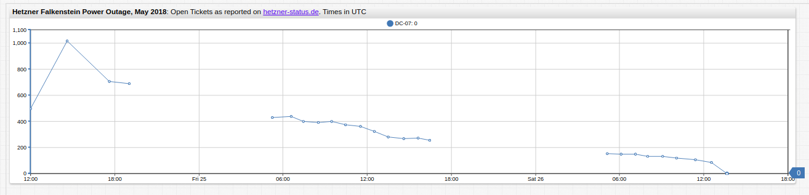
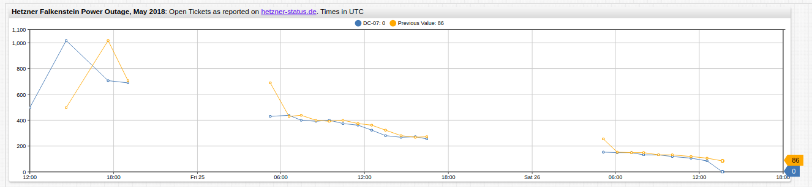
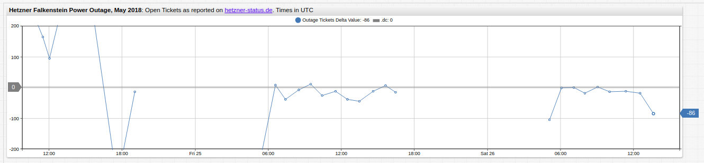

# Computing Series Delta Values in ATSD

## Purpose

[ATSD](https://axibase.com/docs/atsd/) has a number of data transformation tools which may be used to perform ad hoc data modifications inline. A critical data transformation is quickly computing delta values for a given series and returning those values in place of or alongside raw data.

This article will cover this functionality using three essential tools in ATSD:

* [SQL Console](https://axibase.com/docs/atsd/sql/)
* [Data API Series: Query](https://axibase.com/docs/atsd/api/data/series/query.html)
* [Charts Functions](https://github.com/axibase/charts/blob/master/README.md)

With these tools, any dataset may be modified to return a new series which is composed of delta values for a particular sample relative to the sample immediately before or immediately after it.

## SQL Console

**SQL Console** features a structured query syntax which may be used in the ATSD user interface. With [LAG](https://axibase.com/docs/atsd/sql/#lag) and [LEAD](https://axibase.com/docs/atsd/sql/#lead) functions, samples on either side of a data point may be accessed and used for calculations. Data is collected by entity `hetzner` as metric `outage-tickets` which is divided into three series tags (`DC=07`, `DC=10`, and `DC=12`), representing three unique data centers. This article will focus on `DC07`.

Consider the query:

```sql
SELECT datetime, value DC07, (LEAD(value) - value) SUB, (LAG(value) - value) ANTE
FROM "outage-tickets"
WHERE entity = 'hetzner' AND tags.dc = 07
ORDER BY datetime
```

This query compares raw value (`DC07`) to delta values relative to antecedent (`ANTE`) and subsequent datapoints (`SUB`).

The result set in shown here:

| datetime            | DC07 | SUB  | ANTE |
|---------------------|------|------|------|
| 2018-05-24 10:43:00 | 237  | 165  | null |
| 2018-05-24 11:29:00 | 402  | 95   | -165 |
| 2018-05-24 12:00:00 | 497  | 516  | -95  |
| 2018-05-24 14:36:00 | 1013 | -309 | -516 |
| 2018-05-24 17:35:00 | 704  | -14  | 309  |
| 2018-05-24 19:01:00 | 690  | -261 | 14   |
| 2018-05-25 05:13:00 | 429  | 8    | 261  |
| 2018-05-25 06:34:00 | 437  | -39  | -8   |
| 2018-05-25 07:25:00 | 398  | -8   | 39   |
| 2018-05-25 08:29:00 | 390  | 11   | 8    |
| 2018-05-25 09:28:00 | 401  | -27  | -11  |
| 2018-05-25 10:25:00 | 374  | -12  | 27   |
| 2018-05-25 11:30:00 | 362  | -38  | 12   |
| 2018-05-25 12:30:00 | 324  | -45  | 38   |
| 2018-05-25 13:29:00 | 279  | -13  | 45   |
| 2018-05-25 14:36:00 | 266  | 6    | 13   |
| 2018-05-25 15:38:00 | 272  | -16  | -6   |
| 2018-05-25 16:27:00 | 256  | -105 | 16   |
| 2018-05-26 05:05:00 | 151  | -2   | 105  |
| 2018-05-26 06:04:00 | 149  | 0    | 2    |
| 2018-05-26 07:06:00 | 149  | -19  | 0    |
| 2018-05-26 08:00:00 | 130  | 1    | 19   |
| 2018-05-26 09:03:00 | 131  | -14  | -1   |
| 2018-05-26 10:02:00 | 117  | -12  | 14   |
| 2018-05-26 11:22:00 | 105  | -19  | 12   |
| 2018-05-26 12:31:00 | 86   | -86  | 19   |
| 2018-05-26 13:38:00 | 0    | null | 86   |

The data samples from other data center tags may be returned by modifying the [`WHERE`](https://axibase.com/docs/atsd/sql/#where-clause) clause in the query above.

> When `LAG` or `LEAD` encounters a non-existent sample (such as the first or last sample, respectively) [`null`](https://axibase.com/docs/atsd/sql/#null) value is returned.

SQL Console may export a result set in `CSV` format so it may be uploaded into the database via [CSV Parser](https://axibase.com/docs/atsd/api/data/ext/csv-upload.html) or [Data API](https://axibase.com/docs/atsd/api/data/series/csv-insert.html).

## Series Query

The [**REST API Client**](https://axibase.com/docs/atsd/api/data/) allows you to access series from the user interface and work with the data using JSON-formatted queries. [Series: Query](https://axibase.com/docs/atsd/api/data/series/query.html) may be used to return raw data.

Consider the following `POST` request:

```json
[{
    "startDate": "2018-05-24T00:00:00Z",
    "endDate": "2018-05-27T00:00:00Z",
    "entity": "hetzner",
    "metric": "outage-tickets",
    "tags": {"dc" : "07"}
}]
```

The result set is shown here:

```json
[{"entity":"hetzner","metric":"outage-tickets","tags":{"dc":"07"},"type":"HISTORY","aggregate":{"type":"DETAIL"},"data":[
{"d":"2018-05-24T10:43:00","v":237.0},
{"d":"2018-05-24T11:29:00","v":402.0},
{"d":"2018-05-24T12:00:00","v":497.0},
{"d":"2018-05-24T14:36:00","v":1013.0},
{"d":"2018-05-24T17:35:00","v":704.0},
{"d":"2018-05-24T19:01:00","v":690.0},
{"d":"2018-05-25T05:13:00","v":429.0},
{"d":"2018-05-25T06:34:00","v":437.0},
{"d":"2018-05-25T07:25:00","v":398.0},
{"d":"2018-05-25T08:29:00","v":390.0},
{"d":"2018-05-25T09:28:00","v":401.0},
{"d":"2018-05-25T10:25:00","v":374.0},
{"d":"2018-05-25T11:30:00","v":362.0},
{"d":"2018-05-25T12:30:00","v":324.0},
{"d":"2018-05-25T13:29:00","v":279.0},
{"d":"2018-05-25T14:36:00","v":266.0},
{"d":"2018-05-25T15:38:00","v":272.0},
{"d":"2018-05-25T16:27:00","v":256.0},
{"d":"2018-05-26T05:05:00","v":151.0},
{"d":"2018-05-26T06:04:00","v":149.0},
{"d":"2018-05-26T07:06:00","v":149.0},
{"d":"2018-05-26T08:00:00","v":130.0},
{"d":"2018-05-26T09:03:00","v":131.0},
{"d":"2018-05-26T10:02:00","v":117.0},
{"d":"2018-05-26T11:22:00","v":105.0},
{"d":"2018-05-26T12:31:00","v":86.0},
{"d":"2018-05-26T13:38:00","v":0.0}]}]
```

Using [Rate Processor](https://axibase.com/docs/atsd/api/data/series/rate.html), delta values between consecutive samples may be returned by adding a `"rate"` expression to the original request:

```json
[{
    "startDate": "2018-05-20T00:00:00Z",
    "endDate": "2018-05-27T00:00:00Z",
    "entity": "hetzner",
    "metric": "outage-tickets",
    "tags": {"dc" : "07"},
    "rate": {
      "counter": false
}}]
```

The result will show the difference between the current data sample and the sample immediately following it. The result set is show here:

```json
[{"entity":"hetzner","metric":"outage-tickets","tags":{"dc":"07"},"type":"HISTORY","aggregate":{"type":"DETAIL"},"rate":{"period":{"count":0,"unit":"SECOND"},"counter":false,"order":0},"data":[
{"d":"2018-05-24T11:29:00","v":165.0},
{"d":"2018-05-24T12:00:00","v":95.0},
{"d":"2018-05-24T14:36:00","v":516.0},
{"d":"2018-05-24T17:35:00","v":-309.0},
{"d":"2018-05-24T19:01:00","v":-14.0},
{"d":"2018-05-25T05:13:00","v":-261.0},
{"d":"2018-05-25T06:34:00","v":8.0},
{"d":"2018-05-25T07:25:00","v":-39.0},
{"d":"2018-05-25T08:29:00","v":-8.0},
{"d":"2018-05-25T09:28:00","v":11.0},
{"d":"2018-05-25T10:25:00","v":-27.0},
{"d":"2018-05-25T11:30:00","v":-12.0},
{"d":"2018-05-25T12:30:00","v":-38.0},
{"d":"2018-05-25T13:29:00","v":-45.0},
{"d":"2018-05-25T14:36:00","v":-13.0},
{"d":"2018-05-25T15:38:00","v":6.0},
{"d":"2018-05-25T16:27:00","v":-16.0},
{"d":"2018-05-26T05:05:00","v":-105.0},
{"d":"2018-05-26T06:04:00","v":-2.0},
{"d":"2018-05-26T07:06:00","v":0.0},
{"d":"2018-05-26T08:00:00","v":-19.0},
{"d":"2018-05-26T09:03:00","v":1.0},
{"d":"2018-05-26T10:02:00","v":-14.0},
{"d":"2018-05-26T11:22:00","v":-12.0},
{"d":"2018-05-26T12:31:00","v":-19.0},
{"d":"2018-05-26T13:38:00","v":-86.0}]}]
```

Returned datasets may inserted via [`POST`](https://axibase.com/docs/atsd/api/data/#series) method. Unlike the `LAG` and `LEAD` functions, no `null` values will be returned in the result set, thus both queries are combined into one request.

## Charts Functions

[**ChartLab**](../../../ChartLabIntro/README.md) is data-visualization service that relies on data-processing, storage, and management tasks by ATSD to create in-depth visualizations using  an easy-to-understand syntax. One of these syntactical options is the ability to perform inline data modifications on the fly that may be shown independently or alongside raw data.

The `outage-tickets` dataset is visualized here in **ChartLab**:



[](https://apps.axibase.com/chartlab/c39eda7f#fullscreen)

> Note that outage ticket reports only occurred during local business hours thus [`disconnect-count`](https://axibase.com/products/axibase-time-series-database/visualization/widgets/time-chart/#tab-id-12) setting has been applied to compensate for empty periods without returning `0` values.

[Charts API](https://github.com/axibase/charts) supports several [functions](https://github.com/axibase/charts/blob/master/syntax/functions.md#-functions). Here the [`previous`](https://github.com/axibase/charts/blob/master/syntax/functions.md#previous) function is used, whereby antecedent samples may be accessed by applying an [`alias`](https://axibase.com/products/axibase-time-series-database/visualization/widgets/configuring-the-widgets/) to the raw series.



[](https://apps.axibase.com/chartlab/465a96ba#fullscreen)

The [`replace-value`](https://axibase.com/products/axibase-time-series-database/visualization/widgets/configuring-the-widgets/) setting is used to calculate a new series using the underlying formula:

```css
replace-value = value('raw') - value('prev')
```

Where `raw` and `prev` aliases are applied to component series. [Inheritance](https://axibase.com/products/axibase-time-series-database/visualization/widgets/inheritance/) is used to eliminate redundant syntax when possible.



[](https://apps.axibase.com/chartlab/15a094ec#fullscreen)

> Data manipulated by inline functions remains unmodified in the database.