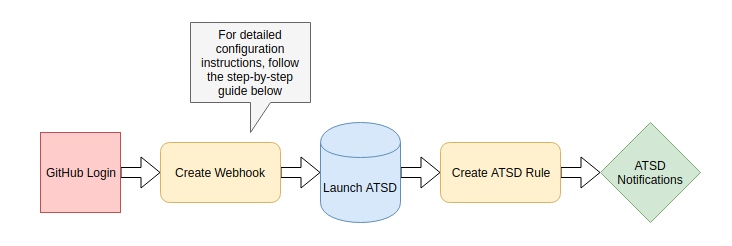

# Configure Notifications for New Issues

### Overview

This guide shows how to configure GitHub to alert you when someone raises an issue in your repository. This feature allows you to monitor your repository and receive notifications the moment an issue is raised. Follow the instructions to configure the notifications to be sent to you directly through a third-party messenger service with [Axibase Time Series Database](https://axibase.com/products/axibase-time-series-database/).

