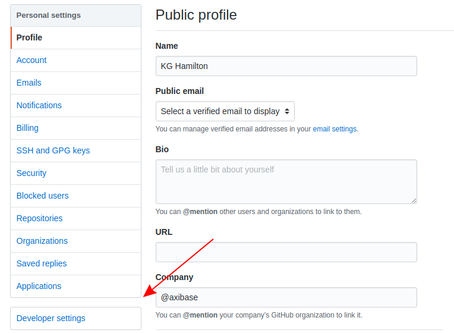
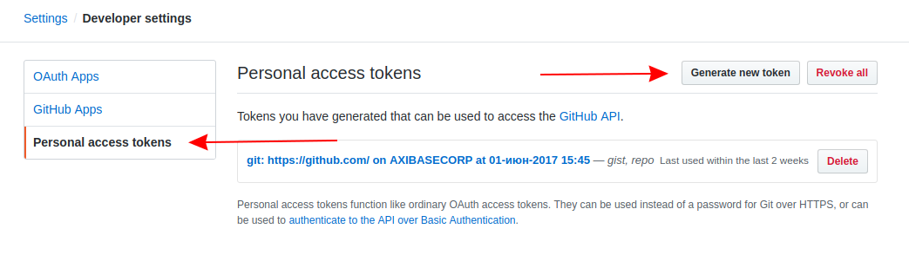

# Daily Pull Request Report for GitHub Repositories

## Overview

This guide shows how to configure [ATSD](https://axibase.com/products/axibase-time-series-database/) to produce a daily report with all open Pull Requests across an organization's entire collection of repositories and email it to subscribed users. GitHub [webhook services](pr-notification.md) may be used to notify repository owners and administrators when a Pull Request is opened, but for larger organizations with a large collection of repositories, individual Pull Requests may be missed and left open leading to potential conflicts or inaccurate code / documentation. This feature allows repository owners and administrators to monitor their work and receive a daily report with the status of all open Pull Requests across an entire repository library. Follow the instructions to configure the notifications to be sent directly to any group of subscribers via email with [Axibase Time Series Database](https://axibase.com/products/axibase-time-series-database/) and the [GitHub v4 API](https://developer.github.com/v4/).


## Purpose

Large organizations maintain large GitHub libraries with many repositories. Keeping track of many incoming Pull Requests is important to maintain accurate documentation and up-to-date code accessible to end users, but even attentive repository administrators may miss the occasional Pull Request. Stay on top of open Pull Requests with daily reports delivered to a list of subscribers.

GitHub features email notifications for individual repositories, but the task of tracking Pull Requests across many repositories may be better accomplished using programmatic integration leveraging the [GraphQL](https://graphql.org/) API query language, featured in the GitHub API.

In contrast to the [GitHub v3 REST API](https://developer.github.com/v3/), the latest API offers more flexibility by replacing multiple REST requests with a single call to fetch all relevant data.

## Launch ATSD Sandbox

Execute the `docker run` command to launch a local ATSD [sandbox](https://github.com/axibase/dockers/tree/atsd-sandbox) instance.

Replace the `SERVER_URL` parameter with the public DNS name of the Docker host where the sandbox container will be running.

```sh
docker run -d -p 8443:8443 \
  --name=atsd-sandbox \
  --env START_COLLECTOR=off \
  --env SERVER_URL=https://atsd.company_name.com:8443 \
  --env EMAIL_CONFIG=mail.properties \
  --env ATSD_IMPORT_PATH='https://raw.githubusercontent.com/axibase/atsd-use-cases/master/how-to/github/resources/github-daily-pr-status.xml' \
  --env ATSD_IMPORT_PATH='https://raw.githubusercontent.com/axibase/atsd-use-cases/master/how-to/github/resources/github-graphql-table.xml' \
  --env ATSD_IMPORT_PATH='https://raw.githubusercontent.com/axibase/atsd-use-cases/master/how-to/github/resources/graphql-queries.xml' \
  --volume /home/user/mail.properties:/mail.properties \
  axibase/atsd-sandbox:latest
```

The bound volume should point to the **absolute path** where a plaintext file is stored containing the following parameters:

```txt
server_name=ATSD-sandbox
server=smtp.example.org
port=587
sender=notify@axibase.com
user=myuser@example.org
password=secret
auth=true
ssl=true
upgrade_ssl=true
```

This file defines the mail server which will host outgoing reports. The Simple Mail Transfer Protocol (SMTP) documentation for any mail server will contain information on the correct `port` to expose, typically `587`, and the name of the server. Replace `server`, `user`, and `password` fields with legitimate credentials.

> For advanced launch settings refer to this [guide](https://github.com/axibase/dockers/tree/atsd-sandbox).

Watch the sandbox container logs for `All applications started`.

```sh
docker logs -f atsd-sandbox
```

The ATSD host will be present in the logs as a clickable link:

```txt
[ATSD] https://atsd_hostname:8443
```

## Generating OAuth Access Token

The GitHub API may be accessed [several ways](https://developer.github.com/v3/auth/#other-authentication-methods). This tool uses an [OAuth Personal Token](https://blog.github.com/2013-05-16-personal-api-tokens/) to query the API without sending user login information. Follow these instructions to generate a personal token and store it in the local ATSD instance.

While logged in to GitHub, click your profile picture in the upper-right corner from any page, then click **Settings**



Open the **Developer Settings** page and navigate to the **Personal Access Tokens** tab.



Click **Generate New Token**, you will prompted to enter your password.


Configure the token to grant **read:org** permissions in the **admin:org** section. This scope grants read-only organization access to any user bearing this token, keep it confidential. For more information about token scopes, see [GitHub Developer Documentation](https://developer.github.com/apps/building-oauth-apps/scopes-for-oauth-apps/).

Log in to ATSD using the [default credentials](https://github.com/axibase/dockers/tree/atsd-sandbox#default-credentials). Navigate to the **Web Notifications** page from the **Alerts** menu.


Under **Network Settings**, the **Headers** field will contain the placeholder `Authorization: bearer ****************************************`. Replace the asterisk template with legitimate token credentials and save.

## Adding Subscribers

Any number of email subscribers may be notified when a new Pull Request Report is generated. Open the **Alerts** menu and select **Rules**.


Open the `github-daily-pr-status` rule and navigate to the **Email Notifications** tab. Add a list of subscriber email addresses separated by commas.


> The system will prevent malformed email addresses from being saved and return a warning if one is entered.

## Configuring Report Delivery

By default, the `github-daily-pr-status` rule is configured to deliver a report every morning at 5 AM UTC time, which may differ from local time.

Open the **Settings** menu and select **System Information** to view system time.


Modify delivery time by opening the `github-daily-pr-status` rule from the **Rules** page. The `Condition` field contains:

```java
now.getHourOfDay == 5
```

Change the value of this expression to the integer UTC 24-hour time when the report should be delivered.

Minute granularity may be applied by extending the expression:

```java
now.getHourOfDay == 18 && now.getMinuteOfHour == 30
```

Report delivery will be scheduled for 6:30 PM UTC time.

## Configure GraphQL Query

Open the **Data** menu and select **Replacement Tables**.


The GraphQL query will be present in the `value` field. The `organization` clause contains the placeholder value `your-organization-name` surrounded by quotation marks. Without deleting the quotation marks, replace the template information with the case-sensitive name of the GitHub organization whose repositories will be monitored. For information about creating a new organization, see the [GitHub Help Documentation](https://help.github.com/articles/creating-a-new-organization-from-scratch/).

## Notification Payload

The `github-daily-pr-status` rule builds an HTML table with information returned by the GQL query, according to the following configuration found in the **Text** field of the **Email Notifications** tab:

```txt
${addTable(
  jsonToLists(
    jsonPathFilter(
      queryConfig('github-graphql-table',
        ['GQL_query': lookup('graphql-queries', 'issue-list')]
      ).content,
      "$..pullRequests.nodes[*]"
    )
  )
, 'html', true)}
```

The `queryConfig` clause calls `github-graphql-table` which queries the [GraphQL API v4](https://developer.github.com/v4/guides/forming-calls/#the-graphql-endpoint) via POST method and returns open Pull Request information in JSON format.

The `'GQL_query'` variable is delivered as the outgoing query and returns the `pullRequests` [node](https://developer.github.com/v4/guides/intro-to-graphql/#node), which is a JSON list of open Pull Requests.

## Report Delivery

Before report delivery, ensure all parameters have been correctly configured:

* ATSD web client is able to resolve outgoing email server (See **Settings** > **Mail Client** to send test messages);

* [OAuth access token](#generating-oauth-access-token) created and inserted;

* [Email subscribers](#adding-subscribers) defined;

* [GraphQL query](#configure-graphql-query) targets the appropriate organization. Any organization's public repositories may be queried by GitHub GraphQL API.

A sample report from [**Siemens**](https://github.com/siemens) repositories:


Clickable URLs redirect to the Pull Request page.

For additional setup information, raise an [issue](https://github.com/axibase/atsd/issues) on the ATSD GitHub repository. For other GitHub tools developed by Axibase, see our [Use Cases Repository](https://github.com/axibase/atsd-use-cases#github).