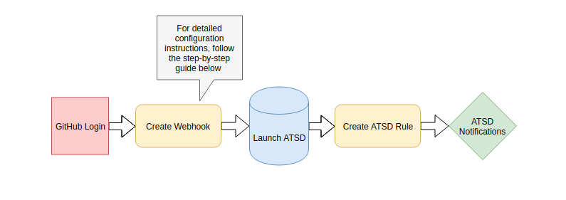

# Configure Notifications Upon Repository Creation

### Overview

This guide shows how to configure GitHub to alert you when a new repository is created. This feature allows you to stay current on all documentation and code updates. Follow the extended instructions to configure the notifications to be sent to you directly through a third-party messenger service with [Axibase Time Series Database](https://axibase.com/products/axibase-time-series-database/).

