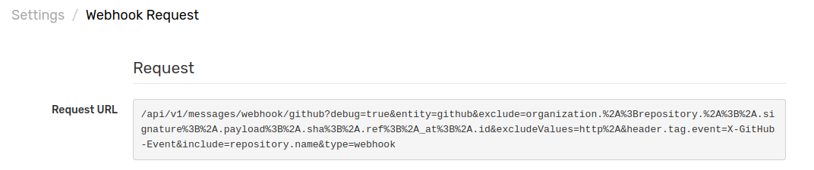

# Troubleshooting

Correct common problems with GitHub webhooks.

## Confirm Connectivity

In the ATSD environment, open the left-side **Settings** menu, navigate to **Diagnostics** and click **Webhook Requests**.

On the **Webhook Requests** page, you will see your newly-configured webhook. Under the **Details** column, click the **View** link to see detailed information about the webhook request.

You'll receive a test message from ATSD:

