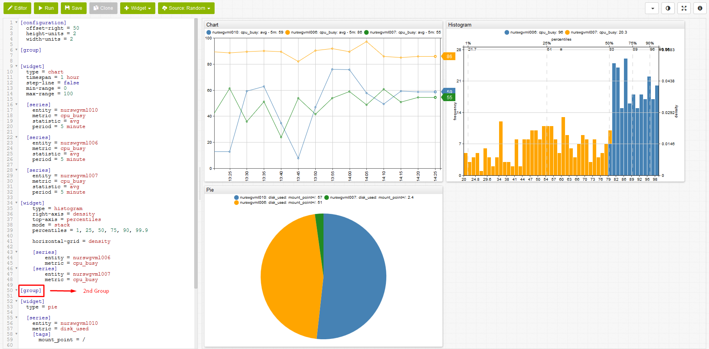
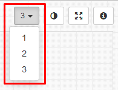
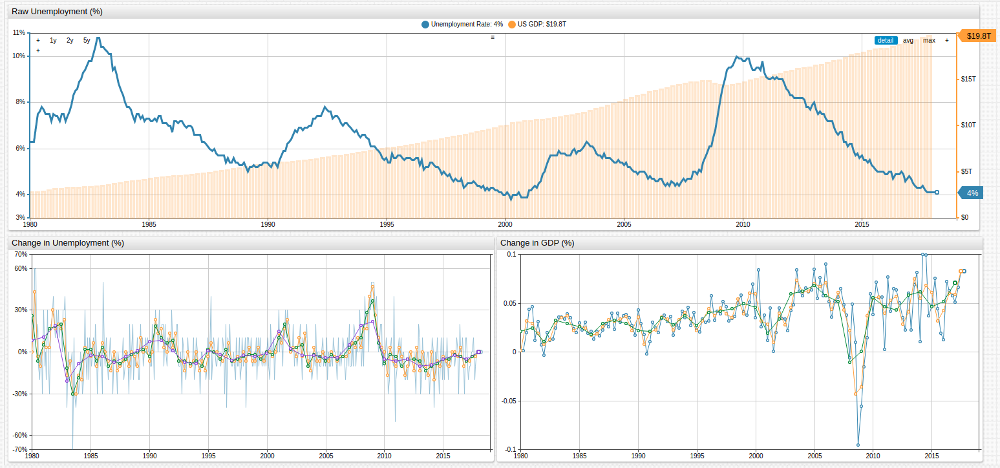

# Data Visualization with ChartLab


## Introduction

**ChartLab** is a versatile online tool which allows users to test drive [Axibase Time Series Database](https://axibase.com/docs/atsd/) (ATSD) visualization capabilities. **ChartLab** does not require any registration and allows you to experiment with different layouts and widget settings prior to deploying it in your own ATSD instance. For front-end developers familiar with [jsfiddle](http://jsfiddle.net/da1rosy8/), **ChartLab** shares many of the same properties and characteristics.

This article shows basic features and functionality of the **ChartLab** service.

## ChartLab Features

To start, open a blank [**ChartLab**](https://apps.axibase.com/chartlab/) page.

The **ChartLab** menu has the following components:

* **Editor**: Toggle configuration editor.
* **Run**" Apply and view a portal based on the current configuration in the Editor window.
* **Save**: Save the current configuration under as new version in the current directory;
* **Clone**: Save current configuration in a new directory;
* **Widget**: Append widget template to the current desired configuration;
* **Source**: Switch between data sources: Random or ATSD.

## Source

**ChartLab** supports two data sources:

1. Random Data Generator
2. Axibase Time Series Database


The Random Data Generator is a non-existent dataset which invokes the `math.random()` javascript function. 

>For more information see the [Mozilla Developer Network Documentation](https://developer.mozilla.org/en-US/docs/Web/JavaScript/Reference/Global_Objects/Math/random).

This function returns a floating-point, pseudo-random number in the range `[0,1]`, which includes all number from zero up to, but not including, 1. These numbers have no meaning, the functions generates a new random number every 60 seconds.

Use the Randon Data Generator to explore different widgets and layouts available in **ChartLab**

ATSD data is data stored in ATSD from a variety of sources including server equipment, network devices, and online resources. Use **ChartLab** to access public data stored by ATSD and [install](https://axibase.com/docs/atsd/installation/) the databast to begin uploading your own.

## Widget

ChartLab contains each of these **Widgets**, shown in this image.


See the [Axibase website](https://axibase.com/products/axibase-time-series-database/visualization/widgets/) for complete information about available widgets.

To add a Widget template to the **Editor** window, open the **Widget** drop-down list and select a widget.

## Run

Once you define a **Source** and **Widget**, click **Run** to render the visualization.

## Widget Settings

Widgets are visualized chronologically, from top to bottom, based on the order in the **Editor** window. The figure below displays a Chart and Histogram widget, respectively.


By default, widgets are arranged in a single horizontal row. Add a new `[group]` clause to modify this feature.

In the image below, a Pie Chart widget is created by adding a new `[group]`.



Change **height-units** and **width-units** settings in the **Editor** window to resize the widgets.


**ChartLab** supports commenting:

* Single-line comment begin `#`.
* Multi-line comments begin `/*` and end `*/`.

Quickly reformat all text shown in the **Editor** window. Select all text and use `ctrl + tab`.

## Save

If you would like to create a new version of the current portal by adding a version suffix to the current URL, click **Save**.

Use the **Versions** drop-down list to select a specific iteration of a given chart.



## Clone

To save the portal under an entirely new URL click **Clone**.


The cloned portal is identical to the original with a unique URL. Use this feature to publish a final addition so that earlier versions remain hidden.

## Editor

Show or hide the **Editor** window by clicking **Editor**.

## Miscellaneous Features

Use the toolbar at the top of the screen to further customize your visualization.


**Theme** applies one of the available **ChartLab** themes


**Fullscreen** toggles the view between standard and fullscreen.

Access [Charts Documentation](https://axibase.com/products/axibase-time-series-database/visualization/widgets/portal-settings/) by clicking **Information**.

## User-Defined Functions

**ChartLab** supports user-defined functions, enabling users to store and re-use statistical functions.



[](https://trends.axibase.com/c9311303#fullscreen)

The above visualization applies user-defined functions for each of the series. An abbreviated version of the configuration is shown here:

```javascript
### On the [configuration] level, the 'import' command is used to load functions from the `fred.js` file
### The library is assigned the name 'fred'.
### Multiple function libraries may be imported into the same portal.

[configuration]
  import fred = fred.js

  offset-right = 50
  height-units = 2
  width-units = 1
  start-time = 1980

  entity = fred.stlouisfed.org
  metric = unrate

[series]
  alias = base
  display = false

[series]
  value = fred.MonthlyChange('base')
```

Using two series, **ChartLab** calculates the monthly change as a new series with a `value` expression which applies `MonthlyChange` function from the `fred` library to the series identified with alias `base`.

### `fred` Library

Any **ChartLab** user may access the `fred.js` library, which contains the following functions:

| Function Name                      | Arguments       | Description |
|------------------------------------|-----------------|-------------|
| [`MonthlyChange`](https://trends.axibase.com/c5e043b5)                      | alias           | Month-on-month change |
| [`ChangeFromYearAgo`](https://trends.axibase.com/34165ff1)                  | alias           | Year-on-year change |
| [`ChangeByOffset`](https://trends.axibase.com/90cfadae)                     | alias, [interval](https://axibase.com/products/axibase-time-series-database/visualization/end-time/) | Customizable interval-on-interval change |
| [`MonthlyPercentChange`](https://trends.axibase.com/7bca24b2)               | alias           | Month-on-month percent change |
| [`PercentChangeFromYearAgo`](https://trends.axibase.com/44627e1d)           | alias           | Year-on-year percent change |
| [`PercentChangeByOffset`](https://trends.axibase.com/b0deb565)              | alias, [interval](https://axibase.com/products/axibase-time-series-database/visualization/end-time/) | Customizable interval-on-interval change |
| [`CompoundedAnnualRateOfChange`](https://trends.axibase.com/f04b65fc)       | alias           | Geometric-progression ratio which compounds change annually
| [`ContinuouslyCompoundedRateOfChange`](https://trends.axibase.com/16ea90bf) | alias           | Geometric-progression ratio which continuously compounds change over an infinitesimally small interval
| [`NaturalLog`](https://trends.axibase.com/897f53e1)                         | alias           | Natural Logarithm (`LOG` base constant `e`)
| [`IndexMax`](https://trends.axibase.com/3db3bfa7)                           | alias           | Maximum series value is used as index value
| [`Index`](https://trends.axibase.com/964a4b97)                              | alias, [time](https://axibase.com/products/axibase-time-series-database/visualization/end-time/)     | User-selected value is used as index value

Open any of the visualizations above to see syntax and visual demonstrations of each function.

## Further Reading

For more detailed information about ATSD, the underlying mechanics, or download instructions see the [ATSD Documentation](https://axibase.com/docs/atsd/).

Reach out with questions, comments, or suggestions by raising an [issue](https://github.com/axibase/atsd-use-cases/issues) on the Axibase GitHub page.