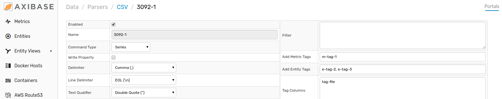
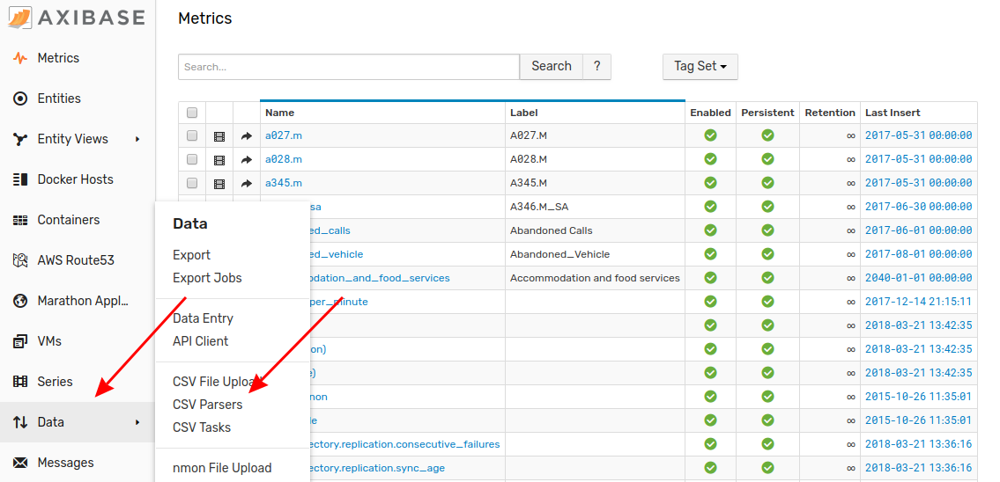
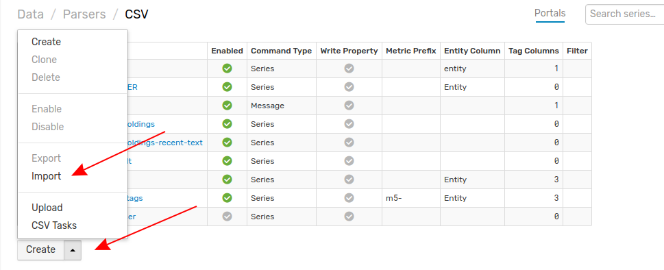
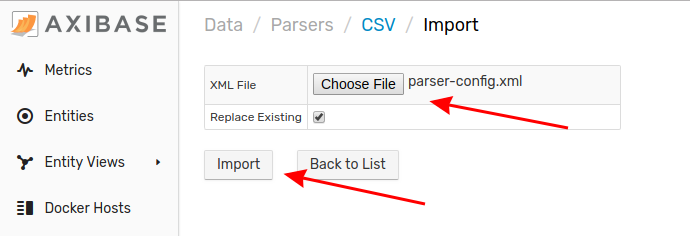

# Importing CSV Parsers 

A parser is an automated tool that reads CSV files and creates Entities, Metrics, Timestamps, and Tags from the information contained therein.

1. From any tab in the ATSD interface, expand the **Data** menu and select **CSV Parsers**.

2. From the **CSV** page, expand the split button, click **Import**.

3. Select the appropriate XML file from your local machine. Click **Import**.

Your parser configuration has been uploaded to ATSD. Return to the **CSV** page where the newly configured portal will be visible.
