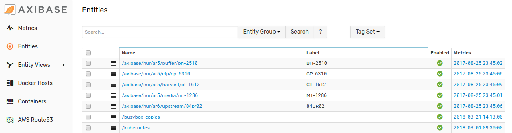
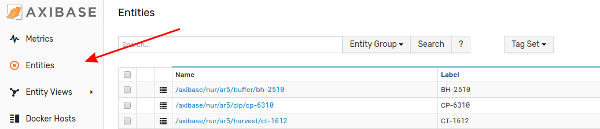
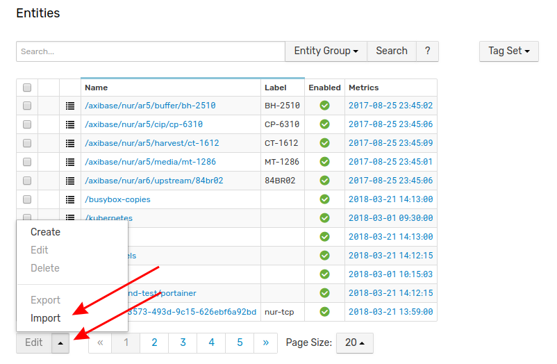
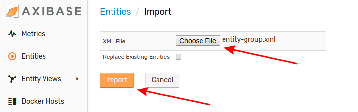

# Importing Entity Groups

An Entity Group is the highest denomination of data within ATSD. An entity may be subdivided into metrics, which may be further subdivided into tags. Follow this process to upload a new Entity Group to your local ATSD instance.

1. From any tab in the ATSD interface, click the **Entities** link from the toolbar on the left. 

2. From the **Entities** page, expand the split button at the bottom of the page and click **Import**.

3. Select the appropriate XML file from your local machine. Click **Import**.

Your Entity Group has been uploaded to ATSD. Return to the **Entities** page where the newly imported Entity Group will be visible.
