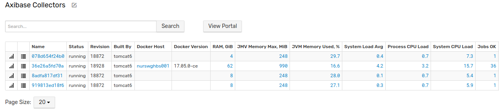
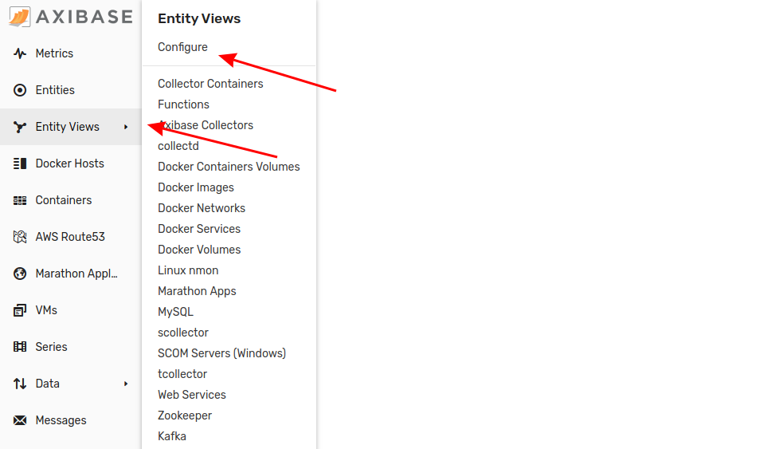
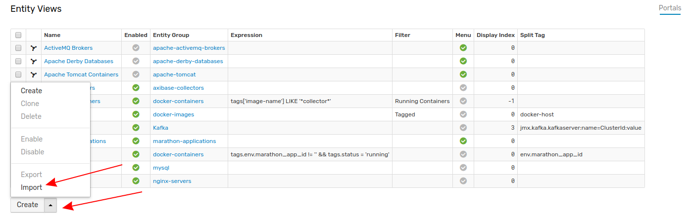
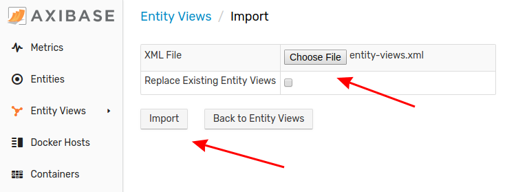

# Importing Entity Views

Entity Views are a set of special queries which retrieve specific information automtically on a recurring basis. Follow this process to upload an Entity View configuration to your local ATSD instance.

1. Expand the **Entity Views** menu from the left toolbar and select **Configure**.

2. Expand the split button at the bottom of the page, click **Import**.

3. Select the appropriate XML file from your local machine by clicking **Choose File**. Click **Import**.

Your Entity View has been uploaded to ATSD. Expand the **Entity Views** menu from the left toolbar to navigate to this new page.
