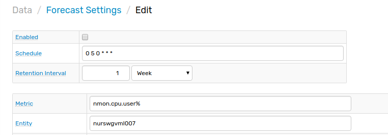
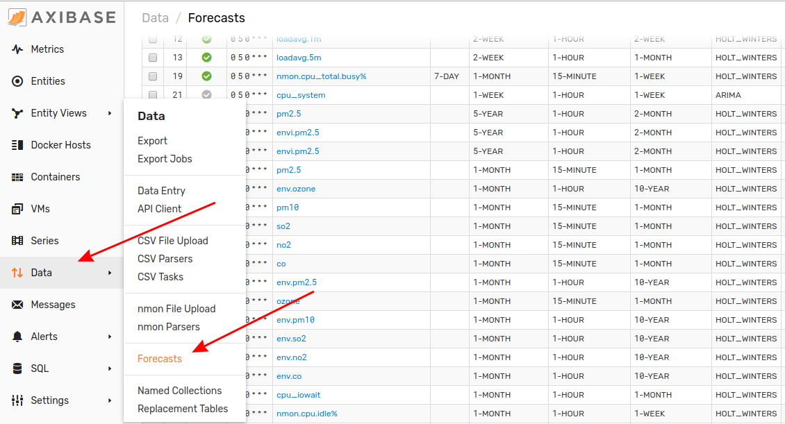
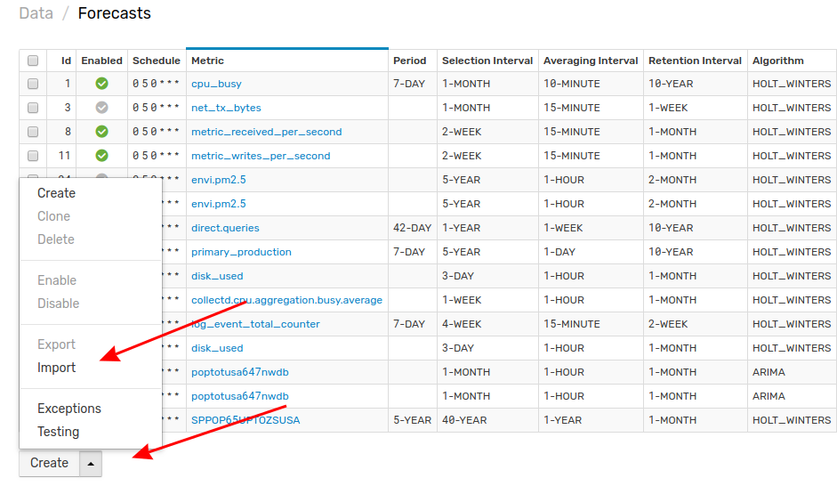
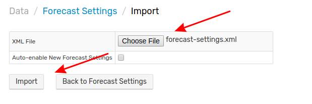

# Importing Forecasts

A Forecast is a prediction of future data using existing data and a mathematical algorithm. Forecasts may be automatically configured by ATSD or customized to include a specific score interval, data selection interval, and aggregation period.

Follow this process to upload a Forecast configuration to your local ATSD instance.

1. Expand the **Data** menu and select **Forecasts**.

2. From the **Forecasts** page, expand the split button and click **Import**.

3. Select the appropriate XML file from you local machine and click **Import**.

4. Your forecast configuration has been uploaded to ATSD.

Return to the **Forecasts** page where the newly configured Forecast will be visible.

### Uploading Multiple Configuration Files

Note that multiple files may be uploaded together or as an archive by opening the **Settings** menu, expanding the **Diagnostics** section, selecting the **Backup Import** page, and completing the form to which you will be directed.

