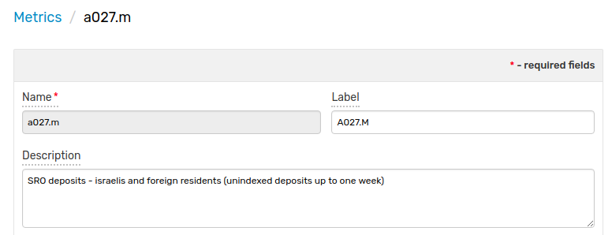
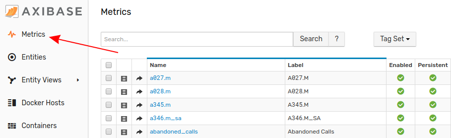
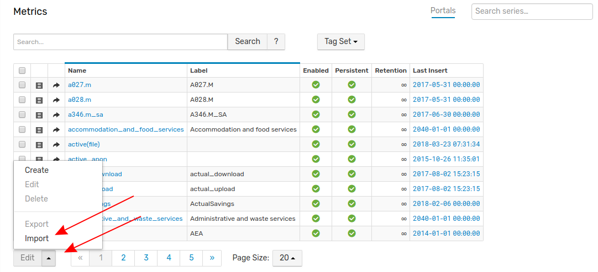
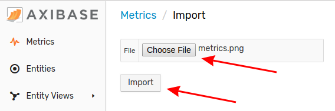
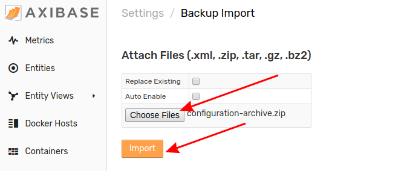

# Importing Metrics 

Metrics are quantitative measurements recorded by or imported into ATSD, they may be either discrete (finite) or continuous (infinite) based on the data which they record.

Follow this process to upload metrics to your local ATSD instance.

1. Click the **Metrics** link in the toolbar on the left.

2. From the **Entites** page, expand the split button at the bottom of the page and click **Import**.

3. Select the appropriate XML file from you local machine and click **Import**.

Your metrics have been uploaded to ATSD. Return to the **Metrics** page where the newly imported metrics will be visible. 

### Uploading Multiple Configuration Files

Note that multiple files may be uploaded together or as an archive by opening the **Settings** menu, expanding the **Diagnostics** section, selecting the **Backup Import** page, and completing the form to which you will be directed.

