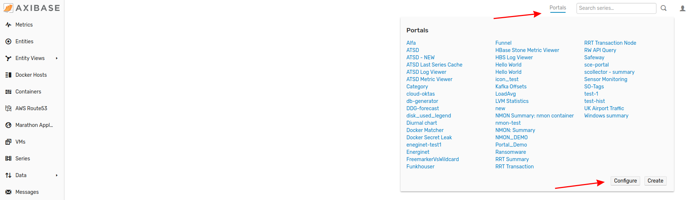
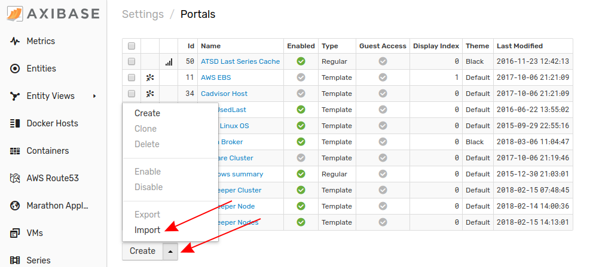
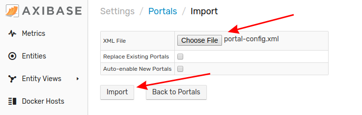

# Importing Portals

A Portal is a collection of real-time data visualizations which are grouped together in one interface. Follow this process to upload a Portal to your local ATSD instance.

1. From any tab in the ATSD interface, click the **Portals** link in the top menu and select **Configure**.

2. From the **Portals** page, expand the split button and click **Import**.

3. Select the appropriate XML file from your local machine by clicking Choose File. By default, ATSD will add a number to the file name if such a portal already exists. Set the flag in the **Replace Existing Portals** box to modify this behavior. By default, a new portal will not be enabled. Set the flag in the **Auto-Enable New Portals** box to modify this behavior. Click **Import**.

Your portal has been uploaded to ATSD. Expand the Portals menu from the top toolbar to navigate to this new page.
