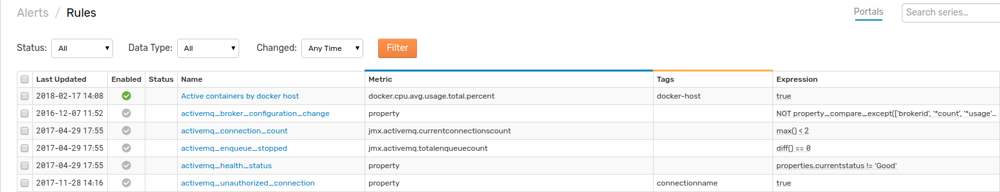
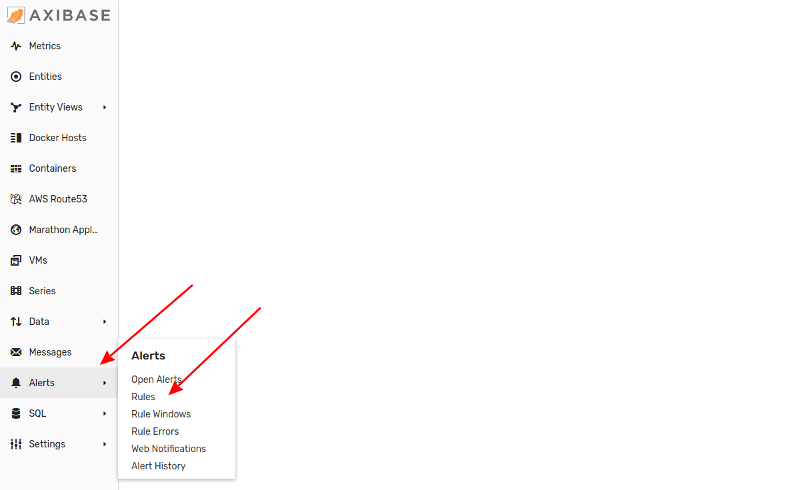
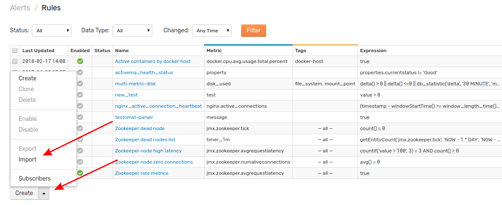
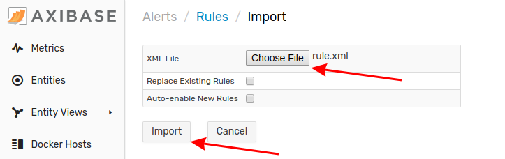

# Importing Rules

A rule is an condition which triggers an automated response from ATSD. Follow this process to upload a rule to you local ATSD instance.

1. Expand the **Alerts** menu and select **Rules**.

2. From the **Rules** page, expand the split button at the bottom of the page. Click **Import**.

3. Select the appropriate XML file from your local machine. Click **Import**.

Your new rule has been uploaded to ATSD. Return to the **Rules** page where the newly configured rule will be visible.
