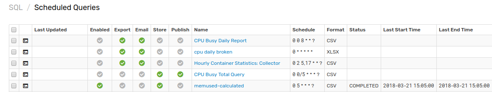
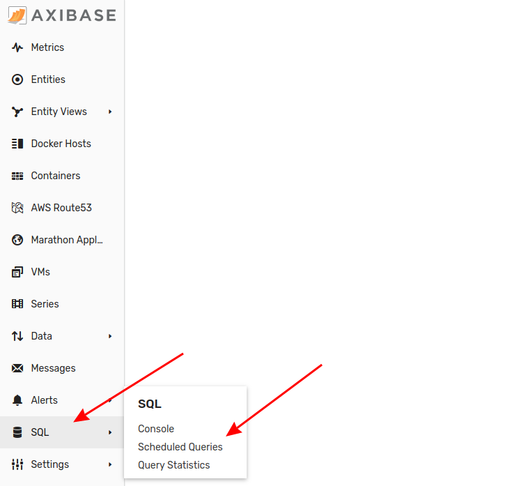
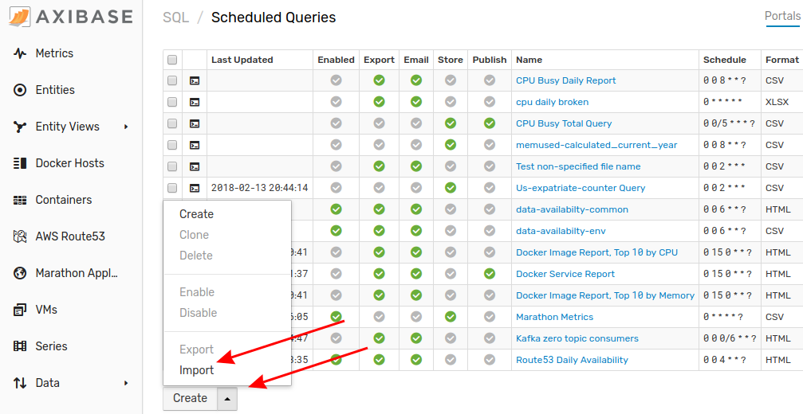
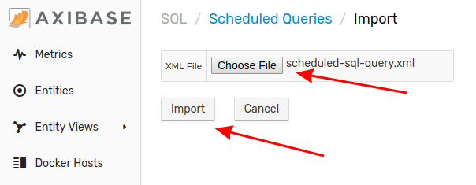

# Importing Scheduled SQL Queries

A scheduled SQL query is one that is completed on a repetive and time-dependant basis, it may include additional operations such as email notifications. Follow this process to add a new schedule SQL query to your local ATSD instance.

1. Expand the **SQL** menu and select **Scheduled Queries**.

2. From the **Scheduled Queries** page, expand the split button at the bottom of the page and click **Import**.

3. Select the appropriate XML file from your local machine and click **Import**.

Your scheduled SQL query has been added to ATSD. Return to the **Scheduled Queries** page, where the newly configured scheduled SQL query will be visible.
