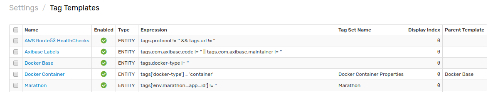

# Importing Tag Templates

A Tag Template is a set of tags which belong to an specific. Follow this process to upload a tag template to your local ATSD instance.

1. Expand the **Settings** menu and select **Tag Templates**.

2. From the **Tag Templates** page, expand the split button, click **Import**

3. Select the appropriate XML file from your local machine, click **Import**.

Your tag template has been uploaded to ATSD. Return to the **Tag Templates** page where the newly configured template will be visible.
