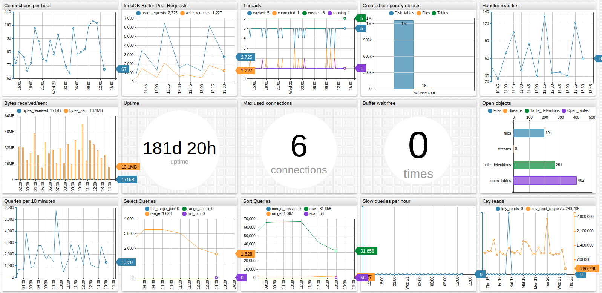
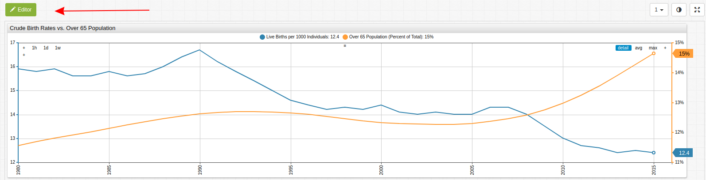
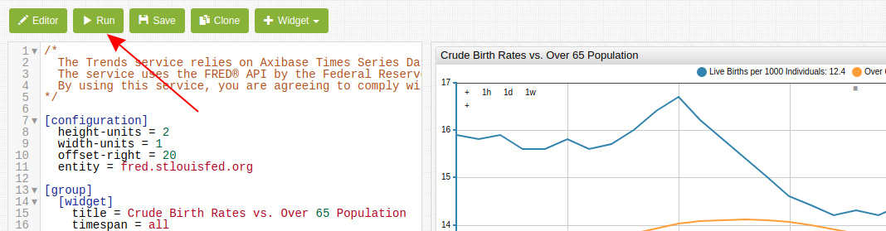
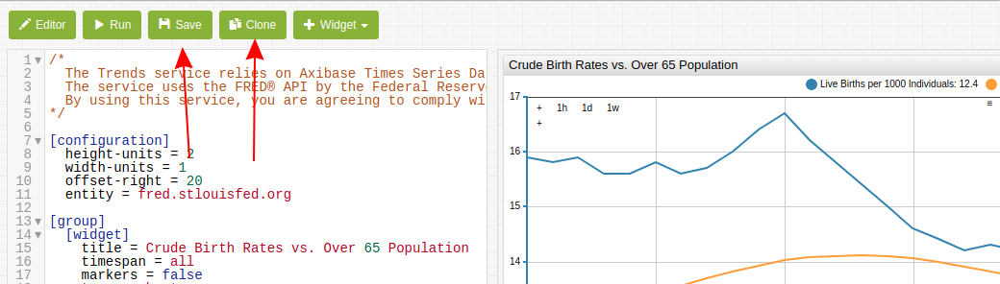

# Using TRENDS



### Overview

[**TRENDS**](https://trends.axibase.com/) is a data visualization sandbox based on the [ChartLab](https://apps.axibase.com/) API which relies on the [Axibase Time Series Database](https://axibase.com) for data storage and processing tasks. The **TRENDS** interface enables users to interact with the data that they are reading about and modify the visualizations to ask and answer questions without skewed visualization or biased information.

### Syntax

**TRENDS** uses a convenient [syntax](https://axibase.com/products/axibase-time-series-database/visualization/widgets/) for data modification that will be briefly discussed in this guide. Feel free to ask questions or suggest datasets or topics by dropping us a line [here](mailto:hello@axibase.com).

In the **Editor** window you will see the configuration for the current visualization. All configurations have several levels of settings:

* **[configuration]**: Overall settings for the entire visualization. Even the most complex portals and visualizations will have one set of **[configuration]** settings. Define broad parameters for the visualization such as widget size, data entity, and additional formating parameters such as visualization offset.

* **[group]**: Each row of widgets is defined as a group. **[group]** level settings are applied to an entire row. Here, entities may be defined as well as metrics, chart titles or other shared settings.  

* **[widget]**: Define the [type](https://axibase.com/products/axibase-time-series-database/visualization/widgets/) of visualization and additional shared parameters such as time characteristics.

* **[series]**: Each widget must have at least one series. **[series]** level settings may be used to distinguish several metrics when used together in one visualization. Data transformations, translations, and reflections should be performed at the **[series]** level.

> Some settings may be defined at multiple levels of a visualization. The most subordinate setting is given priority by **TRENDS**. That means, that if you define an entity `x` at the **[configuration]** level for several widgets, and at the **[series]** level for one chart you define a different entity `y`, entity `x` will be used for all widgets **EXCEPT** for the one where you defined `entity = y`.  This is a useful setting when including an additional set of data from a unique entity.


### Modifying a Visualization

If it is not already visible, open the **Editor** window in the **TRENDS** interface by clicking the button at the top of the visualization.


[](https://trends.axibase.com/e91b896e#fullscreen)

Using the chart above as a configuration example:

```sql
[configuration]
  height-units = 2
  width-units = 1
  offset-right = 20
  entity = fred.stlouisfed.org
  
  [group]
    [widget]
      title = Crude Birth Rates vs. Over 65 Population
      timespan = all
      markers = false
      type = chart
      starttime = 1980
      endtime = 2016
        
      [series]
        metric = SPDYNCBRTINUSA
        label = Live Births per 1000 Individuals 
        style = stroke-width: 2
      
      [series]
        metric = SPPOP65UPTOZSUSA
        label = Over 65 Population (Percent of Total)
        replace-value = value/100
        format = %
        axis = right
        style = stroke-width: 2
```

Each of these settings may be modified and new settings may be added based on ChartLab syntax. Additionally, complex transformations may be performed according to this [guide](https://github.com/axibase/atsd-use-cases/tree/master/Solutions/calculated-values), which details common economic transformations using javascript `math.` syntax, which is supported by ATSD.

Likewise, series may be derived from existing data using according to this [guide](https://github.com/axibase/atsd-use-cases/tree/master/Support/Add-Calculated-Value), which shows each step from one dataset to another.

For simpler charts (non-time series) data may be manually input using the `value = x` setting, where `x` is the desired value for some series.

Once you have satisfactorily modified a configuration, click the **Run** button apply the new settings.



If you would like to create a new iteration of the current chart by adding a numerical suffix to the current URL, click **Save**, to generate an entirely new URL click **Clone**. 



**TRENDS** is a community-service sandbox, we encourage users to create their own charts and attach them to this article or others.

### Further Reading 

For more detailed information about the ATSD API, underlying mechanics, or download instructions see the [ATSD Documentation](https://github.com/axibase/atsd) or reach out to us with questions, comments, or suggestions [here](mailto:hello@axibase.com). Good luck and happy data hunting!
