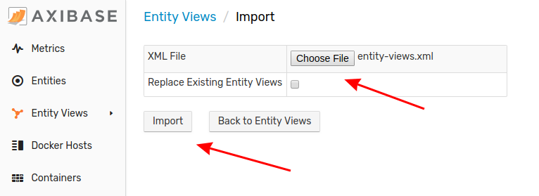

# Uploading a Portal Configuration

A portal is a series of data visualizations displayed and grouped together which conveys related information based on a portal configuration.

1. From the ATSD homepage, expand the **Entity Views** menu from the left toolbar and select **Configure**.

2. Expand the split button at the bottom of the page, click **Import**.

3. Select the appropriate XML file from you local machine by clicking **Choose File**. By default ATSD will add a number to the file name if such an entity view already exists. Set the flag in the **Replace Existing Entity Views** box to modify this behavior. Click **Import**

Your Entity View has been uploaded to ATSD. 
