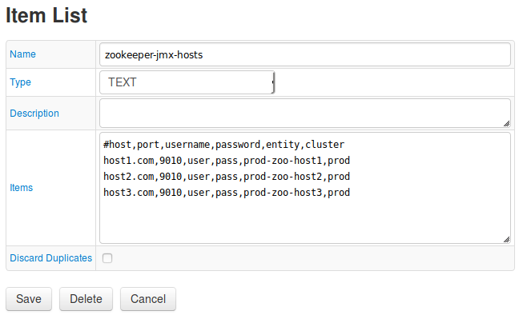
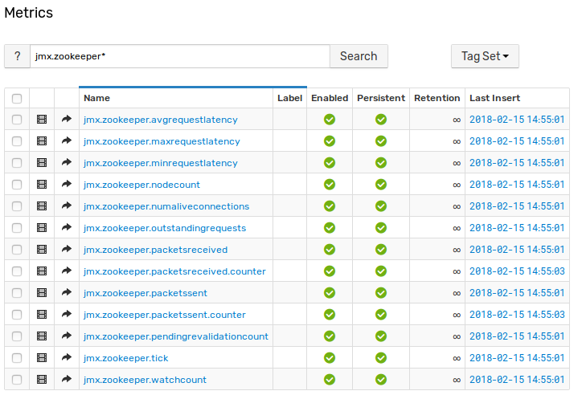
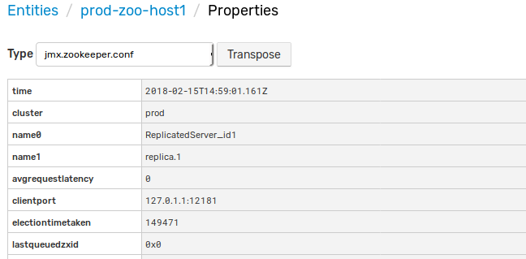
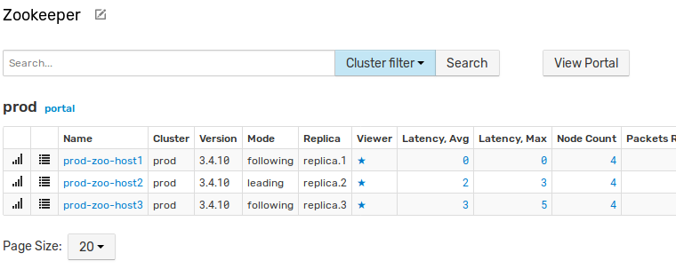

# Zookeeper

This guide describes how to monitor availability and performance of an [Apache Zookeeper](https://zookeeper.apache.org/) cluster (3 nodes) using Axibase Time Series Database.

## Step 1: Configure Axibase Collector

### Create hosts list

1) Log in to Axibase Collector at `https://collector_hostname:9443`

2) Click the `Collections` tab in the top menu and select `Item Lists`.

3) Click `Add` and create item list with Zookeeper hosts.
Enter name `zookeeper-jmx-hosts`, choose type `TEXT` and add comma-separated addresses of Zookeeper hosts in the following format:

```txt
#host,port,username,password,entity,cluster
host1.com,9010,user,pass,prod-zoo-host1,prod
host2.com,9010,user,pass,prod-zoo-host2,prod
host3.com,9010,user,pass,prod-zoo-host3,prod
```

   **host** — Zookeeper hostname.
   **port** — JMX port.
   **username** — JMX user name.
   **password** — Password for JMX user.
   **entity** — ATSD entity for Zookeeper node.
   **cluster** — ATSD series tag for indicating that nodes are in the same cluster.



Save changes.

### Import job

Select the **Jobs** tab in the top menu and click **Import**.

Import the [`zookeeper-jmx`](resources/jobs.xml) job.

Locate the `zookeeper-jmx` job in the list of jobs.

Adjust the cron expression if required. For more information on cron expressions, see [Scheduling](https://github.com/axibase/axibase-collector/blob/master/scheduling.md).

Select a target ATSD database for storing data.

Click **Save**.


Test job configurations. Click on `zookeeper-series`.

If needed, change default parameters.
For more information on JMX configuration, see [JMX](https://github.com/axibase/axibase-collector/blob/master/jobs/jmx.md). Click **Test**.


Repeat test for `zookeeper-properties`.

On the **JMX Job** page set **Enabled** checkbox and save the job.

### Check data collection

Log in to the target Axibase Time Series Database instance at `https://atsd_hostname:8443`.

Go to **Metrics** page and verify that `jmx.zookeeper.*` metrics are available.



1. Go to **Entities** page and verify that `jmx.zookeeper.*` properties are available for entities from `zookeeper-properties` configuration.




## Step 2: Configure Zookeeper in ATSD

### Import entity group

1. Go to `Settings -> Entity Groups` and import this [entity group](resources/groups.xml).
1. Locate `Zookeeper Nodes` group, click on it
1. Verify that entities were successfully imported.


### Import portals

1. Go to `Portals -> Configure` and import [portals](resources/portal-configs.xml) (check on the Auto-enable New Portals check box).
2. Verify that new portals are displayed at `Portals -> Configure`.


### Import rules

Go to `Alerts -> Rules` and import [rules](resources/rules.xml) (set the flag in the **Auto-enable New Rules** check box).

Check that rules were imported


* `Zookeeper cluster high latency` - alert opens when more than 50% of the nodes in a cluster have average latency greater than 100 ms in 3 minutes.
* `Zookeeper cluster not serving requests` - alert opens when node status is `leaderelection`, which means that nodes cannot choose leader.
* `Zookeeper dead cluster` - opens when no data was collected from cluster in 2 minutes.
* `Zookeeper dead node` - opens when no data was collected from a single node in 2 minutes.
* `Zookeeper dead nodes list` - same as single dead node, but checks all nodes by timer.
* `Zookeeper node high latency` - opens when node average latency is above 100 in 3 consecutive measurements.
* `Zookeeper rate metrics` - always open. Used for transform `packetsreceived` and `packetssent` metrics from cumulative to difference (packets per minute) metrics. Uses derived commands.

Verify rule functionality. Stop one node and check that `Zookeeper dead node` and `Zookeeper dead nodes list` rule opens (it may take up to 2 minutes). Go to **Alerts -> Open Alerts** to see all open rules.


To check `Zookeeper cluster not serving requests` rule stop more than 50% of all active nodes (in this case 2 of 3, if Zookeeper quorum is default).

To check `Zookeeper dead cluster` stop all nodes.

To check `Zookeeper cluster high latency` send large latency values using `Data -> Data Entry` page. For example:

```ls
series e:prod-zoo-host1 m:jmx.zookeeper.avgrequestlatency=1400 t:cluster=prod
series e:prod-zoo-host2 m:jmx.zookeeper.avgrequestlatency=1500 t:cluster=prod
```

To check `Zookeeper node high latency` send large latency for single node 3 times using `Data Entry`

```ls
series e:prod-zoo-host1 m:jmx.zookeeper.avgrequestlatency=1400 t:cluster=prod
```

To check `Zookeeper rate metrics` go to `Metrics` and verify that metrics `jmx.zookeeper.packetsreceived.counter` and `jmx.zookeeper.packetssent.counter` are collecting.

For more information on Rule Engine, see [ATSD Rule Engine](https://axibase.com/docs/atsd/rule-engine/).

### Import entity view

Go to `Entity Views -> Configure` and import the following [entity view](resources/entity-views.xml).
Check entity view. Go to `Entity Views -> Zookeeper`



Click on `portal` link and check cluster portal


