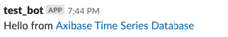
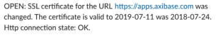

# How to Monitor SSL Certificates Expiry Dates for Subdomains

## Overview

[Axibase Collector](https://github.com/axibase/axibase-collector/#overview) is a versatile data collection tool written in Java that implements various types of jobs to retrieve data from remote systems. One of such job types is the `HTTP` job which works similar to AWS Health Checks while also collecting detailed SSL status information from HTTPS endpoints.

The `HTTP` job retrieves the list of subdomains from the [CRT Certificate Search](https://crt.sh) database maintained by [Comodo Group](https://www.comodo.com). The list includes active (`NotAfter > 1 week ago`) subdomains for the specified top domain.

The job connects to each subdomain in the list and collects SSL certificate details for analysis. The data is then transmitted to ATSD where it is analyzed using the built-in rule engine. The pre-installed rule send instant alerts to the specified Slack channel when the SSL certificate is about to expire as well as when it is replaced.

### Tools

[ATSD Sandbox](https://github.com/axibase/dockers/tree/atsd-sandbox#overview) is a Docker image which runs the ATSD and Axibase Collector instances used for this integration. Both tools are installed with a temporary license which can be renewed at the end of the 2-week trial period.

## Procedure

Copy the command below to the terminal.

* Set the `TOP_DOMAIN` variable to your domain name, for example `example.org`.
* Replace `SLACK_TOKEN` variable with your [Slack token](https://axibase.com/docs/atsd/rule-engine/notifications/slack.html#add-bot-to-channel).

:::tip ATSD Sandbox
Refer to ATSD Sandbox information for additional [environment variables](https://github.com/axibase/dockers/tree/atsd-sandbox#container-parameters)
:::

```bash
docker run -d -p 8443:8443 -p 9443:9443 -p 8081:8081 \
  --name=atsd-sandbox \
  --env TOP_DOMAIN=example.org \
  --env ATSD_IMPORT_PATH='https://raw.githubusercontent.com/axibase/atsd-use-cases/dev-howto-monitor-ssl-for-domains/integrations/atsd-sandbox/monitor-ssl-expiry-dates/resources/ssl-certificates-files.tar.gz' \
  --env COLLECTOR_IMPORT_PATH='https://raw.githubusercontent.com/axibase/atsd-use-cases/dev-howto-monitor-ssl-for-domains/integrations/atsd-sandbox/monitor-ssl-expiry-dates/resources/job_http_subdomains-ssl-certificates.xml' \
  --env SLACK_TOKEN={SLACK_TOKEN} \
  axibase/atsd-sandbox:latest
```

Monitor the launch process.

```bash
docker logs -f atsd-sandbox
```

ATSD sends a confirmation message to the specified Slack slack upon successful launch.



## Sample Notifications

Initial Notification.

 

Notification when SSL certificate expiration date changes.



Notification if less than 30 days remain before SSL certificate expiry date.


