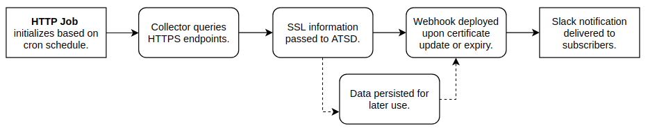
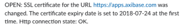
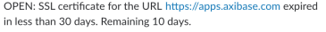

# Monitoring SSL Certificates Expiry Dates for Subdomains

## Overview

HTTPS is an internet ubiquity, Google Security analysts reported that the [vast majority](https://security.googleblog.com/2018/02/a-secure-web-is-here-to-stay.html) of 2018 Chrome traffic occurs over the secure protocol, which was formerly primarily relegated to the realm of [internet financial or security transactions](https://security.googleblog.com/2016/09/moving-towards-more-secure-web.html) and requires the exchange of validity credentials. Automate SSL certificate monitoring for expiry and error with a programmatic solution that alerts upon certificate update or expiration.



[Axibase Collector](https://axibase.com/docs/axibase-collector/#introduction) is a data collection tool written in Java which implements tasks to retrieve data from remote systems, one such task is the [HTTP job](https://axibase.com/docs/axibase-collector/jobs/http.html). Using the HTTP job, query HTTPS endpoints to gather information with Collector and pass that information on for storage, processing, and alerting tasks in ATSD.

The [Comodo Group](https://www.comodo.com) maintains the [CRT Certificate Search](https://crt.sh) database which tracks SSL certificates. The list includes active subdomains for each specified top domain and thus, supports the audit of [mixed content](https://developers.google.com/web/fundamentals/security/prevent-mixed-content/what-is-mixed-content) environments.

Collector connects to each subdomain in the list and gathers SSL certificate details. The data is passed to ATSD where it is analyzed using the [rule engine](https://axibase.com/docs/atsd/rule-engine/). This rule sends alerts to a specified Slack channel when the SSL certificate is about to expire, as well as when it is replaced.

### Tools

:::tip To obtain a **free** SSL certificate, refer to the [`Let's Encrypt` Workshop](../../tutorials/workshop/lets-encrypt.md) for more information.
:::

* [ATSD Sandbox](https://github.com/axibase/dockers/tree/atsd-sandbox#overview): a Docker image which runs ATSD and Axibase Collector instances.

> Both tools are installed with a [temporary license](https://axibase.com/docs/atsd/licensing.html) which can be renewed at the end of the 2-week trial period.

## Procedure

Copy the launch command below to a command-line console.

* Set the `TOP_DOMAIN` variable to the domain name to monitor, for example `example.org`.
* Replace `SLACK_TOKEN` variable with your [Slack token](https://axibase.com/docs/atsd/rule-engine/notifications/slack.html#add-bot-to-channel).

:::tip ATSD Sandbox
Refer to ATSD Sandbox documentation for additional [environment variables](https://github.com/axibase/dockers/tree/atsd-sandbox#container-parameters).
:::

```bash
docker run -d -p 8443:8443 -p 9443:9443 -p 8081:8081 \
  --name=atsd-sandbox \
  --env TOP_DOMAIN=example.org \
  --env ATSD_IMPORT_PATH='https://raw.githubusercontent.com/axibase/atsd-use-cases/master/integrations/atsd-sandbox/monitor-ssl-expiry-dates/resources/ssl-certificates-files.tar.gz' \
  --env COLLECTOR_IMPORT_PATH='https://raw.githubusercontent.com/axibase/atsd-use-cases/master/integrations/atsd-sandbox/monitor-ssl-expiry-dates/resources/job_http_subdomains-ssl-certificates.xml' \
  --env SLACK_TOKEN={SLACK_TOKEN} \
  axibase/atsd-sandbox:latest
```

Monitor the launch process.

```bash
docker logs -f atsd-sandbox
```

ATSD sends a confirmation message to the specified Slack channel upon successful launch.


## Sample Notifications

There are three types of notifications:

**Initial Notification**: Received upon successful sandbox launch.

 

**Update Notification**: Received upon SSL certificate expiration update.


**Expiry Notification**: Received when less than 30 days remain before SSL certificate expiration.

