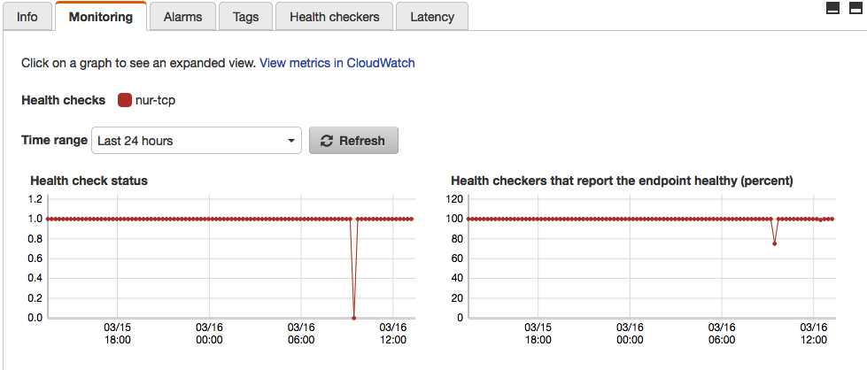
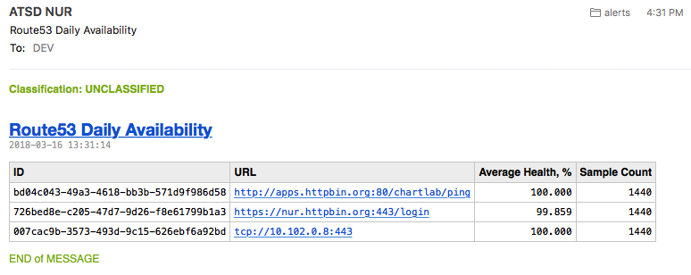
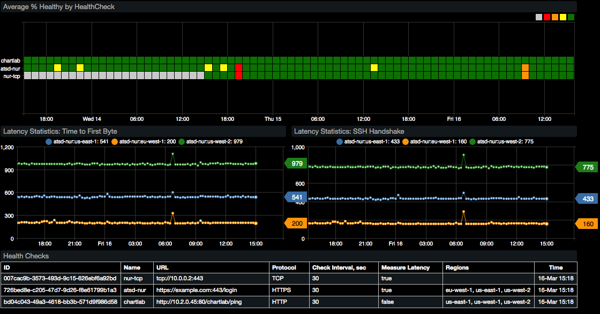

# How to Build Availability Report for AWS Route 53

## Overview

[AWS Route 53](https://aws.amazon.com/route53) provides tools to automate DNS configuration to reliably connect external user requests to infrastructure running in AWS. In addition to domain registration, AWS provides dynamic routing services, including latency-based routing, GeoDNS, Geoproximity, and Weighted Round Robin (WRR).

A core Route 53 functionality is the ability to configure [health checks](https://docs.aws.amazon.com/Route53/latest/DeveloperGuide/welcome-health-checks.html) which monitor the health of an application and can route incoming traffic to healthy endpoints.


An automation procedure, such as DNS fail-over or service restart, can be initiated by Route 53 once the health check status drops below a certain threshold.


### Geographic Distribution

Route 53 executes health checks from different parts of the world so that outage and latency are independently verified. The latency and connection times collected by the checkers vary widely depending on the geographic proximity of the monitored endpoint to one of the AWS regions used for health checking.

* us-east-1
* us-west-1
* us-west-2
* sa-east-1
* ap-southeast-1
* ap-southeast-2
* ap-northeast-1


### Access Security

AWS publishes a list of IP ranges used by [health checker nodes](https://ip-ranges.amazonaws.com/ip-ranges.json). Your network administrators may need to allow inbound traffic from `ROUTE53_HEALTHCHECKS` addresses.

```json
{
  "ip_prefix": "54.243.31.192/26",
  "region": "us-east-1",
  "service": "ROUTE53_HEALTHCHECKS"
}
```

### Healthy Endpoint

For HTTP and HTTPS checks, Route 53 considers the endpoint healthy if the service establishes a connection within **ten** seconds and the endpoint returns an HTTP status code of `2xx` or `3xx` within **two** seconds.

For TCP checks, Route 53 determines the endpoint status is healthy if the service establishes TCP connection within **ten** seconds.

The timeouts are **hardcoded**.

### Monitoring Frequency

Route 53 schedules health checks in multiple regions [independently](https://docs.aws.amazon.com/Route53/latest/DeveloperGuide/health-checks-creating.html#health-checks-creating-values-request-interval) using the same monitoring interval of 30 or 10 seconds (**Fast** mode).

* 0.5 requests per second for standard frequency of 30 seconds.
* 2.0 requests per second for **Fast** mode frequency of 10 seconds.

Individual checkers are not synchronized, the rate at which requests arrive is uneven.

Route 53 supports health checks HTTP, HTTPS, and TCP protocols.

The services considers the endpoint to be in a `Healthy` state when the specified percentage of checkers establish a TCP connection and (for HTTP/S) received a `2xx`/`3xx` response code from the server. The response also contains the specified keyword if **String Matching** is enabled.

When specifying paths for HTTP/S endpoints, factor in the increased traffic sent to the target service so the monitored URL does not cause excessive load on the server.

### HTTPS

Health checks **cannot** be used to monitor validity of SSL certificates as part of HTTPS endpoint monitoring. Specifically, the service reports `Healthy` status even if the SSL certificate is expired, self-signed, or otherwise invalid.

### Metrics

Built-in monitoring charts display endpoint health statistics for a period of up to 2 weeks.



Route 53 CloudWatch metrics are available only in the **us-east-1** region as specified in the [Developer Guide](https://docs.aws.amazon.com/Route53/latest/DeveloperGuide/health-checks-monitor-view-status.html) (see section **To view Route 53 metrics on the CloudWatch console**).

## Service Availability Dashboards

Offload health check statistics to ATSD and create consolidated dashboards with custom thresholds for alerts and notifications.

## Configuration

### Prerequisites

* Create an AWS [IAM account](https://axibase.com/docs/axibase-collector/jobs/aws-iam.html) to query CloudWatch statistics.
* Ensure 4 GB RAM is available for the [ATSD sandbox](https://github.com/axibase/dockers/tree/atsd-sandbox) container.

### Launch ATSD Sandbox

Create an `import` directory in the current directory:

```sh
mkdir import
cd import
```

Mount this directory to the Docker container to pass AWS credentials to the CloudWatch data collector without exposing sensitive information as environment variables.

Create an `aws.propeties` file in the `import` directory and replace `KEY` and `SECRET` with **AWS Access Key ID** and **Secret Access Key** respectively.

```sh
accessKeyId=KEY
secretAccessKey=SECRET
```

Launch the [ATSD sandbox](https://github.com/axibase/dockers/tree/atsd-sandbox) container on a Docker host:

```sh
docker run -d -p 8443:8443 -p 9443:9443 -p 8081:8081 \
  --name=atsd-sandbox \
  --volume=$(pwd)/import:/import \
  --env ATSD_IMPORT_PATH='https://github.com/axibase/atsd-use-cases/raw/master/integrations/aws/route53-health-checks/resources/aws-route53-xml.zip' \
  --env COLLECTOR_IMPORT_PATH='https://raw.githubusercontent.com/axibase/atsd-use-cases/master/integrations/aws/route53-health-checks/resources/job_aws_aws-route53.xml' \
  --env COLLECTOR_CONFIG='job_aws_aws-route53.xml:aws.properties' \
  axibase/atsd-sandbox:latest
```

The sandbox container includes both ATSD and [Axibase Collector](https://axibase.com/docs/axibase-collector/jobs/docker.html) instances.

Use the Collector instance in the sandbox container to retrieve Route 53 statistics from AWS CloudWatch and store the statistics in ATSD.

Wait until the sandbox is initialized and `All applications started` is displayed by the start logs.

```sh
docker logs -f atsd-sandbox
```

```sh
[Collector] 2018-03-29 17:47:40,329 Job 'aws-route53' completed.
[Collector] 2018-03-29 17:47:40,330 All jobs completed.
[Collector] Checking Collector web-interface port 9443 ...
[Collector] Collector web interface:
[Collector] https://172.17.0.2:9443
[Collector] Collector start completed.
[Collector] For more details see logfile in /opt/axibase-collector/logs/axibase-collector.log
[Collector] Account 'axibase' created.
All applications started
```

Log in to ATSD using `axibase` username and `axibase` password at `https://atsd_hostname:8443/`.

### Health Check Setup Attribute Copy

Configure a `cron` scheduled task to copy health check attributes into ATSD sandbox as described by [ATSD Integration Documentation](https://github.com/axibase/atsd-integration/tree/aws-route53)

## Results

### Consolidated View

View all working Route 53 health checks on the **AWS Route53** tab.


### Service Level Reporting




### Availability Portal

The built-in portal displays availability statistics.




