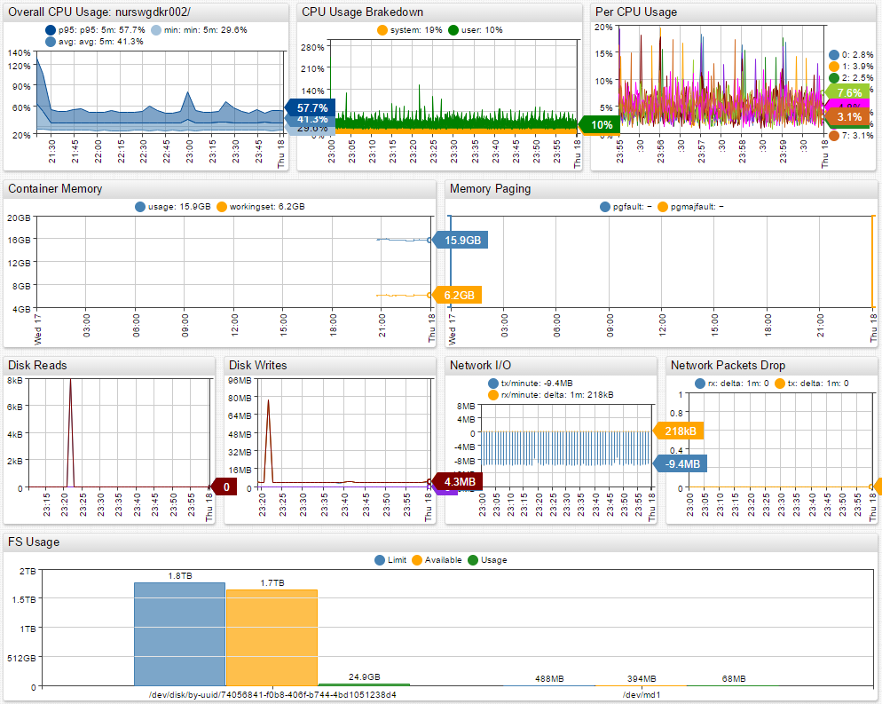

# Axibase Time Series Database as the Backend for cAdvisor

[Axibase Time Series Database](http://axibase.com/docs/atsd) can collect Linux container metrics through cAdvisor for
long-term retention, alerting, and visualization.

## Single Host Installation

In this configuration ATSD collects metrics from the underlying Docker host retrieved by a cAdvisor container running
on the same server.

## Multiple Host Installation

To consolidate metrics from multiple Docker hosts configure cAdvisor containers to send data to a centralized ATSD
server. This type of setup enables centralized performance monitoring.


## Installation Steps

### Launch ATSD container

```bash
docker run \
  -d \
  -p 8088:8088 \
  -p 8081:8081 \
  -p 8443:8443 \
  -p 8082:8082/udp \
  -h atsd \
  --name=atsd \
  axibase/atsd
```

It may take up to 15 minutes to initialize the database.

For more options, see [ATSD Docker installation manual](https://axibase.com/docs/atsd/installation/docker.html).

### Launch cAdvisor with ATSD storage driver

```bash
docker run \
  --volume=/:/rootfs:ro \
  --volume=/var/run:/var/run:rw \
  --volume=/sys:/sys:ro \
  --volume=/var/lib/docker/:/var/lib/docker:ro \
  --publish=8080:8080 \
  --detach=true \
  --name=cadvisor \
  --link atsd:atsd \
  axibase/cadvisor:latest \
  --storage_driver=atsd \
  --storage_driver_atsd_protocol=tcp \
  --storage_driver_host=atsd \
  --storage_driver_buffer_duration=15s \
  --housekeeping_interval=15s
```

In case you are using http/https protocol when writing data into a remote ATSD server, make sure that you create a
collector account with restricted permissions as described
[here](https://axibase.com/docs/atsd/administration/collector-account.html).

```bash
docker run \
  --volume=/:/rootfs:ro \
  --volume=/var/run:/var/run:rw \
  --volume=/sys:/sys:ro \
  --volume=/var/lib/docker/:/var/lib/docker:ro \
  --publish=8080:8080 \
  --detach=true \
  --name=cadvisor \
  --link atsd:atsd \
  axibase/cadvisor:latest \
  --storage_driver=atsd \
  --storage_driver_atsd_protocol=http \
  --storage_driver_host=atsd:8088 \
  --storage_driver_user=${ATSD_COLLECTOR_ACCOUNT_NAME} \
  --storage_driver_password=${ATSD_COLLECTOR_ACCOUNT_PASSWORD} \
  --storage_driver_buffer_duration=15s \
  --housekeeping_interval=15s
```

## Verify Installation

* Login into ATSD web interface on `http://atsd_host:8088`.
* Configure the built-in administrative account.
* Click on Entities tab in the top menu, click on Portal icons to view default portals.

## Storage Driver Options

| **Flag**                                | **Default Value**                      | **Description**                                                                              |
| --------------------------------------- | -------------------------------------- | -------------------------------------------------------------------------------------------- |
| `storage_driver_atsd_protocol`            | `tcp`                                  | Transfer protocol. Supported protocols: http, https, udp, tcp                                |
| `storage_driver_atsd_skip_verify`         | false                                  | Controls whether a client verifies the server certificate chain and hostname              |
| `storage_driver_atsd_store_major_numbers` | false                                  | Include statistics for devices with all available major numbers                              |
| storage_driver_atsd_property_interval   | 1m                                     | Container property (`host`, `id`, `namespace`) update interval. Must be >= `housekeeping_interval` |
| `storage_driver_atsd_sampling_interval`   | housekeeping_interval value            | Series sampling interval. Must be >= `housekeeping_interval`                                |
| `storage_driver_atsd_docker_host`         | Output of "/rootfs/etc/hostname" or "" | Hostname of the docker host, used as entity prefix                                           |
| `storage_driver_atsd_store_user_cgroups`  | false                                  | Include statistics for user `cgroups`, for example: `docker-host/user.*`                      |
| `storage_driver_buffer_duration`          | 1m                                     | Time for which data is accumulated in a buffer before being sent into ATSD                   |
| `storage_driver_atsd_buffer_limit`        | 1000000                                | Maximum network command count stored in buffer before being sent into ATSD                   |
| `storage_driver_atsd_sender_thread_limit` | 4                                      | Maximum thread `goroutine` count sending data to ATSD server via tcp/udp                     |

You can view the collected metrics under the Entity and Metrics tabs in ATSD.

Note that disk metrics are only collected from containers that have attached volumes.

### Built-in Portals

| **Cadvisor Host**                              | **Cadvisor Disk Detail**                    | **Docker Host Portal**               | **Cadvisor Multi-Host**                    |
| ---------------------------------------------- | ------------------------------------------- | ------------------------------------ | ------------------------------------------ |
|  |  |  |  |
