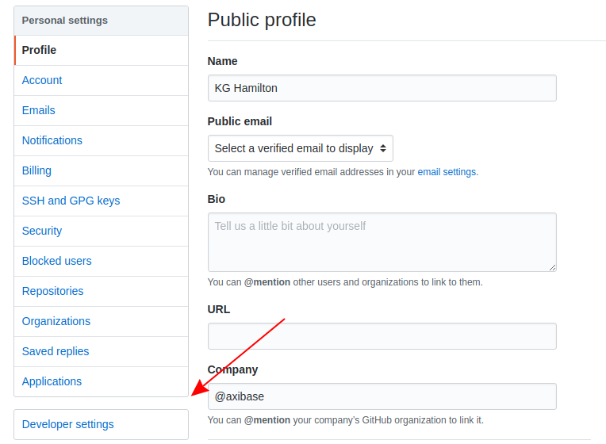
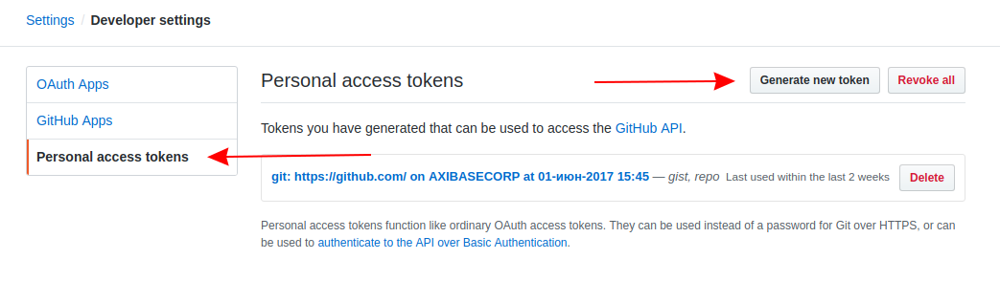
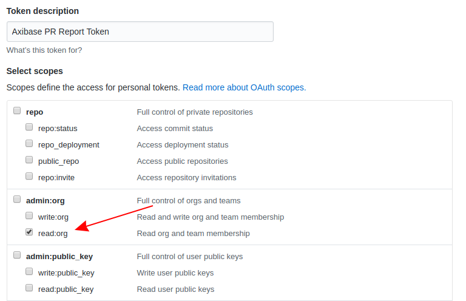
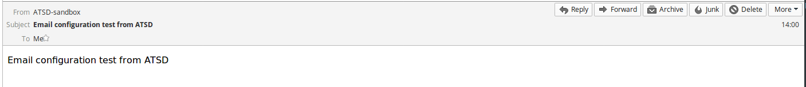
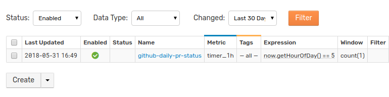
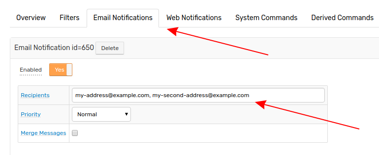
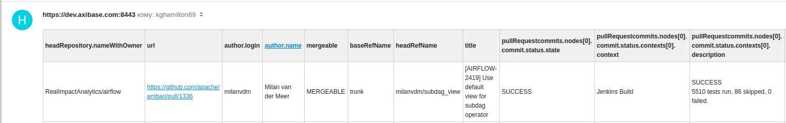
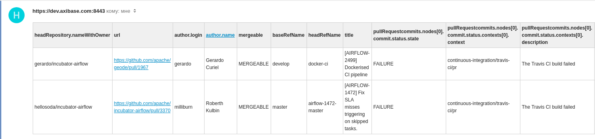

# Daily Pull Request Report for GitHub Repositories

## Overview

Configure [Axibase Time Series Database](https://axibase.com/docs/atsd/) (ATSD) to produce a daily report with all open Pull Requests across a collection of repositories and email the report to subscribed users. The report has two parts: open Pull Requests passing all status checks, and open Pull Requests failing one or more status checks.

GitHub [webhook services](pr-notification.md) can notify repository owners and administrators of a new Pull Request, but for larger organizations with a large collection of repositories, use the **Daily PR Report** to achieve a wider scope. Configure notifications for a group of subscribers via email with ATSD and the [GitHub v4 API](https://developer.github.com/v4/). Setup takes around 10 minutes.


Accomplish complete Pull Request management using programmatic integration leveraging the [GraphQL](https://graphql.org/) API query language, featured in the GitHub API.

In contrast to the [GitHub v3 REST API](https://developer.github.com/v3/), the latest [GitHub v4 GraphQL API](https://developer.github.com/v4/) offers more flexibility by replacing multiple REST requests with a single call to fetch all relevant data.

## Generate OAuth Access Token

The **Daily PR Report** uses an [OAuth Personal Token](https://blog.github.com/2013-05-16-personal-api-tokens/) to query the GitHub API without transmitting user login information.

While logged in to GitHub, click the user profile picture in the upper-right corner and select **Settings**.



Open the **Developer Settings** page and navigate to the **Personal Access Tokens** tab.



Click **Generate New Token** and enter the account password when prompted.



Configure the token to grant **read:org** permissions in the **admin:org** section by checking the appropriate box. This scope grants read-only organization access to any user with this token, so keep it confidential. For more information about token scopes, see [GitHub Developer Documentation](https://developer.github.com/apps/building-oauth-apps/scopes-for-oauth-apps/).

Define the token in the `TOKEN` parameter of the [sandbox launch command](#launch-atsd-sandbox).

## Launch ATSD Sandbox

Execute the `docker run` command shown below to launch an ATSD [sandbox](https://github.com/axibase/dockers/tree/atsd-sandbox) instance.

Modify the launch command to include legitimate information:

* The `ORGANIZATION` variable specifies the case-sensitive name of the organization to monitor.
* Specify `TOKEN` variable as [GitHub OAuth token](#generate-oauth-access-token), generated in GitHub.
* The `SUBSCRIBERS` variable contains the comma-separated list of email addresses subscribed to the daily report.
* Bind `mail.properties` file via `volume`.

```sh
docker run -d -p 8443:8443 \
  --name=atsd-sandbox \
  --env START_COLLECTOR=off \
  --env ORGANIZATION=MyOrganization \
  --env TOKEN=**************************************** \
  --env SUBSCRIBERS=myuser@example.org \
  --env EMAIL_CONFIG=mail.properties \
  --env ATSD_IMPORT_PATH=https://raw.githubusercontent.com/axibase/atsd-use-cases/master/integrations/github/resources/github-daily-pr-status.xml,https://raw.githubusercontent.com/axibase/atsd-use-cases/master/integrations/github/resources/github-graphql-table.xml,https://raw.githubusercontent.com/axibase/atsd-use-cases/master/integrations/github/resources/graphql-queries.xml \
  --volume /home/user/mail.properties:/mail.properties \
  axibase/atsd-sandbox:latest
```

> For information about creating an organization, see the [GitHub Help Documentation](https://help.github.com/articles/creating-a-new-organization-from-scratch/).

Mail configuration has several required parameters, passing these parameters into the container via mounted file is the simplest solution. The `volume` variable should point to the absolute path where a plaintext file exists containing the following parameters:

```ls
server=smtp.example.org
user=myuser@example.org
password=secret
```

This file contains mail server connection settings for the mail server by which the PR report is sent. Replace `server`, `user`, and `password` parameters with legitimate information. If the outgoing mail server uses a different port than `587` for SMTP queries, define it as an additional parameter:

```ls
port=465
```

Watch the sandbox container logs for `All applications started` and `Mail Client configured`.

```sh
docker logs -f atsd-sandbox
```

The log file contains the following message if **Mail Client** configuration is successful:

```txt
Mail Client test successful.
```

Otherwise, the log file includes a warning:

```txt
Mail Client test failed: Invalid email address
```

Upon failure, stop the container:

```sh
docker rm -vf atsd-sandbox
```

Confirm parameters in `mail.properties` and relaunch.

Upon successful completion, **Mail Client** sends subscribed users a confirmation email.



> For advanced launch settings refer to [Sandbox Documentation](https://github.com/axibase/dockers/tree/atsd-sandbox#overview).

## Configure Subscriber List

After initial launch, you may modify the list of subscribers at any time. Log in to the ATSD web interface, accessible at [`https://docker_host:8443/`](https://github.com/axibase/dockers/tree/atsd-sandbox#exposed-ports). Open the **Alerts** menu and select **Rules**.


Search for the `github-daily-pr-status` with the available filters and rule and open the **Rule Editor** by clicking the link in the **Name** column.



Open the **Email Notifications** tab in the **Rule Editor** and modify the **Recipients** field. Emails must be comma-separated.



## Configuring Report Delivery

By default, the `github-daily-pr-status` rule delivers a report upon launch and then again every morning at 5:00 AM server local time. Open the **Settings** menu in ATSD and select **System Information** to view server local time.

Modify delivery time by opening the `github-daily-pr-status` rule from the **Rules** page. The **Condition** field contains:

```java
now.getHourOfDay() == 5
```

Change the value of this expression to the integer 24-hour time when ATSD should deliver the report.

```java
now.getHourOfDay() == 18
```

Report delivery now occurs at 6:00 PM server local time.

## Notification Payload

The `github-daily-pr-status` rule builds an HTML table with information returned by the GQL query according to the configuration found in the **Text** field of the **Email Notifications** tab:

```javascript
${addTable(
  jsonToLists(
    jsonPathFilter(
      queryConfig('github-graphql-table',
        ['GQL_query': lookup('graphql-queries', 'issue-list')]
      ).content,
      "$..pullRequests.nodes[?(@.mergeable == 'MERGEABLE' && @.pullRequestcommits.nodes[0].commit.status.state == 'SUCCESS')]"
    )
  )
, 'html', true)}
```

> The `FAILURE` email report uses an identical configuration with the exception of the `JSONPath`, which instead evaluates `state == 'FAILURE'`.

Table Function [`jsonToLists`](https://axibase.com/docs/atsd/rule-engine/functions-table.html#jsontolists) converts JSON file to string list. Table function [`jsonPathFilter`](https://axibase.com/docs/atsd/rule-engine/functions-table.html#jsonpathfilter) parses the original document based on `JSONPath` defined as `"$..pullRequests.nodes[?...]"`.

> For additional Table Functions, view [ATSD Documentation](https://axibase.com/docs/atsd/rule-engine/functions-table.html).

The [`queryConfig`](https://axibase.com/docs/atsd/rule-engine/functions-web-query.html#queryconfig) clause calls `github-graphql-table` which queries the [GraphQL API v4](https://developer.github.com/v4/guides/forming-calls/#the-graphql-endpoint) via POST method and returns Pull Request information in JSON format.

ATSD delivers the `GQL_query` variable as the outgoing query and returns the `pullRequests` [node](https://developer.github.com/v4/guides/intro-to-graphql/#node), which is a JSON list of open Pull Requests.

[GitHub Developer Documentation](https://developer.github.com/v4/guides/forming-calls/#example-query) offers a step-by-step walkthrough to form each part of a query using the `v4` API.

```graphql
query {
  organization(login: "apache") {
        repositories(first: 1, orderBy: {field: PUSHED_AT, direction: DESC}) {
        nodes {
            #name
            pullRequests(first: 5, states: OPEN, orderBy: {field: UPDATED_AT, direction: DESC}) {
                nodes {
                    headRepository { nameWithOwner }
                    url
                    author {
                    ... on User {
                        login name
                        }
                    }
                    mergeable
                    baseRefName
                    headRefName
                    title
                    #milestone { title }
                    #labels(first: 3) { nodes{name} }
                    ... on PullRequest {
                        pullRequestcommits: commits(last: 1) {
                            #totalCount
                            nodes {
                                commit {
                                    #url
                                    status { state contexts { context description createdAt targetUrl } }
                                }
                            }
                        }
                    }
                }
            }
        }
    }
  }
}
```

The above query targets [Apache Software Foundation](https://github.com/apache) repositories and returns a JSON list with the first five Pull Requests from the first repository of the Apache GitHub library, alphabetically.

Configure these settings by modifying the `pullRequests(first: 5, states: OPEN, orderBy: {field: UPDATED_AT, direction: DESC})` and `repositories(first:1, orderBy: {field: PUSHED_AT, direction: DESC})` clauses, respectively. Modify these configurations in ATSD under **Data > Replacement Tables**.

<details><summary>View the JSON results of the GraphQL query.</summary>
<p>

```json
{
    "data": {
        "organization": {
            "repositories": {
                "nodes": [
                    {
                        "pullRequests": {
                            "nodes": [
                                {
                                    "headRepository": {
                                        "nameWithOwner": "harishbisht/incubator-airflow"
                                    },
                                    "url": "https://github.com/apache/incubator-airflow/pull/3387",
                                    "author": {
                                        "login": "harishbisht",
                                        "name": "Harish Bisht"
                                    },
                                    "mergeable": "MERGEABLE",
                                    "baseRefName": "master",
                                    "headRefName": "master",
                                    "title": "added airtel in user list",
                                    "pullRequestcommits": {
                                        "nodes": [
                                            {
                                                "commit": {
                                                    "status": {
                                                        "state": "PENDING",
                                                        "contexts": [
                                                            {
                                                                "context": "continuous-integration/travis-ci/pr",
                                                                "description": "The Travis CI build is in progress",
                                                                "createdAt": "2018-05-21T15:53:56Z",
                                                                "targetUrl": "https://travis-ci.org/apache/incubator-airflow/builds/381737856?utm_source=github_status&utm_medium=notification"
                                                            }
                                                        ]
                                                    }
                                                }
                                            }
                                        ]
                                    }
                                },
                                {
                                    "headRepository": {
                                        "nameWithOwner": "kaxil/incubator-airflow"
                                    },
                                    "url": "https://github.com/apache/incubator-airflow/pull/3394",
                                    "author": {
                                        "login": "kaxil",
                                        "name": "Kaxil Naik"
                                    },
                                    "mergeable": "MERGEABLE",
                                    "baseRefName": "master",
                                    "headRefName": "AIRFLOW-2429",
                                    "title": "[AIRFLOW-2429] Fix contrib folder's flake8 errors",
                                    "pullRequestcommits": {
                                        "nodes": [
                                            {
                                                "commit": {
                                                    "status": {
                                                        "state": "PENDING",
                                                        "contexts": [
                                                            {
                                                                "context": "continuous-integration/travis-ci/pr",
                                                                "description": "The Travis CI build is in progress",
                                                                "createdAt": "2018-05-21T15:34:06Z",
                                                                "targetUrl": "https://travis-ci.org/apache/incubator-airflow/builds/381727712?utm_source=github_status&utm_medium=notification"
                                                            }
                                                        ]
                                                    }
                                                }
                                            }
                                        ]
                                    }
                                },
                                {
                                    "headRepository": {
                                        "nameWithOwner": "RealImpactAnalytics/airflow"
                                    },
                                    "url": "https://github.com/apache/incubator-airflow/pull/3314",
                                    "author": {
                                        "login": "milanvdm",
                                        "name": "Milan van der Meer"
                                    },
                                    "mergeable": "MERGEABLE",
                                    "baseRefName": "master",
                                    "headRefName": "milanvdm/subdag_view",
                                    "title": "[AIRFLOW-2419] Use default view for subdag operator",
                                    "pullRequestcommits": {
                                        "nodes": [
                                            {
                                                "commit": {
                                                    "status": {
                                                        "state": "SUCCESS",
                                                        "contexts": [
                                                            {
                                                                "context": "continuous-integration/travis-ci/pr",
                                                                "description": "The Travis CI build passed",
                                                                "createdAt": "2018-05-04T13:24:31Z",
                                                                "targetUrl": "https://travis-ci.org/apache/incubator-airflow/builds/374873020?utm_source=github_status&utm_medium=notification"
                                                            }
                                                        ]
                                                    }
                                                }
                                            }
                                        ]
                                    }
                                },
                                {
                                    "headRepository": {
                                        "nameWithOwner": "hellosoda/incubator-airflow"
                                    },
                                    "url": "https://github.com/apache/incubator-airflow/pull/3370",
                                    "author": {
                                        "login": "milliburn",
                                        "name": "Roberth Kulbin"
                                    },
                                    "mergeable": "MERGEABLE",
                                    "baseRefName": "master",
                                    "headRefName": "airflow-1472-master",
                                    "title": "[AIRFLOW-1472] Fix SLA misses triggering on skipped tasks.",
                                    "pullRequestcommits": {
                                        "nodes": [
                                            {
                                                "commit": {
                                                    "status": {
                                                        "state": "FAILURE",
                                                        "contexts": [
                                                            {
                                                                "context": "continuous-integration/travis-ci/pr",
                                                                "description": "The Travis CI build failed",
                                                                "createdAt": "2018-05-21T13:34:13Z",
                                                                "targetUrl": "https://travis-ci.org/apache/incubator-airflow/builds/381662628?utm_source=github_status&utm_medium=notification"
                                                            }
                                                        ]
                                                    }
                                                }
                                            }
                                        ]
                                    }
                                },
                                {
                                    "headRepository": {
                                        "nameWithOwner": "gerardo/incubator-airflow"
                                    },
                                    "url": "https://github.com/apache/incubator-airflow/pull/3393",
                                    "author": {
                                        "login": "gerardo",
                                        "name": "Gerardo Curiel"
                                    },
                                    "mergeable": "MERGEABLE",
                                    "baseRefName": "master",
                                    "headRefName": "docker-ci",
                                    "title": "[AIRFLOW-2499] Dockerised CI pipeline",
                                    "pullRequestcommits": {
                                        "nodes": [
                                            {
                                                "commit": {
                                                    "status": {
                                                        "state": "FAILURE",
                                                        "contexts": [
                                                            {
                                                                "context": "continuous-integration/travis-ci/pr",
                                                                "description": "The Travis CI build failed",
                                                                "createdAt": "2018-05-21T14:18:05Z",
                                                                "targetUrl": "https://travis-ci.org/apache/incubator-airflow/builds/381676845?utm_source=github_status&utm_medium=notification"
                                                            }
                                                        ]
                                                    }
                                                }
                                            }
                                        ]
                                    }
                                }
                            ]
                        }
                    }
                ]
            }
        }
    }
}
```

</p>
</details>

The GraphQL query returns a JSON list of Pull Requests based on `MERGEABLE` status. Among the five returned Pull Requests, one has `'SUCCESS'` state, two have `'FAILURE'` state, and two have `'PENDING'` state. ATSD [**Rule Engine**](https://axibase.com/docs/atsd/rule-engine/) filters these results with `JSONPath` syntax:

```ls
$..pullRequests.nodes[?(@.mergeable == 'MERGEABLE' && @.pullRequestcommits.nodes[0].commit.status.state == 'SUCCESS')]
```

And:

```ls
$..pullRequests.nodes[?(@.mergeable == 'MERGEABLE' && @.pullRequestcommits.nodes[0].commit.status.state == 'FAILURE')]
```

The database uses the results to create two reports. One report tracks `MERGEABLE` Pull Requests which have passed all secondary checks identified by `state == 'SUCCESS'`, and the second report tracks `MERGEABLE` pull requests which have failed one or more secondary checks identified by `state == 'FAILURE'`.

Each of these `JSONPaths` correspond to a JSON list which **Rule Engine** converts into an HTML table.

<details><summary>View the <code>state == 'SUCCESS'</code> JSON result set.</summary>
<p>

```json
[
  {
    "headRepository": {
      "nameWithOwner": "RealImpactAnalytics/airflow"
    },
    "url": "https://github.com/apache/incubator-airflow/pull/3314",
    "author": {
      "login": "milanvdm",
      "name": "Milan van der Meer"
    },
    "mergeable": "MERGEABLE",
    "baseRefName": "master",
    "headRefName": "milanvdm/subdag_view",
    "title": "[AIRFLOW-2419] Use default view for subdag operator",
    "pullRequestcommits": {
      "nodes": [
        {
          "commit": {
            "status": {
              "state": "SUCCESS",
              "contexts": [
                {
                  "context": "continuous-integration/travis-ci/pr",
                  "description": "The Travis CI build passed",
                  "createdAt": "2018-05-04T13:24:31Z",
                  "targetUrl": "https://travis-ci.org/apache/incubator-airflow/builds/374873020?utm_source=github_status&utm_medium=notification"
                }
              ]
            }
          }
        }
      ]
    }
  }
]
```

</p>
</details>

<details><summary>View the <code>state == 'FAILURE'</code> JSON result set.</summary>
<p>

```json
[
  {
    "headRepository": {
      "nameWithOwner": "hellosoda/incubator-airflow"
    },
    "url": "https://github.com/apache/incubator-airflow/pull/3370",
    "author": {
      "login": "milliburn",
      "name": "Roberth Kulbin"
    },
    "mergeable": "MERGEABLE",
    "baseRefName": "master",
    "headRefName": "airflow-1472-master",
    "title": "[AIRFLOW-1472] Fix SLA misses triggering on skipped tasks.",
    "pullRequestcommits": {
      "nodes": [
        {
          "commit": {
            "status": {
              "state": "FAILURE",
              "contexts": [
                {
                  "context": "continuous-integration/travis-ci/pr",
                  "description": "The Travis CI build failed",
                  "createdAt": "2018-05-21T13:34:13Z",
                  "targetUrl": "https://travis-ci.org/apache/incubator-airflow/builds/381662628?utm_source=github_status&utm_medium=notification"
                }
              ]
            }
          }
        }
      ]
    }
  },
  {
    "headRepository": {
      "nameWithOwner": "gerardo/incubator-airflow"
    },
    "url": "https://github.com/apache/incubator-airflow/pull/3393",
    "author": {
      "login": "gerardo",
      "name": "Gerardo Curiel"
    },
    "mergeable": "MERGEABLE",
    "baseRefName": "master",
    "headRefName": "docker-ci",
    "title": "[AIRFLOW-2499] Dockerised CI pipeline",
    "pullRequestcommits": {
      "nodes": [
        {
          "commit": {
            "status": {
              "state": "FAILURE",
              "contexts": [
                {
                  "context": "continuous-integration/travis-ci/pr",
                  "description": "The Travis CI build failed",
                  "createdAt": "2018-05-21T14:18:05Z",
                  "targetUrl": "https://travis-ci.org/apache/incubator-airflow/builds/381676845?utm_source=github_status&utm_medium=notification"
                }
              ]
            }
          }
        }
      ]
    }
  }
]
```

</p>
</details>

ATSD [Rule Engine](https://axibase.com/docs/atsd/rule-engine/) receives incoming JSON results and converts the information into human-readable HTML reports. Rule Engine generates reports based on [Conditions](https://axibase.com/docs/atsd/rule-engine/#condition-checking), in this case, immediately after the first sandbox launch and then daily at 5:00 AM server local time. The report is created by [Email Action](https://axibase.com/docs/atsd/rule-engine/email.html) which convert the JSON output into HTML table via [`jsonToLists`](https://axibase.com/docs/atsd/rule-engine/functions-table.html#jsontolists) function.

The above JSON result sets will be converted to two outgoing email reports, sent to the defined subscriber list.

**Sample Apache Report for `MERGEABLE` Pull Requests with `SUCCESS` State**



**Sample Apache Report for `MERGEABLE` Pull Requests with `FAILURE` State**



For additional GraphQL query syntax, view the [GraphQL Documentation](https://graphql.org/learn/queries/).

## Final Confirmation

Define the following parameters in the launch command and execute to begin reporting:

* Organization to monitor (`ORGANIZATION`).

* [OAuth access token](#generate-oauth-access-token) (`TOKEN`).

* Email subscribers (`SUBSCRIBERS`).

* Location of `mail.properties` file (`volume`).

A sample report from [**Siemens**](https://github.com/siemens) repositories using a wider scope:


Clickable URLs redirect to Pull Request page.

For other GitHub tools developed by Axibase, see the [Use Cases Repository](https://github.com/axibase/atsd-use-cases#github).