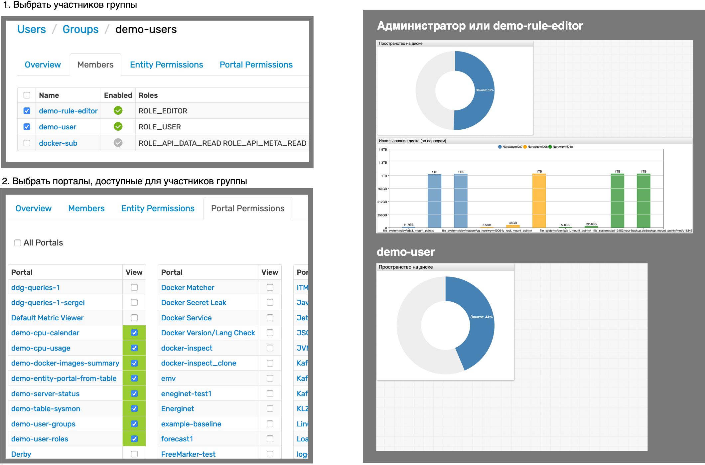
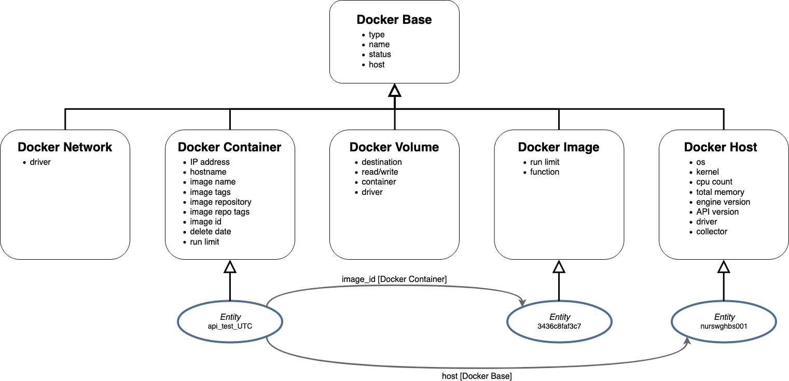
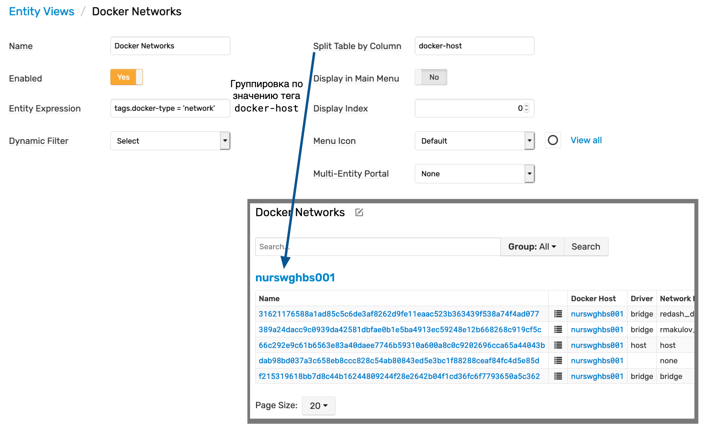
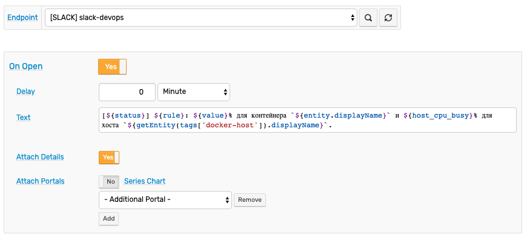
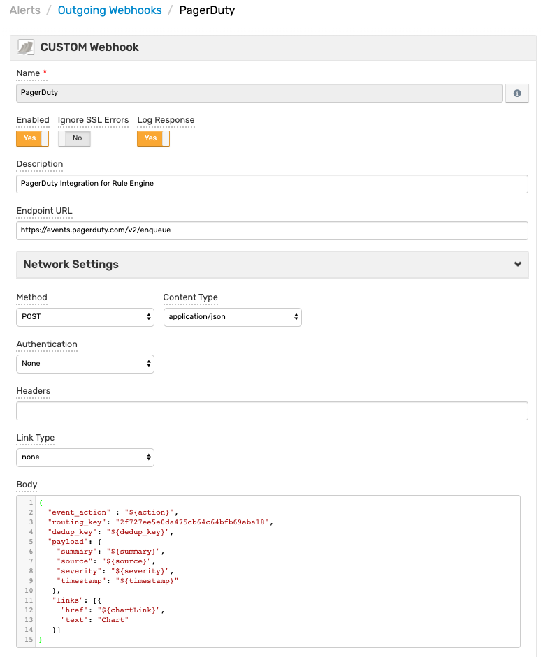
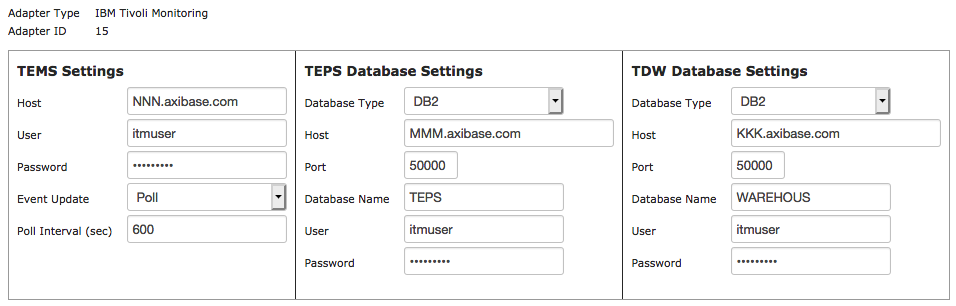

# Мониторинг Инфрастуктуры ИТ

## 3. Требования к функциональным, техническим и эксплуатационным характеристикам

### 3.1. Предоставление единой графической консоли для доступа к конфигурационным единицам

3.1.1) Возможность использования единой консоли для отображения, анализа и управления всей событийной информацией, поступающей от компонентов мониторинга сетевой инфраструктурой и серверного оборудования

* Аксибейс СитЦентр позволяет создать единую точку интеграции без копирования информации и, таким образом, построить единую систему отображения ("витрину") данных.
* [Пример консолидированной консоли](https://hbs.axibase.com/workspace/index-noc.htm): [конфигурация](https://hbs.axibase.com/dashboard/widgets.jsp?fileName=widgets_noc.config)
* Примеры клиентов представлены в файле `examples.pdf`.
* Консоли собираются из [виджетов](https://axibase.com/docs/charts/#widgets). Виджеты поддерживают подгрузку данных из разных источников.
* Переходы между консолями позволяют построить навигационную модель, соответствующую организационной роли пользователя.
* Поддерживается добавление кастомизированной оболочки на верхнем уровня навигации.


3.1.2) Возможность представления в единой консоли совокупных, взаимосвязанных данных топологических представлений активного сетевого оборудования и  сервисно-ресурсной модели серверных платформ

* Источники топологических представлений:
  * Встроенные механизмы построения моделей (примеры - WMQ, Hana, Docker)
  * Низлежащий инструмент (SCOM distributed apps)
  * Модель эскалации критичности, построенная в СитЦентре
  * Диаграмма Визио, созданная автоматически или вручную.


3.1.3) Доступ к консоли на основе ролевой модели

СитЦентр


АТСД

* Пример из UI выдачи прав на просмотр пользовательской группе



* Портал, который представляет данные по-разному, в зависимости от  роли: `userHasRole`

`demo-user-roles`

User 
Admin 

* Портал, который представляет данные по-разному, в зависимости от  принадлежности к заданной группе: `userInGroup`

`demo-user-groups`

`demo-users` 

Rest 

* Портал в режиме гостевого доступа


3.1.4) Возможность категоризации событийной информации по типу

> to be clarified

3.1.5) Возможность отображания и градации состояния элементов ИТ-инфраструктуры в терминах, обобщающих низкоуровневые события

> to be clarified

3.1.6) Возможность отображения зависимых друг от друга сообщений (отображение причинно-следственной связи на уровне событий)

> to be clarified

3.1.7) Возможность просмотра графиков производительности по контексту

Продукт: ATSD

> AV

* Открытие графика из строки таблицы, например, загрузка ЦПУ несколькими серверами - график открывает историю.

`demo-table-sysmon`

* Открытие порталов для сущности из консоли алертов.

`demo-entity-portal-from-table`


* Обновление виджета по нажатию. Должно быть сделать в портале Докера.

* Открыть график по ссылке из email alert

`demo-rule-email`


3.1.8) Возможность отображения на одном графике данных от нескольких источников для возможности сопоставления и оценки работы объектов мониторинга

Продукт: АТСД

> AV

* График с двумя осями: CPU server и Java GC %

`demo-cpu-usage` 

* График с двумя осями: nginx request count (latency), сеть (байты), и ЦПУ

`demo-server-status` 

* Календарь с несколькими серверами - при этом ЦПУ с scollector (linux) и SCOM windows

`demo-cpu-calendar` 

3.1.9) Возможность гибкой настройки оповещений ответственных в соответствии с их зонами ответственности и событиями, приходящими от подсистем системы мониторинга

Продукт: АТСД

> AR

* Условные выражения для отправки уведомлений на разные адреса в зависисмости от критичности события и от времени суток

```javascript
@if{now.timeOfDay BETWEEN '08:00' AND '20:00'}
daywatch@example.org
@else{}
nightwatch@example.org
@end{}
@if{severity = 'CRITICAL' or severity = 'FATAL'}
ops_team@example.org
@end{}
```

* Отмена уведомлений по расписанию с использованием `cancelAction`

```javascript
@if{NOT now.timeOfDay BETWEEN '08:00' AND '20:00'}
${cancelAction()}
@end{}
```

* Отправка уведомления группе пользователей

```javascript
${get_group_emails('DevOps')}
```

* Отправка уведомления собственнику системы (указан email в тэге `owner` сущности)

```javascript
${entity.tags.owner}
```

* Отправка уведомления подвыборке подписанных пользовалей - по ключевым словам. В данном примере лучше взять messages, чтобы пользователи могли указать `type/source` где-то в настройках

В ATSD пользователи могут в настройках счёта самостоятельно задавать события, уведомления о которых они хотели бы получать.


Полный перечень доступных событий создаётся администратором и содержится в служебной таблице `$topics`. Ключом является идентификатор события, значением – его описание.


Функция `subscribers` в **Rule Engine** принимает один или несколько ключей и возвращает email адреса всех пользователей, имеющих хотя бы один ключ в списке тем.

```javascript
${subscribers(type)}
```

3.1.10) Сбор данных о метриках функционирования серверного оборудования и рабочих станций (степень утилизации, загрузка CPU, RAM, HDD)

Продукт: АТСД

> IS

* Таблица с типом ОС (windows, linux, aix) и поддерживаемые агенты со ссылками: scollector, tcollector, nmon, и т.д.
* Пример entity view, портала и списки собираемых метрик

3.1.11) Сбор данных о метриках функционирования сетевого оборудования (сетевая доступность конфигурационных единиц, степень утлизация каналов связи)

Продукт: АТСД

> IS

* SNMP задача:
  * Список собираемых метрик для базового файла MIB
  * Список MIB файлов
  * SNMP портал с доступностью и утилизация

3.1.12) Сбор данных о метриках функционирования приложений (статусы\состояния)

* Поддерживаемые источники данных 
    * Table `prTable`: `1.3.6.1.4.1.2021.2`

      | Объект                                            | Описание                                                                                                                                                                   |
      | :------------------------------------------------ | :------------------------------------------------------------------------------------------------------------------------------------------------------------------------- |
      | **`prEntry`**<br/>`1.3.6.1.4.1.2021.2.1`          | An entry containing a process and its statistics.                                                                                                                          |
      | **`prIndex`**<br/>`1.3.6.1.4.1.2021.2.1.1`        | Reference Index for each observed process.                                                                                                                                 |
      | **`prNames`**<br/>`1.3.6.1.4.1.2021.2.1.2`        | The process name we're counting/checking on.                                                                                                                               |
      | **`prMin`**<br/>`1.3.6.1.4.1.2021.2.1.3`          | The minimum number of processes that must be running. An error setting is generated if the number of running processes is < the minimum.                                   |
      | **`prMax`**<br/>`1.3.6.1.4.1.2021.2.1.4`          | The maximum number of processes that must be running. An error setting is generated if the number of running processes is > the maximum.                                   |
      | **`prCount`**<br/>`1.3.6.1.4.1.2021.2.1.5`        | The number of current processes running with the name in question.                                                                                                         |
      | **`prErrorFlag`**<br/>`1.3.6.1.4.1.2021.2.1.100`  | A Error setting to indicate trouble with a process. Setting goes to `1` if there is an error, `0` if no error.                                                             |
      | **`prErrMessage`**<br/>`1.3.6.1.4.1.2021.2.1.101` | An error message describing the problem (if one exists).                                                                                                                   |
      | **`prErrFix`**<br/>`1.3.6.1.4.1.2021.2.1.102`     | Setting this to one tries to fix the problem if the agent has been configured with a script to call to attempt to fix problems automatically using remote snmp operations. |
      | **`prErrFixCmd`**<br/>`1.3.6.1.4.1.2021.2.1.103`  | The command that gets run when the `prErrFix` column is set to `1`.                                                                                                        |

    * Table `memory`: `1.3.6.1.4.1.2021.4`

      | Объект                                             | Описание                                                                                                                                                                                                                                                                                                                                                                                                                                                       |
      | :------------------------------------------------- | :------------------------------------------------------------------------------------------------------------------------------------------------------------------------------------------------------------------------------------------------------------------------------------------------------------------------------------------------------------------------------------------------------------------------------------------------------------- |
      | **`memIndex`**<br/>`1.3.6.1.4.1.2021.4.1`          | Bogus Index. This must always return the integer `0`.                                                                                                                                                                                                                                                                                                                                                                                                          |
      | **`memErrorName`**<br/>`1.3.6.1.4.1.2021.4.2`      | Bogus Name. This must always return the string `swap`.                                                                                                                                                                                                                                                                                                                                                                                                         |
      | **`memTotalSwap`**<br/>`1.3.6.1.4.1.2021.4.3`      | The total amount of swap space configured for this host.                                                                                                                                                                                                                                                                                                                                                                                                       |
      | **`memAvailSwap`**<br/>`1.3.6.1.4.1.2021.4.4`      | The amount of swap space currently unused or available.                                                                                                                                                                                                                                                                                                                                                                                                        |
      | **`memTotalReal`**<br/>`1.3.6.1.4.1.2021.4.5`      | The total amount of real/physical memory installed on this host.                                                                                                                                                                                                                                                                                                                                                                                               |
      | **`memAvailReal`**<br/>`1.3.6.1.4.1.2021.4.6`      | The amount of real/physical memory currently unused or available.                                                                                                                                                                                                                                                                                                                                                                                              |
      | **`memTotalSwapTXT`**<br/>`1.3.6.1.4.1.2021.4.7`   | The total amount of swap space or virtual memory allocated for text pages on this host. This object is not implemented on hosts where the underlying operating system does not distinguish text pages from other uses of swap space or virtual memory.                                                                                                                                                                                                         |
      | **`memAvailSwapTXT`**<br/>`1.3.6.1.4.1.2021.4.8`   | The amount of swap space or virtual memory currently being used by text pages on this host. This object is not implemented on hosts where the underlying operating system does not distinguish text pages from other uses of swap space or virtual memory. Note that (despite the name), this value reports the amount used, rather than the amount free or available for use. For clarity, this object is being deprecated in favour of `memUsedSwapTXT(16)`. |
      | **`memTotalRealTXT`**<br/>`1.3.6.1.4.1.2021.4.9`   | The total amount of real/physical memory allocated for text pages on this host. This object is not implemented on hosts where the underlying operating system does not distinguish text pages from other uses of physical memory.                                                                                                                                                                                                                              |
      | **`memAvailRealTXT`**<br/>`1.3.6.1.4.1.2021.4.10`  | The amount of real/physical memory currently being used by text pages on this host. This object is not implemented on hosts where the underlying operating system does not distinguish text pages from other uses of physical memory. Note that (despite the name), this value reports the amount used, rather than the amount free or available for use. For clarity, this object is being deprecated in favour of `memUsedRealTXT(17)`.                      |
      | **`memTotalFree`**<br/>`1.3.6.1.4.1.2021.4.11`     | The total amount of memory free or available for use on this host. This value typically covers both real memory and swap space or virtual memory.                                                                                                                                                                                                                                                                                                              |
      | **`memMinimumSwap`**<br/>`1.3.6.1.4.1.2021.4.12`   | The minimum amount of swap space expected to be kept free or available during normal operation of this host. If this value (as reported by `memAvailSwap(4)`) falls below the specified level, then `memSwapError(100)` is set to `1` and an error message made available via `memSwapErrorMsg(101)`.                                                                                                                                                          |
      | **`memShared`**<br/>`1.3.6.1.4.1.2021.4.13`        | The total amount of real or virtual memory currently allocated for use as shared memory. This object is not implemented on hosts where the underlying operating system does not explicitly identify memory as specifically reserved for this purpose.                                                                                                                                                                                                          |
      | **`memBuffer`**<br/>`1.3.6.1.4.1.2021.4.14`        | The total amount of real or virtual memory currently allocated for use as memory buffers. This object is not implemented on hosts where the underlying operating system does not explicitly identify memory as specifically reserved for this purpose.                                                                                                                                                                                                         |
      | **`memCached`**<br/>`1.3.6.1.4.1.2021.4.15`        | The total amount of real or virtual memory currently allocated for use as cached memory. This object is not implemented on hosts where the underlying operating system does not explicitly identify memory as specifically reserved for this purpose.                                                                                                                                                                                                          |
      | **`memUsedSwapTXT`**<br/>`1.3.6.1.4.1.2021.4.16`   | The amount of swap space or virtual memory currently being used by text pages on this host. This object is not implemented on hosts where the underlying operating system does not distinguish text pages from other uses of swap space or virtual memory.                                                                                                                                                                                                     |
      | **`memUsedRealTXT`**<br/>`1.3.6.1.4.1.2021.4.17`   | The amount of real/physical memory currently being used by text pages on this host. This object is not implemented on hosts where the underlying operating system does not distinguish text pages from other uses of physical memory.                                                                                                                                                                                                                          |
      | **`memSwapError`**<br/>`1.3.6.1.4.1.2021.4.100`    | Indicates whether the amount of available swap space (as reported by `memAvailSwap(4)`), is less than the specified minimum (defined by `memMinimumSwap(12)`).                                                                                                                                                                                                                                                                                                 |
      | **`memSwapErrorMsg`**<br/>`1.3.6.1.4.1.2021.4.101` | Describes whether the amount of available swap space (as reported by `memAvailSwap(4)`), is less than the specified minimum (defined by `memMinimumSwap(12)`).                                                                                                                                                                                                                                                                                                 |

    * Table `extTable`: `1.3.6.1.4.1.2021.8`

      | Объект                                            | Описание                                                                                                                                                                   |
      | :------------------------------------------------ | :------------------------------------------------------------------------------------------------------------------------------------------------------------------------- |
      | **`extEntry`**<br/>`1.3.6.1.4.1.2021.8.1`         | An entry containing an extensible script/program and its output.                                                                                                           |
      | **`extIndex`**<br/>`1.3.6.1.4.1.2021.8.1.1`       | Reference Index for extensible scripts. Simply an integer row number.                                                                                                      |
      | **`extNames`**<br/>`1.3.6.1.4.1.2021.8.1.2`       | A Short, one name description of the extensible command.                                                                                                                   |
      | **`extCommand`**<br/>`1.3.6.1.4.1.2021.8.1.3`     | The command line to be executed.                                                                                                                                           |
      | **`extResult`**<br/>`1.3.6.1.4.1.2021.8.1.100`    | The result code (exit status) from the executed command.                                                                                                                   |
      | **`extOutput`**<br/>`1.3.6.1.4.1.2021.8.1.101`    | The first line of output of the executed command.                                                                                                                          |
      | **`extErrFix`**<br/>`1.3.6.1.4.1.2021.8.1.102`    | Setting this to one tries to fix the problem if the agent has been configured with a script to call to attempt to fix problems automatically using remote snmp operations. |
      | **`extErrFixCmd`**<br/>`1.3.6.1.4.1.2021.8.1.103` | The command that gets run when the `extErrFix` column is set to `1`.                                                                                                       |

    * Table `dskTable`: `1.3.6.1.4.1.2021.9`

      | Объект                                             | Описание                                                                                                                                                        |
      | :------------------------------------------------- | :-------------------------------------------------------------------------------------------------------------------------------------------------------------- |
      | **`dskEntry`**<br/>`1.3.6.1.4.1.2021.9.1`          | An entry containing a disk and its statistics.                                                                                                                  |
      | **`dskIndex`**<br/>`1.3.6.1.4.1.2021.9.1.1`        | Integer reference number (row number) for the disk `mib`.                                                                                                       |
      | **`dskPath`**<br/>`1.3.6.1.4.1.2021.9.1.2`         | Path where the disk is mounted.                                                                                                                                 |
      | **`dskDevice`**<br/>`1.3.6.1.4.1.2021.9.1.3`       | Path of the device for the partition                                                                                                                            |
      | **`dskMinimum`**<br/>`1.3.6.1.4.1.2021.9.1.4`      | Minimum space required on the disk (in kBytes) before the errors are triggered. Either this or `dskMinPercent` is configured via the agent's `snmpd.conf` file. |
      | **`dskMinPercent`**<br/>`1.3.6.1.4.1.2021.9.1.5`   | Percentage of minimum space required on the disk before the errors are triggered. Either this or `dskMinimum` is configured via the agent's `snmpd.conf` file.  |
      | **`dskTotal`**<br/>`1.3.6.1.4.1.2021.9.1.6`        | Total size of the disk/partition (kBytes)                                                                                                                       |
      | **`dskAvail`**<br/>`1.3.6.1.4.1.2021.9.1.7`        | Available space on the disk                                                                                                                                     |
      | **`dskUsed`**<br/>`1.3.6.1.4.1.2021.9.1.8`         | Used space on the disk                                                                                                                                          |
      | **`dskPercent`**<br/>`1.3.6.1.4.1.2021.9.1.9`      | Percentage of space used on disk                                                                                                                                |
      | **`dskPercentNode`**<br/>`1.3.6.1.4.1.2021.9.1.10` | Percentage of inodes used on disk                                                                                                                               |
      | **`dskTotalLow`**<br/>`1.3.6.1.4.1.2021.9.1.11`    | Total size of the disk/partition (kBytes). Together with `dskTotalHigh` composes `64`-bit number.                                                               |
      | **`dskTotalHigh`**<br/>`1.3.6.1.4.1.2021.9.1.12`   | Total size of the disk/partition (kBytes). Together with `dskTotalLow` composes `64`-bit number.                                                                |
      | **`dskAvailLow`**<br/>`1.3.6.1.4.1.2021.9.1.13`    | Available space on the disk (kBytes). Together with `dskAvailHigh` composes `64`-bit number.                                                                    |
      | **`dskAvailHigh`**<br/>`1.3.6.1.4.1.2021.9.1.14`   | Available space on the disk (kBytes). Together with `dskAvailLow` composes `64`-bit number.                                                                     |
      | **`dskUsedLow`**<br/>`1.3.6.1.4.1.2021.9.1.15`     | Used space on the disk (kBytes). Together with `dskUsedHigh` composes `64`-bit number.                                                                          |
      | **`dskUsedHigh`**<br/>`1.3.6.1.4.1.2021.9.1.16`    | Used space on the disk (kBytes). Together with `dskUsedLow` composes `64`-bit number.                                                                           |
      | **`dskErrorFlag`**<br/>`1.3.6.1.4.1.2021.9.1.100`  | Error setting signaling that the disk or partition is under the minimum required space configured for it.                                                       |
      | **`dskErrorMsg`**<br/>`1.3.6.1.4.1.2021.9.1.101`   | A text description providing a warning and the space left on the disk.                                                                                          |

    * Table `laTable`: `1.3.6.1.4.1.2021.10`

      | Объект                                             | Описание                                                                                                                                                                                      |
      | :------------------------------------------------- | :-------------------------------------------------------------------------------------------------------------------------------------------------------------------------------------------- |
      | **`laEntry`**<br/>`1.3.6.1.4.1.2021.10.1`          | An entry containing a load average and its values.                                                                                                                                            |
      | **`laIndex`**<br/>`1.3.6.1.4.1.2021.10.1.1`        | reference index/row number for each observed `loadave`.                                                                                                                                       |
      | **`laNames`**<br/>`1.3.6.1.4.1.2021.10.1.2`        | The list of `loadave` names we're watching.                                                                                                                                                   |
      | **`laLoad`**<br/>`1.3.6.1.4.1.2021.10.1.3`         | The `1`,`5` and `15` minute load averages (one per row).                                                                                                                                      |
      | **`laConfig`**<br/>`1.3.6.1.4.1.2021.10.1.4`       | The watch point for load-averages to signal an error. If the load averages rises above this value, the `laErrorFlag` below is set.                                                            |
      | **`laLoadInt`**<br/>`1.3.6.1.4.1.2021.10.1.5`      | The `1`,`5` and `15` minute load averages as an integer. This is computed by taking the floating point `loadaverage` value and multiplying by `100`, then converting the value to an integer. |
      | **`laLoadFloat`**<br/>`1.3.6.1.4.1.2021.10.1.6`    | The `1`,`5` and `15` minute load averages as an opaquely wrapped floating point number.                                                                                                       |
      | **`laErrorFlag`**<br/>`1.3.6.1.4.1.2021.10.1.100`  | A Error setting to indicate the load-average has crossed its threshold value defined in the `snmpd.conf` file. Set to `1` if the threshold is crossed, `0` otherwise.                         |
      | **`laErrMessage`**<br/>`1.3.6.1.4.1.2021.10.1.101` | An error message describing the `loadaverage` and its surpassed watch-point value.                                                                                                            |

    * Table `systemStats`: `1.3.6.1.4.1.2021.11`

      | Объект                                               | Описание                                                                                                                                                                                                                                                                                                                                                                                                             |
      | :--------------------------------------------------- | :------------------------------------------------------------------------------------------------------------------------------------------------------------------------------------------------------------------------------------------------------------------------------------------------------------------------------------------------------------------------------------------------------------------- |
      | **`ssIndex`**<br/>`1.3.6.1.4.1.2021.11.1`            | Bogus Index. This must always return the integer `1`.                                                                                                                                                                                                                                                                                                                                                                |
      | **`ssErrorName`**<br/>`1.3.6.1.4.1.2021.11.2`        | Bogus Name. This must always return the string `systemStats`.                                                                                                                                                                                                                                                                                                                                                        |
      | **`ssSwapIn`**<br/>`1.3.6.1.4.1.2021.11.3`           | The average amount of memory swapped in from disk, calculated over the last minute.                                                                                                                                                                                                                                                                                                                                  |
      | **`ssSwapOut`**<br/>`1.3.6.1.4.1.2021.11.4`          | The average amount of memory swapped out to disk, calculated over the last minute.                                                                                                                                                                                                                                                                                                                                   |
      | **`ssIOSent`**<br/>`1.3.6.1.4.1.2021.11.5`           | The average amount of data written to disk or other block device, calculated over the last minute. This object has been deprecated in favour of `ssIORawSent(57)`, which can be used to calculate the same metric, over any specified time period.                                                                                                                                                                   |
      | **`ssIOReceive`**<br/>`1.3.6.1.4.1.2021.11.6`        | The average amount of data read from disk or other block device, calculated over the last minute. This object has been deprecated in favour of `ssIORawReceived(58)`, which can be used to calculate the same metric, over any specified time period.                                                                                                                                                                |
      | **`ssSysInterrupts`**<br/>`1.3.6.1.4.1.2021.11.7`    | The average rate of interrupts processed (including the clock) calculated over the last minute. This object has been deprecated in favour of `ssRawInterrupts(59)`, which can be used to calculate the same metric, over any specified time period.                                                                                                                                                                  |
      | **`ssSysContext`**<br/>`1.3.6.1.4.1.2021.11.8`       | The average rate of context switches, calculated over the last minute. This object has been deprecated in favour of `ssRawContext(60)`, which can be used to calculate the same metric, over any specified time period.                                                                                                                                                                                              |
      | **`ssCpuUser`**<br/>`1.3.6.1.4.1.2021.11.9`          | The percentage of CPU time spent processing user-level code, calculated over the last minute. This object has been deprecated in favour of `ssCpuRawUser(50)`, which can be used to calculate the same metric, over any specified time period.                                                                                                                                                                       |
      | **`ssCpuSystem`**<br/>`1.3.6.1.4.1.2021.11.10`       | The percentage of CPU time spent processing system-level code, calculated over the last minute. This object has been deprecated in favour of `ssCpuRawSystem(52)`, which can be used to calculate the same metric, over any specified time period.                                                                                                                                                                   |
      | **`ssCpuIdle`**<br/>`1.3.6.1.4.1.2021.11.11`         | The percentage of processor time spent idle, calculated over the last minute. This object has been deprecated in favour of `ssCpuRawIdle(53)`, which can be used to calculate the same metric, over any specified time period.                                                                                                                                                                                       |
      | **`ssCpuRawUser`**<br/>`1.3.6.1.4.1.2021.11.50`      | The number of `ticks` (typically `1`/`100`s) spent processing user-level code. On a multi-processor system, the `ssCpuRaw*` counters are cumulative over all CPUs, their sum is typically N*`100` for N processors.                                                                                                                                                                                                  |
      | **`ssCpuRawNice`**<br/>`1.3.6.1.4.1.2021.11.51`      | The number of `ticks` (typically `1`/`100`s) spent processing reduced-priority code. This object is not implemented on hosts where the underlying operating system does not measure this particular CPU metric. On a multi-processor system, the `ssCpuRaw*` counters are cumulative over all CPUs, their sum is typically N*`100` for N processors.                                                                 |
      | **`ssCpuRawSystem`**<br/>`1.3.6.1.4.1.2021.11.52`    | The number of `ticks` (typically `1`/`100`s) spent processing system-level code. On a multi-processor system, the `ssCpuRaw*` counters are cumulative over all CPUs, their sum is typically N*`100` for N processors. This object sometimes is implemented as the combination of the `ssCpuRawWait(54)` and `ssCpuRawKernel(55)` counters, care must be taken when summing the overall raw counters.                 |
      | **`ssCpuRawIdle`**<br/>`1.3.6.1.4.1.2021.11.53`      | The number of `ticks` (typically `1`/`100`s) spent idle. On a multi-processor system, the `ssCpuRaw*` counters are cumulative over all CPUs, their sum is typically N*`100` for N processors.                                                                                                                                                                                                                        |
      | **`ssCpuRawWait`**<br/>`1.3.6.1.4.1.2021.11.54`      | The number of `ticks` (typically `1`/`100`s) spent waiting for IO. This object is not implemented on hosts where the underlying operating system does not measure this particular CPU metric. This time also is included within the `ssCpuRawSystem(52)` counter. On a multi-processor system, the `ssCpuRaw*` counters are cumulative over all CPUs, their sum is typically N*`100` for N processors.               |
      | **`ssCpuRawKernel`**<br/>`1.3.6.1.4.1.2021.11.55`    | The number of `ticks` (typically `1`/`100`s) spent processing kernel-level code. This object is not implemented on hosts where the underlying operating system does not measure this particular CPU metric. This time also is included within the `ssCpuRawSystem(52)` counter. On a multi-processor system, the `ssCpuRaw*` counters are cumulative over all CPUs, their sum is typically N*`100` for N processors. |
      | **`ssCpuRawInterrupt`**<br/>`1.3.6.1.4.1.2021.11.56` | The number of `ticks` (typically `1`/`100`s) spent processing hardware interrupts. This object is not implemented on hosts where the underlying operating system does not measure this particular CPU metric. On a multi-processor system, the `ssCpuRaw*` counters are cumulative over all CPUs, their sum is typically N*`100` for N processors.                                                                   |
      | **`ssIORawSent`**<br/>`1.3.6.1.4.1.2021.11.57`       | Number of blocks sent to a block device                                                                                                                                                                                                                                                                                                                                                                              |
      | **`ssIORawReceived`**<br/>`1.3.6.1.4.1.2021.11.58`   | Number of blocks received from a block device                                                                                                                                                                                                                                                                                                                                                                        |
      | **`ssRawInterrupts`**<br/>`1.3.6.1.4.1.2021.11.59`   | Number of interrupts processed                                                                                                                                                                                                                                                                                                                                                                                       |
      | **`ssRawContexts`**<br/>`1.3.6.1.4.1.2021.11.60`     | Number of context switches                                                                                                                                                                                                                                                                                                                                                                                           |
      | **`ssCpuRawSoftIRQ`**<br/>`1.3.6.1.4.1.2021.11.61`   | The number of `ticks` (typically `1`/`100`s) spent processing software interrupts. This object is not implemented on hosts where the underlying operating system does not measure this particular CPU metric. On a multi-processor system, the `ssCpuRaw*` counters are cumulative over all CPUs, their sum is typically N*`100` for N processors.                                                                   |
      | **`ssRawSwapIn`**<br/>`1.3.6.1.4.1.2021.11.62`       | Number of blocks swapped in                                                                                                                                                                                                                                                                                                                                                                                          |
      | **`ssRawSwapOut`**<br/>`1.3.6.1.4.1.2021.11.63`      | Number of blocks swapped out                                                                                                                                                                                                                                                                                                                                                                                         |

    * Table `fileTable`: `1.3.6.1.4.1.2021.15`

      | Объект                                              | Описание                 |
      | :-------------------------------------------------- | :----------------------- |
      | **`fileEntry`**<br/>`1.3.6.1.4.1.2021.15.1`         | Entry of file            |
      | **`fileIndex`**<br/>`1.3.6.1.4.1.2021.15.1.1`       | Index of file            |
      | **`fileName`**<br/>`1.3.6.1.4.1.2021.15.1.2`        | Filename                 |
      | **`fileSize`**<br/>`1.3.6.1.4.1.2021.15.1.3`        | Size of file (kB)        |
      | **`fileMax`**<br/>`1.3.6.1.4.1.2021.15.1.4`         | Limit of `filesize` (kB) |
      | **`fileErrorFlag`**<br/>`1.3.6.1.4.1.2021.15.1.100` | Limit exceeded setting   |
      | **`fileErrorMsg`**<br/>`1.3.6.1.4.1.2021.15.1.101`  | `Filesize` error message |

    * Table `logMatch`: `1.3.6.1.4.1.2021.16`

      | Объект                                                           | Описание                                                                           |
      | :--------------------------------------------------------------- | :--------------------------------------------------------------------------------- |
      | **`logMatchMaxEntries`**<br/>`1.3.6.1.4.1.2021.16.1`             | The maximum number of `logmatch` entries this `snmpd` daemon can support.          |
      | **`logMatchTable`**<br/>`1.3.6.1.4.1.2021.16.2`                  | Table of monitored files.                                                          |
      | **`logMatchEntry`**<br/>`1.3.6.1.4.1.2021.16.2.1`                | Entry of file                                                                      |
      | **`logMatchIndex`**<br/>`1.3.6.1.4.1.2021.16.2.1.1`              | Index of `logmatch`                                                                |
      | **`logMatchName`**<br/>`1.3.6.1.4.1.2021.16.2.1.2`               | `logmatch` instance name                                                           |
      | **`logMatchFilename`**<br/>`1.3.6.1.4.1.2021.16.2.1.3`           | filename to be `logmatched`                                                        |
      | **`logMatchRegEx`**<br/>`1.3.6.1.4.1.2021.16.2.1.4`              | regular expression                                                                 |
      | **`logMatchGlobalCounter`**<br/>`1.3.6.1.4.1.2021.16.2.1.5`      | global count of matches                                                            |
      | **`logMatchGlobalCounter`**<br/>`1.3.6.1.4.1.2021.16.2.1.5`      | Description.                                                                       |
      | **`logMatchCurrentCounter`**<br/>`1.3.6.1.4.1.2021.16.2.1.7`     | Regular expression match counter. This counter resets with each log file rotation. |
      | **`logMatchCurrentCounter`**<br/>`1.3.6.1.4.1.2021.16.2.1.7`     | Description.                                                                       |
      | **`logMatchCounter`**<br/>`1.3.6.1.4.1.2021.16.2.1.9`            | Regular expression match counter. This counter resets with each read               |
      | **`logMatchCounter`**<br/>`1.3.6.1.4.1.2021.16.2.1.9`            | Description.                                                                       |
      | **`logMatchCycle`**<br/>`1.3.6.1.4.1.2021.16.2.1.11`             | time between updates (if not queried) in seconds                                   |
      | **`logMatchErrorFlag`**<br/>`1.3.6.1.4.1.2021.16.2.1.100`        | error setting: is this line configured correctly?                                  |
      | **`logMatchRegExCompilation`**<br/>`1.3.6.1.4.1.2021.16.2.1.101` | message of regular expression `precompilation`                                     |

    * Table `version`: `1.3.6.1.4.1.2021.100`

      | Объект                                                        | Описание                                                                    |
      | :------------------------------------------------------------ | :-------------------------------------------------------------------------- |
      | **`versionIndex`**<br/>`1.3.6.1.4.1.2021.100.1`               | Index to `mib` (always `0`)                                                 |
      | **`versionTag`**<br/>`1.3.6.1.4.1.2021.100.2`                 | CVS tag keyword                                                             |
      | **`versionDate`**<br/>`1.3.6.1.4.1.2021.100.3`                | Date string from RCS keyword                                                |
      | **`versionCDate`**<br/>`1.3.6.1.4.1.2021.100.4`               | Date string from `ctime()`                                                  |
      | **`versionIdent`**<br/>`1.3.6.1.4.1.2021.100.5`               | Id string from RCS keyword                                                  |
      | **`versionConfigureOptions`**<br/>`1.3.6.1.4.1.2021.100.6`    | Options passed to the configure script when this agent is built.            |
      | **`versionClearCache`**<br/>`1.3.6.1.4.1.2021.100.10`         | Set to `1` to clear the `exec` cache, if enabled                            |
      | **`versionUpdateConfig`**<br/>`1.3.6.1.4.1.2021.100.11`       | Set to `1` to read-read the config file(s).                                 |
      | **`versionRestartAgent`**<br/>`1.3.6.1.4.1.2021.100.12`       | Set to `1` to restart the agent.                                            |
      | **`versionSavePersistentData`**<br/>`1.3.6.1.4.1.2021.100.13` | Set to `1` to force the agent to save it's persistent data immediately.     |
      | **`versionDoDebugging`**<br/>`1.3.6.1.4.1.2021.100.20`        | Set to `1` to turn debugging statements on in the agent or `0` to turn off. |

    * Table `snmperrs`: `1.3.6.1.4.1.2021.101`

      | Объект                                                 | Описание                                                                                               |
      | :----------------------------------------------------- | :----------------------------------------------------------------------------------------------------- |
      | **`snmperrIndex`**<br/>`1.3.6.1.4.1.2021.101.1`        | Bogus Index for `snmperrs` (always `0`).                                                               |
      | **`snmperrNames`**<br/>`1.3.6.1.4.1.2021.101.2`        | snmp                                                                                                   |
      | **`snmperrErrorFlag`**<br/>`1.3.6.1.4.1.2021.101.100`  | A Error setting to indicate trouble with the agent. Goes to `1` if there is an error, `0` if no error. |
      | **`snmperrErrMessage`**<br/>`1.3.6.1.4.1.2021.101.101` | An error message describing the problem (if one exists).                                               |

    * Table `mrTable`: `1.3.6.1.4.1.2021.102`

      | Объект                                            | Описание                                      |
      | :------------------------------------------------ | :-------------------------------------------- |
      | **`mrEntry`**<br/>`1.3.6.1.4.1.2021.102.1`        | An entry containing a registered `mib` `oid`. |
      | **`mrIndex`**<br/>`1.3.6.1.4.1.2021.102.1.1`      | The registry slot of a `mibmodule`.           |
      | **`mrModuleName`**<br/>`1.3.6.1.4.1.2021.102.1.2` | The module name that registered this OID.     |

    * Table `ifTable`: `1.3.6.1.2.1.2.2`

      | Объект                                             | Описание                                                                                                                                                                                                                                                                                                                                                                                                                                                                                                                                                                                                                                                                                                                             |
      | :------------------------------------------------- | :----------------------------------------------------------------------------------------------------------------------------------------------------------------------------------------------------------------------------------------------------------------------------------------------------------------------------------------------------------------------------------------------------------------------------------------------------------------------------------------------------------------------------------------------------------------------------------------------------------------------------------------------------------------------------------------------------------------------------------- |
      | **`ifEntry`**<br/>`1.3.6.1.2.1.2.2.1`              | An entry containing management information applicable to a particular interface.                                                                                                                                                                                                                                                                                                                                                                                                                                                                                                                                                                                                                                                     |
      | **`ifIndex`**<br/>`1.3.6.1.2.1.2.2.1.1`            | A unique value, greater than zero, for each interface. It is recommended that values are assigned contiguously starting from `1`. The value for each interface sub-layer must remain constant at least from one re-initialization of the entity's network management system to the next re- initialization.                                                                                                                                                                                                                                                                                                                                                                                                                          |
      | **`ifDescr`**<br/>`1.3.6.1.2.1.2.2.1.2`            | A textual string containing information about the interface. This string must include the name of the manufacturer, the product name and the version of the interface hardware/software.                                                                                                                                                                                                                                                                                                                                                                                                                                                                                                                                             |
      | **`ifType`**<br/>`1.3.6.1.2.1.2.2.1.3`             | The type of interface. Additional values for `ifType` are assigned by the Internet Assigned Numbers Authority (IANA), through updating the syntax of the `IANAifType` textual convention.                                                                                                                                                                                                                                                                                                                                                                                                                                                                                                                                            |
      | **`ifMtu`**<br/>`1.3.6.1.2.1.2.2.1.4`              | The size of the largest packet which can be sent/received on the interface, specified in octets. For interfaces that are used for transmitting network datagrams, this is the size of the largest network datagram that can be sent on the interface.                                                                                                                                                                                                                                                                                                                                                                                                                                                                                |
      | **`ifSpeed`**<br/>`1.3.6.1.2.1.2.2.1.5`            | An estimate of the interface's current bandwidth in bits per second. For interfaces which do not vary in bandwidth or for those where no accurate estimation can be made, this object must contain the nominal bandwidth. If the bandwidth of the interface is greater than the maximum value reportable by this object then this object must report its maximum value (`4,294,967,295`) and `ifHighSpeed` must be used to report the interface's speed. For a sub-layer which has no concept of bandwidth, this object must be zero.                                                                                                                                                                                                |
      | **`ifPhysAddress`**<br/>`1.3.6.1.2.1.2.2.1.6`      | The interface's address at its protocol sub-layer. For example, for an `802.x` interface, this object normally contains a MAC address. The interface's media-specific MIB must define the bit and byte ordering and the format of the value of this object. For interfaces which do not have such an address (e.g., a serial line), this object must contain an octet string of zero length.                                                                                                                                                                                                                                                                                                                                         |
      | **`ifAdminStatus`**<br/>`1.3.6.1.2.1.2.2.1.7`      | The target state of the interface. The `testing(3)` state indicates that no operational packets can be passed. When a managed system initializes, all interfaces start with `ifAdminStatus` in the `down(2)` state. As a result of either explicit management action or per configuration information retained by the managed system, `ifAdminStatus` is then changed to either the `up(1)` or `testing(3)` states (or remains in the `down(2)` state).                                                                                                                                                                                                                                                                              |
      | **`ifOperStatus`**<br/>`1.3.6.1.2.1.2.2.1.8`       | The current operational state of the interface. The testing(3) state indicates that no operational packets can be passed. If `ifAdminStatus` is down(2) then `ifOperStatus` must be `down(2)`. If `ifAdminStatus` is changed to `up(1)` then `ifOperStatus` must change to `up(1)` if the interface is ready to transmit and receive network traffic; it must change to `dormant(5)` if the interface is waiting for external actions (such as a serial line waiting for an incoming connection); it must remain in the `down(2)` state if and only if there is a fault that prevents it from going to the `up(1)` state; it must remain in the `notPresent(6)` state if the interface has missing (typically, hardware) components. |
      | **`ifLastChange`**<br/>`1.3.6.1.2.1.2.2.1.9`       | The value of `sysUpTime` at the time the interface entered its current operational state. If the current state is entered prior to the last re-initialization of the local network management subsystem, then this object contains a zero value.                                                                                                                                                                                                                                                                                                                                                                                                                                                                                     |
      | **`ifInOctets`**<br/>`1.3.6.1.2.1.2.2.1.10`        | The total number of octets received on the interface, including framing characters. Discontinuities in the value of this counter can occur at re-initialization of the management system, and at other times as indicated by the value of `ifCounterDiscontinuityTime`.                                                                                                                                                                                                                                                                                                                                                                                                                                                              |
      | **`ifInUcastPkts`**<br/>`1.3.6.1.2.1.2.2.1.11`     | The number of packets, delivered by this sub-layer to a higher (sub-)layer, which are not addressed to a multicast or broadcast address at this sub-layer. Discontinuities in the value of this counter can occur at re-initialization of the management system, and at other times as indicated by the value of `ifCounterDiscontinuityTime`.                                                                                                                                                                                                                                                                                                                                                                                       |
      | **`ifInNUcastPkts`**<br/>`1.3.6.1.2.1.2.2.1.12`    | The number of packets, delivered by this sub-layer to a higher (sub-)layer, which are addressed to a multicast or broadcast address at this sub-layer. Discontinuities in the value of this counter can occur at re-initialization of the management system, and at other times as indicated by the value of `ifCounterDiscontinuityTime`. This object is deprecated in favour of `ifInMulticastPkts` and `ifInBroadcastPkts`.                                                                                                                                                                                                                                                                                                       |
      | **`ifInDiscards`**<br/>`1.3.6.1.2.1.2.2.1.13`      | The number of inbound packets which are chosen to be discarded even though no errors are detected to prevent their being deliverable to a higher-layer protocol. One possible reason for discarding such a packet is to free up buffer space. Discontinuities in the value of this counter can occur at re-initialization of the management system, and at other times as indicated by the value of `ifCounterDiscontinuityTime`.                                                                                                                                                                                                                                                                                                    |
      | **`ifInErrors`**<br/>`1.3.6.1.2.1.2.2.1.14`        | For packet-oriented interfaces, the number of inbound packets that contained errors preventing them from being deliverable to a higher-layer protocol. For character- oriented or fixed-length interfaces, the number of inbound transmission units that contained errors preventing them from being deliverable to a higher-layer protocol. Discontinuities in the value of this counter can occur at re-initialization of the management system, and at other times as indicated by the value of `ifCounterDiscontinuityTime`.                                                                                                                                                                                                     |
      | **`ifInUnknownProtos`**<br/>`1.3.6.1.2.1.2.2.1.15` | For packet-oriented interfaces, the number of packets received via the interface which are discarded because of an unknown or unsupported protocol. For character-oriented or fixed-length interfaces that support protocol multiplexing the number of transmission units received via the interface which are discarded because of an unknown or unsupported protocol. For any interface that does not support protocol multiplexing, this counter always is `0`. Discontinuities in the value of this counter can occur at re-initialization of the management system, and at other times as indicated by the value of `ifCounterDiscontinuityTime`.                                                                               |
      | **`ifOutOctets`**<br/>`1.3.6.1.2.1.2.2.1.16`       | The total number of octets transmitted out of the interface, including framing characters. Discontinuities in the value of this counter can occur at re-initialization of the management system, and at other times as indicated by the value of `ifCounterDiscontinuityTime`.                                                                                                                                                                                                                                                                                                                                                                                                                                                       |
      | **`ifOutUcastPkts`**<br/>`1.3.6.1.2.1.2.2.1.17`    | The total number of packets that higher-level protocols requested be transmitted, and which are not addressed to a multicast or broadcast address at this sub-layer, including those that are discarded or not sent. Discontinuities in the value of this counter can occur at re-initialization of the management system, and at other times as indicated by the value of `ifCounterDiscontinuityTime`.                                                                                                                                                                                                                                                                                                                             |
      | **`ifOutNUcastPkts`**<br/>`1.3.6.1.2.1.2.2.1.18`   | The total number of packets that higher-level protocols requested be transmitted, and which are addressed to a multicast or broadcast address at this sub-layer, including those that are discarded or not sent. Discontinuities in the value of this counter can occur at re-initialization of the management system, and at other times as indicated by the value of `ifCounterDiscontinuityTime`. This object is deprecated in favour of `ifOutMulticastPkts` and `ifOutBroadcastPkts`.                                                                                                                                                                                                                                           |
      | **`ifOutDiscards`**<br/>`1.3.6.1.2.1.2.2.1.19`     | The number of outbound packets which are chosen to be discarded even though no errors are detected to prevent their being transmitted. One possible reason for discarding such a packet is to free up buffer space. Discontinuities in the value of this counter can occur at re-initialization of the management system, and at other times as indicated by the value of `ifCounterDiscontinuityTime`.                                                                                                                                                                                                                                                                                                                              |
      | **`ifOutErrors`**<br/>`1.3.6.1.2.1.2.2.1.20`       | For packet-oriented interfaces, the number of outbound packets that are not transmitted because of errors. For character-oriented or fixed-length interfaces, the number of outbound transmission units that are not transmitted because of errors. Discontinuities in the value of this counter can occur at re-initialization of the management system, and at other times as indicated by the value of `ifCounterDiscontinuityTime`.                                                                                                                                                                                                                                                                                              |
      | **`ifOutQLen`**<br/>`1.3.6.1.2.1.2.2.1.21`         | The length of the output packet queue (in packets).                                                                                                                                                                                                                                                                                                                                                                                                                                                                                                                                                                                                                                                                                  |
      | **`ifSpecific`**<br/>`1.3.6.1.2.1.2.2.1.22`        | A reference to MIB definitions specific to the particular media being used to realize the interface. It is recommended that this value point to an instance of a MIB object in the media-specific MIB, i.e., that this object have the semantics associated with the InstancePointer textual convention defined in RFC `2579`. In fact, it is recommended that the media-specific MIB specify what value `ifSpecific` must/can take for values of `ifType`. If no MIB definitions specific to the particular media are available, the value must be set to the OBJECT IDENTIFIER { `0` `0` }.                                                                                                                                        |

    * Table `ifMIB`: `1.3.6.1.2.1.31`

      | Объект                                                         | Описание                                                                                                                                                                                                                                                                                                                                                                                                                                                                                                                                                                                                                                                                                                                                                                                                                                                                                                                                                                                                                                                                                                                                                                                                                 |
      | :------------------------------------------------------------- | :----------------------------------------------------------------------------------------------------------------------------------------------------------------------------------------------------------------------------------------------------------------------------------------------------------------------------------------------------------------------------------------------------------------------------------------------------------------------------------------------------------------------------------------------------------------------------------------------------------------------------------------------------------------------------------------------------------------------------------------------------------------------------------------------------------------------------------------------------------------------------------------------------------------------------------------------------------------------------------------------------------------------------------------------------------------------------------------------------------------------------------------------------------------------------------------------------------------------- |
      | **`ifMIBObjects`**<br/>`1.3.6.1.2.1.31.1`                      | This data type is used to model an administratively assigned name of the owner of a resource. This information is taken from the NVT ASCII character set. It is suggested that this name contain one or more of the following: ASCII form of the manager station's transport address, management station name (e.g., domain name), network management personnel's name, location, or phone number. In some cases the agent itself is the owner of an entry. In these cases, this string shall be set to a string starting with `agent`.                                                                                                                                                                                                                                                                                                                                                                                                                                                                                                                                                                                                                                                                                  |
      | **`ifXTable`**<br/>`1.3.6.1.2.1.31.1.1`                        | A list of interface entries. The number of entries is given by the value of `ifNumber`. This table contains additional objects for the interface table.                                                                                                                                                                                                                                                                                                                                                                                                                                                                                                                                                                                                                                                                                                                                                                                                                                                                                                                                                                                                                                                                  |
      | **`ifXEntry`**<br/>`1.3.6.1.2.1.31.1.1.1`                      | An entry containing additional management information applicable to a particular interface.                                                                                                                                                                                                                                                                                                                                                                                                                                                                                                                                                                                                                                                                                                                                                                                                                                                                                                                                                                                                                                                                                                                              |
      | **`ifName`**<br/>`1.3.6.1.2.1.31.1.1.1.1`                      | The textual name of the interface. The value of this object must be the name of the interface as assigned by the local device and must be suitable for use in commands entered at the device's `console`. This might be a text name, such as `le0` or a simple port number, such as `1`, depending on the interface naming syntax of the device. If several entries in the `ifTable` together represent a single interface as named by the device, then each has the same value of `ifName`. Note that for an agent which responds to SNMP queries concerning an interface on some other (proxied) device, then the value of `ifName` for such an interface is the proxied device's local name for it. If there is no local name, or this object is otherwise not applicable, then this object contains a zero-length string.                                                                                                                                                                                                                                                                                                                                                                                            |
      | **`ifInMulticastPkts`**<br/>`1.3.6.1.2.1.31.1.1.1.2`           | The number of packets, delivered by this sub-layer to a higher (sub-)layer, which are addressed to a multicast address at this sub-layer. For a MAC layer protocol, this includes both Group and Functional addresses. Discontinuities in the value of this counter can occur at re-initialization of the management system, and at other times as indicated by the value of `ifCounterDiscontinuityTime`.                                                                                                                                                                                                                                                                                                                                                                                                                                                                                                                                                                                                                                                                                                                                                                                                               |
      | **`ifInBroadcastPkts`**<br/>`1.3.6.1.2.1.31.1.1.1.3`           | The number of packets, delivered by this sub-layer to a higher (sub-)layer, which are addressed to a broadcast address at this sub-layer. Discontinuities in the value of this counter can occur at re-initialization of the management system, and at other times as indicated by the value of `ifCounterDiscontinuityTime`.                                                                                                                                                                                                                                                                                                                                                                                                                                                                                                                                                                                                                                                                                                                                                                                                                                                                                            |
      | **`ifOutMulticastPkts`**<br/>`1.3.6.1.2.1.31.1.1.1.4`          | The total number of packets that higher-level protocols requested be transmitted, and which are addressed to a multicast address at this sub-layer, including those that are discarded or not sent. For a MAC layer protocol, this includes both Group and Functional addresses. Discontinuities in the value of this counter can occur at re-initialization of the management system, and at other times as indicated by the value of `ifCounterDiscontinuityTime`.                                                                                                                                                                                                                                                                                                                                                                                                                                                                                                                                                                                                                                                                                                                                                     |
      | **`ifOutBroadcastPkts`**<br/>`1.3.6.1.2.1.31.1.1.1.5`          | The total number of packets that higher-level protocols requested be transmitted, and which are addressed to a broadcast address at this sub-layer, including those that are discarded or not sent. Discontinuities in the value of this counter can occur at re-initialization of the management system, and at other times as indicated by the value of `ifCounterDiscontinuityTime`.                                                                                                                                                                                                                                                                                                                                                                                                                                                                                                                                                                                                                                                                                                                                                                                                                                  |
      | **`ifHCInOctets`**<br/>`1.3.6.1.2.1.31.1.1.1.6`                | The total number of octets received on the interface, including framing characters. This object is a `64`-bit version of `ifInOctets`. Discontinuities in the value of this counter can occur at re-initialization of the management system, and at other times as indicated by the value of `ifCounterDiscontinuityTime`.                                                                                                                                                                                                                                                                                                                                                                                                                                                                                                                                                                                                                                                                                                                                                                                                                                                                                               |
      | **`ifHCInUcastPkts`**<br/>`1.3.6.1.2.1.31.1.1.1.7`             | The number of packets, delivered by this sub-layer to a higher (sub-)layer, which are not addressed to a multicast or broadcast address at this sub-layer. This object is a `64`-bit version of `ifInUcastPkts`. Discontinuities in the value of this counter can occur at re-initialization of the management system, and at other times as indicated by the value of `ifCounterDiscontinuityTime`.                                                                                                                                                                                                                                                                                                                                                                                                                                                                                                                                                                                                                                                                                                                                                                                                                     |
      | **`ifHCInMulticastPkts`**<br/>`1.3.6.1.2.1.31.1.1.1.8`         | The number of packets, delivered by this sub-layer to a higher (sub-)layer, which are addressed to a multicast address at this sub-layer. For a MAC layer protocol, this includes both Group and Functional addresses. This object is a `64`-bit version of `ifInMulticastPkts`. Discontinuities in the value of this counter can occur at re-initialization of the management system, and at other times as indicated by the value of `ifCounterDiscontinuityTime`.                                                                                                                                                                                                                                                                                                                                                                                                                                                                                                                                                                                                                                                                                                                                                     |
      | **`ifHCInBroadcastPkts`**<br/>`1.3.6.1.2.1.31.1.1.1.9`         | The number of packets, delivered by this sub-layer to a higher (sub-)layer, which are addressed to a broadcast address at this sub-layer. This object is a `64`-bit version of `ifInBroadcastPkts`. Discontinuities in the value of this counter can occur at re-initialization of the management system, and at other times as indicated by the value of `ifCounterDiscontinuityTime`.                                                                                                                                                                                                                                                                                                                                                                                                                                                                                                                                                                                                                                                                                                                                                                                                                                  |
      | **`ifHCOutOctets`**<br/>`1.3.6.1.2.1.31.1.1.1.10`              | The total number of octets transmitted out of the interface, including framing characters. This object is a `64`-bit version of `ifOutOctets`. Discontinuities in the value of this counter can occur at re-initialization of the management system, and at other times as indicated by the value of `ifCounterDiscontinuityTime`.                                                                                                                                                                                                                                                                                                                                                                                                                                                                                                                                                                                                                                                                                                                                                                                                                                                                                       |
      | **`ifHCOutUcastPkts`**<br/>`1.3.6.1.2.1.31.1.1.1.11`           | The total number of packets that higher-level protocols requested be transmitted, and which are not addressed to a multicast or broadcast address at this sub-layer, including those that are discarded or not sent. This object is a `64`-bit version of `ifOutUcastPkts`. Discontinuities in the value of this counter can occur at re-initialization of the management system, and at other times as indicated by the value of `ifCounterDiscontinuityTime`.                                                                                                                                                                                                                                                                                                                                                                                                                                                                                                                                                                                                                                                                                                                                                          |
      | **`ifHCOutMulticastPkts`**<br/>`1.3.6.1.2.1.31.1.1.1.12`       | The total number of packets that higher-level protocols requested be transmitted, and which are addressed to a multicast address at this sub-layer, including those that are discarded or not sent. For a MAC layer protocol, this includes both Group and Functional addresses. This object is a `64`-bit version of `ifOutMulticastPkts`. Discontinuities in the value of this counter can occur at re-initialization of the management system, and at other times as indicated by the value of `ifCounterDiscontinuityTime`.                                                                                                                                                                                                                                                                                                                                                                                                                                                                                                                                                                                                                                                                                          |
      | **`ifHCOutBroadcastPkts`**<br/>`1.3.6.1.2.1.31.1.1.1.13`       | The total number of packets that higher-level protocols requested be transmitted, and which are addressed to a broadcast address at this sub-layer, including those that are discarded or not sent. This object is a `64`-bit version of `ifOutBroadcastPkts`. Discontinuities in the value of this counter can occur at re-initialization of the management system, and at other times as indicated by the value of `ifCounterDiscontinuityTime`.                                                                                                                                                                                                                                                                                                                                                                                                                                                                                                                                                                                                                                                                                                                                                                       |
      | **`ifLinkUpDownTrapEnable`**<br/>`1.3.6.1.2.1.31.1.1.1.14`     | Indicates whether `linkUp`/`linkDown` traps must be generated for this interface. By default, this object must have the value enabled(1) for interfaces which do not operate on `top` of any other interface (as defined in the `ifStackTable`), and `disabled(2)` otherwise.                                                                                                                                                                                                                                                                                                                                                                                                                                                                                                                                                                                                                                                                                                                                                                                                                                                                                                                                            |
      | **`ifHighSpeed`**<br/>`1.3.6.1.2.1.31.1.1.1.15`                | An estimate of the interface's current bandwidth in units of `1,000,000` bits per second. If this object reports a value of `n` then the speed of the interface is somewhere in the range of `n-500,000` to `n+499,999`. For interfaces which do not vary in bandwidth or for those where no accurate estimation can be made, this object must contain the nominal bandwidth. For a sub-layer which has no concept of bandwidth, this object must be zero.                                                                                                                                                                                                                                                                                                                                                                                                                                                                                                                                                                                                                                                                                                                                                               |
      | **`ifPromiscuousMode`**<br/>`1.3.6.1.2.1.31.1.1.1.16`          | This object has a value of `false(2)` if this interface only accepts packets/frames that are addressed to this station. This object has a value of `true(1)` when the station accepts all packets/frames transmitted on the media. The value `true(1)` is only legal on certain types of media. If legal, setting this object to a value of `true(1)` requires the interface to be reset before becoming effective. The value of `ifPromiscuousMode` does not affect the reception of broadcast and multicast packets/frames by the interface.                                                                                                                                                                                                                                                                                                                                                                                                                                                                                                                                                                                                                                                                           |
      | **`ifConnectorPresent`**<br/>`1.3.6.1.2.1.31.1.1.1.17`         | This object has the value `true(1)` if the interface sub-layer has a physical connector and the value `false(2)` otherwise.                                                                                                                                                                                                                                                                                                                                                                                                                                                                                                                                                                                                                                                                                                                                                                                                                                                                                                                                                                                                                                                                                              |
      | **`ifAlias`**<br/>`1.3.6.1.2.1.31.1.1.1.18`                    | This object is an `alias` name for the interface as specified by a network manager, and provides a non-volatile `handle` for the interface. On the first instantiation of an interface, the value of `ifAlias` associated with that interface is the zero-length string. As and when a value is written into an instance of `ifAlias` through a network management set operation, then the agent must retain the supplied value in the `ifAlias` instance associated with the same interface for as long as that interface remains instantiated, including across all re-initializations/reboots of the network management system, including those which result in a change of the interface's `ifIndex` value. An example of the value which a network manager might store in this object for a WAN interface is the (`Telco's`) circuit number/identifier of the interface. Some agents support write-access only for interfaces having particular values of `ifType`. An agent which supports write access to this object is required to keep the value in non-volatile storage, but it limits the length of new values depending on how much storage is already occupied by the current values for other interfaces. |
      | **`ifCounterDiscontinuityTime`**<br/>`1.3.6.1.2.1.31.1.1.1.19` | The value of `sysUpTime` on the most recent occasion at which any one or more of this interface's counters suffered a discontinuity. The relevant counters are the specific instances associated with this interface of any `Counter32` or `Counter64` object contained in the `ifTable` or `ifXTable`. If no such discontinuities have occurred since the last re- initialization of the local management subsystem, then this object contains a zero value.                                                                                                                                                                                                                                                                                                                                                                                                                                                                                                                                                                                                                                                                                                                                                            |
      | **`ifStackTable`**<br/>`1.3.6.1.2.1.31.1.2`                    | The table containing information on the relationships between the multiple sub-layers of network interfaces. In particular, it contains information on which sub-layers run 'on top of' which other sub-layers, where each sub-layer corresponds to a conceptual row in the `ifTable`. For example, when the sub-layer with `ifIndex` value x runs over the sub-layer with `ifIndex` value y, then this table contains: `ifStackStatus.x.y=active` For each `ifIndex` value, I, which identifies an active interface, there are always at least two instantiated rows in this table associated with I. For one of these rows, I is the value of `ifStackHigherLayer`; for the other, I is the value of `ifStackLowerLayer`. (If I is not involved in multiplexing, then these are the only two rows associated with I.) For example, two rows exist even for an interface which has no others stacked on top or below it: `ifStackStatus.0.x=active ifStackStatus.x.0=active`                                                                                                                                                                                                                                            |
      | **`ifStackEntry`**<br/>`1.3.6.1.2.1.31.1.2.1`                  | Information on a particular relationship between two sub-layers, specifying that one sub-layer runs on `top` of the other sub-layer. Each sub-layer corresponds to a conceptual row in the `ifTable`.                                                                                                                                                                                                                                                                                                                                                                                                                                                                                                                                                                                                                                                                                                                                                                                                                                                                                                                                                                                                                    |
      | **`ifStackHigherLayer`**<br/>`1.3.6.1.2.1.31.1.2.1.1`          | The value of `ifIndex` corresponding to the higher sub-layer of the relationship, i.e., the sub-layer which runs on `top` of the sub-layer identified by the corresponding instance of `ifStackLowerLayer`. If there is no higher sub-layer (below the internetwork layer), then this object has the value `0`.                                                                                                                                                                                                                                                                                                                                                                                                                                                                                                                                                                                                                                                                                                                                                                                                                                                                                                          |
      | **`ifStackLowerLayer`**<br/>`1.3.6.1.2.1.31.1.2.1.2`           | The value of `ifIndex` corresponding to the lower sub-layer of the relationship, i.e., the sub-layer which runs `below` the sub-layer identified by the corresponding instance of `ifStackHigherLayer`. If there is no lower sub-layer, then this object has the value `0`.                                                                                                                                                                                                                                                                                                                                                                                                                                                                                                                                                                                                                                                                                                                                                                                                                                                                                                                                              |
      | **`ifStackStatus`**<br/>`1.3.6.1.2.1.31.1.2.1.3`               | The status of the relationship between two sub-layers. Changing the value of this object from `active` to `notInService` or `destroy` has consequences up and down the interface stack. Thus, write access to this object is likely to be inappropriate for some types of interfaces, and many implementations choose not to support write-access for any type of interface.                                                                                                                                                                                                                                                                                                                                                                                                                                                                                                                                                                                                                                                                                                                                                                                                                                             |
      | **`ifTestTable`**<br/>`1.3.6.1.2.1.31.1.3`                     | This table contains one entry per interface. It defines objects which allow a network manager to instruct an agent to test an interface for various faults.  Tests for an interface are defined in the media-specific MIB for that interface.  After invoking a test, the object `ifTestResult` can be read to determine the outcome.  If an agent can not perform the test, `ifTestResult` is set to indicate.  The object `ifTestCode` can be used to provide further test-specific or interface-specific (or even enterprise-specific) information concerning the outcome of the test.  Only one test can be in progress on each interface at any one time. If one test is in progress when another test is invoked, the second test is rejected.  Some agents reject a test when a prior test is active on another interface.                                                                                                                                                                                                                                                                                                                                                                                        |
      | **`ifTestEntry`**<br/>`1.3.6.1.2.1.31.1.3.1`                   | An entry containing objects for invoking tests on an interface.                                                                                                                                                                                                                                                                                                                                                                                                                                                                                                                                                                                                                                                                                                                                                                                                                                                                                                                                                                                                                                                                                                                                                          |
      | **`ifTestId`**<br/>`1.3.6.1.2.1.31.1.3.1.1`                    | This object identifies the current invocation of the interface's test.                                                                                                                                                                                                                                                                                                                                                                                                                                                                                                                                                                                                                                                                                                                                                                                                                                                                                                                                                                                                                                                                                                                                                   |
      | **`ifTestStatus`**<br/>`1.3.6.1.2.1.31.1.3.1.2`                | This object indicates whether or not some manager currently has the necessary `ownership` required to invoke a test on this interface. A write to this object is only successful when it changes its value from `notInUse(1)` to `inUse(2)`. After completion of a test, the agent resets the value back to `notInUse(1)`.                                                                                                                                                                                                                                                                                                                                                                                                                                                                                                                                                                                                                                                                                                                                                                                                                                                                                               |
      | **`ifTestType`**<br/>`1.3.6.1.2.1.31.1.3.1.3`                  | A control variable used to start and stop operator- initiated interface tests. Most OBJECT IDENTIFIER values assigned to tests are defined elsewhere, in association with specific types of interface. However, this document assigns a value for a full-duplex loopback test, and defines the special meanings of the subject identifier: `noTest OBJECT IDENTIFIER ::= { 0 0 }` When the value `noTest` is written to this object, no action is taken unless a test is in progress, in which case the test is aborted. Writing any other value to this object is only valid when no test is currently in progress, in which case the indicated test is initiated. When read, this object always returns the most recent value that `ifTestType` is set to. If it has not been set since the last initialization of the network management subsystem on the agent, a value of `noTest` is returned.                                                                                                                                                                                                                                                                                                                     |
      | **`ifTestResult`**<br/>`1.3.6.1.2.1.31.1.3.1.4`                | This object contains the result of the most recently requested test, or the value `none(1)` if no tests have been requested since the last reset. Note that this facility provides no provision for saving the results of one test when starting another, as required if used by multiple managers concurrently.                                                                                                                                                                                                                                                                                                                                                                                                                                                                                                                                                                                                                                                                                                                                                                                                                                                                                                         |
      | **`ifTestCode`**<br/>`1.3.6.1.2.1.31.1.3.1.5`                  | This object contains a code which contains more specific information on the test result, for example an error-code after a failed test. Error codes and other values this object takes are specific to the type of interface and test. The value has the semantics of either the `AutonomousType` or `InstancePointer` textual conventions as defined in RFC `2579`. The identifier: `testCodeUnknown OBJECT IDENTIFIER ::= { 0 0 }` is defined for use if no additional result code is available.                                                                                                                                                                                                                                                                                                                                                                                                                                                                                                                                                                                                                                                                                                                       |
      | **`ifTestOwner`**<br/>`1.3.6.1.2.1.31.1.3.1.6`                 | The entity which currently has the `ownership` required to invoke a test on this interface.                                                                                                                                                                                                                                                                                                                                                                                                                                                                                                                                                                                                                                                                                                                                                                                                                                                                                                                                                                                                                                                                                                                              |
      | **`ifRcvAddressTable`**<br/>`1.3.6.1.2.1.31.1.4`               | This table contains an entry for each address (broadcast, multicast, or unicast) for which the system receives packets/frames on a particular interface, except as follows: - for an interface operating in promiscuous mode, entries are only required for those addresses for which the system receives frames are it not operating in promiscuous mode. - for `802.5` functional addresses, only one entry is required, for the address which has the functional address bit `ANDed` with the bit mask of all functional addresses for which the interface accepts frames. A system is normally able to use any unicast address which corresponds to an entry in this table as a source address.                                                                                                                                                                                                                                                                                                                                                                                                                                                                                                                      |
      | **`ifRcvAddressEntry`**<br/>`1.3.6.1.2.1.31.1.4.1`             | A list of objects identifying an address for which the system accept packets/frames on the particular interface identified by the index value `ifIndex`.                                                                                                                                                                                                                                                                                                                                                                                                                                                                                                                                                                                                                                                                                                                                                                                                                                                                                                                                                                                                                                                                 |
      | **`ifRcvAddressAddress`**<br/>`1.3.6.1.2.1.31.1.4.1.1`         | An address for which the system accepts packets/frames on this entry's interface.                                                                                                                                                                                                                                                                                                                                                                                                                                                                                                                                                                                                                                                                                                                                                                                                                                                                                                                                                                                                                                                                                                                                        |
      | **`ifRcvAddressStatus`**<br/>`1.3.6.1.2.1.31.1.4.1.2`          | This object is used to create and delete rows in the `ifRcvAddressTable`.                                                                                                                                                                                                                                                                                                                                                                                                                                                                                                                                                                                                                                                                                                                                                                                                                                                                                                                                                                                                                                                                                                                                                |
      | **`ifRcvAddressType`**<br/>`1.3.6.1.2.1.31.1.4.1.3`            | This object has the value `nonVolatile(3)` for those entries in the table which are valid and are not deleted by the next restart of the managed system. Entries having the value `volatile(2)` are valid and exist, but have not been saved, that does not exist after the next restart of the managed system. Entries having the value `other(1)` are valid and exist but are not classified as to whether they continue to exist after the next restart.                                                                                                                                                                                                                                                                                                                                                                                                                                                                                                                                                                                                                                                                                                                                                              |
      | **`ifTableLastChange`**<br/>`1.3.6.1.2.1.31.1.5`               | The value of `sysUpTime` at the time of the last creation or deletion of an entry in the `ifTable`. If the number of entries has been unchanged since the last re-initialization of the local network management subsystem, then this object contains a zero value.                                                                                                                                                                                                                                                                                                                                                                                                                                                                                                                                                                                                                                                                                                                                                                                                                                                                                                                                                      |
      | **`ifStackLastChange`**<br/>`1.3.6.1.2.1.31.1.6`               | The value of `sysUpTime` at the time of the last change of the (whole) interface stack. A change of the interface stack is defined to be any creation, deletion, or change in value of any instance of `ifStackStatus`. If the interface stack has been unchanged since the last re-initialization of the local network management subsystem, then this object contains a zero value.                                                                                                                                                                                                                                                                                                                                                                                                                                                                                                                                                                                                                                                                                                                                                                                                                                    |
      | **`ifConformance`**<br/>`1.3.6.1.2.1.31.2`                     | The compliance statement for SNMP entities which have network interfaces.                                                                                                                                                                                                                                                                                                                                                                                                                                                                                                                                                                                                                                                                                                                                                                                                                                                                                                                                                                                                                                                                                                                                                |
      | **`ifGroups`**<br/>`1.3.6.1.2.1.31.2.1`                        | The compliance statement for SNMP entities which have network interfaces.                                                                                                                                                                                                                                                                                                                                                                                                                                                                                                                                                                                                                                                                                                                                                                                                                                                                                                                                                                                                                                                                                                                                                |
      | **`ifGeneralGroup`**<br/>`1.3.6.1.2.1.31.2.1.1`                | A collection of objects deprecated in favour of `ifGeneralInformationGroup`.                                                                                                                                                                                                                                                                                                                                                                                                                                                                                                                                                                                                                                                                                                                                                                                                                                                                                                                                                                                                                                                                                                                                             |
      | **`ifFixedLengthGroup`**<br/>`1.3.6.1.2.1.31.2.1.2`            | A collection of objects providing information specific to non-high speed (non-high speed interfaces transmit and receive at speeds less than or equal to `20,000,000` bits/second) character-oriented or fixed-length-transmission network interfaces.                                                                                                                                                                                                                                                                                                                                                                                                                                                                                                                                                                                                                                                                                                                                                                                                                                                                                                                                                                   |
      | **`ifHCFixedLengthGroup`**<br/>`1.3.6.1.2.1.31.2.1.3`          | A collection of objects providing information specific to high speed (greater than `20,000,000` bits/second) character- oriented or fixed-length-transmission network interfaces.                                                                                                                                                                                                                                                                                                                                                                                                                                                                                                                                                                                                                                                                                                                                                                                                                                                                                                                                                                                                                                        |
      | **`ifPacketGroup`**<br/>`1.3.6.1.2.1.31.2.1.4`                 | A collection of objects providing information specific to non-high speed (non-high speed interfaces transmit and receive at speeds less than or equal to `20,000,000` bits/second) packet-oriented network interfaces.                                                                                                                                                                                                                                                                                                                                                                                                                                                                                                                                                                                                                                                                                                                                                                                                                                                                                                                                                                                                   |
      | **`ifHCPacketGroup`**<br/>`1.3.6.1.2.1.31.2.1.5`               | A collection of objects providing information specific to high speed (greater than `20,000,000` bits/second but less than or equal to `650,000,000` bits/second) packet-oriented network interfaces.                                                                                                                                                                                                                                                                                                                                                                                                                                                                                                                                                                                                                                                                                                                                                                                                                                                                                                                                                                                                                     |
      | **`ifVHCPacketGroup`**<br/>`1.3.6.1.2.1.31.2.1.6`              | A collection of objects providing information specific to higher speed (greater than `650,000,000` bits/second) packet- oriented network interfaces.                                                                                                                                                                                                                                                                                                                                                                                                                                                                                                                                                                                                                                                                                                                                                                                                                                                                                                                                                                                                                                                                     |
      | **`ifRcvAddressGroup`**<br/>`1.3.6.1.2.1.31.2.1.7`             | A collection of objects providing information on the multiple addresses which an interface receives.                                                                                                                                                                                                                                                                                                                                                                                                                                                                                                                                                                                                                                                                                                                                                                                                                                                                                                                                                                                                                                                                                                                     |
      | **`ifTestGroup`**<br/>`1.3.6.1.2.1.31.2.1.8`                   | A collection of objects providing the ability to invoke tests on an interface.                                                                                                                                                                                                                                                                                                                                                                                                                                                                                                                                                                                                                                                                                                                                                                                                                                                                                                                                                                                                                                                                                                                                           |
      | **`ifStackGroup`**<br/>`1.3.6.1.2.1.31.2.1.9`                  | The previous collection of objects providing information on the layering of MIB-II interfaces.                                                                                                                                                                                                                                                                                                                                                                                                                                                                                                                                                                                                                                                                                                                                                                                                                                                                                                                                                                                                                                                                                                                           |
      | **`ifGeneralInformationGroup`**<br/>`1.3.6.1.2.1.31.2.1.10`    | A collection of objects providing information applicable to all network interfaces.                                                                                                                                                                                                                                                                                                                                                                                                                                                                                                                                                                                                                                                                                                                                                                                                                                                                                                                                                                                                                                                                                                                                      |
      | **`ifStackGroup2`**<br/>`1.3.6.1.2.1.31.2.1.11`                | A collection of objects providing information on the layering of MIB-II interfaces.                                                                                                                                                                                                                                                                                                                                                                                                                                                                                                                                                                                                                                                                                                                                                                                                                                                                                                                                                                                                                                                                                                                                      |
      | **`ifOldObjectsGroup`**<br/>`1.3.6.1.2.1.31.2.1.12`            | The collection of objects deprecated from the original MIB- II interfaces group.                                                                                                                                                                                                                                                                                                                                                                                                                                                                                                                                                                                                                                                                                                                                                                                                                                                                                                                                                                                                                                                                                                                                         |
      | **`ifCounterDiscontinuityGroup`**<br/>`1.3.6.1.2.1.31.2.1.13`  | A collection of objects providing information specific to interface counter discontinuities.                                                                                                                                                                                                                                                                                                                                                                                                                                                                                                                                                                                                                                                                                                                                                                                                                                                                                                                                                                                                                                                                                                                             |
      | **`linkUpDownNotificationsGroup`**<br/>`1.3.6.1.2.1.31.2.1.14` | The notifications which indicate specific changes in the value of `ifOperStatus`.                                                                                                                                                                                                                                                                                                                                                                                                                                                                                                                                                                                                                                                                                                                                                                                                                                                                                                                                                                                                                                                                                                                                        |
      | **`ifCompliances`**<br/>`1.3.6.1.2.1.31.2.2`                   | The compliance statement for SNMP entities which have network interfaces.                                                                                                                                                                                                                                                                                                                                                                                                                                                                                                                                                                                                                                                                                                                                                                                                                                                                                                                                                                                                                                                                                                                                                |
      | **`ifCompliances`**<br/>`1.3.6.1.2.1.31.2.2`                   | A compliance statement defined in a previous version of this MIB module, for SNMP entities which have network interfaces.                                                                                                                                                                                                                                                                                                                                                                                                                                                                                                                                                                                                                                                                                                                                                                                                                                                                                                                                                                                                                                                                                                |
      | **`ifCompliance2`**<br/>`1.3.6.1.2.1.31.2.2.2`                 | A compliance statement defined in a previous version of this MIB module, for SNMP entities which have network interfaces.                                                                                                                                                                                                                                                                                                                                                                                                                                                                                                                                                                                                                                                                                                                                                                                                                                                                                                                                                                                                                                                                                                |
      | **`ifCompliance3`**<br/>`1.3.6.1.2.1.31.2.2.3`                 | The compliance statement for SNMP entities which have network interfaces.                                                                                                                                                                                                                                                                                                                                                                                                                                                                                                                                                                                                                                                                                                                                                                                                                                                                                                                                                                                                                                                                                                                                                |

* Список MIB файлов
  
    | Приоритет | MIB                                            | Описание                                                                         | Зависимости                                |
    | :-------- | :--------------------------------------------- | :------------------------------------------------------------------------------- | :----------------------------------------- |
    | 1         | [`SNMPv2-SMI`](./resources/SNMPv2-SMI.txt)     | -                                                                                | -                                          |
    | 2         | [`SNMPv2-TC`](./resources/SNMPv2-TC.txt)       | Represents textual information taken from the NVT ASCII character set            | [`SNMPv2-SMI`](./resources/SNMPv2-SMI.txt) |
    | 3         | [`SNMPv2-MIB`](./resources/SNMPv2-MIB.txt)     | The MIB module for SNMP entities                                                 | [`SNMPv2-TC`](./resources/SNMPv2-SMI.txt)  |
    | 4         | [`UCD-SNMP-MIB`](./resources/UCD-SNMP-MIB.txt) | System load average, CPU utilization, memory configuration and usage, disk used. | [`SNMPv2-MIB`](./resources/SNMPv2-MIB.txt) |
    | 5         | [`IF-MIB`](./resources/IF-MIB.txt)             | Network interface counters                                                       | [`SNMPv2-MIB`](./resources/SNMPv2-MIB.txt) |

* [SNMP портал](https://nur.axibase.com/portal/197.xhtml?entity=nur.axibase.com)
  

3.1.12) Сбор данных о метриках функционирования приложений (статусы\состояния)

* Поддерживаемые источники данных

  * **Базы данных**
    * Oracle
    * IBM DB2
    * Microsoft SQL Server
    * MySQL
    * PostgreSQL
    * Sybase
    * Apache Derby
    * Vertica
    * ATSD
    * SAP HANA
    * OSIsoft PI Data Archive
    * OSIsoft PIOleDBEnt
    * Custom
  
  * **Сетевые протоколы и протоколы передачи данных**
    * JDBC
    * SNMP
    * JMX
    * ICMP
    * TCP
    * HTTP
    * MQTT

  * **Файловые форматы**
    * CSV
    * TSV
    * Text
    * JSON

  * **APIs**
    * Kafka
    * Amazon Web Services CloudWatch
    * Docker Engine
    * HP OVPM (Performance Manager)

* Примеры

| Продукт                                                                                          | Источник данных | Портал                                                                                                                                       |
| ------------------------------------------------------------------------------------------------ | --------------- | -------------------------------------------------------------------------------------------------------------------------------------------- |
| [ATSD](http://axibase.com/docs/atsd)                                                             | Built-in        | [↗](https://nur.axibase.com/portal/156.xhtml?menu=true)                                              |
| [ActiveMQ](https://axibase.com/docs/axibase-collector/jobs/examples/activemq/)                   | JMX             | [↗](https://apps.axibase.com/chartlab/2f11a5ef)                                                  |
| [HP OpenView](https://axibase.com/docs/axibase-collector/jobs/examples/hp-openview/)             | OVMP            |  [↗](https://apps.axibase.com/chartlab/f9d176ac/2/)                                                  |
| [JVM](https://axibase.com/docs/axibase-collector/jobs/examples/jvm/)                             | JMX             |  [↗](https://apps.axibase.com/chartlab/e6911d9d)                                                      |
| [Docker](https://axibase.com/docs/axibase-collector/jobs/docker.html)                            | Docker          |  [↗](https://nur.axibase.com/portal/tabs?entity=nurswghbs001&id=112&id=38&id=113&id=2&id=45&id=24) |
| [NGINX](https://axibase.com/docs/axibase-collector/jobs/examples/nginx/)                         | File            |  [↗](https://apps.axibase.com/chartlab/966f33e4)                                                    |
| [Tomcat](https://axibase.com/docs/axibase-collector/jobs/examples/tomcat/)                       | JMX             |  [↗](https://apps.axibase.com/chartlab/106bddba)                                                   |
| [Jetty](https://axibase.com/docs/axibase-collector/jobs/examples/jetty/)                         | JMX             |  [↗](https://apps.axibase.com/chartlab/8a7d8268)                                                    |
| [SCOM](https://axibase.com/docs/axibase-collector/jobs/examples/scom/)                           | JDBC            |  [↗](https://apps.axibase.com/chartlab/c09dc1cd)                                                     |
| [Oracle EM](https://axibase.com/docs/axibase-collector/jobs/examples/oracle-enterprise-manager/) | JDBC            |  [↗](https://apps.axibase.com/chartlab/8c86c962)                                                   |
| [PostgreSQL](https://axibase.com/docs/axibase-collector/jobs/examples/postgres/)                 | JDBC            |  [↗](https://apps.axibase.com/chartlab/070b4941)                                                 |
| [IBM Tivoli](https://axibase.com/use-cases/integrations/itm/)                                    | File            |  [↗](https://apps.axibase.com/chartlab/43f054ee)                                                      |
| [Marathon](https://axibase.com/use-cases/integrations/marathon/capacity-and-usage/)              | JSON            |  [↗](https://apps.axibase.com/chartlab/5e5d7c72)                                                     |
| [Kafka](https://axibase.com/use-cases/integrations/kafka/)                                       | Kafka           |  [↗](https://apps.axibase.com/chartlab/27ac1d9d)                                                    |
| [VMWare](https://axibase.com/docs/axibase-collector/jobs/examples/vmware/)                       | JDBC            |  [↗](https://apps.axibase.com/chartlab/36ae5c9e/3/)                                                |
| [Spring Boot](https://axibase.com/docs/atsd/integration/spring-boot/#spring-boot)                | Storage Driver  |  [↗](https://apps.axibase.com/chartlab/5525c0dc/4/)                                            |


3.1.13) Пользовательская настройка правил мониторинга (пороговых значений и логики проверки) метрик на серверных платформах

Продукт: АТСД

> AR

* Таблица с примерами выражений (condition) и кратким описанием - от простых правил к сложным

**Выражение** | **Описание** | **Пример**
----|----|----
`true` | Безусловное срабатывание правила | [Обработка вебхуков Travis](https://nur.axibase.com/rule/edit.xhtml?name=travis-ci-build-status)
`count() == 0` | Срабатывает для временных окон, если в окно не было добавлено ни одной команды в течение периода длительности окна | [Проверка поступления данных с докер хоста](https://nur.axibase.com/rule/edit.xhtml?name=docker-job-no-messages)
`value > 95` | Значение превышает заданный порог (95) | [Проверка места на диске](https://nur.axibase.com/rule/edit.xhtml?name=disk_VERY_low)
`value > 95 or avg() > 85` | Значение превышает 95 или среднее всех значений в окне превышает 85 | [Потребление оперативной памяти](https://nur.axibase.com/rule/edit.xhtml?name=JVM%20memory%20low)
`rate_per_minute() > 10` | Скорость роста значения превышает порог (10) | [Вызов сборки мусора JVM](https://nur.axibase.com/rule/edit.xhtml?name=jvm_garbage_collection_rate)
`forecast('forecast_name').violates(avg(), level)` | Значение в окне отличается от предсказанного | [Предсказание занятости процессора](https://nur.axibase.com/rule/edit.xhtml?name=cpu_busy_forecast_ssa_15m)
`now.add(1, 'day').is_workday() AND NOT now.add(2, 'days').is_workday()` | Продвинутая фильтрация по календарю рабочих дней: срабатывает в последний рабочий день на неделе | [Friday Pizza](https://nur.axibase.com/rule/edit.xhtml?name=Pizza%20Time)

* Пример извлечения порога из тэга сущности

  ```javascript
  value > 0.9 * toNumber(entity.tags['mem-limit'])
  ```

* Пример извлечения порога из replacement table

  
  

  ```javascript
  value > toNumber(lookup('docker_env_thresholds', entity.tags.environment))
  ```

* Пример с таблицей Overrides, где приведены разные значения для разных рядов

  

  [Правило](https://nur.axibase.com/rule/edit.xhtml?name=Disk%20Size%20Thresholds#condition_overrides)

* Пример с авто-порогами используя SSA

  Функция [forecast](https://axibase.com/docs/atsd/rule-engine/functions-forecast.html#forecast) возвращает объект, содержащий предсказанные значение и время, который можно использовать для проверки соответствия прогнозируемого значения реальному, при помощи метода `violates(value, delta)`
  Функция [forecast_score_stdev](https://axibase.com/docs/atsd/rule-engine/functions-forecast.html#forecast_score_stdev) возвращает стандартное отклонение агрегированных значений от наиболее подходящего прогноза, которое может быть полезно при определении порогов.
  Для работы функций необходимо заранее создать хранимый Forecast и задать ему имя.

  
  

  [Forecast](https://nur.axibase.com/forecast/settings/edit.xhtml?settingsKey=144)

Пример использования.


3.1.14) Возможность расчета эталонных значений отслеживаемых метрик на основе статистической информации за определенный исторический период

Продукт: АТСД

* [Chartlab](https://apps.axibase.com/chartlab/26b23ab6/4/#fullscreen), на котором можно посмотреть значения за текущий день и усредненные baselines, рассчитаные для этого дня. [Chartlab](https://apps.axibase.com/chartlab/26b23ab6/2/#fullscreen) без трюка с подменой start time у прогноза.
* Портал/chartlab, на котором можно посмотреть средние значения за несколько недель и усредненные baselines, рассчитаные для этого же промежутка
* [Пример правила](https://nur.axibase.com/rule/edit.xhtml?name=baseline+example#overview) и алерта по почте, при отклонении среднего в окне от baseline для данного интервала

Пример письма о срабатывании правила.


## 3.2. Наличие встроенных моделей, описывающих типовые приложения

3.2.1) Наличие встроенных моделей, описывающих наиболее популярные и известные промышленные приложения (таких как MS SQL, MS Exchange, MS Active Directory, Oracle, SAP, Oracle Application server, IIS)

* Задача `om_dstr_app_topology` для автоматического построения представлений распределенных приложений из топологии SCOM
* Задача `mq_topology` для автоматического построения транспортной схемы WebSphere MQ: менеджеры, очереди, каналы.

  

* Встроенная кластерная топология для [SAP HANA](https://axibase.com/products/axibase-enterprise-reporter/axibase-enterprise-reporter-for-sap-hana/)

  

* Встроенный stack для микро-сервисов на основе ресурсной модели контейнеров [Docker](https://nur.axibase.com/portal/tabs?entity=nurswghbs001&id=112&id=113)

  

3.2.2) Наличие встроенных типов конфигурационных элементов и связей между ними

Продукт: АТСД

> AV

* Диаграмма со структурой Docker tag templates

* Примеры из редактора с наследованием шаблонов (н-р контейнер наследует от docker base)

* Примеры настроек колонок типа Entity Link

  Demo Docker Container
  

* Примеры встроенных Entity Views для Докера, где демонстрируется группировка по полю, содержащему связанную сущность (group by tags.docker-host)


3.2.3) Возможность создания эталонных моделей

Продукт: АС

> AV

* Редактор entity tags


3.2.4) Возможность изменения и настройки отчетов

Продукт: АТСД

> AS

### Пример настроек [Export Job](https://axibase.com/docs/atsd/reporting/scheduled-exporting.html)

> Задача [Загрузка CPU](https://nur.axibase.com/export/jobs/job.xhtml?jobId=54).
>
> Скачать конфигурацию [здесь](https://github.com/axibase/atsd-use-cases/tree/master/resources/export-jobs.xml).

1. Перeйдите на страницу **Data > Export Jobs**, нажмите **Create**.

   
  
1. Установите периодичность запуска задачи, например, `каждый час`.

   
  
1. Укажите `entity`, `metric` и временной интервал экспортируемых данных.

   

1. **Дополнительно.** <details><summary>Укажите фильтр значений</summary>
Например, задайте минимальный порог.

   

</details>

1. **Дополнительно.** <details><summary>Аггрегация</summary>
Выберите аггрегирующую функцию, период аггрегации и метод интерполяции.

   

</details>

1. **Дополнительно.**<details><summary>Задайте настройки, связанные с форматом отчёта</summary>
Например, выберите формат, тип сжатия или укажите аннотацию - текст, который будет добавлен в начало сгенерированного файла.

   

   Кроме того, можно указать следующие настройки:

      

   * **Entity Tags** - список тегов сущности, значения которых будут добавлены в отчёт как колонки
   * **Metric Tags** - список тегов метрики, значения которых будут добавлены в отчёт как колонки
   * **Decimal Precision** - количество знаков после запятой, `-1`- оставить значения без изменений
   * **Date Format** - формат даты
   * **Time Zone** - временная зона, которая будет применена к **Date Format**
   * **Add Metadata** - добавить метаданные в заголовок файла

</details>

1. Укажите список e-mail адресов и тему письма или абсолютный путь к отчёту на файловой системе ATSD.

   

    Абсолютный путь и тема письма могут содержать следующие плэйсхолдеры:

    * `${entity}`
    * `${entity.tagName}`
    * `${metric}`
    * `${metric.tagName}`
    * `${yyyy-MM-dd}`
    * `${yyyy/MM/dd}`
    * `${yyyy-MM-dd-HH-mm-ss.SSS}`

    Сохраните задачу.
  
1. Для проверки задачи, нажмите **Run**.

   

   

    Содержимое файла [здесь](https://github.com/axibase/atsd-use-cases/tree/master/resources/export-job-54.csv).

### Пример настроек [SQL Job](https://axibase.com/docs/atsd/sql/scheduled-sql.html#sql-scheduler)

> Задача [Ежедневное использование CPU](https://nur.axibase.com/export/queries/query.xhtml?queryId=126).
>
> Скачать конфигурацию [здесь](https://github.com/axibase/atsd-use-cases/tree/master/resources/export-queries.xml).

1. Перейдите на страницу **SQL > Scheduled Queries**, нажмите **Create**.

   

1. Установите периодичность запуска задачи, например, `каждый день в 02:00`.

   

1. Укажите SQL-запрос.

   

1. Выберите формат и укажите список e-mail адресов и тему письма или абсолютный путь к отчёту на файловой системе ATSD.

   

    Абсолютный путь и тема письма могут содержать следующие плэйсхолдеры:

    * `${entity}`
    * `${entity.tagName}`
    * `${metric}`
    * `${metric.tagName}`
    * `${yyyy-MM-dd}`
    * `${yyyy/MM/dd}`
    * `${yyyy-MM-dd-HH-mm-ss.SSS}`

   Кроме того, можно указать дополнительные настройки:
   <details><summary>смотреть</summary>

      * **Decimal Precision** - количество знаков после запятой, `-1`- оставить значения без изменений
      * **Add Metadata** - добавить метаданные в заголовок файла
      * **Send Empty Report** - отпрявлять e-mail, даже если SQl-запрос вернул пустой результат
      * **Send Error Report** - отпрявлять e-mail, даже если SQl-запрос завершился с ошибкой
      * **Fail on No Data** - генерировать ошибку, если SQL-запрос не получил данные из таблицы `atsd_d`

</details>

1. **Дополнительно.** <details><summary>Установите ограничение на значения дат для сохраняемых серий</summary>

   

   Подробнее об опции **Store** [здесь](https://axibase.com/docs/atsd/sql/scheduled-sql-store.html#sql-scheduled-store).

</details>

1. **Дополнительно.** <details><summary>Укажите настройки публикации результатов</summary>

    * **Guest Access** - предоставить анонимный доступ для неавторизованных пользователей
    * **Allow Refresh** - обновлять отчёт, если в запросе задан параметер `refresh=true`

   

</details>

1. Сохраните задачу.

   

1. Для проверки задачи, нажмите **Test**.

   

   Опубликованный отчёт [здесь](https://nur.axibase.com/sqla/126.html).

### Пример portal screenshot to Email, portal to Slack

> Правило [Высокая загрузка CPU](https://nur.axibase.com/rule/edit.xhtml?name=%D0%92%D1%8B%D1%81%D0%BE%D0%BA%D0%B0%D1%8F%20%D0%B7%D0%B0%D0%B3%D1%80%D1%83%D0%B7%D0%BA%D0%B0%20CPU#overview).
>
> Скачать конфигурацию [здесь](https://github.com/axibase/atsd-use-cases/tree/master/resources/rule_1.xml).

1. Перейдите на страницу **Alerts > Rules**, нажмите **New**.

   

2. Вкладка **Overview**: укажите имя нового правила.

   

   > Чтобы посмотреть описание всех настроек, используйте кнопку **Help** в верхнем правом углу вкладки.
   >
   > 

3. Вкладка **Filters**: укажите метрику и сущность.

   

4. Вкладка **Condition**: укажите условие, на которое должно сработать правило, например, `value > 50`.

   

5. Вкладка **Email**: укажите получателей и настройте **On Open** триггер. Установите флаг **Series Chart**, чтобы отправлять скриншот с порталом, содержащим серии из текущего правила.

   > Предварительно нужно настроить [**Mail Client**](https://axibase.com/docs/atsd/administration/mail-client.html#mail-client).

   

6. Для проверки уведомления нажмите **Test**.

   

   

7. Вкладка **Webhooks**: выберите Webhook и настройте **On Open** триггер. Установите флаг **Series Chart**, чтобы отправлять скриншот с порталом, содержащим серии из текущего правила.

   > Предварительно нужно настроить [**Slack Webhook**](https://axibase.com/docs/atsd/rule-engine/notifications/slack.html#slack-notifications).

   

8. Для проверки уведомления нажмите **Test**.

   

   

9. Сохраните правило.

3.2.5) Возможностью создания правил корреляции с использованием графического интерфейса (без использования программирования), учитывая сервисно-ресурсную модель компонентов объекта мониторинга

Продукт: АТСД

> AR

* Пример правила с двумя метриками (value function): [проверка истечения SSL сертификатов](https://nur.axibase.com/rule/edit.xhtml?name=ssl-certificates-expiration)

  ```javascript
  value < expiration_limit and value('http.ssl_certificate_status') != 5
  ```

* Пример правила с двумя метриками: [Загрузка ЦПУ контейнера и загрузка ЦПУ докер-хоста, на котором контейнер исполяется]()

  
  
  

* Пример правила с двумя метриками: [Общее занятое пространство на диске, занятое пространство под таблицы MS SQL Server](https://nur.axibase.com/rule/edit.xhtml?name=%D0%91%D0%B0%D0%B7%D0%B0+%D0%B4%D0%B0%D0%BD%D0%BD%D1%8B%D1%85+MS+SQL+Server+%D1%80%D0%B0%D0%B7%D1%80%D0%B0%D1%81%D1%82%D0%B0%D0%B5%D1%82%D1%81%D1%8F)

  
  

3.2.6) Возможность настройки динамической корелляции событийной информации на основе топологических данных о взаимосвязях элементов инфраструктуры

> to be clarified

Встроенные правила мониторинга серверных платформ с возможностью их изменения

> IS

* Примеры правил для CPU high, memory low, disk low для линукс
* Ссылки на примеры из коллектора где есть правила для импорта

### 3.3. Удаление, создание и изменение типов конфигурационных единиц

3.3.1) Возможность импорта сервисно-ресурсной модели из внешних источников (например, из базы данных конфигурационных единиц предприятия (CMDB))

* СитЦентр предоставляет специализированный [адаптер](https://axibase.com/files/dcx/axibase_er_cmdb_adapter.pdf) для интеграции с CMDB

  

3.3.2) Возможность в графическом режиме без использования программирования удалять, создавать и изменять типы конфигурационных единиц и собственные типы связей между конфигурационными элементами

Продукт: АТСД

> AV

* Пример tag templates и их назначения

* Пример entity views их применения к группам


3.3.3) Возможность удаления, создания и изменения связей между конфигурационными единицами и атрибутов конфигурационных единиц и связей

> to be clarified

3.3.4) Возможность ручного добавления/удаления/изменения экземпляров конфигурационных единиц

Сущность - это объект, который можно охарактеризовать несколькими метриками. Простые объекты, такие как датчик температуры, могут собирать несколько метрик. Более сложная система, такая как автомобиль, может собирать сотни метрик. В ИТ-инфраструктуре объект может представлять сервер, виртуальную машину, сетевое устройство, приложение или службу.

* Создание сущности
  
  * С помощью действия **Create** на странице  **Entities**

    * Перейдите в раздел **Entites** в главном меню
    

    * Выбeрите действие **Create** из списка действий
    

    * Форма создания новой сущности содержит следующие поля
      

      | Поле        | Тип    | Описание                                                                                                                                                                  |
      | ----------- | ------ | ------------------------------------------------------------------------------------------------------------------------------------------------------------------------- |
      | Name        | строка | [**Обязательное поле**]Имя сущности.                                                                                                                                           |
      | Enabled     | флаг   | Если опция отключена - новые данные, полученные для этого объекта, отбрасываются.                                                                                         |
      | Label       | строка | Краткое описание сущности, может содержать спецсимволы.                                                                                                                   |
      | Interpolate | строка | Режим интерполяции данных : `linear`, `previous`. По умолчанию: не установлен.                                                                                            |
      | Time Zone   | строка | Идентификатор часового пояса, например `EST`. Часовой пояс применяется функциями форматирования даты, чтобы возвращать местное время в часовом поясе в зависимости от сущности. |
      | Tags | словарь | Список дополнительных характеристик сущности. Задается в формате `ключ-значение`. Может быть подгружен из шаблона тегов. |

    * Заполните все необходимые поля и нажитe кнопку **Save**

      
  
  * Используя шаблон тэгов

    AТСД позволяет объединять различные сущности имеющие схожие тэги.

    * Откройте страницу **Settings > Tag Templates** в основном меню.
    

    * Выберите один из существующих шаблонов c типом `ENTITY` или создайте новый.
    

    * Нажмите кнопку **Create* Entity**, список имен тэгов будет создан исходя из шаблона.
    

    * Заполните оставшиеся поля и нажмите кнопку **Save**

  * Импорт из CSV файла

     Сущность может быть описана как строка в CSV файле. АТСД  позволяет распарсить CSV файл как набор сущностей используя  **CSV Parser Wizard**

    * Допустим у нас есть CSV файл в котором хранится описание хостов

      ```csv
      hostname,ip,protocol,tz
      test.axibase.com,192.168.1.8,tcp,EST
      datagram.axibase.com,192.168.1.7,udp,UTC
      ...
      ```

    * Откройте страницу **Data>CSV Parser Wizard** из основного меню
      

    * Прикрепите файл с помощью конпки **Browse**

    * В выпадающем списке выберите действие **Insert as Entities**
    

    * На стадии **Parse** убедитесь что CSV распознан корректно и нажмите кнопку **Next**

    * На стадии **Model** опишите как колонки должны соотноститься с полями сущности и нажмите кнопку **Apply**
    

    * На заключетельной стадии загрузите исходный файл с помощью построенного парсера нажав кнопку **Upload file**

    * Убедитесь, что сущности появилсь в списке сущностей и их поля проставлены корректно.

    
  * Импорт из CSV файла

     Сущность может быть описана как строка в CSV файле. АТСД  позволяет распарсить CSV файл как набор сущностей используя  **CSV Parser Wizard**

    * Допустим у нас есть CSV файл в котором хранится описание хостов

      ```csv
      hostname,ip,protocol,tz
      test.axibase.com,192.168.1.8,tcp,EST
      datagram.axibase.com,192.168.1.7,udp,UTC
      ...
      ```

    * Откройте страницу **Data>CSV Parser Wizard** из основного меню
      

    * Прикрепите файл с помощью конпки **Browse**

    * В выпадающем списке выберите действие **Insert as Entities**
    

    * На стадии **Parse** убедитесь что CSV распознан корректно и нажмите кнопку **Next**

    * На стадии **Model** опишите как колонки должны соотноститься с полями сущности и нажмите кнопку **Apply**
    

    * На заключетельной стадии загрузите исходный файл с помощью построенного парсера нажав кнопку **Upload file**

    * Убедитесь, что сущности появилсь в списке сущностей и их поля проставлены корректно.

    

## 4. Прочие требования к характеристикам

4.1) Аудит действий в подсистеме

Продукт: АТСД

> AS

### Список наблюдаемых объектов

* CSV Parsers
* Entity
* Entity Group
* Entity View
* Export Job
* Forecast Jobs
* Named Collection
* Metric
* Outgoing Webhook
* Portal
* Replacement Table
* Rule
* Scheduled SQL Queries
* Tag Templates
* User
* User Group

### Примеры

Удаление группы пользователей **Editors**:

* сообщениe в лог при удалении

  ```js
  2019-05-28 12:27:12,999;INFO;qtp543648248-214;com.axibase.tsd.service.admin.ActionAuditServiceImpl;
  Record type: USER_GROUP, name: Editors, action: delete, user: axibase
  ```

* message при удалении

  

* уведомлениe по почте

  

  Пример настройки правила [здесь](./audit_rule.md).

4.2) Возможность эскалации сообщений

Продукт: ATSD

> AR

* Пример правила, которое вызывает скрипт (opc_msg) для отправки алерта во внешнюю систему используя спец. программу

Для отправки сообщения во внешнюю систему (для примера возьмём HP Operations Connector) через скрипты командной оболочки можно воспользоваться механизмом исполнения скриптов на вкладке Scripts.
В целях безопасности разрешено запускать только доверенные скрипты из директории `/opt/atsd/atsd/conf/script`. Поэтому для начала необходимо создать в этой директории файл `opcmsg_execute.sh` и дать ему права на исполнение: `chmod +x opcmsg_execute.sh`.
Все скрипты, доступные для исполнения в ATSD, можно просмотреть на странице **Alerts / Script Viewer**


Для исполнения можно выбрать доступный скрипт из списка и перечислить необходимые параметры, каждый параметр с новой строки. Параметры могут быть вычислены динамически с использованием переменных окна, пользовательских переменных, определённых на вкладке Overview, встроенных функций и условных выражений.


[Правило](https://nur.axibase.com/rule/edit.xhtml?name=docker-container-cpu-high)

* Пример правила, которое дергает веб сервис для отправки алерта во внешнюю систему алертинга (AlarmPoint, PagerDuty - у нас должны быть примеры)

Интеграция с веб-сервисами как правило происходит в три этапа:

1. Подготовка счёта, от имени которого будут отправляться сообщения, и получение токенов аутентификации.

2. Создание конфигурации вебхука в ATSD с фиксированием токена авторизации и заданием переопределяемых параметров.

3. Создание правила, использующего данную конфигурацию с подставленными значениями.

Рассмотрим интеграцию на примере PagerDuty.

1. Создадим интеграцию для сервиса ATSD.


Сгенерированный ключ Integration Key впоследствии будет использоваться для авторизации вебхуков.


2. Для отправки вебхуков PagerDuty в ATSD нужно создать Custom Outgoing Webhook.


Описание принимаемых параметров и примеры запросов к PagerDuty находим в [документации](https://v2.developer.pagerduty.com/docs/send-an-event-events-api-v2). Заполняем форму в соответствии с документацией, заменяя реальные значения, которые будут подставляться динамически, именованными шаблонами. Копируем ранее полученный ключ Integration Key в поле routing_key.



3. В качестве примера создадим правило, которое инициирует инцидент, если занимаемое место на диске превышает 75%, и закрывает инцидент, если занимаемое место не превышает 75%.
Чтобы открыть и закрыть один и тот же инцидент, заранее сгенерируем уникальный ключ и сохраним его в переменной dedup_key.


При срабатывании правила Rule Engine отправляет запрос в PagerDuty на создание инцидента, сопровождая его информацией о состоянии файловой системы, и предоставляет ссылку на портал с метрикой disk_used.


При возврате метрики к приемлемым значениям Rule Engine отправляет запрос на закрытие инцидента. Функция `last_open()` позволяет получить состояние окна в момент предыдущего срабатывания правила.


[Правило](https://nur.axibase.com/rule/edit.xhtml?name=atsd_disk_low_pagerduty)

4.3) Возможность получения информации из сторонних систем мониторинга IT инфраструктуры и комплексов обеспечения информационной безопасности. (ArcSight ESM, IBM Tivoli, Nagios, HP NNMi, HP OneView, MS SCOM, VmWare vCenter, OmniVista)

СитЦентр интегрируется с низлежащими системами на основе Linked Data - без копирования исходных данных.




Для копирования и долгосрочного хранения данных в АТСД реализованы интеграции с использованием Коллектора или промежуточных механизмов (CSV файлы, Кафка):

* [HP OpenView](https://axibase.com/docs/axibase-collector/jobs/examples/hp-openview/)
* [IBM Tivoli Monitoring](https://axibase.com/use-cases/integrations#ibm)
* [Microsoft System Center Operations Manager](https://axibase.com/docs/axibase-collector/jobs/examples/scom/)
* [Oracle Enterprise Manager](https://axibase.com/docs/axibase-collector/jobs/examples/oracle-enterprise-manager/)
* [OSISoft PI](https://axibase.com/docs/axibase-collector/jobs/examples/pi/)

[Entity View](https://nur.axibase.com/entities/views/78.xhtml): пример для [SCOM OS и SQL Server](https://nur.axibase.com/portal/tabs?entity=nurswgvmw014&id=30&id=31)


4.4) Возможность доработки коннекторов для интеграции с промышленным оборудованием под нужды заказчика.

Продукт: АТСД

> IS

* Пример интеграции: запись данных из [OpenMuc](https://www.openmuc.org/openmuc/user-guide/#_build_a_simple_m_bus_data_logger) в удаленную ATSD как data logger. OpenMuc выпускается под GPL и поэтому не может быть встроен в Коллектор.