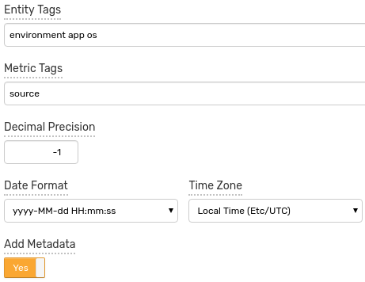
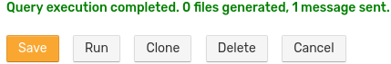
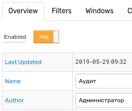
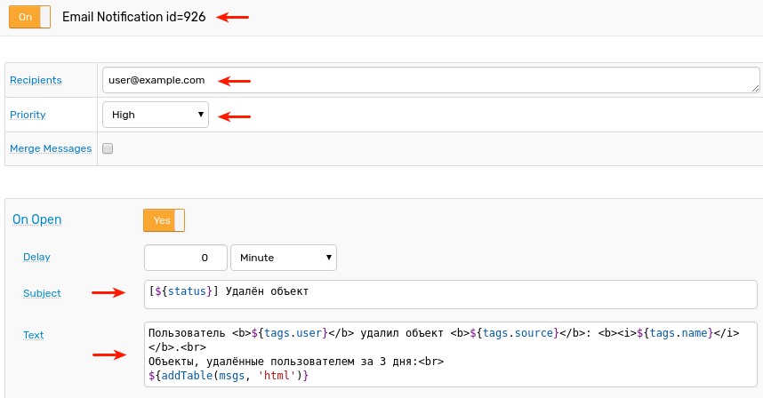

# Мониторинг Инфрастуктуры ИТ

## 3. Требования к функциональным, техническим и эксплуатационным характеристикам

### 3.1. Предоставление единой графической консоли для доступа к конфигурационным единицам

3.1.1) Возможность использования единой консоли для отображения, анализа и управления всей событийной информацией, поступающей от компонентов мониторинга сетевой инфраструктурой и серверного оборудования

Продукт: АС

> SR

3.1.2) Возможность представления в единой консоли совокупных, взаимосвязанных данных топологических представлений активного сетевого оборудования и  сервисно-ресурсной модели серверных платформ

Продукт: АС

> SR

3.1.3) Доступ к консоли на основе ролевой модели

Продукт: ATSD

> AV

* Пример из UI выдачи прав на просмотр пользовательской группе
* Портал, который представляет данные по разному в зависимости от  роли: `userHasRole`
* Портал, который представляет данные по разному в зависимости от  принадлежности к заданной группе: `userInGroup`
* Портал в режиме гостевого доступа

3.1.4) Возможность категоризации событийной информации по типу

> to be clarified

3.1.5) Возможность отображания и градации состояния элементов ИТ-инфраструктуры в терминах, обобщающих низкоуровневые события

> to be clarified

3.1.6) Возможность отображения зависимых друг от друга сообщений (отображение причинно-следственной связи на уровне событий)

> to be clarified

3.1.7) Возможность просмотра графиков производительности по контексту

Продукт: ATSD

> AV

* Открытие графика из строки таблицы, например загрузка ЦПУ несколькими серверами и график открывает историю.
* Открытие порталов для сущности из консоли алертов
* Обновление виджета по нажатию. Должно быть сделать в портале Докера.
* Открыть график по ссылке из email alert

3.1.8) Возможность отображения на одном графике данных от нескольких источников для возможности сопоставления и оценки работы объектов мониторинга

Продукт: АТСД

> AV

* График с двумя осями: CPU server и Java GC %
* График с двумя осями: nginx request count (latency), сеть (байты), и ЦПУ
* Календарь с несколькими серверами - при этом ЦПУ с scollector (linux) и SCOM windows

3.1.9) Возможность гибкой настройки оповещений ответственных в соответствии с их зонами ответственности и событиями, приходящими от подсистем системы мониторинга

Продукт: АТСД

> AR

* Условные выражения для отправки почты на разные адреса в зависисмости от критичности события и от времени суток
* Отмена уведомлений по расписанию с использованием cancelAction
* Отправка уведомления на группу пользователей
* Отправка уведомления собственнику системы (указан email в тэге owner сущности)
* Отправка уведомления подвыборке подписанных пользовалей - по ключевым словам. В данном примере лучше взять messages - чтобы пользователи могли указать type/source где-то в настройках

3.1.10) Сбор данных о метриках функционирования серверного оборудования и рабочих станций (степень утилизации, загрузка CPU, RAM, HDD)

Продукт: АТСД

> IS

* Таблица с типом ОС (windows, linux, aix) и поддерживаемые агенты со ссылками: scollector, tcollector, nmon, и т.д.
* Пример entity view, портала и списки собираемых метрик

3.1.11) Сбор данных о метриках функционирования сетевого оборудования (сетевая доступность конфигурационных единиц, степень утлизация каналов связи)

Продукт: АТСД

> IS

* SNMP задача:
  * Список собираемых метрик для базового файла MIB
  * Список MIB файлов
  * SNMP портал с доступностью и утилизация

3.1.12) Сбор данных о метриках функционирования приложений (статусы\состояния)

Продукт: АТСД

> IS

* Список API, с которых поддерживается сбор данных: JMX, JSON, JDBC, file, Java.
* Таблица примеров со ссылками на порталы/чарлабы для Tomcat, SpringBoot, Marathon, Kafka, ATSD, и пр.

3.1.13) Пользовательская настройка правил мониторинга (пороговых значений и логики проверки) метрик на серверных платформах

Продукт: АТСД

> AR

* Таблица с примерами выражений (condition) и кратким описанием - от простых правил к сложным
* Пример извлечения порога из тэга сущности, из replacement table
* Пример с таблицей Overrides, где приведены разные значения для разных рядов
* Пример с авто-порогами используя SSA

3.1.14) Возможность расчета эталонных значений отслеживаемых метрик на основе статистической информации за определенный исторический период

Продукт: АТСД

> MZ

* Портал/chartlab, на котором можно посмотреть значения за текущий день и усредненные baselines, рассчитаные для этого дня
* Портал/chartlab, на котором можно посмотреть средние значения за несколько недель и усредненные baselines, рассчитаные для этого же промежутка
* Пример правила и алерта по почте, при отклонении среднего в окне от baseline для данного интервала

## 3.2. Наличие встроенных моделей, описывающих типовые приложения

3.2.1) Наличие встроенных моделей, описывающих наиболее популярные и известные промышленные приложения (таких как MS SQL, MS Exchange, MS Active Directory, Oracle, SAP, Oracle Application server, IIS)

Продукт: АС

> SR

3.2.2) Наличие встроенных типов конфигурационных элементов и связей между ними

Продукт: АТСД

> AV

* Диаграмма со структурой Docker tag templates
* Примеры из редактора с наследованием шаблонов (н-р контейнер наследует от docker base)
* Примеры настроек колонок типа Entity Link
* Примеры встроенных Entity Views для Докера, где демонстрируется группировка по полю, содержащему связанную сущность (group by tags.docker-host)

3.2.3) Возможность создания эталонных моделей

Продукт: АС

> AV

* Редактор entity tags

3.2.4) Возможность изменения и настройки отчетов

Продукт: АТСД

> AS

### Пример настроек [Export Job](https://axibase.com/docs/atsd/reporting/scheduled-exporting.html)

1. Перeйдите на страницу **Data > Export Jobs**, нажмите **Create**.

   
  
2. Установите периодичность запуска задачи, например, `каждый час`.

   
  
3. Укажите `entity`, `metric` и временной интервал экспортируемых данных.

   
   
4. **Дополнительно.** Укажите фильтр значений, например, задайте минимальный порог.

   

5. **Дополнительно.** Выберите аггрегирующую функцию и период аггрегации.

   
   
6. **Дополнительно.** Задайте настройки, связанные с форматом отчёта, например, выберите формат, тип сжатия или укажите аннотацию - текст, который будет добавлен в начало сгенерированного файла.

   
   
   Дополнительно можно указать следующие настройки:
   
      * **Entity Tags** - список тегов сущности, значения которых будут добавлены в отчёт как колонки
      * **Metric Tags** - список тегов метрики, значения которых будут добавлены в отчёт как колонки
      * **Decimal Precision** - количество знаков после запятой, `-1`- оставить значения без изменений
      * **Date Format** - формат даты
      * **Time Zone** - временная зона, которая будет применена к **Date Format**
      * **Add Metadata** - добавить метаданные в заголовок файла
      
        
  
7. Укажите список e-mail адресов или абсолютный путь к отчёту на файловой системе ATSD. Сохраните задачу.

   
  
8. Для проверки задачи, нажмите **Run**.

   
     
   
  

### Пример настроек [SQL Job](https://axibase.com/docs/atsd/sql/scheduled-sql.html#sql-scheduler)

1. Перeйдите на страницу **SQL > Scheduled Queries**, нажмите **Create**.

   
   
2. Установите периодичность запуска задачи, например, `каждый день в 02:00`.

   
   
3. Укажите SQL-запрос.

   
   
4. Выберите формат, укажите список e-mail адресов или абсолютный путь к отчёту на файловой системе ATSD.

   
   
   Дополнительно можно указать следующие настройки:
   
      * **Decimal Precision** - количество знаков после запятой, `-1`- оставить значения без изменений
      * **Add Metadata** - добавить метаданные в заголовок файла
      * **Send Empty Report** - отпрявлять e-mail, даже если SQl-запрос вернул пустой результат
      * **Send Error Report** - отпрявлять e-mail, даже если SQl-запрос завершился с ошибкой
      * **Fail on No Data** - генерировать ошибку, если SQL-запрос не получил данные из таблицы `atsd_d`

5. **Дополнительно.** Установите ограничение на значения дат для сохраняемых серий.

   

6. **Дополнительно.** Укажите настройки публикации результатов.

    * **Guest Access** - предоставить анонимный доступ для неавторизованных пользователей
    * **Allow Refresh** - обновлять отчёт, если в запросе задан параметер `refresh=true`
    
   
   
7. Сохраните задачу.

   

8. Для проверки задачи, нажмите **Test**.

### Пример portal screenshot to Email, portal to Slack

1. Перeйдите на страницу **Alerts > Rules**, нажмите **New**.

   
   
2. Вкладка **Overview**: укажите имя нового правила.

   
   
   > Чтобы посмотреть описание всех настроек, используйте кнопку **Help** в верхнем правом углу вкладки.
   
   
   
3. Вкладка **Filters**: укажите метрику и сущность.
   
   
      
4. Вкладка **Condition**: укажите условие, на которое должно сработать правило, например, `value > 50`.
   
   
   
5. Вкладка **Email**: укажите получателей и настройте **On Open** триггер. Установите флаг **Series Chart**, чтобы отправлять скриншот с порталом, содержащим серии из текущего правила.
   
   > Предварительно нужно настроить [**Mail Client**](https://axibase.com/docs/atsd/administration/mail-client.html#mail-client).
      
   
   
6. Для проверки уведомления нажмите **Test**.

   
   
   
   
7. Вкладка **Webhooks**: выберите Webhook и настройте **On Open** триггер. Установите флаг **Series Chart**, чтобы отправлять скриншот с порталом, содержащим серии из текущего правила.
   
   > Предварительно нужно настроить [**Slack Webhook**](https://axibase.com/docs/atsd/rule-engine/notifications/slack.html#slack-notifications).
   
   
   
8. Для проверки уведомления нажмите **Test**.

   
   
   
   
9. Сохраните правило.

3.2.5) Возможностью создания правил корреляции с использованием графического интерфейса (без использования программирования), учитывая сервисно-ресурсную модель компонентов объекта мониторинга

Продукт: АТСД

> AR

* Пример правила с двумя метриками (value function)
* Пример правила с двумя метриками - загрузка ЦПУ контейнера и загрузка ЦПУ докер-хоста на котором контейнер исполяется
* Пример правила с двумя метриками - DB server db space usage (mysql, postgres, SQL server) and OS disk space

3.2.6) Возможность настройки динамической корелляции событийной информации на основе топологических данных о взаимосвязях элементов инфраструктуры

> to be clarified

Встроенные правила мониторинга серверных платформ с возможностью их изменения

> IS

* Примеры правил для CPU high, memory low, disk low для линукс
* Ссылки на примеры из коллектора где есть правила для импорта

### 3.3. Удаление, создание и изменение типов конфигурационных единиц

3.3.1) Возможность импорта сервисно-ресурсной модели из внешних источников (например, из базы данных конфигурационных единиц предприятия (CMDB))

Продукт: АС

> SR

3.3.2) Возможность в графическом режиме без использования программирования удалять, создавать и изменять типы конфигурационных единиц и собственные типы связей между конфигурационными элементами

Продукт: АТСД

> AV

* Пример tag templates и их назначения
* Пример entity views их применения к группам

3.3.3) Возможность удаления, создания и изменения связей между конфигурационными единицами и атрибутов конфигурационных единиц и связей

> to be clarified

3.3.4) Возможность ручного добавления/удаления/изменения экземпляров конфигурационных единиц

> IS

* Создание новой сущности #6249

## 4. Прочие требования к характеристикам

4.1) Аудит действий в подсистеме

Продукт: АТСД

> AS

### Список наблюдаемых объектов

* CSV Parsers
* Entity
* Entity View
* Export Job
* Forecast Jobs
* Named Collection
* Metric
* Portal
* Replacement Table
* Rule
* Series
* Scheduled SQL Queries
* User
* User Group

### Пример сообщения в лог при удалении

* Удаление **Series**

```js
2019-05-24 10:42:00,501;INFO;qtp2117132196-228;com.axibase.tsd.service.TimeSeriesDeleteServiceImpl;Starting series removal , series key 157:4,1=197,4=114
```

### Пример message при удалении

* Удаление **User Group**

  

* Удаление **Series**

  

#### Пример уведомления по почте

* Удаление **User Group**

  
  
##### Настройка правила

1. Перeйдите на страницу **Alerts > Rules**, нажмите **New**.

   
   
2. Вкладка **Overview**: укажите имя нового правила.

   
   
   > Чтобы посмотреть описание всех настроек, используйте кнопку **Help** в верхнем правом углу вкладки.
   
   
   
3. Вкладка **Filters**: в меню **Data Type** выберите **Message**, установите `Type = audit`, `Source = user_group`.
   
   
   
   Укажите **Filter Expression**: `tags.action == 'delete'`.
   
   
   
4. Вкладка **Condition**: укажите условие, на которое должно сработать правило, в данном случае `true`, чтобы правило срабатывало всегда.
   
   
   
5. Вкладка **Email**: укажите получателей и настройте **On Open** триггер. Установите флаг **Attach Details**, чтобы отправлять таблицу, содержащую детальную информацию о правиле.
   
   > Предварительно нужно настроить [**Mail Client**](https://axibase.com/docs/atsd/administration/mail-client.html#mail-client).
      
   
   
6. Для проверки уведомления нажмите **Test**.

    
   
7. Сохраните правило.

4.2) Возможность эскалации сообщений

Продукт: ATSD

> AR

* Пример правила, которое вызывает скрипт (opc_msg) для отправки алерта во внешнюю систему используя спец. программу (есть пример, делали с AV)
* Пример правила, которое дергает веб сервис для отправки алерта во внешнюю систему алертинга (AlarmPoint, PagerDuty - у нас должны быть примеры)

4.3) Возможность получения информации из сторонних систем мониторинга IT инфраструктуры и комплексов обеспечения информационной безопасности. (ArcSight ESM, IBM Tivoli, Nagios, HP NNMi, HP OneView, MS SCOM, VmWare vCenter, OmniVista)

Продукт: АС

> SR

4.4) Возможность доработки коннекторов для интеграции с промышленным оборудованием под нужды заказчика.

Продукт: АТСД

> IS

* Пример интеграции: запись данных из [OpenMuc](https://www.openmuc.org/openmuc/user-guide/#_build_a_simple_m_bus_data_logger) в удаленную ATSD как data logger. OpenMuc выпускается под GPL и поэтому не может быть встроен в Коллектор.