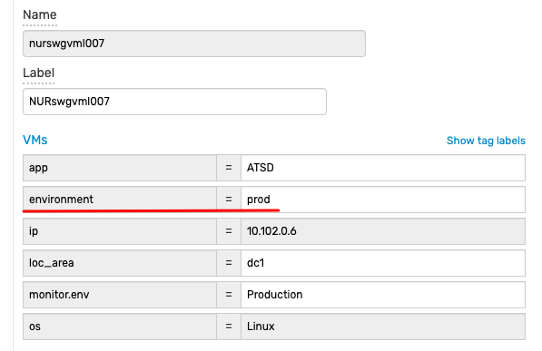
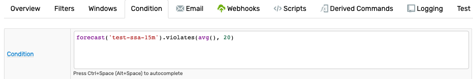
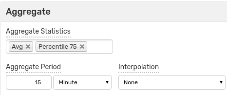
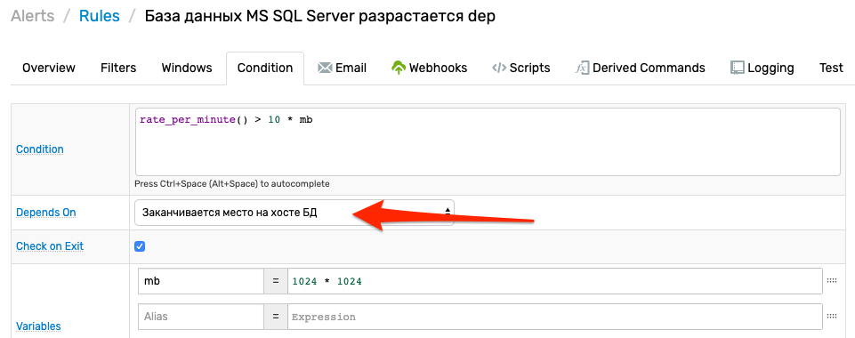
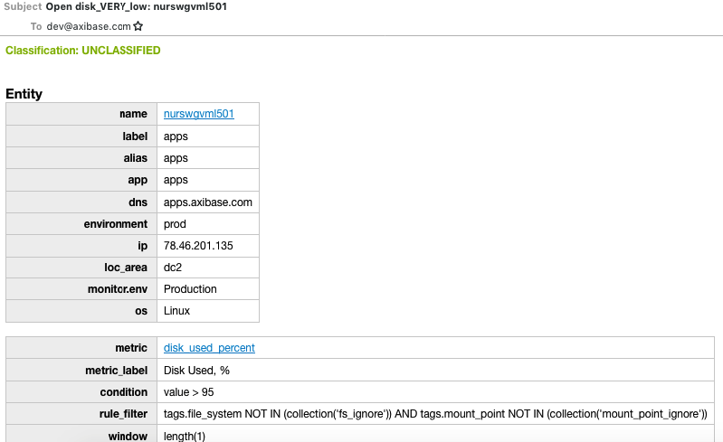
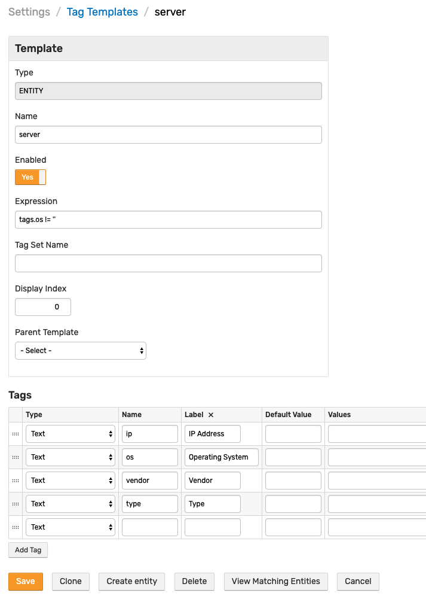
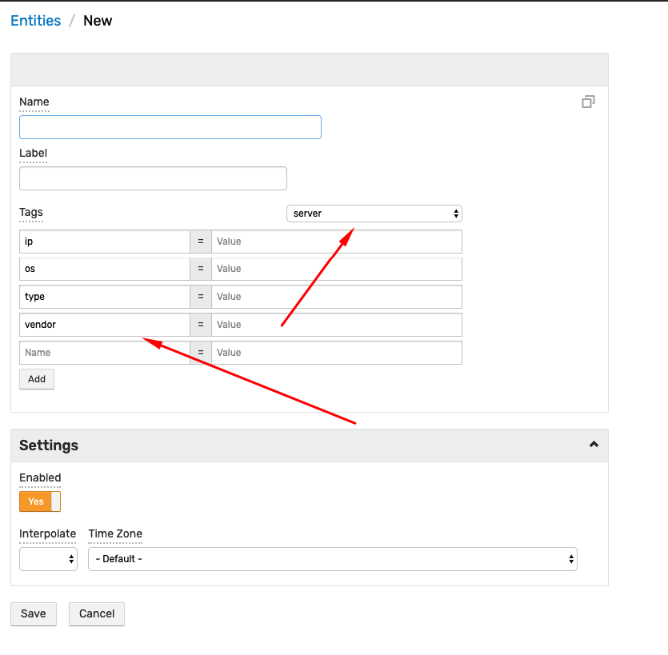
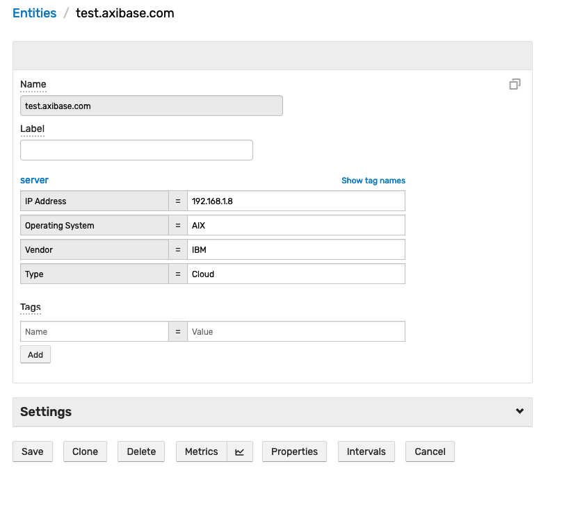
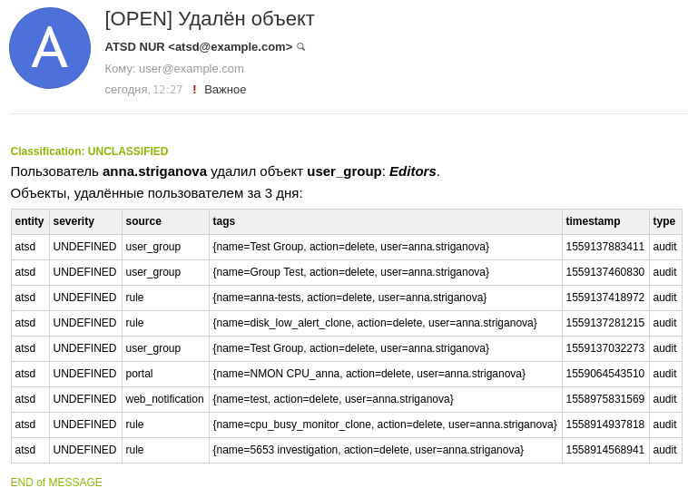

# Мониторинг Инфрастуктуры ИТ

## Содержание

* [3. Требования к функциональным, техническим и эксплуатационным характеристикам](#⇧-3-требования-к-функциональным-техническим-и-эксплуатационным-характеристикам)
  * [3.1. Предоставление единой графической консоли для доступа к конфигурационным единицам](#⇧-3-1-предоставление-единой-графической-консоли-для-доступа-к-конфигурационным-единицам)
    * [3.1.1 Возможность использования единой консоли для отображения, анализа и управления всей событийной информацией, поступающей от компонентов мониторинга сетевой инфраструктурой и серверного оборудования](#⇧-3-1-1-возможность-использования-единой-консоли-для-отображения-анализа-и-управления-всей-событийной-информацией-поступающей-от-компонентов-мониторинга-сетевой-инфраструктурой-и-серверного-оборудования)
    * [3.1.2 Возможность представления в единой консоли совокупных, взаимосвязанных данных топологических представлений активного сетевого оборудования и  сервисно-ресурсной модели серверных платформ](#⇧-3-1-2-возможность-представления-в-единой-консоли-совокупных-взаимосвязанных-данных-топологических-представлений-активного-сетевого-оборудования-и-сервисно-ресурсной-модели-серверных-платформ)
    * [3.1.3 Доступ к консоли на основе ролевой модели](#⇧-3-1-3-доступ-к-консоли-на-основе-ролевой-модели)
    * [3.1.4 Возможность категоризации событийной информации по типу](#⇧-3-1-4-возможность-категоризации-событийной-информации-по-типу)
    * [3.1.8 Возможность отображения на одном графике данных от нескольких источников для возможности сопоставления и оценки работы объектов мониторинга](#⇧-3-1-8-возможность-отображения-на-одном-графике-данных-от-нескольких-источников-для-возможности-сопоставления-и-оценки-работы-объектов-мониторинга)
    * [3.1.9 Возможность гибкой настройки оповещений ответственных в соответствии с их зонами ответственности и событиями, приходящими от подсистем системы мониторинга](#⇧-3-1-9-возможность-гибкой-настройки-оповещений-ответственных-в-соответствии-с-их-зонами-ответственности-и-событиями-приходящими-от-подсистем-системы-мониторинга)
    * [3.1.10 Сбор данных о метриках функционирования серверного оборудования и рабочих станций (степень утилизации, загрузка CPU, RAM, HDD)](#⇧-3-1-10-сбор-данных-о-метриках-функционирования-серверного-оборудования-и-рабочих-станций-степень-утилизации-загрузка-cpu-ram-hdd)
    * [3.1.11 Сбор данных о метриках функционирования сетевого оборудования (сетевая доступность конфигурационных единиц, степень утлизация каналов связи)](#⇧-3-1-11-сбор-данных-о-метриках-функционирования-сетевого-оборудования-сетевая-доступность-конфигурационных-единиц-степень-утлизация-каналов-связи)
    * [3.1.12 Сбор данных о метриках функционирования приложений (статусы\состояния)](#⇧-3-1-12-сбор-данных-о-метриках-функционирования-приложений-статусысостояния)
    * [3.1.13 Пользовательская настройка правил мониторинга (пороговых значений и логики проверки) метрик на серверных платформах](#⇧-3-1-13-пользовательская-настройка-правил-мониторинга-пороговых-значений-и-логики-проверки-метрик-на-серверных-платформах)
    * [3.1.14 Возможность расчета эталонных значений отслеживаемых метрик на основе статистической информации за определенный исторический период](#⇧-3-1-14-возможность-расчета-эталонных-значений-отслеживаемых-метрик-на-основе-статистической-информации-за-определенный-исторический-период)
  * [3.2. Наличие встроенных моделей, описывающих типовые приложения](#⇧-3-2-наличие-встроенных-моделей-описывающих-типовые-приложения)
    * [3.2.1 Наличие встроенных моделей, описывающих наиболее популярные и известные промышленные приложения (таких как MS SQL, MS Exchange, MS Active Directory, Oracle, SAP, Oracle Application server, IIS)](#⇧-3-2-1-наличие-встроенных-моделей-описывающих-наиболее-популярные-и-известные-промышленные-приложения-таких-как-ms-sql-ms-exchange-ms-active-directory-oracle-sap-oracle-application-server-iis)
    * [3.2.2 Наличие встроенных типов конфигурационных элементов и связей между ними](#⇧-3-2-2-наличие-встроенных-типов-конфигурационных-элементов-и-связей-между-ними)
    * [3.2.3 Возможность создания эталонных моделей](#⇧-3-2-3-возможность-создания-эталонных-моделей)
    * [3.2.4 Возможность изменения и настройки отчетов](#⇧-3-2-4-возможность-изменения-и-настройки-отчетов)
    * [3.2.5 Возможность создания правил корреляции с использованием графического интерфейса (без использования программирования), учитывая сервисно-ресурсную модель компонентов объекта мониторинга](#⇧-3-2-5-возможность-создания-правил-корреляции-с-использованием-графического-интерфейса-без-использования-программирования-учитывая-сервисно-ресурсную-модель-компонентов-объекта-мониторинга)
    * [3.2.6 Возможность настройки динамической корелляции событийной информации на основе топологических данных о взаимосвязях элементов инфраструктуры](#⇧-3-2-6-возможность-настройки-динамической-корелляции-событийной-информации-на-основе-топологических-данных-о-взаимосвязях-элементов-инфраструктуры)
  * [3.3. Удаление, создание и изменение типов конфигурационных единиц](#⇧-3-3-удаление-создание-и-изменение-типов-конфигурационных-единиц)
    * [3.3.1 Возможность импорта сервисно-ресурсной модели из внешних источников (например, из базы данных конфигурационных единиц предприятия (CMDB))](#⇧-3-3-1-возможность-импорта-сервисно-ресурсной-модели-из-внешних-источников-например-из-базы-данных-конфигурационных-единиц-предприятия-cmdb)
    * [3.3.2 Возможность в графическом режиме без использования программирования удалять, создавать и изменять типы конфигурационных единиц и собственные типы связей между конфигурационными элементами](#⇧-3-3-2-возможность-в-графическом-режиме-без-использования-программирования-удалять-создавать-и-изменять-типы-конфигурационных-единиц-и-собственные-типы-связей-между-конфигурационными-элементами)
    * [3.3.3 Возможность удаления, создания и изменения связей между конфигурационными единицами и атрибутов конфигурационных единиц и связей](#⇧-3-3-3-возможность-удаления-создания-и-изменения-связей-между-конфигурационными-единицами-и-атрибутов-конфигурационных-единиц-и-связей)
    * [3.3.4 Возможность ручного добавления/удаления/изменения экземпляров конфигурационных единиц](#⇧-3-3-4-возможность-ручного-добавления-удаления-изменения-экземпляров-конфигурационных-единиц)
* [4. Прочие требования к характеристикам](#⇧-4-прочие-требования-к-характеристикам)
  * [4.1 Аудит действий в подсистеме](#⇧-4-1-аудит-действий-в-подсистеме)
  * [4.2 Возможность эскалации сообщений](#⇧-4-2-возможность-эскалации-сообщений)
  * [4.3 Возможность получения информации из сторонних систем мониторинга IT инфраструктуры и комплексов обеспечения информационной безопасности. (ArcSight ESM, IBM Tivoli, Nagios, HP NNMi, HP OneView, MS SCOM, VmWare vCenter, OmniVista)](#⇧-4-3-возможность-получения-информации-из-сторонних-систем-мониторинга-it-инфраструктуры-и-комплексов-обеспечения-информационной-безопасности-arcsight-esm-ibm-tivoli-nagios-hp-nnmi-hp-oneview-ms-scom-vmware-vcenter-omnivista)
  * [4.4 Возможность доработки коннекторов для интеграции с промышленным оборудованием под нужды заказчика](#⇧-4-4-возможность-доработки-коннекторов-для-интеграции-с-промышленным-оборудованием-под-нужды-заказчика)

## [⇧](#содержание) 3. Требования к функциональным, техническим и эксплуатационным характеристикам

### [⇧](#содержание) 3.1. Предоставление единой графической консоли для доступа к конфигурационным единицам

#### [⇧](#содержание) 3.1.1) Возможность использования единой консоли для отображения, анализа и управления всей событийной информацией, поступающей от компонентов мониторинга сетевой инфраструктурой и серверного оборудования

* Аксибейс СитЦентр позволяет создать единую точку интеграции без копирования информации и, таким образом, построить единую систему отображения ("витрину") данных.
* [Пример консолидированной консоли](https://hbs.axibase.com/workspace/index-noc.htm): [конфигурация](https://hbs.axibase.com/dashboard/widgets.jsp?fileName=widgets_noc.config)
* Примеры клиентов представлены в файле `examples.pdf`.
* Консоли собираются из [виджетов](https://axibase.com/docs/charts/#widgets). Виджеты поддерживают подгрузку данных из разных источников.
* Переходы между консолями позволяют построить навигационную модель, соответствующую организационной роли пользователя.
* Поддерживается добавление кастомизированной оболочки на верхнем уровня навигации.


#### [⇧](#содержание) 3.1.2) Возможность представления в единой консоли совокупных, взаимосвязанных данных топологических представлений активного сетевого оборудования и сервисно-ресурсной модели серверных платформ

* Источники топологических представлений:
  * Встроенные механизмы построения моделей (примеры - WMQ, Hana, Docker)
  * Низлежащий инструмент (SCOM distributed apps)
  * Модель эскалации критичности, построенная в СитЦентре
  * Диаграмма Визио, созданная автоматически или вручную.


#### [⇧](#содержание) 3.1.3) Доступ к консоли на основе ролевой модели

СитЦентр


АТСД

* Пример из UI выдачи прав на просмотр пользовательской группе
* Портал, который представляет данные по разному в зависимости от  принадлежности к заданной группе: `userInGroup`
* Портал, который представляет данные по разному в зависимости от  роли: `userHasRole`

Функции, доступные в Freemarker-выражениях в портале: [`userHasRole`](https://axibase.com/docs/atsd/rule-engine/functions-security.html#userhasrole) и [`userInGroup`](https://axibase.com/docs/atsd/rule-engine/functions-security.html#useringroup)

[Группа пользователей](https://nur.axibase.com/admin/users/groups/edit.xhtml?group=demo-users)

Пример использования Freemarker-выражения для организации доступа к виджетам в портале

```ls
[configuration]
[group]

  # Виджет видем всем, кто имеет доступ к порталу
  [widget]
    type = pie
    title = Пространство на диске
    ...

# Ограничим доступ к сводному графику
<#if userHasRole("ROLE_ADMIN") || (userHasRole("ROLE_EDITOR") && userInGroup("demo-users"))>

[group]
  # Виджет видем только администраторам и редакторам из группы 'demo-users'
  [widget]
    type = bar
    title = Использование диска (по серверам)
    ...

</#if>
```

[Портал](https://nur.axibase.com/portal/256.xhtml)
([редактор](https://nur.axibase.com/portals/edit?id=256))


* Портал в режиме гостевого доступа

    [Портал](https://nur.axibase.com/portal/256.xhtml)
    ([редактор](https://nur.axibase.com/portals/edit?id=256))

#### [⇧](#содержание) 3.1.4) Возможность категоризации событийной информации по типу

> to be clarified

3.1.5) Возможность отображания и градации состояния элементов ИТ-инфраструктуры в терминах, обобщающих низкоуровневые события

> to be clarified

3.1.6) Возможность отображения зависимых друг от друга сообщений (отображение причинно-следственной связи на уровне событий)

> to be clarified

3.1.7) Возможность просмотра графиков производительности по контексту

Продукт: ATSD

> AV

* Открытие графика из строки таблицы, например, загрузка ЦПУ несколькими серверами - график открывает историю.

    [Мониторинг загрузки серверов](https://nur.axibase.com/portal/name/demo-table-sysmon)
    ([редактор](https://nur.axibase.com/portals/edit?id=261))

    

* Открытие порталов для сущности из консоли алертов.

    ```js
    format = value ? value + ' (<a href="/entities/' +encodeURIComponent(value)+'/metricsPortal">portal</a>)' : ''
    ```

    [Консоль событий ATSD](https://nur.axibase.com/portal/name/demo-entity-portal-from-table)
    ([редактор](https://nur.axibase.com/portals/edit?id=268))

    

* Обновление виджета по нажатию на сущность или при смене периода загрузки данных.

    [Портал scollector'а](https://nur.axibase.com/portal/name/demo-scollector-monitor)
    ([редактор](https://nur.axibase.com/portals/edit?id=274))

    

* Открыть график по ссылке из email alert

    Для доступа у порталу ряда, для которого сработало правило, можно использовать переменную
    [`chartLink`](https://axibase.com/docs/atsd/rule-engine/links.html#chartlink)

    [Уведомление о превышении порога загрузки ЦП](https://nur.axibase.com/rule/edit.xhtml?name=demo-rule-email#notifications_email)

    

#### [⇧](#содержание) 3.1.8) Возможность отображения на одном графике данных от нескольких источников для возможности сопоставления и оценки работы объектов мониторинга

Продукт: АТСД

> AV

* График с двумя осями: CPU server и Java GC %

    ```ls
    [widget]
        type = chart
        ...

        [series]
          axis = left
          metric = jvm_system_cpu_load

        [series]
          axis = right
          metric = gc_time_percent
    ```

    [Загрузка ЦП](https://nur.axibase.com/portal/name/demo-cpu-usage)
    ([редактор](https://nur.axibase.com/portals/edit?id=254))

    

* График с двумя осями: nginx request count (latency), сеть (байты), и ЦПУ

    ```ls
    [widget]
      ...  
      [series]
        entity = apps.axibase.com
        metric = nginx.server_requests
        statistics = counter # Метрика является накопительной

      [series]
        axis = right
        entity = nurswgvml501
        metric = cpu_busy
        statistic = max
    ```

    [Статус сервера NGINX](https://nur.axibase.com/portal/name/demo-server-status)
    ([редактор](https://nur.axibase.com/portals/edit?id=263))

    

* Календарь с несколькими серверами - при этом ЦПУ с scollector (linux) и SCOM windows

    ```ls
    csv cpu_usage =
      os,group,metric
      Windows,scom-servers,scom.server.processor_information.%_processor_time
      Linux,nmon-linux,cpu_busy
    endcsv

    [group]
      [widget]
        type = calendar
        summarize-statistic = percentile(95)
        summarize-period = 1 day
        ...
      for cpu_info in cpu_usage
        [series]
          entity-group = @{cpu_info.group}
          metric = @{cpu_info.metric}
      endfor
    ```

    [Загрузка ЦП по серверам](https://nur.axibase.com/portal/name/demo-cpu-calendar)
    ([редактор](https://nur.axibase.com/portals/edit?id=255))

    

#### [⇧](#содержание) 3.1.9) Возможность гибкой настройки оповещений ответственных в соответствии с их зонами ответственности и событиями, приходящими от подсистем системы мониторинга

Продукт: АТСД

> AR

Список используемых правил


Настройка адресата Email уведомления


* Задание адресатов уведомлений списком

<!-- markdownlint-disable MD104 -->

```javascript
user1@example.org,user2@example.org,user3@example.org
```

<!-- markdownlint-enable MD104 -->

* Условные выражения для отправки уведомлений на разные адреса в зависисмости от критичности события и от времени суток

<!-- markdownlint-disable MD104 -->

```javascript
@if{now.timeOfDay BETWEEN '08:00' AND '20:00'}
daywatch@example.org
@else{}
nightwatch@example.org
@end{}
@if{tags.error_code = 'ORA-12317'}
dba@example.org
@end{}
```

<!-- markdownlint-enable MD104 -->

* Отмена уведомлений по расписанию с использованием `cancelAction`

```javascript
@if{NOT now.timeOfDay BETWEEN '08:00' AND '20:00'}
${cancelAction()}
@end{}
```

* Отправка уведомления группе пользователей


Функция вернёт список известных адресов всех членов запрашиваемой группы: `jack.smith@example.org,mary.jones@example.org,john.doe@example.org`

```javascript
${get_group_emails('DevOps')}
```

* Отправка уведомления ответственному за систему (указан email в тэге `owner` сущности). Если тэг не указан, получатель – `dev-atsd@axibase.com`.


```javascript
${ifEmpty(entity.tags.owner, 'dev-atsd@axibase.com')}
```

* Отправка уведомления подвыборке подписанных пользовалей - по ключевым словам.

В ATSD пользователи могут в настройках счёта самостоятельно задавать события, уведомления о которых они хотели бы получать.


Полный перечень доступных событий создаётся администратором и содержится в служебной таблице `$topics`. Ключом является идентификатор события, значением – его описание.


Функция `subscribers` в **Rule Engine** принимает один или несколько ключей и возвращает email адреса всех пользователей, имеющих хотя бы один ключ в списке тем.

В данном примере уведомления отправляются в ответ на все входящие сообщения пользователям, которые подписаны на сообщения с данным типом.

```javascript
${subscribers(type)}
```

[Пример правила](https://nur.axibase.com/rule/edit.xhtml?name=Message+Audit#notifications_email)

#### [⇧](#содержание) 3.1.10) Сбор данных о метриках функционирования серверного оборудования и рабочих станций (степень утилизации, загрузка CPU, RAM, HDD)

| Агент | Поддерживаемые ОС | Собираемые метрики | Порталы |
|---|---|---|---|
| [collectd](https://axibase.com/docs/atsd/integration/collectd/) | `Ubuntu`, `Centos`, `RHEL` |  [↗](https://axibase.com/docs/atsd/integration/collectd/#collected-metrics) | [Linux](https://nur.axibase.com/portal/tabs?entity=nurswghbs001&id=38&id=112&id=113&id=2&id=45&id=24)  |
| [scollector](https://axibase.com/docs/atsd/integration/scollector/) | `Linux`, `Windows` `MacOS` | [↗](https://axibase.com/docs/atsd/integration/scollector/#collected-metrics) | [Linux](https://nur.axibase.com/portal/name/scollector%20-%20Linux?entity=nurswghbs001)  <br>[Microsoft Windows Server](https://nur.axibase.com/portal/tabs?entity=nurswgvmw015&id=44&id=30)  |
| [tcollector](https://axibase.com/docs/atsd/integration/tcollector/) | `Linux` | [↗](https://axibase.com/docs/atsd/integration/tcollector/#list-of-tcollector-metrics) | [Linux](https://nur.axibase.com/portal/name/tcollector%20-%20Linux?entity=nurswghbs001)  |
| [nmon](https://axibase.com/docs/atsd/integration/nmon/) | `Linux`, `AIX` | [↗](https://axibase.com/docs/atsd/integration/tcollector/#list-of-tcollector-metrics) | [Linux](https://nur.axibase.com/portal/name/Linux%20nmon?entity=nurswghbs001)  <br> [AIX](https://nur.axibase.com/portal/name/AIX%20nmon?entity=aix03) |

#### [⇧](#содержание) 3.1.11) Сбор данных о метриках функционирования сетевого оборудования (сетевая доступность конфигурационных единиц, степень утлизация каналов связи)

Продукт: АТСД

* [SNMP](https://axibase.com/docs/axibase-collector/jobs/snmp.html) задача
  
  * [Список](https://axibase.com/docs/axibase-collector/jobs/snmp.html#snmp-object-reference) собираемых метрик для базового файла MIB

    

  * [Список MIB файлов](https://axibase.com/docs/axibase-collector/jobs/snmp.html#base-mib-files)

    
  
  * [SNMP портал](https://nur.axibase.com/portal/197.xhtml?entity=nur.axibase.com) с доступностью и утилизация

    

#### [⇧](#содержание) 3.1.12) Сбор данных о метриках функционирования приложений (статусы\состояния)

* Поддерживаемые источники данных

  * **Сетевые протоколы и протоколы передачи данных**
    * JDBC
    * SNMP
    * JMX
    * ICMP
    * TCP
    * HTTP
    * MQTT

  * **Файловые форматы**
    * CSV
    * TSV
    * Text
    * JSON

  * **APIs**
    * Kafka
    * Amazon Web Services CloudWatch
    * Docker Engine
    * HP OVPM (Performance Manager)

* Примеры

| Продукт                                                                                          | Источник данных | Портал                                                                                                                                       |
| ------------------------------------------------------------------------------------------------ | --------------- | -------------------------------------------------------------------------------------------------------------------------------------------- |
| [JVM](https://axibase.com/docs/axibase-collector/jobs/examples/jvm/)                             | JMX             |  [↗](https://apps.axibase.com/chartlab/e6911d9d)                                                      |
| [ActiveMQ](https://axibase.com/docs/axibase-collector/jobs/examples/activemq/)                   | JMX             | [↗](https://apps.axibase.com/chartlab/2f11a5ef)                                                  |
| [Docker](https://axibase.com/docs/axibase-collector/jobs/docker.html)                            | Docker          |  [↗](https://nur.axibase.com/portal/tabs?entity=nurswghbs001&id=112&id=38&id=113&id=2&id=45&id=24) |
| [NGINX](https://axibase.com/docs/axibase-collector/jobs/examples/nginx/)                         | File            |  [↗](https://apps.axibase.com/chartlab/966f33e4)                                                    |
| [Tomcat](https://axibase.com/docs/axibase-collector/jobs/examples/tomcat/)                       | JMX             |  [↗](https://apps.axibase.com/chartlab/106bddba)                                                   |
| [Oracle EM](https://axibase.com/docs/axibase-collector/jobs/examples/oracle-enterprise-manager/) | JDBC            |  [↗](https://apps.axibase.com/chartlab/8c86c962)                                                   |
| [PostgreSQL](https://axibase.com/docs/axibase-collector/jobs/examples/postgres/)                 | JDBC            |  [↗](https://apps.axibase.com/chartlab/070b4941)                                                 |
| [Marathon](https://axibase.com/use-cases/integrations/marathon/capacity-and-usage/)              | JSON            |  [↗](https://apps.axibase.com/chartlab/5e5d7c72)                                                     |
| [Kafka](https://axibase.com/use-cases/integrations/kafka/)                                       | Kafka           |  [↗](https://apps.axibase.com/chartlab/27ac1d9d)                                                    |
| [VMWare](https://axibase.com/docs/axibase-collector/jobs/examples/vmware/)                       | JDBC            |  [↗](https://apps.axibase.com/chartlab/36ae5c9e/3/)                                                |
| [Spring Boot](https://axibase.com/docs/atsd/integration/spring-boot/#spring-boot)                | Storage Driver  |  [↗](https://apps.axibase.com/chartlab/5525c0dc/4/)                                            |

#### [⇧](#содержание) 3.1.13) Пользовательская настройка правил мониторинга (пороговых значений и логики проверки) метрик на серверных платформах

Продукт: АТСД

> AR

* Примеры выражений (condition) и краткое описание - от простых правил к сложным

  * Безусловное срабатывание правила

      ```javascript
      true
      ```

      [Правило: Обработка вебхуков Travis](https://nur.axibase.com/rule/edit.xhtml?name=travis-ci-build-status)

  * Проверка поступления данных в течение периода длительности окна

      ```javascript
      count() == 0
      ```

      [Правило: Проверка поступления данных с докер хоста](https://nur.axibase.com/rule/edit.xhtml?name=docker-job-no-messages)

  * Значение превышает заданный порог (95)

      ```javascript
      value > 95
      ```

      [Правило: Проверка места на диске](https://nur.axibase.com/rule/edit.xhtml?name=disk_VERY_low)

  * Значение превышает 95 или среднее всех значений в окне превышает 85

      ```javascript
      value > OR avg() > 85
       ```

      [Документация по агрегационным функциям](https://axibase.com/docs/atsd/rule-engine/functions.html#statistical)

      [Правило: Потребление оперативной памяти](https://nur.axibase.com/rule/edit.xhtml?name=JVM%20memory%20low)

  * Скорость роста значения превышает порог (10)

      ```javascript
      rate_per_minute() > 10
      ```

      [Правило: Анализ сборки мусора JVM](https://nur.axibase.com/rule/edit.xhtml?name=jvm_garbage_collection_rate)

  * Значение в окне отличается от предсказанного

      ```javascript
      forecast('forecast_name').violates(avg(), 20)
      ```

      [Правило: Предсказание занятости процессора](https://nur.axibase.com/rule/edit.xhtml?name=cpu_busy_forecast_ssa_15m)

  * Срабатывает, если предсказанное заполнение диска наступит ранее, чем через два часа

      ```javascript
      threshold_linear_time(99) < 120
      ```

      [Правило: Предсказание времени, когда закончится место на диске](https://nur.axibase.com/rule/edit.xhtml?name=disk_threshold#condition_overrides)

  * Продвинутая фильтрация по календарю рабочих дней

      ```javascript
      now.is_workday() AND NOT now.add(1, 'day').is_workday()
      ```

      [Правило: Заказ пиццы в последний рабочий день на неделе](https://nur.axibase.com/rule/edit.xhtml?name=Pizza%20Time)

* Пример извлечения порога из тэга сущности

  

  ```javascript
  value > 0.9 * entity.tags.memory_limit
  ```

* Пример извлечения порога из replacement table

  
  
  [Таблица порогов](https://nur.axibase.com/replacement-tables/docker_env_thresholds)
  
  

  ```javascript
  value > lookup('docker_env_thresholds', entity.tags.environment)
  ```

* Пример с таблицей Overrides, где приведены разные значения для разных рядов

  

  [Правило](https://nur.axibase.com/rule/edit.xhtml?name=Disk%20Size%20Thresholds#condition_overrides)

* Пример с авто-порогами используя SSA

  Функция [forecast](https://axibase.com/docs/atsd/rule-engine/functions-forecast.html#forecast) возвращает объект, содержащий предсказанные значение и время, который можно использовать для проверки соответствия прогнозируемого значения реальному, при помощи метода `violates(value, delta)`
  Для работы функций необходимо заранее создать хранимый Forecast и задать ему имя.

  
  

  [Forecast](https://nur.axibase.com/forecast/settings/edit.xhtml?settingsKey=144)

  [Пример использования](https://nur.axibase.com/rule/edit.xhtml?name=cpu_busy_forecast_ssa_15m_level20#condition_overrides)
  
  
  

#### [⇧](#содержание) 3.1.14) Возможность расчета эталонных значений отслеживаемых метрик на основе статистической информации за определенный исторический период

Продукт: АТСД

Для расчета эталонного значения метрики можно воспользоваться функцией `baseline`
доступной в редакторе правил **Rule Engine**, при построении графиков в **Charts**
и при отправлении запросов на метрики в АТСД.

Функция `baseline` рассчитывает эталонное значение аггрегируя значения метрики с определенным периодом.

Например, чтобы рассчитать значение функции `baseline` в 3 часа дня на основании данных за предшествующие 2 дня,
и с периодом в 1 день надо пременить аггрегирующую функцию к значениям которые имела метрика в 3 часа дня вчера и
позавчера. Если в качестве аггрегирующей функции взять среднее арифметическое, то получаем такой пример:

| Время | вчера  | позавчера | среднее |
|-------|--------|-----------|---------|
| 15:00 |   3.8  |   8.2     |    6.0  |
| 18:00 |   4.6  |   5.8     |    5.2  |

Графический [пример](https://apps.axibase.com/chartlab/ded4adaf/4/#fullscreen) поясняющий вычисление функции `baseline`.

В [примере](https://apps.axibase.com/chartlab/26b23ab6/6/#fullscreen) приведен график текущих значений метрики и `baseline` график, рассчитаный по предшествующим 5 дням.

В **Rule Engine** функцию `baseline` можно использовать в условии срабатывания правила.
Например так:

```javascript
avg("30 minute") > baseline("avg", "1 day", "30 minute")
```

Здесь `avg("30 minute")` есть среднее арифметическое значений за последние 30 минут в окне.
Величина `baseline("avg", "1 day", "30 minute")` вычисляется следующим образом.
Разбиваем окно на 30 минутные интервалы, начиная с конца окна.
Выбираем последовательность интервалов с периодом 1 день, начиная с последнего интервала.
Вычисляем среднее арифметическое всех значений метрики, попавших в выбранные интервалы.

[Пример](https://nur.axibase.com/rule/edit.xhtml?name=baseline+example#condition_overrides) правила срабатывающего при отклонении среднего значения в окне от значения расчитанного функцией `baseline`.
При срабатывании правила на почту приходит следующее сообщение.


### [⇧](#содержание) 3.2. Наличие встроенных моделей, описывающих типовые приложения

#### [⇧](#содержание) 3.2.1) Наличие встроенных моделей, описывающих наиболее популярные и известные промышленные приложения (таких как MS SQL, MS Exchange, MS Active Directory, Oracle, SAP, Oracle Application server, IIS)

* Задача `om_dstr_app_topology` для автоматического построения представлений распределенных приложений из топологии SCOM
* Задача `mq_topology` для автоматического построения транспортной схемы WebSphere MQ: менеджеры, очереди, каналы.

  

* Встроенная кластерная топология для [SAP HANA](https://axibase.com/products/axibase-enterprise-reporter/axibase-enterprise-reporter-for-sap-hana/)

  

* Встроенный stack для микро-сервисов на основе ресурсной модели контейнеров [Docker](https://nur.axibase.com/portal/tabs?entity=nurswghbs001&id=112&id=113)

  

#### [⇧](#содержание) 3.2.2) Наличие встроенных типов конфигурационных элементов и связей между ними

Продукт: АТСД

> AV

* Диаграмма со структурой Docker tag templates

  

* Примеры из редактора с наследованием шаблонов (н-р контейнер наследует от docker base)

  [Docker Container](https://nur.axibase.com/tags/templates/edit.xhtml?tagTemplateId=12)

  

* Примеры настроек колонок типа Entity Link

  [Docker Container](https://nur.axibase.com/tags/templates/edit.xhtml?tagTemplateId=12)

  

* Примеры встроенных Entity Views для Докера, где демонстрируется группировка по полю, содержащему связанную сущность (group by tags.docker-host)

  [Docker Network](https://nur.axibase.com/entities/views/7.xhtml)
  ([редактор](https://nur.axibase.com/entities/views/edit.xhtml?entityViewId=7))

  

#### [⇧](#содержание) 3.2.3) Возможность создания эталонных моделей

Продукт: АС

> AV

* Редактор entity tags

При создании сущностей можно выбрать шаблон для предварительного заполнения тегов


При редактировании сущностей доступны сгруппированные по имени шаблона теги, если шаблон применяется к данной сущности.


Возможно создание нового шаблона из текущего набора тегов


#### [⇧](#содержание) 3.2.4) Возможность изменения и настройки отчетов

Продукт: АТСД

> AS

* **Пример настроек [Export Job](https://axibase.com/docs/atsd/reporting/scheduled-exporting.html)**

> [Задача: Загрузка CPU](https://nur.axibase.com/export/jobs/job.xhtml?jobId=54).
>
> [Скачать](./resources/export-jobs.xml) конфигурацию.

1. Перeйдите на страницу **Data > Export Jobs**, нажмите **Create**.

    
  
2. Установите периодичность запуска задачи, например, `каждый час`.

    
  
3. Укажите `entity`, `metric` и временной интервал экспортируемых данных.

    

4. **Дополнительно.** <details><summary>Укажите фильтр значений</summary>

    Например, задайте минимальный порог.

    

    </details>

5. **Дополнительно.** <details><summary>Аггрегация</summary>

    Выберите аггрегирующую функцию, период аггрегации и метод интерполяции.

    

    </details>

6. **Дополнительно.**<details><summary>Задайте настройки, связанные с форматом отчёта</summary>

    Например, выберите формат, тип сжатия или укажите аннотацию - текст, который будет добавлен в начало сгенерированного файла.

    

    Кроме того, можно указать следующие настройки:

    

    * **Entity Tags** - список тегов сущности, значения которых будут добавлены в отчёт как колонки
    * **Metric Tags** - список тегов метрики, значения которых будут добавлены в отчёт как колонки
    * **Decimal Precision** - количество знаков после запятой, `-1`- оставить значения без изменений
    * **Date Format** - формат даты
    * **Time Zone** - временная зона, которая будет применена к **Date Format**
    * **Add Metadata** - добавить метаданные в заголовок файла

    </details>

7. Укажите список e-mail адресов и тему письма или абсолютный путь к отчёту на файловой системе ATSD.

    

    Абсолютный путь и тема письма могут содержать следующие плэйсхолдеры:

    * `${entity}`
    * `${entity.tagName}`
    * `${metric}`
    * `${metric.tagName}`
    * `${yyyy-MM-dd}`
    * `${yyyy/MM/dd}`
    * `${yyyy-MM-dd-HH-mm-ss.SSS}`

    Сохраните задачу.
  
8. Для проверки задачи, нажмите **Run**.

    

    

    [Посмотреть](./resources/export-job-54.csv) cодержимое файла.

* ***Пример настроек [SQL Job](https://axibase.com/docs/atsd/sql/scheduled-sql.html#sql-scheduler)***

> [Задача: Ежедневное использование CPU](https://nur.axibase.com/export/queries/query.xhtml?queryId=126).
>
> [Скачать](./resources/export-queries.xml) конфигурацию.

1. Перейдите на страницу **SQL > Scheduled Queries**, нажмите **Create**.

    

2. Установите периодичность запуска задачи, например, `каждый день в 02:00`.

    

3. Укажите SQL-запрос.

    

4. Выберите формат и укажите список e-mail адресов и тему письма или абсолютный путь к отчёту на файловой системе ATSD.

    

    Абсолютный путь и тема письма могут содержать следующие плэйсхолдеры:

    * `${entity}`
    * `${entity.tagName}`
    * `${metric}`
    * `${metric.tagName}`
    * `${yyyy-MM-dd}`
    * `${yyyy/MM/dd}`
    * `${yyyy-MM-dd-HH-mm-ss.SSS}`

    Кроме того, можно указать дополнительные настройки:
    <details><summary>смотреть</summary>

      * **Decimal Precision** - количество знаков после запятой, `-1`- оставить значения без изменений
      * **Add Metadata** - добавить метаданные в заголовок файла
      * **Send Empty Report** - отпрявлять e-mail, даже если SQL-запрос вернул пустой результат
      * **Send Error Report** - отпрявлять e-mail, даже если SQL-запрос завершился с ошибкой
      * **Fail on No Data** - генерировать ошибку, если SQL-запрос не получил данные из таблицы `atsd_d`

    </details>

5. **Дополнительно.**<details><summary>Установите ограничение на значения дат для сохраняемых серий</summary>

    

    Подробнее об опции **Store** [здесь](https://axibase.com/docs/atsd/sql/scheduled-sql-store.html#sql-scheduled-store).

    </details>

6. **Дополнительно.**<details><summary>Укажите настройки публикации результатов</summary>

    * **Guest Access** - предоставить анонимный доступ для неавторизованных пользователей
    * **Allow Refresh** - обновлять отчёт, если в запросе задан параметер `refresh=true`

    

    </details>

7. Сохраните задачу.

    

8. Для проверки задачи, нажмите **Test**.

    

    Опубликованный отчёт [здесь](https://nur.axibase.com/sqla/126.html).

* **Пример portal screenshot to Email, portal to Slack**

> [Правило: Высокая загрузка CPU](https://nur.axibase.com/rule/edit.xhtml?name=%D0%92%D1%8B%D1%81%D0%BE%D0%BA%D0%B0%D1%8F%20%D0%B7%D0%B0%D0%B3%D1%80%D1%83%D0%B7%D0%BA%D0%B0%20CPU#overview).
>
> [Скачать](./resources/rule_1.xml) конфигурацию.

1. Перейдите на страницу **Alerts > Rules**, нажмите **New**.

    

2. Вкладка **Overview**: укажите имя нового правила.

    

    > Чтобы посмотреть описание всех настроек, используйте кнопку **Help** в верхнем правом углу вкладки.
    >
    > 

3. Вкладка **Filters**: укажите метрику и сущность.

    

4. Вкладка **Condition**: укажите условие, на которое должно сработать правило, например, `value > 50`.

    

5. Вкладка **Email**: укажите получателей и настройте **On Open** триггер. Установите флаг **Series Chart**, чтобы отправлять скриншот с порталом, содержащим серии из текущего правила.

    > Предварительно нужно настроить [**Mail Client**](https://axibase.com/docs/atsd/administration/mail-client.html#mail-client).

    

6. Для проверки уведомления нажмите **Test**.

    

    

7. Вкладка **Webhooks**: выберите Webhook и настройте **On Open** триггер. Установите флаг **Series Chart**, чтобы отправлять скриншот с порталом, содержащим серии из текущего правила.

    > Предварительно нужно настроить [**Slack Webhook**](https://axibase.com/docs/atsd/rule-engine/notifications/slack.html#slack-notifications).

    

8. Для проверки уведомления нажмите **Test**.

    

    

9. Сохраните правило.

#### [⇧](#содержание) 3.2.5) Возможность создания правил корреляции с использованием графического интерфейса (без использования программирования), учитывая сервисно-ресурсную модель компонентов объекта мониторинга

Продукт: АТСД

> AR

* Пример правила с двумя метриками (Dependent Rule): [Общее занятое пространство на диске, занятое пространство под таблицы MS SQL Server](https://nur.axibase.com/rule/edit.xhtml?name=%D0%91%D0%B0%D0%B7%D0%B0+%D0%B4%D0%B0%D0%BD%D0%BD%D1%8B%D1%85+MS+SQL+Server+%D1%80%D0%B0%D0%B7%D1%80%D0%B0%D1%81%D1%82%D0%B0%D0%B5%D1%82%D1%81%D1%8F+dep#condition_overrides)
  
    Dependent Rule – правило, окно в котором должно находиться в состоянии OPEN, чтобы сработало основное правило.
  
    [Вспомогательное правило](https://nur.axibase.com/rule/edit.xhtml?name=%D0%97%D0%B0%D0%BA%D0%B0%D0%BD%D1%87%D0%B8%D0%B2%D0%B0%D0%B5%D1%82%D1%81%D1%8F%20%D0%BC%D0%B5%D1%81%D1%82%D0%BE%20%D0%BD%D0%B0%20%D1%85%D0%BE%D1%81%D1%82%D0%B5%20%D0%91%D0%94#condition_overrides): срабатывает, если на диске меньше 25% свободного места
  
    

    Основное правило

    
    
    

  * Пример правила с двумя метриками (Доступ к данным стороннего окна независимо от его состояния): [Общее занятое пространство на диске, занятое пространство под таблицы MS SQL Server](https://nur.axibase.com/rule/edit.xhtml?name=%D0%91%D0%B0%D0%B7%D0%B0+%D0%B4%D0%B0%D0%BD%D0%BD%D1%8B%D1%85+MS+SQL+Server+%D1%80%D0%B0%D0%B7%D1%80%D0%B0%D1%81%D1%82%D0%B0%D0%B5%D1%82%D1%81%D1%8F)
  
    
    
    

  * Пример правила с двумя метриками (value function): [Проверка истечения SSL сертификатов](https://nur.axibase.com/rule/edit.xhtml?name=ssl-certificates-expiration)

    ```javascript
    value < expiration_limit AND value('http.ssl_certificate_status') != 5
    ```

  * Пример правила с двумя метриками: [Загрузка ЦПУ контейнера и загрузка ЦПУ докер-хоста, на котором контейнер исполяется](https://nur.axibase.com/rule/edit.xhtml?name=%D0%97%D0%B0%D0%B3%D1%80%D1%83%D0%B7%D0%BA%D0%B0%20%20CPU%20%D0%BA%D0%BE%D0%BD%D1%82%D0%B5%D0%B9%D0%BD%D0%B5%D1%80%D0%B0#condition_overrides)
  
    
    
    

#### [⇧](#содержание) 3.2.6) Возможность настройки динамической корелляции событийной информации на основе топологических данных о взаимосвязях элементов инфраструктуры

> to be clarified

Встроенные правила мониторинга серверных платформ с возможностью их изменения

* Примеры правил для CPU high, memory low, disk low для линукс

| Правило | Пример оповещения |
| --- | --- |
| [Высокая загрузка CPU](https://nur.axibase.com/rule/edit.xhtml?name=%D0%92%D1%8B%D1%81%D0%BE%D0%BA%D0%B0%D1%8F%20%D0%B7%D0%B0%D0%B3%D1%80%D1%83%D0%B7%D0%BA%D0%B0%20CPU#overview) | |
| [Мало места на диске](https://nur.axibase.com/rule/edit.xhtml?name=atsd_disk_low#condition_overrides) |  |
| [Оперативная память заканчивается](https://nur.axibase.com/rule/edit.xhtml?name=atsd.jvm.low_memory#condition_overrides) |  |

* Ссылки на примеры из коллектора где есть правила для импорта
  * [JVM Rules](https://axibase.com/docs/axibase-collector/jobs/examples/jvm/#rules)
  * [ActiveMQ Rules](https://axibase.com/docs/axibase-collector/jobs/examples/activemq/#rules)
  * [Nginx Rules](https://axibase.com/docs/axibase-collector/jobs/examples/nginx/#import-jobs)
  * [Docker Rules](https://axibase.com/use-cases/integrations/docker/docker-engine.html#verify-installation)
  * [Kafka Rules](https://axibase.com/use-cases/integrations/kafka/#step-2-configure-kafka-in-atsd)
  * [Marathon Rules](https://axibase.com/use-cases/integrations/marathon/capacity-and-usage/manual-upload.html#import-marathon-models-into-atsd)
  * [Zookeeper Rules](https://axibase.com/use-cases/integrations/zookeeper/#import-rules)
  
### [⇧](#содержание) 3.3. Удаление, создание и изменение типов конфигурационных единиц

#### [⇧](#содержание) 3.3.1) Возможность импорта сервисно-ресурсной модели из внешних источников (например, из базы данных конфигурационных единиц предприятия (CMDB))

* СитЦентр предоставляет специализированный [адаптер](https://axibase.com/files/dcx/axibase_er_cmdb_adapter.pdf) для интеграции с CMDB

  

#### [⇧](#содержание) 3.3.2) Возможность в графическом режиме без использования программирования удалять, создавать и изменять типы конфигурационных единиц и собственные типы связей между конфигурационными элементами

Продукт: АТСД

> AV

* Пример tag templates и их назначения

  [Docker Container](https://nur.axibase.com/tags/templates/edit.xhtml?tagTemplateId=12)

  [Docker Container Member](https://nur.axibase.com/entities/0d3809b9ef8364029add6a4eb126475ae2a285be2f34c9aa844bd9d9c1af898d)

  

* Пример entity views их применения к группам

  [Docker Containers View](https://nur.axibase.com/entities/views/3.xhtml)
  ([редактор](https://nur.axibase.com/entities/views/edit.xhtml?entityViewId=3))

  

#### [⇧](#содержание) 3.3.3) Возможность удаления, создания и изменения связей между конфигурационными единицами и атрибутов конфигурационных единиц и связей

> to be clarified

#### [⇧](#содержание) 3.3.4) Возможность ручного добавления/удаления/изменения экземпляров конфигурационных единиц

Сущность - это объект, который можно охарактеризовать несколькими метриками. Простые объекты, такие как датчик температуры, могут собирать несколько метрик. Более сложная система, такая как автомобиль, может собирать сотни метрик. В ИТ-инфраструктуре объект может представлять сервер, виртуальную машину, сетевое устройство, приложение или службу.

* Создание [сущности](https://axibase.com/products/axibase-time-series-database/data-model/entities/)
  
  * С помощью действия **Create** на странице  **Entities**

    * Перейдите в раздел **Entites** в главном меню

      

    * Выбeрите действие **Create** из списка действий

      

    * Форма создания новой сущности содержит следующие поля

      

      | Поле        | Тип    | Описание                                                                                                                                                                  |
      | ----------- | ------ | ------------------------------------------------------------------------------------------------------------------------------------------------------------------------- |
      | Name        | строка | [**Обязательное поле**]Имя сущности.                                                                                                                                           |
      | Enabled     | флаг   | Если опция отключена - новые данные, полученные для этого объекта, отбрасываются.                                                                                         |
      | Label       | строка | Краткое описание сущности, может содержать спецсимволы.                                                                                                                   |
      | Interpolate | строка | Режим интерполяции данных : `linear`, `previous`. По умолчанию: не установлен.                                                                                            |
      | Time Zone   | строка | Идентификатор часового пояса, например `EST`. Часовой пояс применяется функциями форматирования даты, чтобы возвращать местное время в часовом поясе в зависимости от сущности. |
      | Tags | словарь | Список дополнительных характеристик сущности. Задается в формате `ключ-значение`. Может быть подгружен из шаблона тегов. |

    * Заполните все необходимые поля и нажитe кнопку **Save**

      
  
  * Используя шаблон тэгов

    AТСД позволяет объединять различные сущности имеющие схожие тэги.

    * Откройте страницу **Settings > Tag Templates** в основном меню.

      

    * Выберите один из существующих шаблонов c типом `ENTITY` или создайте новый.

      

    * Нажмите кнопку **Create Entity**, список имен тэгов будет создан исходя из шаблона.

      

    * Заполните оставшиеся поля и нажмите кнопку **Save**

  * Импорт из CSV файла

     Сущность может быть описана как строка в CSV файле. АТСД  позволяет распарсить CSV файл как набор сущностей используя  **CSV Parser Wizard**

    * Допустим у нас есть CSV файл в котором хранится описание хостов

      ```csv
      hostname,ip,os,type,vendor
      test.axibase.com,192.0.2.8,AIX,Cloud,IBM
      amazoncloud.com,192.0.2.7,Ubuntu 16.03,Gaming,Amazon
      ...
      ```

    * Откройте страницу **Data>CSV Parser Wizard** из основного меню
  
      

    * Прикрепите файл с помощью конпки **Browse**

    * В выпадающем списке выберите действие **Insert as Entities**

      

    * На стадии **Parse** убедитесь что CSV распознан корректно и нажмите кнопку **Next**

    * На стадии **Model** опишите как колонки должны соотноститься с полями сущности и нажмите кнопку **Apply**

      

    * На заключетельной стадии загрузите исходный файл с помощью построенного парсера нажав кнопку **Upload file**

    * Убедитесь, что сущности появилсь в списке сущностей и их поля проставлены корректно.

      

## [⇧](#содержание) 4. Прочие требования к характеристикам

### [⇧](#содержание) 4.1) Аудит действий в подсистеме

Продукт: АТСД

> AS

#### Список наблюдаемых объектов

* CSV Parsers
* Entity
* Entity Group
* Entity View
* Export Job
* Forecast Jobs
* Named Collection
* Metric
* Outgoing Webhook
* Portal
* Replacement Table
* Rule
* Scheduled SQL Queries
* Tag Templates
* User
* User Group

#### Примеры

Удаление группы пользователей **Editors**:

* сообщениe в лог при удалении

  ```js
  2019-05-28 12:27:12,999;INFO;qtp543648248-214;com.axibase.tsd.service.admin.ActionAuditServiceImpl;
  Record type: USER_GROUP, name: Editors, action: delete, user: axibase
  ```

* message при удалении

  

* уведомлениe по почте

  

  [Правило: Аудит](https://nur.axibase.com/rule/edit.xhtml?name=%D0%90%D1%83%D0%B4%D0%B8%D1%82#notifications_email).

  Инструкция по настройке правила [здесь](./audit_rule.md).

### [⇧](#содержание) 4.2) Возможность эскалации сообщений

Продукт: ATSD

> AR

* Пример правила, которое вызывает скрипт (opc_msg) для отправки алерта во внешнюю систему используя спец. программу

Для отправки сообщения во внешнюю систему (для примера возьмём HP Operations Connector) через скрипты командной оболочки можно воспользоваться механизмом исполнения скриптов на вкладке Scripts.
В целях безопасности разрешено запускать только доверенные скрипты из директории `/opt/atsd/atsd/conf/script`. Поэтому для начала необходимо создать в этой директории файл `opcmsg_execute.sh` и дать ему права на исполнение: `chmod +x opcmsg_execute.sh`.
Все скрипты, доступные для исполнения в ATSD, можно просмотреть на странице **Alerts / Script Viewer**


Для исполнения можно выбрать доступный скрипт из списка и перечислить необходимые параметры, каждый параметр с новой строки. Параметры могут быть вычислены динамически с использованием переменных окна, пользовательских переменных, определённых на вкладке Overview, встроенных функций и условных выражений.


[Правило](https://nur.axibase.com/rule/edit.xhtml?name=docker-container-cpu-high)

* Пример правила, которое дергает веб сервис для отправки алерта во внешнюю систему алертинга (AlarmPoint, PagerDuty - у нас должны быть примеры)

Интеграция с веб-сервисами как правило происходит в три этапа:

1. Подготовка счёта, от имени которого будут отправляться сообщения, и получение токенов аутентификации.

2. Создание конфигурации вебхука в ATSD с фиксированием токена авторизации и заданием переопределяемых параметров.

3. Создание правила, использующего данную конфигурацию с подставленными значениями.

Рассмотрим интеграцию на примере PagerDuty.

1. Создадим интеграцию для сервиса ATSD.

    

    

    Сгенерированный ключ Integration Key впоследствии будет использоваться для авторизации вебхуков.

    

2. Для отправки вебхуков PagerDuty в ATSD нужно создать Custom Outgoing Webhook.

    

    Описание принимаемых параметров и примеры запросов к PagerDuty находим в [документации](https://v2.developer.pagerduty.com/docs/send-an-event-events-api-v2). Заполняем форму в соответствии с документацией, заменяя реальные значения, которые будут подставляться динамически, именованными шаблонами. Копируем ранее полученный ключ Integration Key в поле routing_key.

    

3. В качестве примера создадим правило, которое инициирует инцидент, если занимаемое место на диске превышает 75%, и закрывает инцидент, если занимаемое место не превышает 75%.

    Чтобы открыть и закрыть один и тот же инцидент, заранее сгенерируем уникальный ключ и сохраним его в переменной dedup_key.

    
    
    

    При срабатывании правила Rule Engine отправляет запрос в PagerDuty на создание инцидента, сопровождая его информацией о состоянии файловой системы, и предоставляет ссылку на портал с метрикой disk_used.

    

    При возврате метрики к приемлемым значениям Rule Engine отправляет запрос на закрытие инцидента. Функция `last_open()` позволяет получить состояние окна в момент предыдущего срабатывания правила.

    
    

    [Правило](https://nur.axibase.com/rule/edit.xhtml?name=atsd_disk_low_pagerduty)

### [⇧](#содержание) 4.3) Возможность получения информации из сторонних систем мониторинга IT инфраструктуры и комплексов обеспечения информационной безопасности. (ArcSight ESM, IBM Tivoli, Nagios, HP NNMi, HP OneView, MS SCOM, VmWare vCenter, OmniVista)

СитЦентр интегрируется с низлежащими системами на основе Linked Data - без копирования исходных данных.


Для копирования и долгосрочного хранения данных в АТСД реализованы интеграции с использованием Коллектора или промежуточных механизмов (CSV файлы, Кафка):

* [HP OpenView](https://axibase.com/docs/axibase-collector/jobs/examples/hp-openview/)
* [IBM Tivoli Monitoring](https://axibase.com/use-cases/integrations#ibm)
* [Microsoft System Center Operations Manager](https://axibase.com/docs/axibase-collector/jobs/examples/scom/)
* [Oracle Enterprise Manager](https://axibase.com/docs/axibase-collector/jobs/examples/oracle-enterprise-manager/)
* [OSISoft PI](https://axibase.com/docs/axibase-collector/jobs/examples/pi/)

[Entity View](https://nur.axibase.com/entities/views/78.xhtml): пример для [SCOM OS и SQL Server](https://nur.axibase.com/portal/tabs?entity=nurswgvmw014&id=30&id=31)


### [⇧](#содержание) 4.4) Возможность доработки коннекторов для интеграции с промышленным оборудованием под нужды заказчика

Продукт: АТСД

* Пример интеграции: запись данных из [OpenMuc](https://github.com/gythialy/openmuc#features) в удаленную ATSD как data logger.

  * Поддерживаемые протоколы
    * Modbus TCP
    * IEC 61850
    * DLMS/COSEM
    * KNX
    * M-Bus (wired)
    * eHz meters
    * CANopen
    * IEC 62056-21
    * S7 PLC protocol
    * SNMP

  * Файлы для импорта
    * [Задача сбора](./resources/job_file_openmuc.xml)
    * [Парсер](./resources/csv-parser-openmuc-parser.xml)

  * Требования
    * Экземпляр [OpenMuc](https://gythialy.github.io/openmuc/)
    * Экземпляр [ATSD](https://axibase.com/docs/atsd/)
    * Экземпляр [Axibase Collector](https://axibase.com/docs/axibase-collector/).
  * Запустите свой экземпляр OpenMuc.
  * Сконфигурируйте задачу в  Axibase Collector
    * Создайте [Http Pool](https://hbs.axibase.com:10443/pool/form.xhtml?connectionPoolId=145)

       

    * Создайте [список  элементов](https://hbs.axibase.com:10443/collection/form.xhtml?collectionId=356) с ноебходимым списком каналов.

       

    * Cоздайте [файловую задачу](https://hbs.axibase.com:10443/job-file.xhtml?jobId=5949) указав экземпляр ATSD.

       

        ####**Response**

         ```json
         {
             "records": [
                 {
                     "id": "power_grid",
                     "valueType": "DOUBLE",
                     "record": {
                         "timestamp": 1559207680005,
                         "flag": "VALID",
                         "value": -2.186
                     }
                 },
                 {
                     "id": "status_electric_vehicle",
                     "valueType": "STRING",
                     "record": {
                         "timestamp": 1559207679749,
                         "flag": "VALID",
                         "value": "idle"
                     }
                 },
            ...
         }
         ```

    * Добавьте конфигурацию описывающую преоброзвание response от OpenMuc REST API в СSV, который будет обработан [СSV парсером](https://axibase.com/docs/atsd/writing-data.html#csv-parsers) в ATSD.

      

  * Cоздайте [CSV парсер](https://nur.axibase.com/csv/configs/edit.xhtml?configName=openmuc-parser) который преобразует данные отправленные коллектором.
  
    

  * Протестируйте созданную раннее конфигурацию
  
    
  
  * Убедитесь, что данные [поступают](https://nur.axibase.com/entities/openmuc-device/) в ATSD.
  
    
  