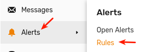
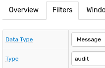

# Правило для отправки уведомления об удалении объекта

> Правило [Аудит](https://nur.axibase.com/rule/edit.xhtml?name=%D0%A3%D0%B4%D0%B0%D0%BB%D0%B5%D0%BD%D0%B8%D0%B5+%D0%B3%D1%80%D1%83%D0%BF%D0%BF%D1%8B+%D0%BF%D0%BE%D0%BB%D1%8C%D0%B7%D0%BE%D0%B2%D0%B0%D1%82%D0%B5%D0%BB%D0%B5%D0%B9#overview).
>
> Скачать конфигурацию [здесь](https://github.com/axibase/atsd-use-cases/tree/master/resources/rule_2.xml).

1. Перeйдите на страницу **Alerts > Rules**, нажмите **New**.

   

2. Вкладка **Overview**: укажите имя нового правила.

   

   > Чтобы посмотреть описание всех настроек, используйте кнопку **Help** в верхнем правом углу вкладки.
   >
   > 

3. Вкладка **Filters**: в меню **Data Type** выберите **Message**, установите `Type = audit`.

   

   Укажите **Filter Expression**: `tags.action == 'delete'`.

   

4. Вкладка **Condition**: укажите условие, на которое должно сработать правило, в данном случае `true`, чтобы правило срабатывало всегда.

   

   Укажите переменную `msgs`, которая будет хранить список сообщений об удалении объектов данным пользователем за последние 3 дня:

   

   объекты `message` извлекаются из базы с помощью функции [`db_messages`](https://axibase.com/docs/atsd/rule-engine/functions-message.html#db_messages).

5. Вкладка **Email**: укажите получателей и настройте **On Open** триггер.

   > Предварительно нужно настроить [**Mail Client**](https://axibase.com/docs/atsd/administration/mail-client.html#mail-client).

   

   Для форматирования списка объектов `message` используется функция [`addTable`](https://axibase.com/docs/atsd/rule-engine/functions-table.html#addtable-for-objects).

6. Для проверки уведомления нажмите **Test**.

   

   

7. Сохраните правило.