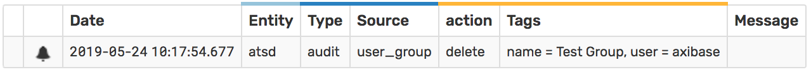
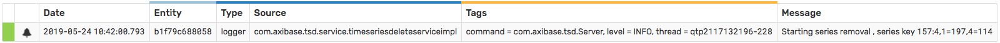
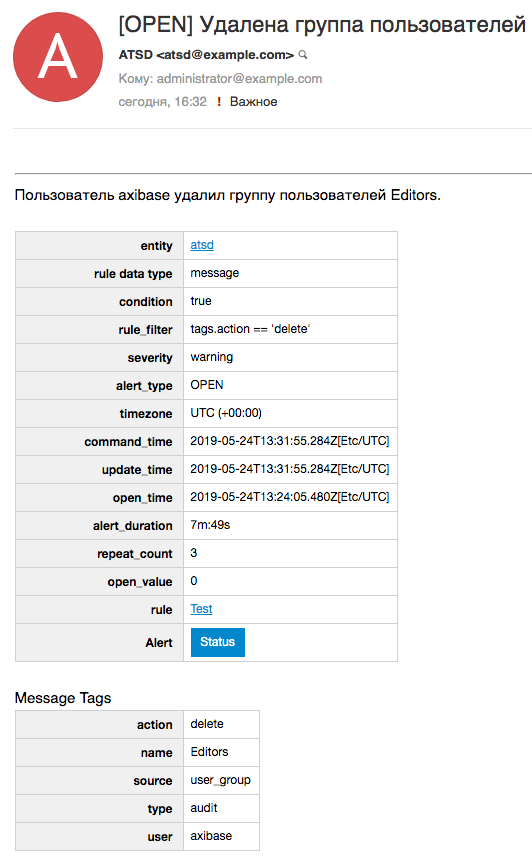

# Прочие требования к характеристикам

## 4. Аудит действий в подсистеме

### 4.1 Список наблюдаемых объектов

* CSV Parsers
* Entiy
* Entity View
* Export Job
* Forecast Jobs
* Named Collection
* Metric
* Portal
* Replacement Table
* Rule
* Series
* Scheduled SQL Queries
* User
* User Group

#### Пример сообщения в лог при удалении

* Удаление **Series**

```js
2019-05-24 10:42:00,501;INFO;qtp2117132196-228;com.axibase.tsd.service.TimeSeriesDeleteServiceImpl;Starting series removal , series key 157:4,1=197,4=114
```

#### Пример message при удалении

* Удаление **User Group**

  

* Удаление **Series**

  

#### Пример уведомления по почте

* Удаление **User Group**

  