# How to Monitor Kafka Brokers

## Overview

This integration guide describes how to monitor availability and performance of [Apache Kafka](https://kafka.apache.org/) brokers using ATSD.

## Configuration

### Prerequisites

* Kafka brokers with enabled JMX.
* `4` GB RAM for the [ATSD Sandbox](https://github.com/axibase/dockers/blob/atsd-sandbox/README.md#atsd-sandbox-docker-image) container.

### Launch ATSD Sandbox

Launch [ATSD Sandbox](https://github.com/axibase/dockers/blob/atsd-sandbox/README.md#launch-instructions) container on one of the Docker hosts:

```sh
docker run -d -p 8443:8443 -p 9443:9443 -p 8081:8081 \
    --name=atsd-sandbox \
    --volume /var/run/docker.sock:/var/run/docker.sock \
    --env ATSD_IMPORT_PATH='https://raw.githubusercontent.com/axibase/atsd-use-cases/master/integrations/kafka/broker-monitoring/resources/kafka-xml.zip' \
    --env COLLECTOR_IMPORT_PATH='https://raw.githubusercontent.com/axibase/atsd-use-cases/master/integrations/kafka/broker-monitoring/resources/job_jmx_kafka-jmx.xml' \
axibase/atsd-sandbox:latest
```

Sandbox container includes ATSD and [Axibase Collector](https://axibase.com/docs/axibase-collector/jobs/docker.html) instances.

Use the Collector instance installed in the Sandbox container to retrieve Kafka statistics with JMX and store the statistics in ATSD.

Monitor the logs for `All applications started`.

```sh
docker logs -f atsd-sandbox
```

### Configure Collector

Log in to the Collector instance at `https://atsd_hostname:9443` with `axibase` username and `axibase` password.

Expand the **Jobs** drop-down list and select **JMX**.

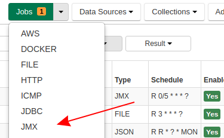

Ensure you see the enabled `kafka-jmx` job.

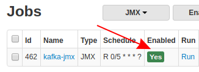

This job uses `kafka-cluster-jmx` [Item List](https://axibase.com/docs/axibase-collector/jobs/jmx.html#connection-parameters) with Kafka JMX connection settings.
Replace default parameters in this list with actual broker JMX address. Expand the **Collections** drop-down list and select **Item Lists**.

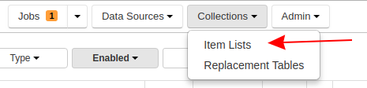

Open `kafka-cluster-jmx`.

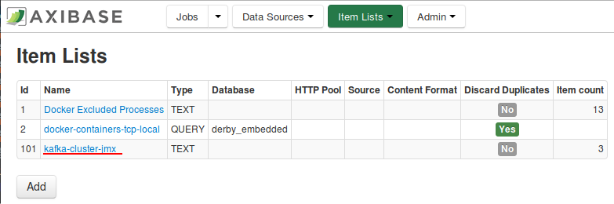

Edit CSV-formatted items. Replace default parameters with actual JMX parameters. Set username and password if required and confirm that connection settings are correct. Click **Save**.

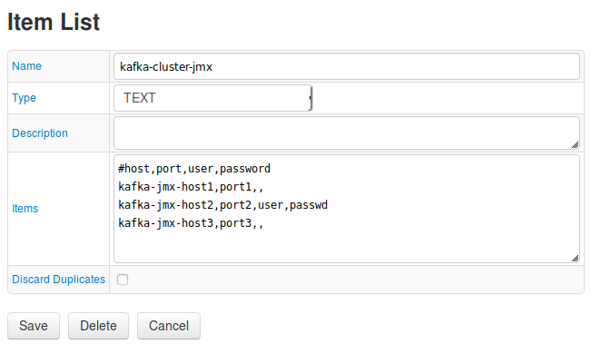

Expand the **Jobs** drop-down list and select **JMX**. Navigate to the `kafka-jmx` job. Click `kafka-series` in the configuration list

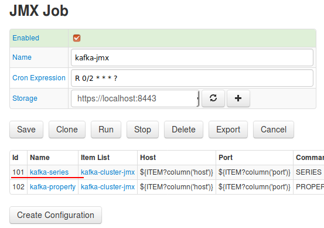

At the bottom of the page click **Test**.

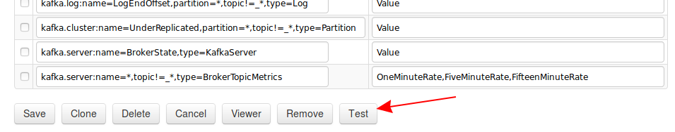

If connection parameters are correct, you see series commands. Select other brokers and repeat test.

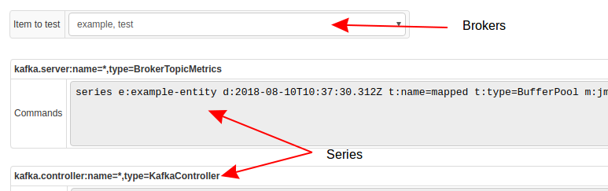

Return to the **Job** page and run the job.

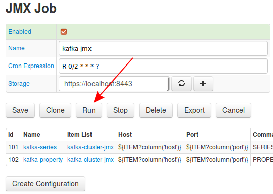

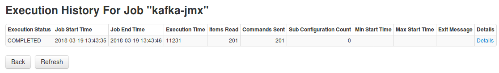

### Configure ATSD

Log in to ATSD instance at `https://atsd_hostname:8443` using `axibase` username and `axibase` password.

Open the **Entities** tab and ensure Collector displays the Kafka nodes with hostnames

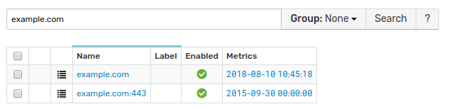

Open the **Portals** menu and select **Configure**.

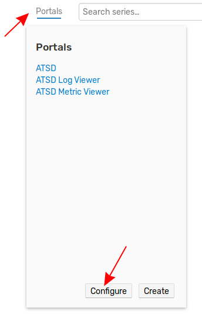

Select **Kafka Broker** and **Kafka Cluster** portals via checkbox and enable these portals using the split-button at the bottom of the page.

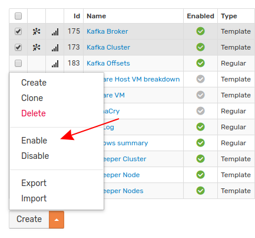

Check **Kafka Broker** portal. Return to the **Entities** page, find any kafka broker and click the **Portal** icon.

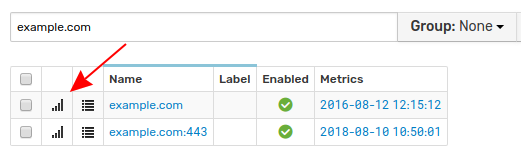

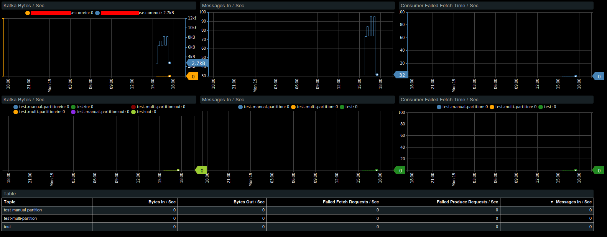

Check Kafka cluster entity view and portal. Open the **Entity Views** menu and select **Kafka**.

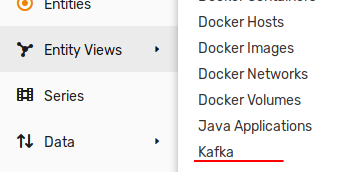

Click **View Portal** to check the **Kafka Cluster** portal

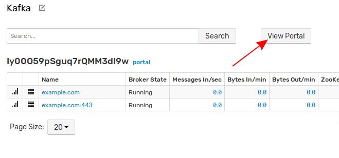

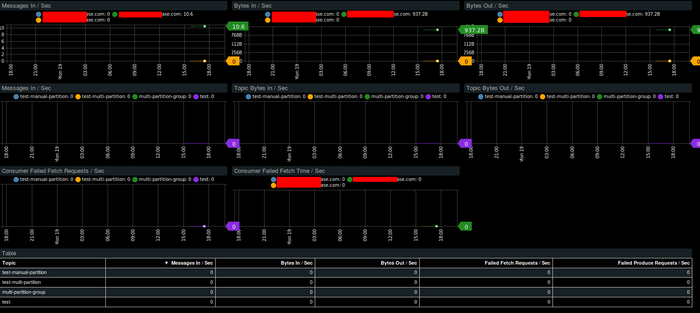