# Analyzing and Combining Iowa Employment and Consumer Price Index Socrata Datasets

## Introduction

For easier access to public datasets like **Employee Financial Compensation by Industry in Iowa**, the Unites States government curates [`data.gov`](https://www.data.gov/). Datasets are available online to conduct research, develop web applications, and design data visualizations on a variety of topics ranging
from agriculture and manufacturing, to healthcare and society.

* According to the [US Bureau of Labor Statistics](https://www.bls.gov/news.release/laus.nr0.htm), as of September 2016, the unemployment rate in Iowa is 4.2%, which is lower than then overall US average of 5.0%.
* [From September 2015 to September 2016](https://www.bls.gov/news.release/laus.t05.htm), the state of Iowa added roughly 29,600 non-farm jobs which increased the total number of non-farm employed people in the state to around 1,587,800. This marks a growth of 1.9%. The US as a whole for this same period achieved a slight lesser growth rate of 1.8%.

The governments at the federal, state, city, and county level publish datasets in [Socrata Open Data](https://socrata.com) format.

[ATSD](https://axibase.com/docs/atsd/) supports the combination of multiple datasets in one portal. This integration uses data collected from the [Bureau of Labor Statistics](https://www.bls.gov/home.htm).

## Iowa Employee Compensation Dataset

> Explore the **Employee Financial Compensation by Industry in Iowa** on [`data.gov`](https://catalog.data.gov/dataset/employee-compensation-by-industry-in-iowa)

The state of Iowa collects estimated employee compensation values in non-adjusted dollar value. Compensation is the total remuneration, both monetary and in kind, payable by employers to employees in return for work during some period.

The state aggregates data in to one of three industries, each with sub-categories:

* Farm
  * Farm
* Government and Government Enterprises
  * Federal and Civilian
  * Military
  * State and Local
* Private Non-farm
  * Administrative and support of waste management and remediation services
  * Accommodation and food services
  * Arts, entertainment, and recreation
  * Construction
  * Educational services
  * Finance and insurance
  * Forestry, fishing, and related activities
  * Health care and social assistance
  * Information
  * Management of companies and enterprises
  * Manufacturing
  * Mining, quarrying, and oil and gas extraction
  * Professional, scientific, and technical services
  * Real estate and rental and leasing
  * Retail trade
  * Transportation and warehousing
  * Wholesale trade
  * Utilities
  * Other Services (except public administration)

Download the dataset in CSV, RDF, JSON, or XML format.

## Axibase Time Series Database

[Axibase Collector](https://axibase.com/docs/axibase-collector/) contains built-in heuristics to parse Socrata format data. Collector uses Socrata metadata to interpret the meaning of columns and extract times, dates, and categories from the raw data. ATSD stores data in a local database instance which allows you to combine this public dataset with those generated locally.

With ATSD and Collector:

* Load additional datasets from `data.gov`.
* Design and manipulate database table schema.
* Provision application server tasks.
* Write programs which parse irregular files.

Configure a [scheduled job](https://axibase.com/docs/axibase-collector/#job-types) to retrieve the data from a specified ATSD endpoint and parse any dataset according to pre-defined rules. Once a dataset is loaded, creating and sharing reports with built-in widgets is simple using examples from [Charts Documentation](https://axibase.com/products/axibase-time-series-database/visualization/widgets/). The database continuously updates the dataset as new data is published by the state of Iowa.

The portal below displays total statewide employee compensation for each of the 23 recorded industries.

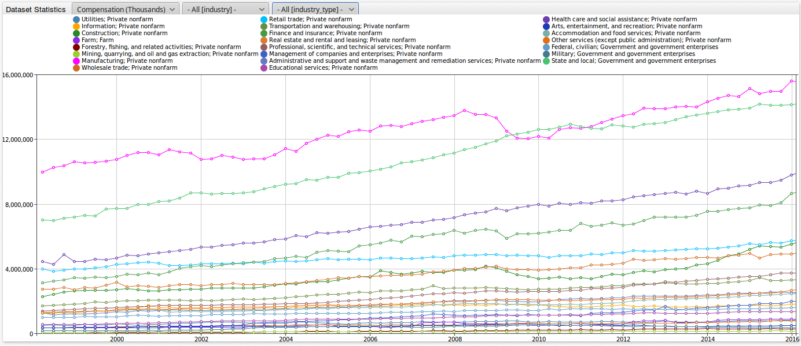

[](https://apps.axibase.com/chartlab/f5eae012#fullscreen)

 Open the **ChartLab** portal above and explore the Iowa compensation dataset using the drop-down lists:

* **Metric**: View the data for a specified metric.
* **Industry**: Filter each of the 23 industries. The visualization above shows all industries.
* **Sub-Category**: Filter by industry group.

Select **Farm** from the **`industry_type`** drop-down list.

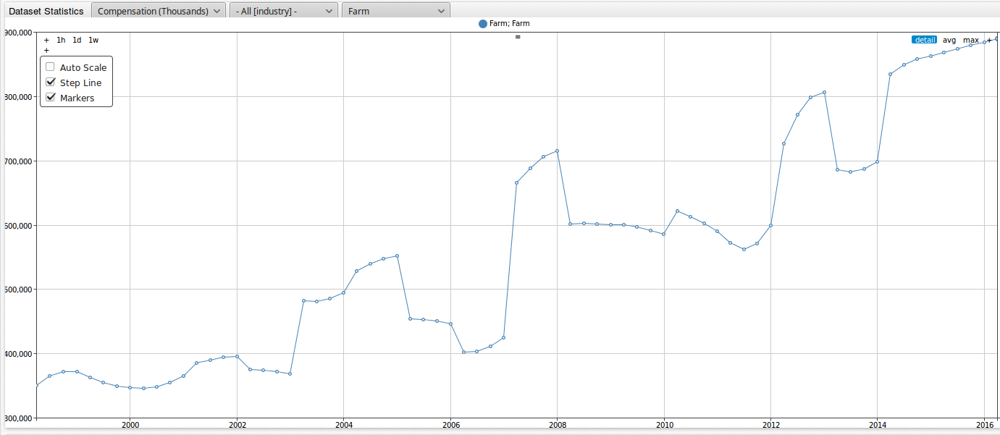

[](https://apps.axibase.com/chartlab/131b7670#fullscreen)

Select **Government and Government Enterprises** from the **`industry_type`** drop-down list.

The compensation for the **Federal and Civilian** and **Military** sectors increases at a lesser rate than **State and Local** compensation.

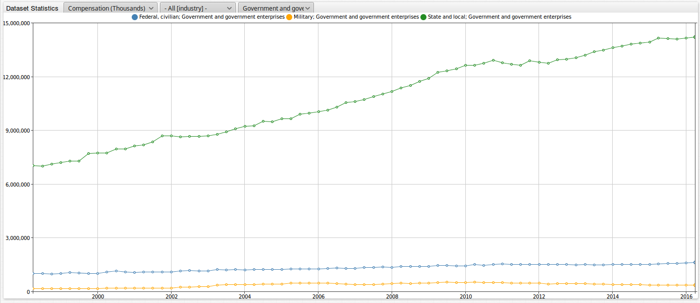

Exclude series from the filtered view with the series legend. The image below hides the **State and Local** series.

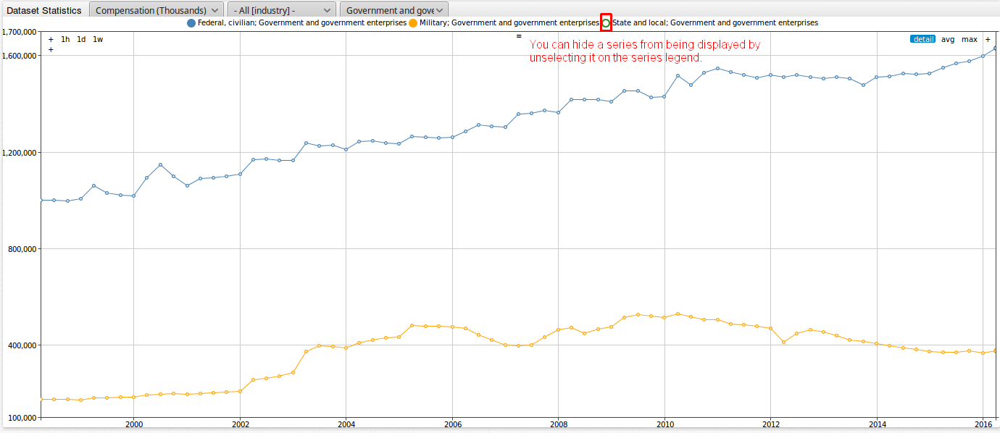

[](https://apps.axibase.com/chartlab/cb62aab7#fullscreen)

Select the **Private Non-Farm** series from the **`industry_type`** drop-down list.

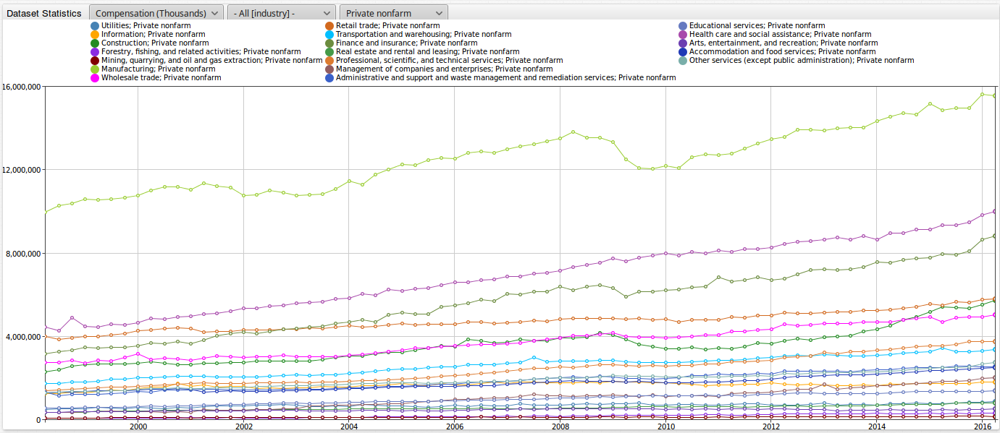

[](https://apps.axibase.com/chartlab/0c459d5f)

Filter for the **Construction** and **Manufacturing** metrics with the **`industry`** drop-down list. Both industries visibly suffered during the Great Recession.

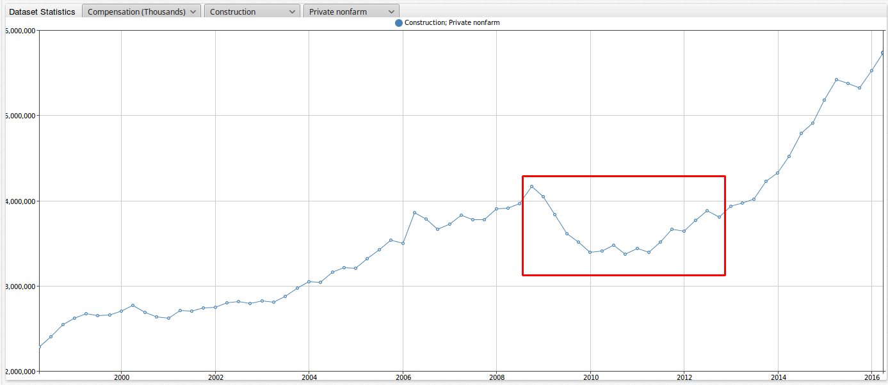

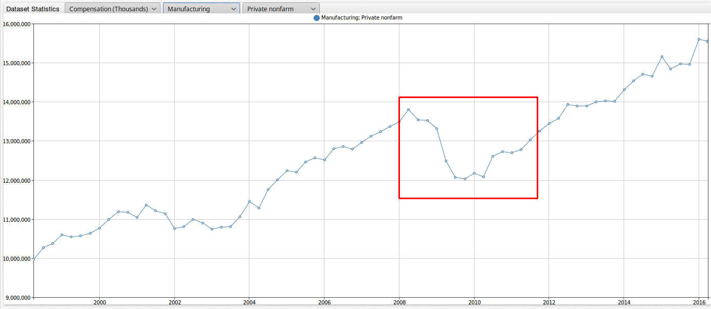

The portal below visualizes total compensation change per industry in Iowa since 2008 and 2000 using a bar chart.

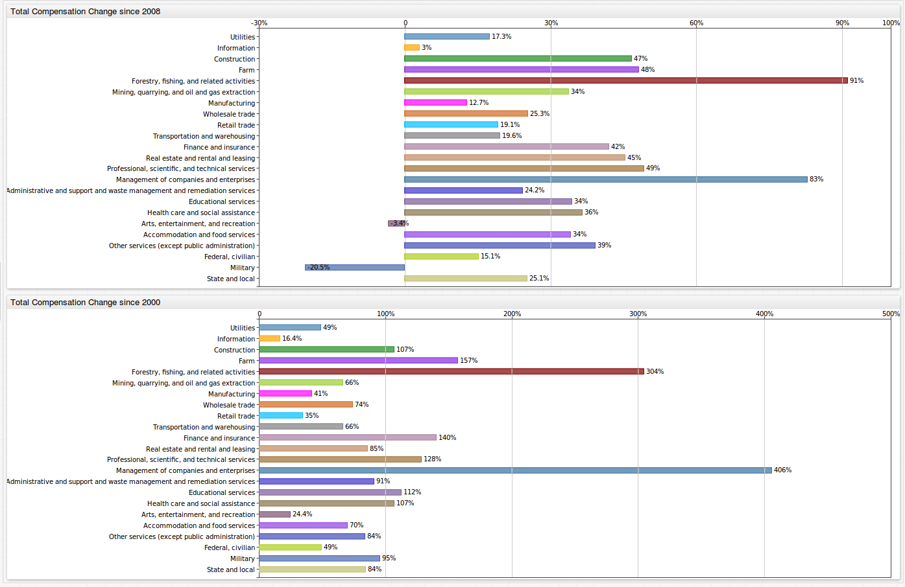

[](https://apps.axibase.com/chartlab/28872118#fullscreen)

> Refer to [Charts Documentation](https://axibase.com/products/axibase-time-series-database/visualization/widgets/) for information about other **ChartLab** widgets.

## Additional Iowa Datasets: State of Iowa Employment by Month and Industry

Insert additional data in ATSD to give the above data further context such as a dataset which tracks the gross number of employees working in Iowa.

1. Navigate to [Gov Data | State of Iowa](https://data.iowa.gov).
2. On the home page, select the **Employment** tab.
3. Scroll to the bottom of the page and open the **Topics** drop-down list. Select **Employment**.

   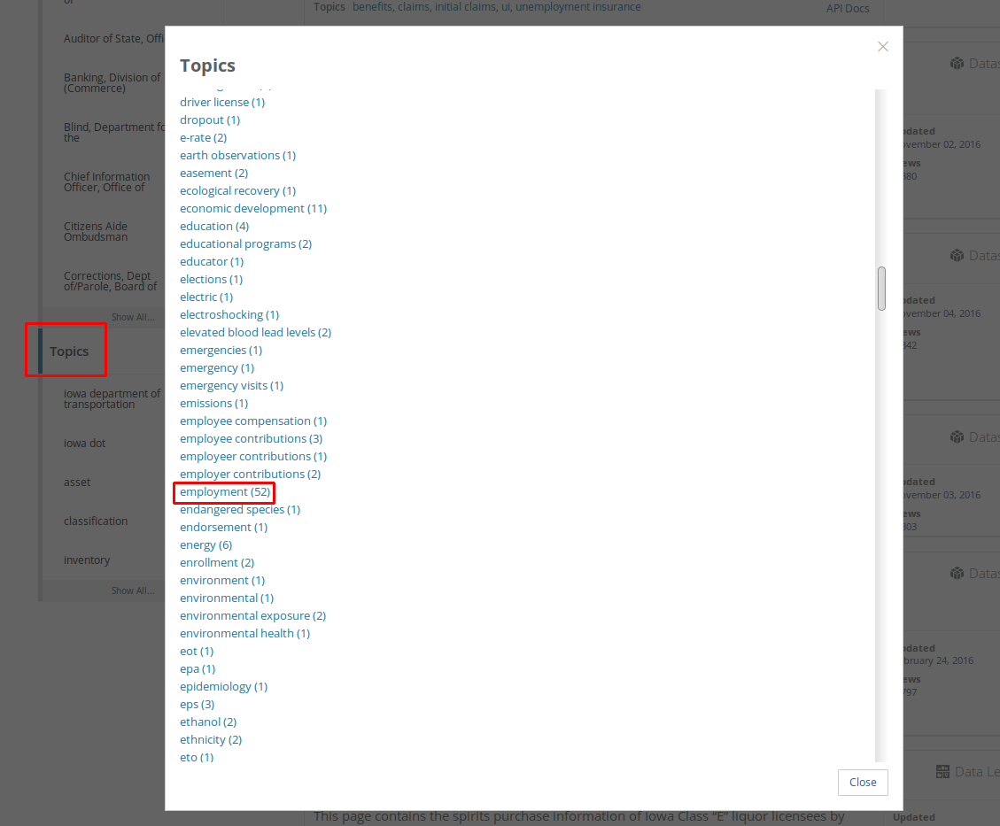

4. Select [**Iowa Seasonally Adjusted Non-Farm Employment by Month and Industry**](https://data.iowa.gov/Economy/Iowa-Seasonally-Adjusted-Non-Farm-Employment-by-Mo/sxz8-4swt).
5. Open the **Download** drop-down list and select **JSON**.

   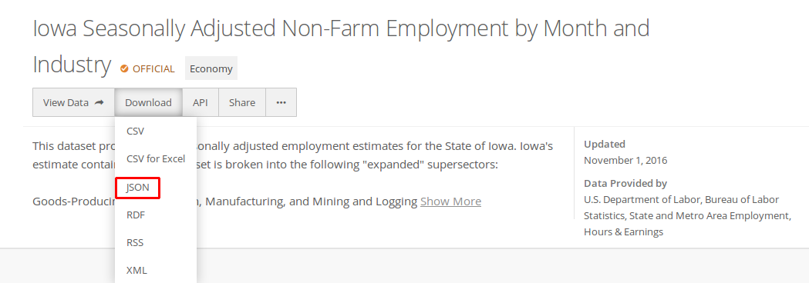

The **Iowa Seasonally Adjusted Non-Farm Employment by Month and Industry** is visualized below.

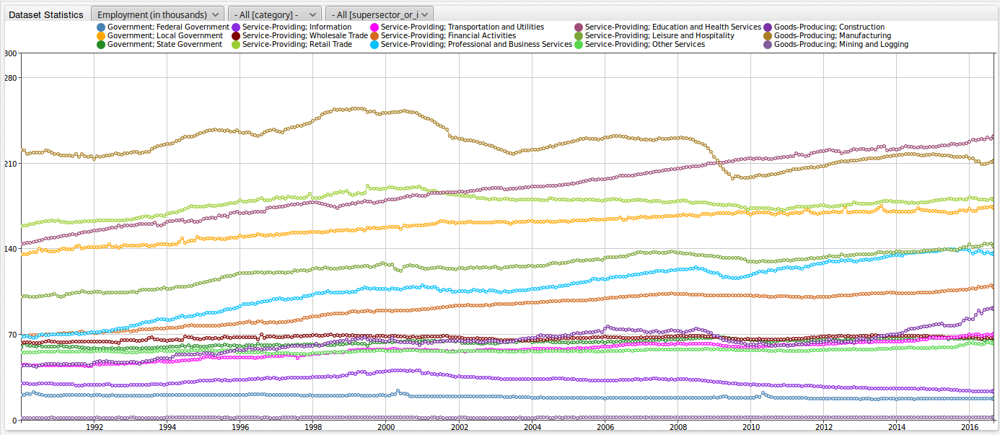

The state of Iowa publishes data for each of the following industries and sub-categories:

* Goods producing
  * Construction
  * Manufacturing
  * Mining and Logging
* Government
  * Federal Government
  * Local Government
  * State Government
* Service providing
  * Education and Health Services
  * Financial Activities
  * Information
  * Leisure and Hospitality
  * Professional and Business Services
  * Retail Trade
  * Transportation and Utilities
  * Wholesale Trade

Filter data and create interactive functions for any visualization. Open the **ChartLab** portal below and explore the Iowa employment dataset using the drop-down lists:

* **Metric**: View data for a specified metric.
* **Industry**: Filter by each of the three industries.
* **Sub-Category**: Filter by sub-category.

[](https://apps.axibase.com/chartlab/1ac33603#fullscreen)

Explore specific metrics in the **Iowa Seasonally Adjusted Non-Farm Employment by Month and Industry** dataset. As with the total statewide employee compensation dataset, filter for the **Construction** and **Manufacturing** metrics. The visualizations for the **Construction** and **Manufacturing** metrics, respectively.

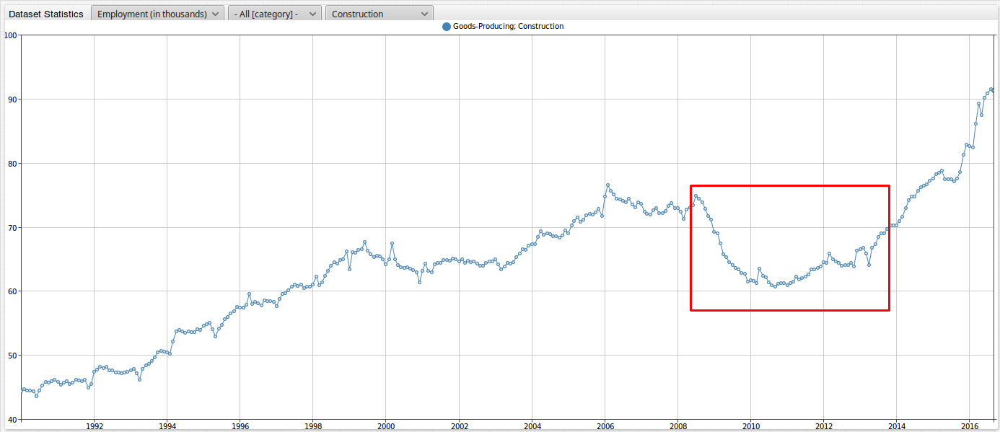

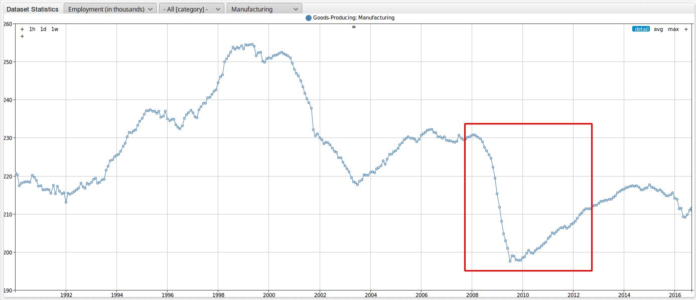

The same decline correlating with the recession period is highlighted the figures above.

Below is a table of datasets from `data.iowa.gov` which are available in **ChartLab**. Modify configuration in the **Editor** window to compare data across entities. For more information about **ChartLab** syntax or selecting series, see the [ChartLab Introduction](../../../tutorials/shared/chartlab.md).

|Entity     | Dataset Title     |
|-----------|--------------------------|
| `ytnz-cckp` | [Gross seasonally adjusted non-farm employment by month](https://data.iowa.gov/Economy/Iowa-Seasonally-Adjusted-Non-Farm-Employment-by-Mo/sxz8-4swt)|
| `n74v-z6ct` | [Average monthly non-farm employment by year and category](https://data.iowa.gov/Economy/Iowa-Seasonally-Adjusted-Non-Farm-Employment-by-Mo/sxz8-4swt)|
| `jpje-kkb9` | [Unemployment insurance claims and payments (statewide - monthly)](https://data.iowa.gov/Economy/Unemployment-Insurance-Claims-And-Payments-Statewi/jpje-kkb9)|
| `njph-rx66` | [Unemployment insurance claims (statewide - weekly)](https://data.iowa.gov/Economy/Unemployment-Insurance-Claims-Statewide-Weekly-/njph-rx66)|
| `b38f-jgn3` | [Unemployment insurance benefit payments by industry](https://data.iowa.gov/Economy/Unemployment-Insurance-Benefit-Payments-by-Industr/b38f-jgn3)|
| `yhbr-3t8a` | [Unemployment insurance recipients and unemployment insurance benefit payments by county (annual)](https://data.iowa.gov/Economy/Unemployment-Insurance-Recipients-and-UI-Benefit-P/yhbr-3t8a)|
| `rmcb-sifx` | [Unemployment insurance payments (statewide - yearly)](https://data.iowa.gov/Economy/Unemployment-Insurance-Recipients-and-UI-Benefit-P/yhbr-3t8a)|
| `rigx-2vau` | [Unemployment insurance initial claims by county](https://data.iowa.gov/Economy/Unemployment-Insurance-Initial-Claims-by-County/rigx-2vau)|
| `aeyn-twxp` | [Unemployment insurance recipients and unemployment insurance benefit payments by county (monthly)](https://data.iowa.gov/Economy/Unemployment-Insurance-Recipients-and-UI-Benefit-P/aeyn-twxp)|

> If a dataset appears to be unavailable, raise an [issue](https://github.com/axibase/atsd-use-cases/issues/new) on the Axibase GitHub page.

Change the entity in the default portal to **Unemployment insurance benefit payments by industry**.

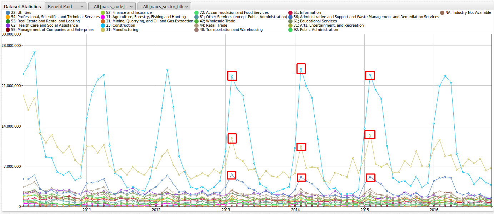

Highlight in the image above for the **Construction**, **Manufacturing**, and **Administration and Support of Waste Management and Remediation Services**
metrics, insurance benefit payments follow a cyclical yearly pattern.

Navigate to **Unemployment insurance claims and payments (statewide - monthly)** by using entity `jpje-kkb9`.

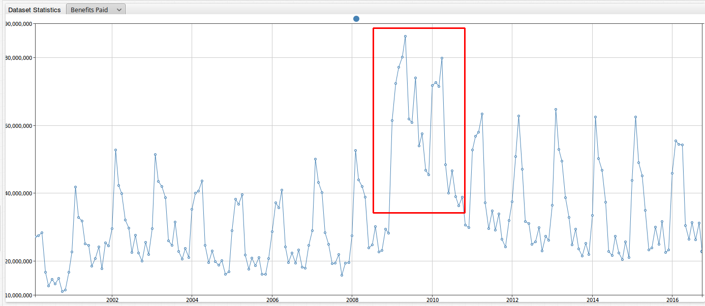

This dataset follows a similar trend, with payments tending to peak in January of each year and fall throughout
the remaining months. However, in the late 2000's, the series shifted upward, highlighted in the figure above.

Use a [`time-offset`](https://axibase.com/products/axibase-time-series-database/visualization/widgets/time-chart/) setting to compare previous year data.

```ls
[series]
  time-offset = 1 year
  color = silver
```

2016 data is shown below in blue and 2015 data is gray. The red box below highlights the dramatic difference when making year-on-year comparisons.

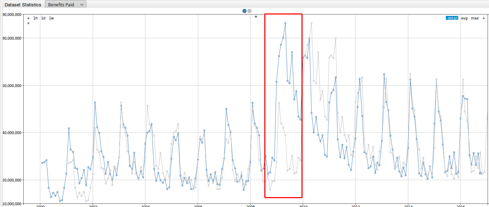

[](https://apps.axibase.com/chartlab/08e6e6f0#fullscreen)

## A Closer look at the Iowa Economy

ATSD supports the combination of several datasets from multiple entities in a single portal. Take these datasets and
compute additional metrics to create more in-depth level of analysis. The following sections explore compensation per employee,
adjusted with consumer price index (CPI) statistics to account for inflation for employees in the federal government working in the state of Iowa.

The image below shows year-on-year growth experienced by the **government and government enterprises** industry in Iowa.

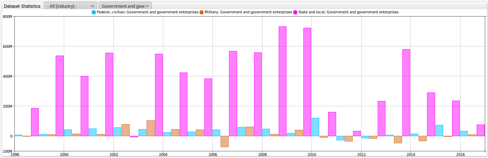

[](https://apps.axibase.com/chartlab/6796b073#fullscreen)

Divide total employee compensation by the total number of employees to compute an average
wage (adjusted with CPI values) for this industry as a new metric.

The image below shows the initial configuration for this visualization.

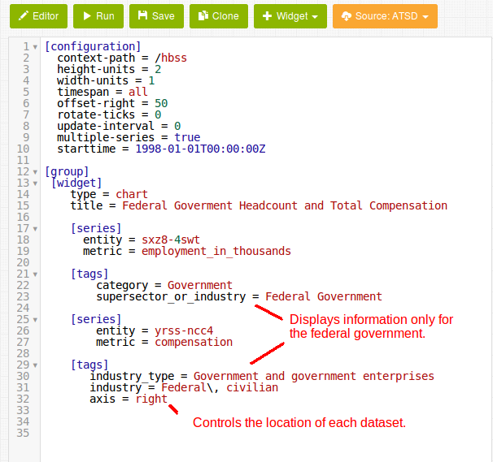

Add a `[series]` section for both fields by specifying the respective entity and metric names. Next, use `[tags]` settings to display more specific information, in this case federal government data. Finally, specify a [**Dual Axis**](https://axibase.com/products/axibase-time-series-database/visualization/widgets/time-chart/#tab-id-2) setting.

The resulting visualization is shown below:

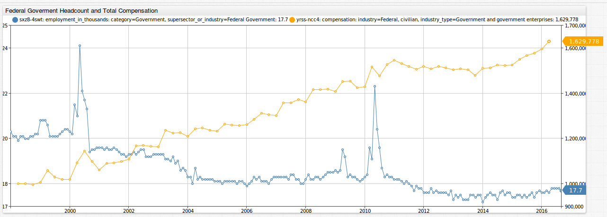

Over time, despite the fact that the total number of employees has decreased, the total employee compensation has increased. The number of federal government employees in the state decreased from 20,300 to 17,700 but the total compensation increased from $999,528,000 to
$1,629,778,000.

Next, compute the average federal government compensation per employee.

The **ChartLab** configuration is shown below:

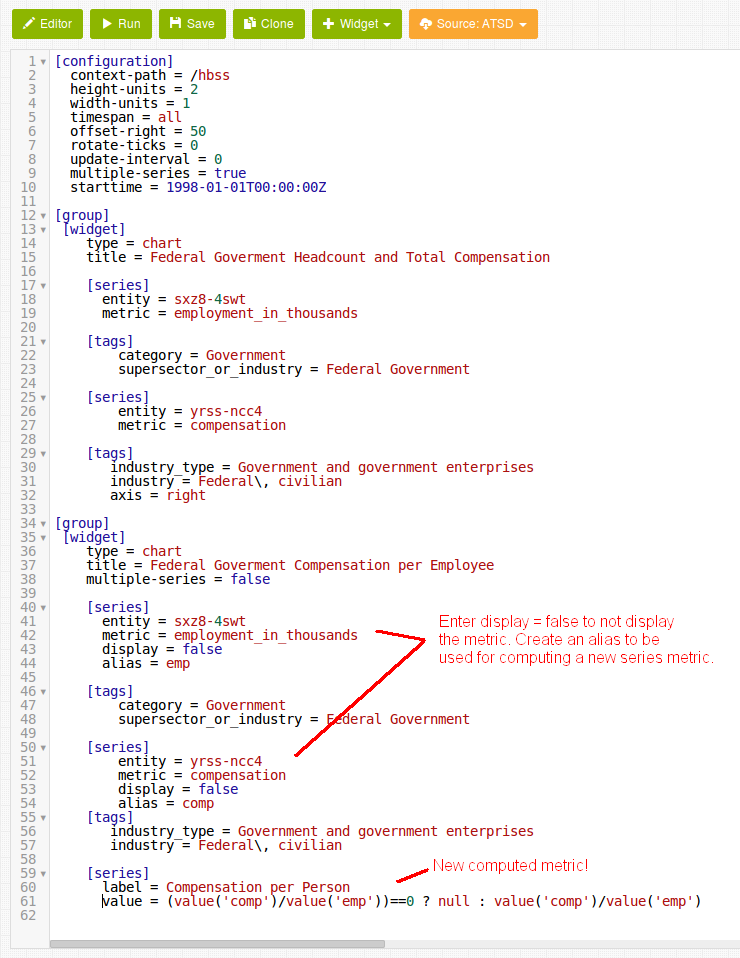

Begin by specifying the `[series]` and `[tags]` clauses. To display only the average employee compensation in this output, specify `display = false` for both series used for calculation. Next, assign these series an [`alias`](https://axibase.com/products/axibase-time-series-database/visualization/widgets/configuring-the-widgets/). Finally, specify a `value` with the formula used by **ChartLab** to calculate the new derived series.

The underlying formula is shown here:

```javascript
value = (value('comp')/value('emp'))==0 ? null : value('comp')/value('emp')
```

Divide the total employee compensation in the state (`comp`) by the total number of employees in the state (`emp`). Because the `start-time` values for these two series differ, the beginning of the equation serves to set any non-real values (timestamps which do not contain data for both series) as `NULL`.

Below is an image of the average employee compensation for the federal government industry in the state of Iowa.

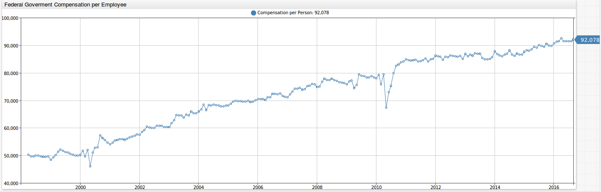

[](https://apps.axibase.com/chartlab/202133dd)

The unadjusted average salary for a federal government employee in the state increased from $50,211 in March of 1998 to $92,078 in September of 2016.

The visualization below shows the average salary for local and state government employees in Iowa. The unadjusted average salary increased from $32,711 in March 1998 to $59,196 in September 2016. During this time, the number of employees in Iowa for local and state government increased from 155,000 to 174,000 and 61,000 to 66,000 persons, respectively.

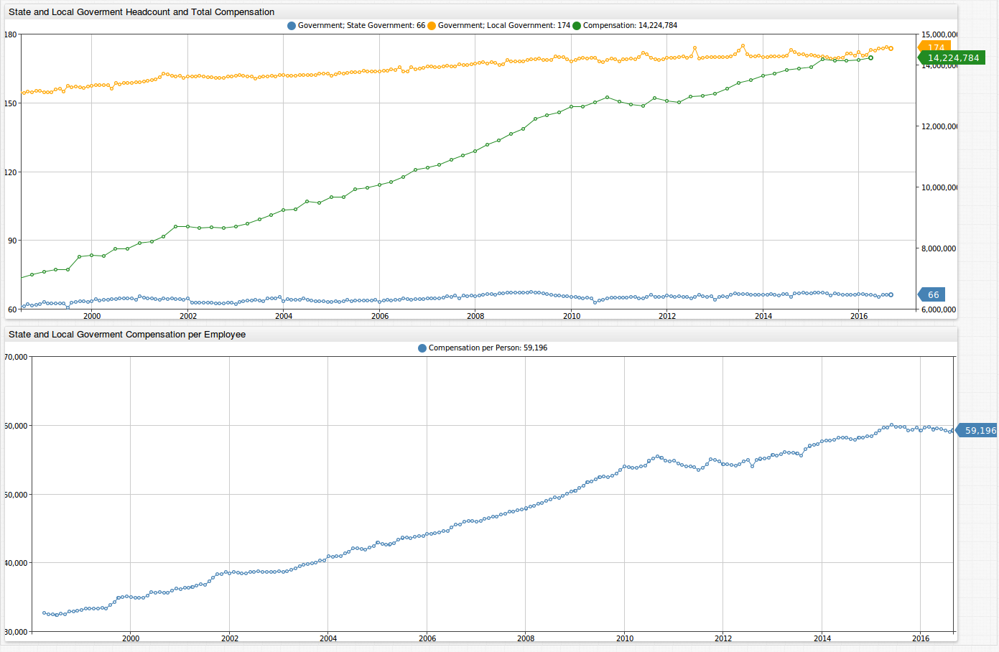

Follow the same configuration procedure as shown above. Calculate the compensation per employee value,by dividing the average total compensation for employees (`emps`) by the number of employees (`empl`).

The underlying formula is shown here:

```javascript
value = (value('comp')/(value('emps')+value('empl')))==0 ? null : (value('comp')/(value('emps')+value('empl')))
```

[](https://apps.axibase.com/chartlab/82d09fa6#fullscreen)

## Consumer Price Index Dataset

Adjust income data for inflation with the Consumer Price Index (CPI).

CPI is a measure of the average change over time in the prices
paid by urban consumers for a market basket of goods and services. This market basket includes a wide variety of consumer items such as chicken, bedroom furniture, jewelry, eyeglasses, college tuition,
tobacco, and many more items. Use CPI to index the real value of average employee salaries change over time using current dollars.

Calculate adjusted dollar value by multiplying unadjusted value and the current CPI, divided by the CPI at any specified time period to project that amount in current dollars. In other words, the rate of change for CPI creates a simple conversion factor for comparing dollar value through time using the amount of goods the same dollar can buy.

Download the CPI dataset from the [Bureau of Labor Statistics](https://data.bls.gov/cgi-bin/surveymost). Data is available in XLSX format.

Create a Collector job to download the tabular data from the Bureau of Labor Statistics file format and then upload the data into
ATSD. Because the file format is nonstandard, configure ATSD to properly upload the data via [CSV Parser](https://axibase.com/docs/atsd/parsers/csv/).

Download the required [job](jobs.xml) and [parser](csv-configs.xml) configuration.

Add the newly inserted data to the configuration.

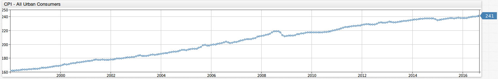

Adjust compensation per employee to account for inflation.

The image below displays the required configuration. The key difference between this and earlier portals, is that each series now includes the CPI multiplier.

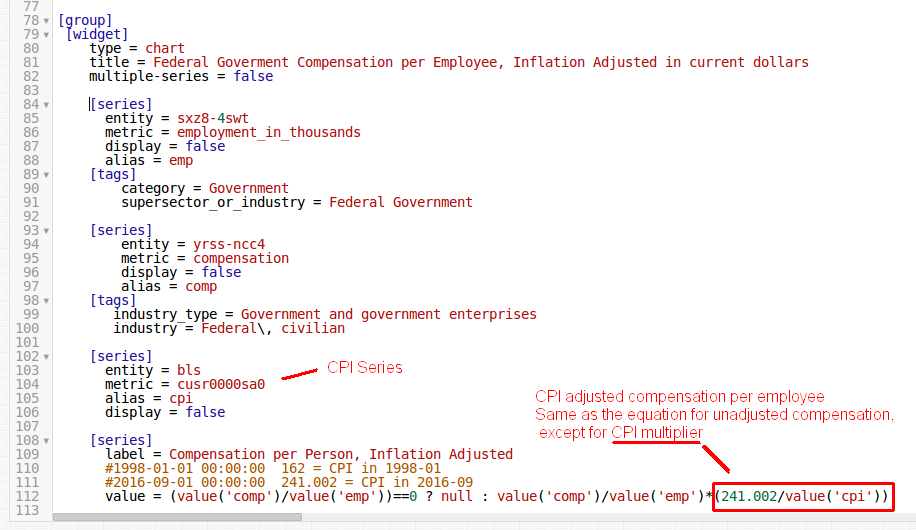

The portal contains three series:

* Federal government head count and total compensation (not displayed).
* Federal government compensation per employee (derived).
* CPI: all urban customers (raw).
* Federal government compensation per employee, inflation adjusted in current dollars (derived).

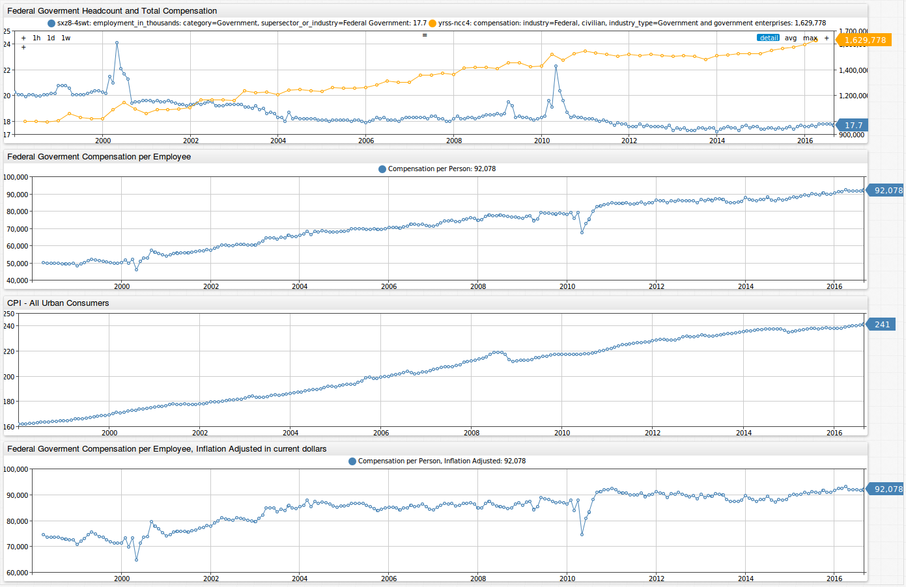

[](https://apps.axibase.com/chartlab/1ac33603/6/)

Below is a screenshot of the complete portal for the local and state government dataset.

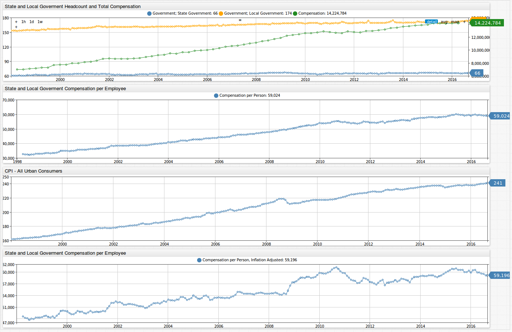

[](https://apps.axibase.com/chartlab/6019ae9c)

With adjusted compensation per employee values derived series, meaningful conclusions can be made by the economically minded observer. The ability of ATSD to easily combine multiple datasets, regardless of standard or non-standard formats, into one visualization makes comparing employee average compensation simple and straightforward and provides outputs that are easy to interpret.

## Action Items

* See [ATSD Documentation](https://axibase.com/docs/atsd/installation/) for installation instructions.

* For more information about ATSD Chart services, see the [Charts Documentation](https://github.com/axibase/charts).

* See the [**ChartLab** Introduction](../../../tutorials/shared/chartlab.md) for more information about **ChartLab** functionality.

* Raise an [issue](https://github.com/axibase/atsd-use-cases/issues/new) in the Axibase GitHub repository for assistance.