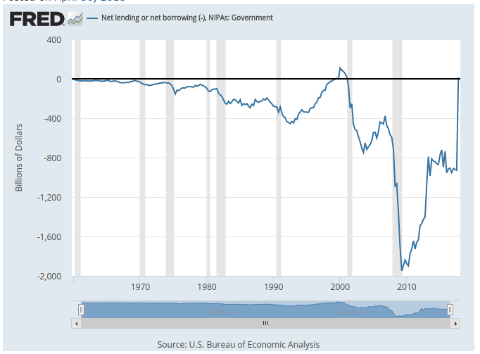
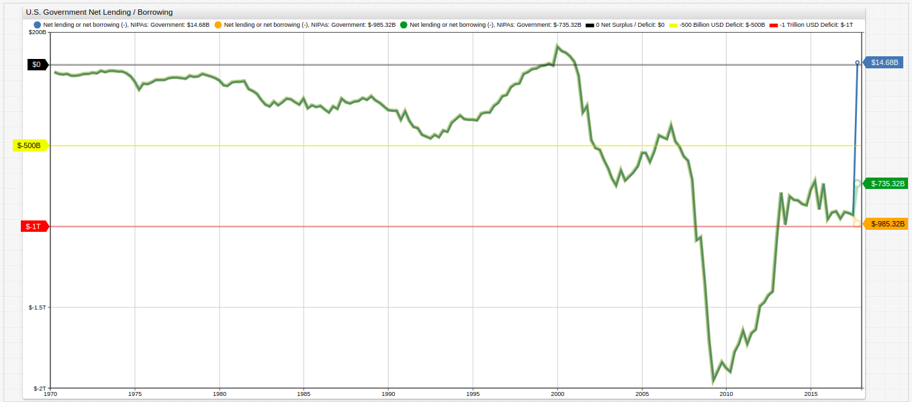

# SQL Queries and Data Visualization with Python and ATSD

## Introduction

[Python](https://www.python.org/) is an easy-to-use and versatile programming language that boasts code readability and functionality for tasks of any size. [Axibase Time Series Database](https://axibase.com/products/axibase-time-series-database/) is an enterprise-level data storage and processing environment that features a rule engine, SQL, and visualization functionality. Using these two tools, data analysis tasks may be approached from the ground up to unlock meaningful results within a single interface.

## Dataset

The [Federal Reserve Economic Research Division](https://fred.stlouisfed.org/) of the St. Louis Federal Reserve publishes publicly available data on a range of topics related to macroeconomic trends such as GDP, employment and national statistics.

While native FRED visualization tools have a number of built-in manipulation and export features, meaningful data wrangling requires specialized capabilities. With the ATSD [API Client for Python](https://github.com/axibase/atsd-api-python), data may be queried using SQL and visualized for ad-hoc analysis. This article will focus on the [net lending / borrowing](https://fred.stlouisfed.org/series/AD01RC1Q027SBEA) of the United States Government for the past several decades and explore the way these three tools intersect to facilitate data processing.

### Handling Special Items

The `AD01RC1Q027SBEA` series is annualized and each quarterly value is therefore multiplied by a factor of four to arrive at the annual estimate. This calculation is used to show the annual total should a specific quarter's trends be replicated over the course of the year. During the final quarter of 2017, a potential $250 billion windfall from one-time corporate repatriation taxes was added to the total by virtue of annualized calculation. In fact, the $250 billion extra income translated to a $1 trillion. The original [FRED blog post](https://fredblog.stlouisfed.org/?s=surplus) discussing this data includes a visualization which considers this annualized value:



We will now illustrate how the declarative graphics library in ATSD can be utilized to perform *ad hoc* data transformations such as the removal of this and other special items. The same dataset is visualized using **Trends** service and applies a [`replace-value`](https://axibase.com/products/axibase-time-series-database/visualization/widgets/configuring-the-widgets/) setting to remove the special budget revenue item from the annual total. Additionally, a third visualization will be shown where the one-time $250 billion addition remains, but only the annualized $750 billion is removed.

The original data and new data are shown together. The range of conclusions one can draw from these three series are vastly different.



[](https://trends.axibase.com/04b1ad9f#fullscreen)

The `replace-value` settings used in the visualization:

```javascript
# remove extraordinary item completely.
replace-value = time == new Date('2017-10-01T00:00:00Z').getTime() ? value-1000 : value
```

```javascript
# remove extraordinary annualization calculation, leave expected repatriation tax.
replace-value = time == new Date('2017-10-01T00:00:00Z').getTime() ? value-(1000+250) : value
```

This calculation targets a defined date by evaluating an `if-else` expression to subtracts $1 trillion from the defined date's value.

### Querying FRED Data with SQL

Similar to graphs, the same analysis and data cleanup may be performed by executing SQL queries using the ATSD Python client.

The FRED data is quarterly, this query tracks federal budget data from the final quarter for each recorded year:

```sql
SELECT datetime "Year",LAST(value) "Net Lending/Borrowing"
  FROM "ad01rc1q027sbea"
GROUP BY period(1 year)
  ORDER BY datetime DESC
```

For multi-line queries in the Python interface, define a variable `q = """`. Close the query with `"""`. The complete query will be:

```python
>>> q = """
... SELECT datetime "Year",LAST(value) "Net Lending/Borrowing"
... FROM "ad01rc1q027sbea"
... GROUP BY period(1 year)
... ORDER BY datetime DESC
... """
```

The ten most recent years are presented below:

```txt
| 37  2007                         -594.622 |
| 38  2008                        -1357.509 |
| 39  2009                        -1838.034 |
| 40  2010                        -1727.036 |
| 41  2011                        -1635.086 |
| 42  2012                        -1402.966 |
| 43  2013                         -812.007 |
| 44  2014                         -868.867 |
| 45  2015                         -736.282 |
| 46  2016                         -949.905 |
| 47  2017                           14.676 |
```

<details><summary>View the complete result set here:</summary>
<p>

```txt
| Year  Deficit / Surplus (Billion USD)     |
|-------------------------------------------|
| 0   1970                          -61.217 |
| 1   1971                          -62.891 |
| 2   1972                          -50.513 |
| 3   1973                          -37.343 |
| 4   1974                          -70.448 |
| 5   1975                         -120.060 |
| 6   1976                          -92.043 |
| 7   1977                          -82.716 |
| 8   1978                          -69.087 |
| 9   1979                          -80.250 |
| 10  1980                         -109.876 |
| 11  1981                         -147.411 |
| 12  1982                         -247.870 |
| 13  1983                         -232.744 |
| 14  1984                         -245.549 |
| 15  1985                         -260.890 |
| 16  1986                         -257.616 |
| 17  1987                         -238.781 |
| 18  1988                         -215.789 |
| 19  1989                         -255.620 |
| 20  1990                         -339.853 |
| 21  1991                         -392.791 |
| 22  1992                         -433.156 |
| 23  1993                         -359.510 |
| 24  1994                         -338.100 |
| 25  1995                         -294.010 |
| 26  1996                         -193.928 |
| 27  1997                         -115.766 |
| 28  1998                          -23.666 |
| 29  1999                           -3.048 |
| 30  2000                           51.488 |
| 31  2001                         -253.246 |
| 32  2002                         -588.672 |
| 33  2003                         -650.718 |
| 34  2004                         -628.160 |
| 35  2005                         -537.567 |
| 36  2006                         -376.840 |
| 37  2007                         -594.622 |
| 38  2008                        -1357.509 |
| 39  2009                        -1838.034 |
| 40  2010                        -1727.036 |
| 41  2011                        -1635.086 |
| 42  2012                        -1402.966 |
| 43  2013                         -812.007 |
| 44  2014                         -868.867 |
| 45  2015                         -736.282 |
| 46  2016                         -949.905 |
| 47  2017                           14.676 |
```

</p>
</details>

To refine the query and show only quarters where the United States had an annual surplus, use this query:

```sql
SELECT date_format(time, 'yyyy') "year", SUM(value)/4 "surplus"
  FROM "ad01rc1q027sbea"
  GROUP BY period(1 year)
HAVING SUM(value) > 0
```

The result set shows only one year since 1970 when the United States achieved a net lending surplus:

| year | surplus |
|------|---------|
| 2000 | 81.14   |

Although it appears that the United States government has finally achieved a budget surplus in the recent financial history, in fact the nature of the data is such that it only seems that way. The dataset here is annualized, meaning that each quarter's data is plotted as if the trends remain constant for the entire year. Thus, the administration's $250 billion tax windfall is translated into $1 trillion due to annualization calculations. See [Non-Annualized Data](#non-annualized-data) for raw data examples.

### Data Visualizations with `matplotlib` and **Trends** Service

The `matplotlib` library is a Matlab-like tool which offers an inline visualization solution for the Python interface. Follow the integration instructions [here](https://github.com/axibase/atsd-api-python#graphing-results) to import the library and work with it from the Python command line. Using government lending / borrowing data, a simple visualization may be created inline, using data which is stored in ATSD.


While lacking the web-based presentation capability, the `matplotlib` tool is helpful for visualizing data transformations inline.

In order to create this visualization, query the desired data using the [SQLService](https://github.com/axibase/atsd-api-python#querying-data).

<details><summary>View command line examples to convert the data to a pandas data frame:</summary>
<p>

```python
## 'series' previously defined as series to be converted.
>>> ts = series.to_pandas_series()

## Confirm successful conversion.
>>> print(ts)

## Import tools and plot queued data.
>>> import matplotlib.pyplot as plt
>>> series.plot()

## Display newly-created visualization.
>>> plt.show()
```

</p>
</details>

Using the same data in the [**Trends**](https://github.com/axibase/atsd-use-cases/blob/master/how-to/shared/trends.md) service, which is a graphical environment supported by ATSD, more robust visualizations may be created with far less user input:


[](https://trends.axibase.com/224fd492)

*Fig 1.* This visualization leverages [user-defined functions](https://github.com/axibase/atsd-use-cases/blob/master/how-to/shared/trends.md#user-defined-functions) to display both the raw data as well as monthly change in value using a [dual-axis](https://axibase.com/products/axibase-time-series-database/visualization/widgets/time-chart/#tab-id-2) setting and `[threshold]` series.

### Non-Annualized Data

As noted previously, this dataset is annualized. This section of the article shows how to revert this transformation and present raw data via SQL query:

```sql
SELECT datetime "Year", SUM(value/4) "Net Lending/Borrowing"
  FROM "ad01rc1q027sbea"
GROUP BY period(1 year)
  ORDER BY datetime DESC
```

Simply dividing by the number of annualized factors, in this case four quarters, and then summing them returns raw annual data.

| Year       | Net Lending/Borrowing |
|------------|-----------------------|
| 2017       | -685.56               |
| 2016       | -931.36               |
| 2015       | -781.12               |
| 2014       | -851.12               |
| 2013       | -913.30               |
| 2012       | -1447.01              |
| 2011       | -1666.73              |
| 2010       | -1818.96              |
| 2009       | -1847.06              |
| 2008       | -1054.96              |
| 2007       | -535.13               |
| 2006       | -429.80               |
| 2005       | -556.31               |
| 2004       | -675.52               |
| 2003       | -684.35               |
| 2002       | -523.37               |
| 2001       | -149.72               |
| 2000       | 81.14                 |
| 1999       | -2.84                 |
| 1998       | -37.36                |
| 1997       | -139.61               |
| 1996       | -244.25               |
| 1995       | -319.11               |
| 1994       | -330.87               |
| 1993       | -406.51               |
| 1992       | -441.19               |
| 1991       | -352.32               |
| 1990       | -296.46               |
| 1989       | -225.68               |
| 1988       | -217.87               |
| 1987       | -237.38               |
| 1986       | -270.47               |
| 1985       | -248.06               |
| 1984       | -224.12               |
| 1983       | -242.26               |
| 1982       | -201.48               |
| 1981       | -113.69               |
| 1980       | -115.53               |
| 1979       | -67.98                |
| 1978       | -73.20                |
| 1977       | -80.50                |
| 1976       | -96.37                |
| 1975       | -123.55               |
| 1974       | -51.64                |
| 1973       | -39.21                |
| 1972       | -52.12                |
| 1971       | -63.07                |
| 1970       | -49.26                |

[`CASE`](https://github.com/axibase/atsd/tree/master/sql#case-expression) expressions may be used to replicate `if-else` statements in SQL console:

```sql
SELECT datetime "Year",
  CASE
  WHEN datetime = '2017-01-01' THEN (SUM(value/4) - LAST(value/4)) + ((LAST(value) -1000)/4)
  ELSE SUM(value/4)
  END AS "Annual Lending / Borrowing"
FROM "ad01rc1q027sbea"
GROUP BY period(1 year)
ORDER BY datetime DESC
LIMIT 18
```

The result set from 2000 onward:

```txt
| Year       | Annual Lending / Borrowing |
|------------|----------------------------|
| 2017-01-01 | -935.56                    |
| 2016-01-01 | -931.36                    |
| 2015-01-01 | -781.12                    |
| 2014-01-01 | -851.12                    |
| 2013-01-01 | -913.30                    |
| 2012-01-01 | -1447.01                   |
| 2011-01-01 | -1666.73                   |
| 2010-01-01 | -1818.96                   |
| 2009-01-01 | -1847.06                   |
| 2008-01-01 | -1054.96                   |
| 2007-01-01 | -535.13                    |
| 2006-01-01 | -429.80                    |
| 2005-01-01 | -556.31                    |
| 2004-01-01 | -675.52                    |
| 2003-01-01 | -684.35                    |
| 2002-01-01 | -523.37                    |
| 2001-01-01 | -149.72                    |
| 2000-01-01 | 81.14                      |
```

In order to remove the annualized portion of the repatriation tax, but leave the estimated $250 billion the tax itself is likely to generate, a similar set of queries may be used.

```sql
SELECT datetime "Year",
  CASE
  WHEN datetime = '2017-10-01' THEN value - 750
  ELSE value
  END AS "Quarterly Lending / Borrowing"
FROM "ad01rc1q027sbea"
ORDER BY datetime DESC
LIMIT 12
```

The 12-quarter result set:

| Year       | Quarterly Lending / Borrowing |
|------------|-------------------------------|
| 2017-10-01 | -735.324                      |
| 2017-07-01 | -927.836                      |
| 2017-04-01 | -918.892                      |
| 2017-01-01 | -910.173                      |
| 2016-10-01 | -949.905                      |
| 2016-07-01 | -905.616                      |
| 2016-04-01 | -915.026                      |
| 2016-01-01 | -954.873                      |
| 2015-10-01 | -736.282                      |
| 2015-07-01 | -895.39                       |
| 2015-04-01 | -720.787                      |
| 2015-01-01 | -772.013                      |

The same transformation applied to annual data:

```sql
SELECT datetime "Year",
  CASE
  WHEN datetime = '2017-01-01' THEN (SUM(value/4) - LAST(value/4)) + (((LAST(value) -1000) + 250)/4)
  ELSE SUM(value/4)
  END AS "Annual Lending / Borrowing"
FROM "ad01rc1q027sbea"
GROUP BY period(1 year)
ORDER BY datetime DESC
LIMIT 18
```

The 18-year result set:

| Year       | Annual Lending / Borrowing |
|------------|----------------------------|
| 2017-01-01 | -873.06                    |
| 2016-01-01 | -931.36                    |
| 2015-01-01 | -781.12                    |
| 2014-01-01 | -851.12                    |
| 2013-01-01 | -913.30                    |
| 2012-01-01 | -1447.01                   |
| 2011-01-01 | -1666.73                   |
| 2010-01-01 | -1818.96                   |
| 2009-01-01 | -1847.06                   |
| 2008-01-01 | -1054.96                   |
| 2007-01-01 | -535.13                    |
| 2006-01-01 | -429.80                    |
| 2005-01-01 | -556.31                    |
| 2004-01-01 | -675.52                    |
| 2003-01-01 | -684.35                    |
| 2002-01-01 | -523.37                    |
| 2001-01-01 | -149.72                    |
| 2000-01-01 | 81.14                      |

## Accessing Data

The dataset used for this article is stored in the **Trends** instance of ATSD. If you would like read-only credentials to the database to recreate the queries shown here, test drive the **ATSD Python Client**, or query any of the other [datasets](https://trends.axibase.com/public/reference.html) stored there, [reach out to us](https://axibase.com/feedback/), we're happy to provide them.

If you have access to your own instance of ATSD, upload the [FRED data crawler](https://github.com/axibase/atsd-data-crawlers/blob/master/crawlers/fred-category-crawler/README.md#fred-category-crawler). The data crawler can upload the needed dataset along with all metadata information.

### Setup

Confirm these programs are present on the local machine:

* Python: `apt-get install python3` (alternatively, [`python2.7`](https://github.com/axibase/atsd-api-python#requirements) may be used);
* ATSD Client: `pip install atsd_client`.

> ATSD Client will import the `pandas` library upon installation.

For detailed installation instructions, this [guide](https://github.com/axibase/atsd-api-python/blob/master/README.md#installation) offers troubleshooting, launch examples, and a step-by-step walkthrough.

## Conclusion

Python programming language offers a convenient syntax for inline SQL queries. Using **ATSD Client** alongside other Python libraries improves upon native functionality by reducing the workload during data preparation. ATSD manages all data storage tasks and provides a client which makes data quickly available without loading it via Python.

**Trends** visualizaton services, supported by ATSD data storage and processing, support and enhance these features by offering a more robust graphical output with a less tedious syntactical input.
