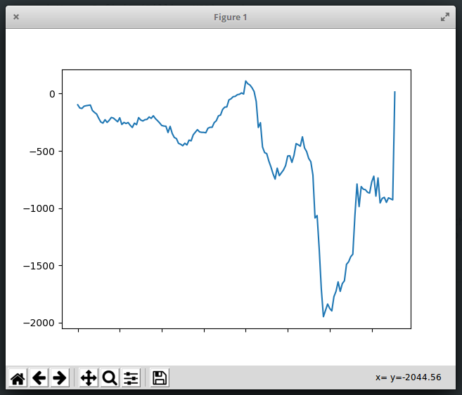
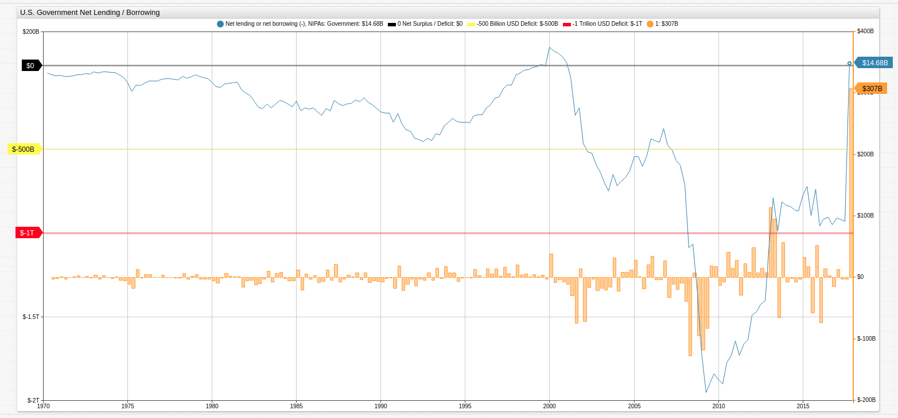
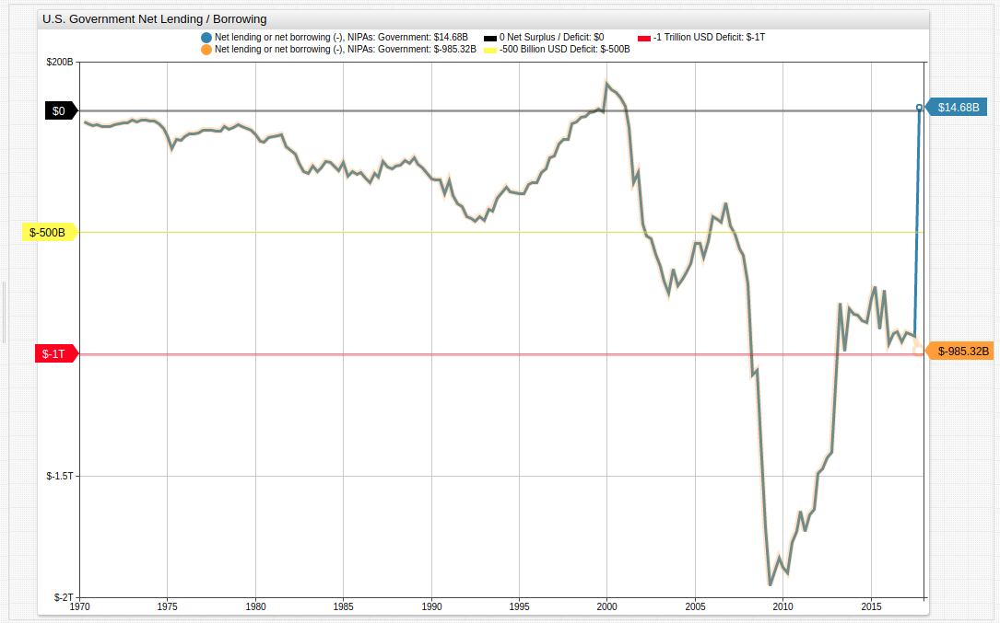

# SQL Queries and Data Visualization with Python and ATSD

## Introduction

[Python](https://www.python.org/) is an easy-to-use and versatile programming language that boasts code readability and functionality for tasks of any size. [Pandas](http://pandas.pydata.org/) is an open-source data analytics library designed for Python which offers the functional solutions of a more purpose-specific language like [R](https://www.r-project.org/) from within the Python interface. [Axibase Time Series Database](https://axibase.com/products/axibase-time-series-database/) is an enterprise-level data storage and processing environment that features a rule engine, SQL, and visualization functionality. Using these three tools, data analysis tasks may be approached from the ground up to unlock meaningful results from within a single interface.

## Dataset

The [Federal Reserve Economic Research Division](https://fred.stlouisfed.org/) of the St. Louis Federal Reserve publishes open-source data on a range of topics from macroeconomic trends like Gross Domestic Product to microeconomic phenomena such as unemployment and producer / consumer price indices.

While native FRED visualization tools have a number of built-in manipulation and export features, meaningful data munging and preparation requires a third-party resource. With the ATSD Client for Python and Pandas library, data may be queried using SQL and visualized for external use or analysis. This article will focus on the [net lending / borrowing](https://fred.stlouisfed.org/series/AD01RC1Q027SBEA) of the United States Government for the past several decades and explore the way these three tools intersect to facilitate data processing, storage, and exploration functionalities for true Big Data projects.

## Accessing Data

The dataset used for this article is stored in the **Trends** instance of ATSD. If you would like access credentials to the database to recreate the queries shown here, or query any of the other [datasets](https://trends.axibase.com/public/reference.html) stored there, [reach out to us](mailto:hello@axibase.com?subject=Trends%20Crendentials&body=Please%20send%20Trends%20credentials%20I'd%20like%20to%20use%20the%20database!), we're happy to provide them.

If you have access to your own instance of ATSD, upload the [FRED data crawler](https://github.com/axibase/atsd-data-crawlers/blob/master/crawlers/fred-category-crawler/README.md#fred-category-crawler). The data crawler can upload the needed dataset along with all metadata information.

## Setup

Confirm these programs are present on the local machine:

* Python: `apt-get install python3` (alternatively, `python2.7` may be used);
* ATSD Client: `pip install atsd_client`.

> ATSD Client will import the `pandas` library upon installation.

For detailed installation instructions, this [guide](https://github.com/axibase/atsd-api-python/blob/master/README.md) offers troubleshooting, launch examples, and a step-by-step walkthrough.

### Querying Federal Reserve Data with Inline SQL

After [setup](https://github.com/axibase/atsd-api-python/blob/master/README.md#axibase-time-series-database-client-for-python), SQL queries may be performed from the Python command line. Download the [Quick Start](resources/quickstart.py) program to establish connectivity, input a query, and return the results. Note that placeholder credentials must be replaced with authentic ones.

The FRED data is quarterly, this query tracks federal budget data from the final quarter for each recorded year:

```sql
SELECT datetime "Year",LAST(value) "Net Lending/Borrowing"
FROM "ad01rc1q027sbea"
GROUP BY period(1 year)
ORDER BY datetime DESC
limit 18
```

For multi-line queries in the Python interface, define a variable `q = """`, so multi-line queries may be made. Close the query with `"""`. The complete query will be:

```python
>>> q = """
... SELECT datetime "Year",LAST(value) "Net Lending/Borrowing"
... FROM "ad01rc1q027sbea"
... GROUP BY period(1 year)
... ORDER BY datetime DESC
... limit 18
... """
```

The most recent samples:

```txt
| 30  2000                           51.488 |
| 31  2001                         -253.246 |
| 32  2002                         -588.672 |
| 33  2003                         -650.718 |
| 34  2004                         -628.160 |
| 35  2005                         -537.567 |
| 36  2006                         -376.840 |
| 37  2007                         -594.622 |
| 38  2008                        -1357.509 |
| 39  2009                        -1838.034 |
| 40  2010                        -1727.036 |
| 41  2011                        -1635.086 |
| 42  2012                        -1402.966 |
| 43  2013                         -812.007 |
| 44  2014                         -868.867 |
| 45  2015                         -736.282 |
| 46  2016                         -949.905 |
| 47  2017                           14.676 |
```

The [`LIMIT`](https://github.com/axibase/atsd/tree/master/sql#limiting) clause may be removed from the query to return all data.

<details><summary>View the complete result set here:</summary>
<p>

```txt
| Year  Deficit / Surplus (Billion USD)     |
|-------------------------------------------|
| 0   1970                          -61.217 |
| 1   1971                          -62.891 |
| 2   1972                          -50.513 |
| 3   1973                          -37.343 |
| 4   1974                          -70.448 |
| 5   1975                         -120.060 |
| 6   1976                          -92.043 |
| 7   1977                          -82.716 |
| 8   1978                          -69.087 |
| 9   1979                          -80.250 |
| 10  1980                         -109.876 |
| 11  1981                         -147.411 |
| 12  1982                         -247.870 |
| 13  1983                         -232.744 |
| 14  1984                         -245.549 |
| 15  1985                         -260.890 |
| 16  1986                         -257.616 |
| 17  1987                         -238.781 |
| 18  1988                         -215.789 |
| 19  1989                         -255.620 |
| 20  1990                         -339.853 |
| 21  1991                         -392.791 |
| 22  1992                         -433.156 |
| 23  1993                         -359.510 |
| 24  1994                         -338.100 |
| 25  1995                         -294.010 |
| 26  1996                         -193.928 |
| 27  1997                         -115.766 |
| 28  1998                          -23.666 |
| 29  1999                           -3.048 |
| 30  2000                           51.488 |
| 31  2001                         -253.246 |
| 32  2002                         -588.672 |
| 33  2003                         -650.718 |
| 34  2004                         -628.160 |
| 35  2005                         -537.567 |
| 36  2006                         -376.840 |
| 37  2007                         -594.622 |
| 38  2008                        -1357.509 |
| 39  2009                        -1838.034 |
| 40  2010                        -1727.036 |
| 41  2011                        -1635.086 |
| 42  2012                        -1402.966 |
| 43  2013                         -812.007 |
| 44  2014                         -868.867 |
| 45  2015                         -736.282 |
| 46  2016                         -949.905 |
| 47  2017                           14.676 |
```

</p>
</details>

To refine the query and show only data where the United States had an annual surplus, use this query:

```sql
SELECT datetime "Year",LAST(value) "Net Lending/Borrowing"
FROM "ad01rc1q027sbea"
WHERE value > 0
GROUP BY period(1 year)
```

The result set shows only four years since 1970 when the United States achieved a net surplus.

```txt
| Year          Surplus (Billion USD)      |
|------------------------------------------|
| 0  1999                            6.35  |
| 1  2000                           51.49  |
| 2  2001                           18.48  |
| 3  2017                           14.67  |
```

When pandas and Python are used alongside ATSD, there is no need to import and filter data for robust SQL queries. Data is readily available and stored on-hand in ATSD and passed directly into the Python interface via ATSD Python Client.

Although it certainly appears that the United States government has achieved a budget surplus this quarter, in fact the nature of the data is such that it only seems that way. The dataset here is annualized, meaning that each quarter's data is plotted as if the trends remaining constant for the entire year. Thus, the administration's $250 billion tax relief is considered as $1 trillion due to annualization calculations. See [Non-Annualized Data](#non-annualized-data) for raw data examples.

The highest annual budget deficits incurred may be gathered with this query:

```sql
SELECT datetime "Year", LAST(value) "Deficit (Billion USD)"
FROM "ad01rc1q027sbea"
GROUP BY PERIOD(1 year)
ORDER BY LAST(value) ASC
LIMIT 10
```

The result set shows the years with the highest annual budget deficits.

```txt
| Year  Deficit (Billion USD)    |
|--------------------------------|
| 0  2009              -1838.03  |
| 1  2010              -1727.04  |
| 2  2011              -1635.09  |
| 3  2012              -1402.97  |
| 4  2008              -1357.51  |
| 5  2016              -949.90   |
| 6  2014              -868.87   |
| 7  2013              -812.01   |
| 8  2015              -736.28   |
| 9  2003              -650.72   |
```

It's no surprise that each of the years leading into, during, and immediately following the Great Recession and housing market collapse are among those which saw the largest growth in annualized government borrowing.

### Data Visualizations with `matplotlib` and **Trends** Service

The `matplotlib` library is a Matlab-like tool which offers an inline visualization solution for the Python interface. Follow the integration instructions [here](https://github.com/axibase/atsd-api-python#graphing-results) to import the library and work with it from the Python command line. Using government lending / borrowing data, a simple visualization may be created inline, using data which is stored in ATSD.



While lacking some of the detail of a more robust visualization service, the `matplotlib` tool is helpful for visualizing data transformations inline.

In order to create this visualization, queue the desired data following [these instructions](https://github.com/axibase/atsd-api-python#querying-data).

<details><summary>View command line syntax to convert the queued data to a pandas-readable series for visualization:</summary>
<p>

```python
## 'series' previously defined as series to be converted.
>>> ts = series.to_pandas_series()

## Confirm successful conversion.
>>> print(ts)

## Import tools and plot queued data.
>>> import matplotlib.pyplot as plt
>>> series.plot()

## Display newly-created visualization.
>>> plt.show()
```

</p>
</details>

Using the same data in the [**Trends**](https://github.com/axibase/atsd-use-cases/blob/master/how-to/shared/trends.md) service, which is a graphical environment supported by ATSD, more robust visualizations may be created with far less user input:



[](https://trends.axibase.com/224fd492)

*Fig 1.* This visualization leverages [user-defined functions](https://github.com/axibase/atsd-use-cases/blob/master/how-to/shared/trends.md#user-defined-functions) to display both the raw data as well as monthly change in value using a [dual-axis](https://axibase.com/products/axibase-time-series-database/visualization/widgets/time-chart/#tab-id-2) setting and `[threshold]` series.

Using **Trends** is an alternate solution to native `matplotlib` functionality in Python. **Trends** offers a convenient and well-documented [syntax](https://axibase.com/products/axibase-time-series-database/visualization/widgets/) that supports *ad hoc* data modifications that do not change the underlying dataset.

### Non-Annualized Data

As noted above, this dataset is annualized. This section of the article shows how to revert this transformation and present raw data:

```sql
SELECT datetime "Year",SUM(value/4) "Net Lending/Borrowing"
FROM "ad01rc1q027sbea"
GROUP BY period(1 year)
ORDER BY datetime DESC
```

Simply dividing by the number of annualized factors, in this case four quarters, and then summing them returns raw data.

| Year       | Net Lending/Borrowing |
|------------|-----------------------|
| 2017-01-01 | -685.56               |
| 2016-01-01 | -931.36               |
| 2015-01-01 | -781.12               |
| 2014-01-01 | -851.12               |
| 2013-01-01 | -913.30               |
| 2012-01-01 | -1447.01              |
| 2011-01-01 | -1666.73              |
| 2010-01-01 | -1818.96              |
| 2009-01-01 | -1847.06              |
| 2008-01-01 | -1054.96              |
| 2007-01-01 | -535.13               |
| 2006-01-01 | -429.80               |
| 2005-01-01 | -556.31               |
| 2004-01-01 | -675.52               |
| 2003-01-01 | -684.35               |
| 2002-01-01 | -523.37               |
| 2001-01-01 | -149.72               |
| 2000-01-01 | 81.14                 |
| 1999-01-01 | -2.84                 |
| 1998-01-01 | -37.36                |
| 1997-01-01 | -139.61               |
| 1996-01-01 | -244.25               |
| 1995-01-01 | -319.11               |
| 1994-01-01 | -330.87               |
| 1993-01-01 | -406.51               |
| 1992-01-01 | -441.19               |
| 1991-01-01 | -352.32               |
| 1990-01-01 | -296.46               |
| 1989-01-01 | -225.68               |
| 1988-01-01 | -217.87               |
| 1987-01-01 | -237.38               |
| 1986-01-01 | -270.47               |
| 1985-01-01 | -248.06               |
| 1984-01-01 | -224.12               |
| 1983-01-01 | -242.26               |
| 1982-01-01 | -201.48               |
| 1981-01-01 | -113.69               |
| 1980-01-01 | -115.53               |
| 1979-01-01 | -67.98                |
| 1978-01-01 | -73.20                |
| 1977-01-01 | -80.50                |
| 1976-01-01 | -96.37                |
| 1975-01-01 | -123.55               |
| 1974-01-01 | -51.64                |
| 1973-01-01 | -39.21                |
| 1972-01-01 | -52.12                |
| 1971-01-01 | -63.07                |
| 1970-01-01 | -49.26                |

Because annualized data assumes full-year totals based on single-quarter information, the current administration's $250 billion tax relief act is in fact counted as $1 trillion. This visualization removes that consideration.



[](https://trends.axibase.com/107eef06#fullscreen)

## Conclusion

Python programming language offers a convenient syntax for inline SQL queries. Using **ATSD Client** alongside other Python libraries improves upon native functionality by reducing the workload during data preparation. ATSD manages all data storage tasks and provides a client which makes data quickly available without loading it via Python.

**Trends** visualizaton services, supported by ATSD data storage and processing, support and enhance these features by offering a more robust graphical output with a less tedious syntactical input.