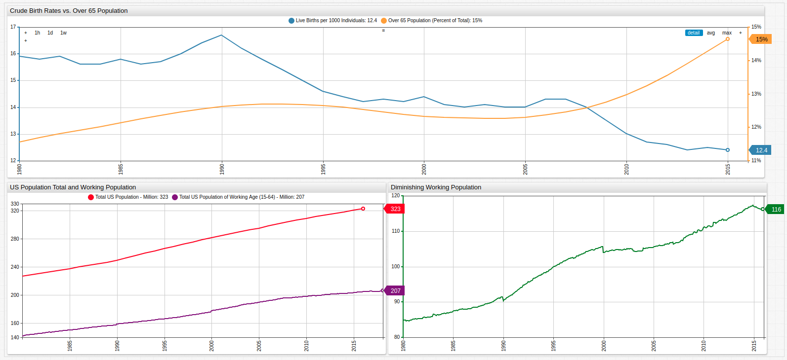
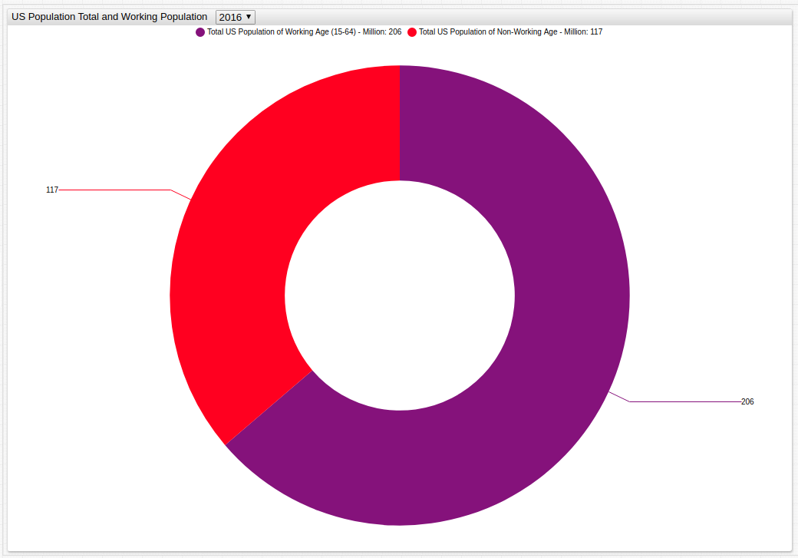
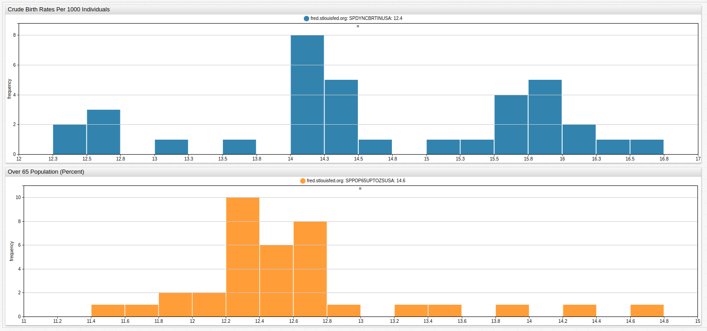
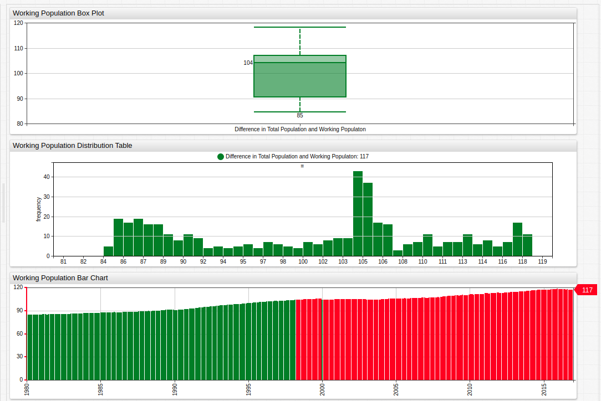
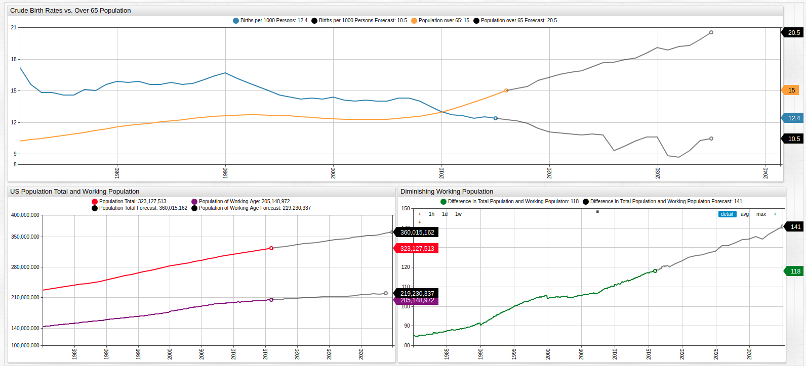

# Aging America: Modeling Birth Trends in the United States


[](https://trends.axibase.com/9703ea57#fullscreen)

> The upper graph shows the growing senior population contrasted to the diminishing birth rate.<br>The lower graphs show the growing difference in total population and total work-eligible population aged 15-64.

## Overview

The United States provides retirement security for the elderly and disabled in a number of ways: Medicaid, Medicare, and Social Security are the main components of the social welfare program. Each of these systems is financed primarily with payroll taxes called the Federal Insurance Contribution Act (FICA) tax. The underlying philosophy is that the able should pay for the healthcare of those unable to pay for themselves due to age or disability in the hopes that one day the next generation does the same for them. Sound logic to be sure, but what happens when the previous generation failed to repopulate the nation in the same way their parents did? What happens when this trend is repeated through one, two, three, or four generations? For a long time analysts have been warning about the coming drought in the Social Security Administration coffers, but more and more it is starting to appear that it may be just over the horizon.

## Objectives

Using [**Forecasting**](https://axibase.com/docs/atsd/forecasting/) functionality from ATSD, current population figures and birth data, models may be created to predict trends in the potential American population crisis.

## Data

All data is sourced from the United States Federal Reserve [FRED](https://fred.stlouisfed.org/) database.

* [U.S. Population Aged 65 or Above](https://fred.stlouisfed.org/series/SPPOP65UPTOZSUSA)
* [Crude Birth Rate for the United States](https://fred.stlouisfed.org/series/SPDYNCBRTINUSA)
* [Working Age Population: Aged 15 - 64](https://fred.stlouisfed.org/series/LFWA64TTUSM647S)
* [Population Total: United States](https://fred.stlouisfed.org/series/POPTOTUSA647NWDB)

Data is visualized using **Trends**, a public instance of ATSD with subsets of public data from organizations like the United States Federal Reserve, the Central Bank of Israel, the SEC, FCC, and other government agencies.

## Methodology

1. Visualize Datasets using [Trends](https://trends.axibase.com/);
2. Implement Forecasting for a five year period.

## Visualization

### Working Population as a Portion of Total Population

Open the **Trends** visualization and use the drop-down list to navigate through time to compare working-aged population to the United States total population.


[](https://trends.axibase.com/2228bbde#fullscreen)

*Fig 2*: The portion of the population eligible for work (aged between 15 and 64) is shown in purple, while the remaining ineligible population is shown in red.

### Births per 1000 / Population Over 65

The upper [Histogram Chart](https://axibase.com/docs/charts/widgets/histogram/) plots the frequency of each value of annual crude births per one thousand persons; the lower Histogram Chart tracks the 65+ population by percentage. Deceptively, the data seems to show that the average amount of births outperforms the aging population, but when scaled to 100, in fact, the aged population severely outnumbers the amount of crude births which are occurring.


[](https://trends.axibase.com/df87fe0c#fullscreen)

*Fig 3*: Open the **Trends** visualization and modify the number of bars in either histogram using a [`bar-count`](https://axibase.com/docs/charts/widgets/histogram/#bar-count) setting for more granularized data visualization.

### Diminishing Working Population

Using the [`value`](https://axibase.com/docs/charts/widgets/shared/#value) setting, create derived series with existing data. Here, the working-aged population is subtracted from the total population to create a new series which is then visualized.

```ls
# Example configuration for calculating and visualizing an ad hoc derived series.

[group]
  [widget]
    title = Working Population Bar Chart
    type = chart
    mode = column
    start-time = 1980
    end-time = 2017

    [series]
    metric = POPTOTUSA647NWDB
    display = false
    alias = pop

# Each series is given an alias, display setting is false (series is only used for calculation).

    [series]
    metric = LFWA64TTUSM647S_
    display = false
    alias = wpop

    [series]
    value = value('pop') - value('wpop')
    style = stroke-width: 2
    color = green
    label = Difference in Total Population and Working Populaton
    alert-expression = value > 104
    alert-style = color: red

# Calculated series has no metric value as it is only derived. Alert expression is entered based on information provided by box graph
```

Each of the target series is given an [`alias`](https://axibase.com/docs/charts/widgets/shared/#alias) which is then used to create the calculated series. For more information about creating calculated series in **Trends** or **ChartLab**, refer to the [Calculated Series Tutorial](../../tutorials//calculated-values/README.md).


[](https://trends.axibase.com/68f93899#fullscreen)

*Fig 4*: The [Box Chart](https://axibase.com/docs/charts/widgets/box-chart/) and Histogram Chart establish the median and range values of the dataset, which are then used in the [`alert-expression`](https://axibase.com/docs/charts/syntax/alert-expression.html#alert-expressions), which alerts when a condition is satisfied. Here, the condition colors a bar red if it is greater than the calculated median value. This shows that since late 1998, the number of people deemed ineligible to work has surpassed the calculated median value and continued to grow.

### Forecasting

Use [Data Forecasting](https://axibase.com/docs/atsd/forecasting/#data-forecasting) in ATSD to model future trends based on existing data.

> Refer to [Resources](#resources) to download the complete configuration used in this forecast or reference the abbreviated table below for a basic understanding of the underlying mathematics.

|Basic Forecast Configuration Information| |
|--|--|
|Algorithm | Holt-Winters |
|<big>&alpha;</big> value| 0.5|
|<big>&beta;</big> value|0.4|
|<big>&gamma;</big> value|0.5|
|Score Interval|5 Years|

The results for each of the original metrics are shown below for 20 years into the future.


[](https://trends.axibase.com/a2967bc9#fullscreen)

*Fig 5*: The original data is shown here with forecasts showing the potentially widening gap between those eligible to pay in to the Social Security system and those needing to be paid out from that system.

Scale Data Forecasting to work with <i>per annum</i> data as seen here just as readily as millisecond-frequency data input from a sensor or other device.

### Conclusion

Using forecasting, the continuation of mathematical trends is readily observable. Forecasts may include periodicity settings for data which is repetitive over some interval. In this example, only mathematical factors have been considered which any sociologist would say is flawed methodology since population reproduction is the result of an array of complicated non-mathematical factors as well. However, strictly mathematical modeling is often used to predict trends under the assumption that social factors remain constant for a given period of time.

### Resources

Use the following tools to replicate these results in a local ATSD instance:

* For information about modifying data visualizations in the **Trends** interface, see the [Trends Guide](../../tutorials/shared/trends.md);
* [Forecast Configuration](./resources/forecast-settings.xml);
* For detailed information about configuring the Forecasting tool, see this [guide](../../tutorials/shared/import-forecast.md).