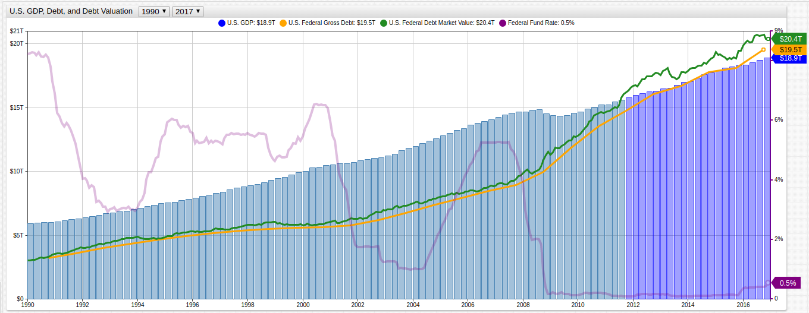
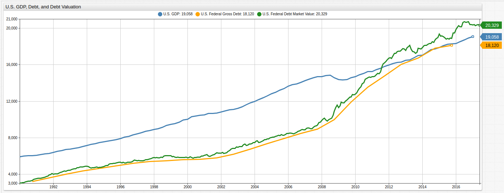
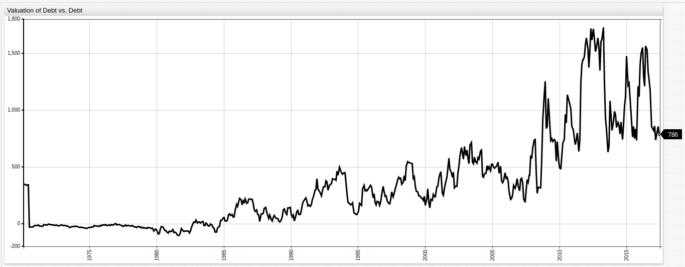
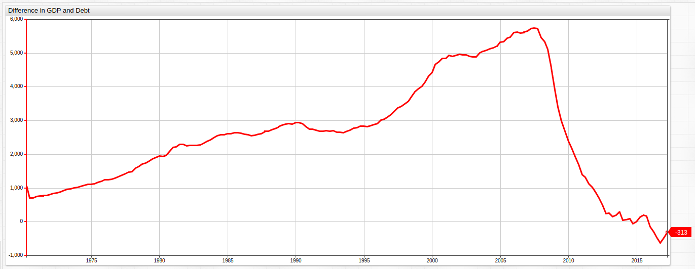
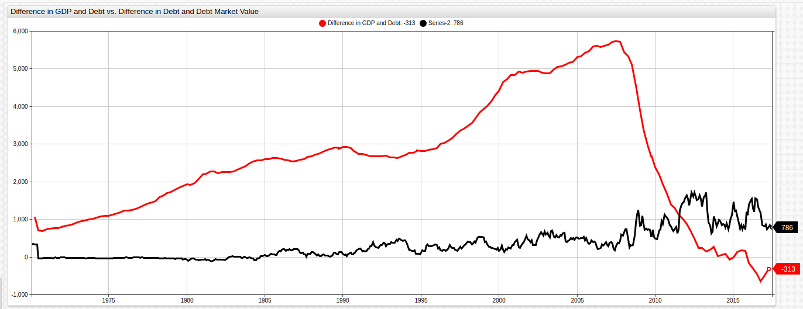
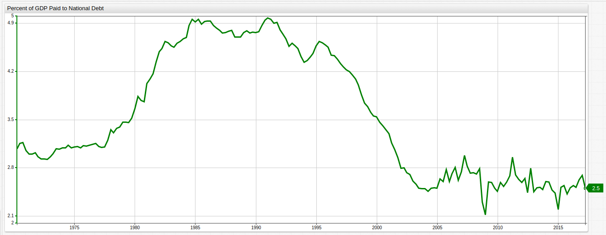
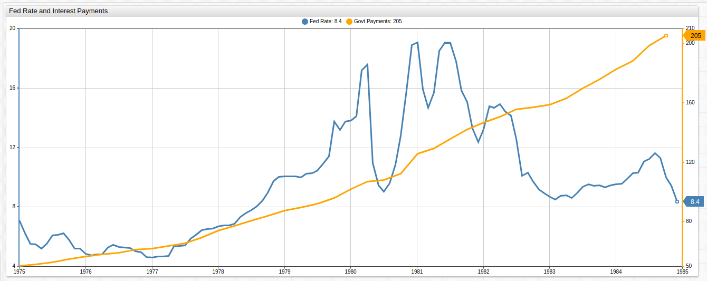
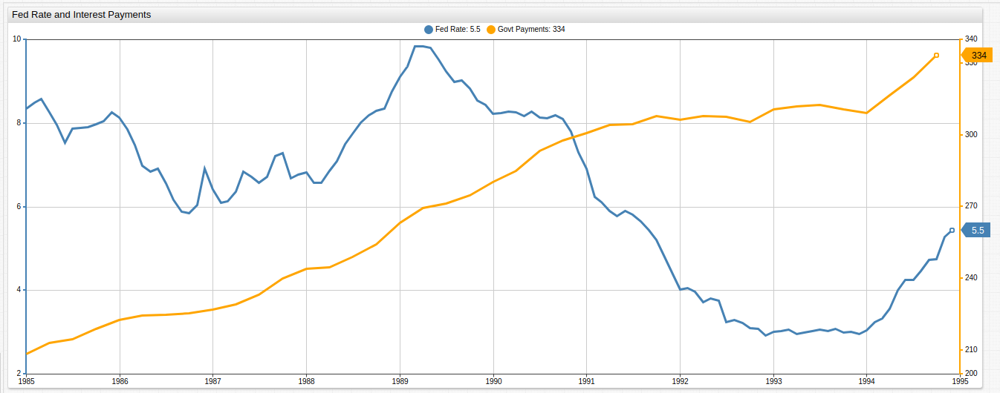

# The New Bubble: Fed Rates Stay Low While Debt Value Remains High

## Introduction

The interest rate paid by the United States on its outstanding debt is set by the Federal Reserve Bank of America, who is
designated by the government to handle the central banking policy of the United States. This rate has a huge impact on the
American economy as it controls the amount of interest the U.S. pays on its outstanding debt. Typically, increases in
the Federal Fund Rate indicate a downturn in the market value of the gross federal debt because it suggests a probable slow down
in government borrowing and repayment brought on by the higher rates. The market value of debt is inherently tied to the
borrowed rate.

This market value is at once a speculative metric, upon which a given debt is traded, and a quantitative metric, based on which
predictions and observations can be made about the overall health of an economy. Traditionally "good debt," that which is
expected to be repaid on time and in full, demands a lower market cost relative to its true value than debt that is unlikely to
be paid in a timely manner, or without some kind of additional financial machinations, accounting for the higher risk involved
in the position. The absolute value of the market price of U.S. Federal Debt has been rising steadily alongside the value
of U.S. GDP and other important financial metrics, with the difference between the absolute and traded value of the debt
being reasonably stable.

However, since the Great Recession of 2009, a different and more sinister trend has taken place, while the Fed keeps interest
rates at historically low levels the value of the market value of the federal debt continues to rise relative to the debt itself,
indicating speculation and volatility. The result is a new kind of bubble that could rattle the U.S. Economy far worse than
the downturn of 2009, which saw a loss of about a third of the household wealth of the average family ([1](#sources)).

## Analysis

**Figure 1**: United States GDP, Gross Debt, and Gross Debt Market Valuation

_Source_: [Federal Reserve Economic Data](#sources)

The above visualization, made using the non-relational ATSD,
tracks the growth of the United States GDP, Gross Debt, and Gross Debt Market Valuation. Since August 2011, the market value of
government debt has outstripped the value of the GDP meaning that the United States' debt is worth more than the country
is producing, that is, the traditionally safe United States index is primed to lose its position as the place to hold money
for reliable growth. Because the debt market value also considers the interest rate at which the debt is created it is considered a
more accurate indicator of the overall state of American debt ([2](#sources)) which is becoming more and more itself an indicator
of the state of the entire U.S. economy.

**Figure 2**: Difference in Gross Debt and Gross Debt Market Value

_Source_: [Federal Reserve Economic Data](#sources)

After plummeting amid recession in the 1990's, the difference between the gross debt and the market value of that debt has remained
fairly constant, within a trillion dollars of each other, until the beginning of the 2009 downturn saw that value spike above
a trillion for the first time in more than a decade. Such fluctuation has resulted in an inflation of the value of the United
States debt that could be described in one of two ways:

1. Investors are eager to cash in while the U.S. is selling valuable treasuries before a predicted recovery, the long position.

2. Investors are eager to cash in while U.S. debt is still able to be freely traded on, before a predicted default, the short position.

The relationship between debt and GDP is a tenuous one, as the GDP must
continue to grow relative to the debt, however shown below in **Figure 3**, that buffer zone, the difference in GDP and debt,
is shrinking and is still nowhere near the levels observed pre-recession.

**Figure 3**: U.S. GDP vs. Debt

_Source_: [Federal Reserve Economic Data](#sources)

When placed on an synchronous x-axis the relationship of the two metrics shows that even as the margin between GDP and debt
decreases, the margin between the debt and its market value increases.

**Figure 4**: Difference in Gross Debt and Gross Debt Market Value Compared to U.S. GDP vs. Debt

_Source_: [Federal Reserve Economic Data](#sources)

This observation is reinforced by the latest data, post-2015, showing a increase in the difference of GDP and debt, met by
a decrease in U.S. debt market value.

**Figure 5**: Percent of GDP Allocated to Debt Payments

_Source_: [Federal Reserve Economic Data](#sources)

Amid the increase in debt value, the actual of amount of wealth created in the United States, expressed by GDP, relative
to the amount of money the federal government is using to pay down the massive, [$20 trillion](http://www.usdebtclock.org/) debt
is sharply decreasing. Less than 2% of new wealth produced in the United States each year is allocated to paying down the debt.
In fact, since the 2009 meltdown, the Fed has kept interest payments low to allow the government to continue paying down the debt,
which skyrocketed during the recession due to now infamous government bailouts of several major financial institutions ([4](#sources)),
without completely suffocating the American economy.

Low interest rates are of course a double-edged sword. While good for borrowers who are not eager to see all of their money
used to simply pay down the interest of the debt, without doing anything to the debt itself, for savers, low interest rates
mean diminishing returns on their savings especially in the face of the consumer price index, which has more than doubled since 1990 ([5](#sources)).

## The Bubble

**Figure 6**: Fed Fund Rate and Federal Debt Payments

_Source_: [Federal Reserve Economic Data](#sources)

While the government is able to make payments at a lower interest rate, consumers are seeing what is left of their savings accounts
slowly drained as the Consumer Price Index continues to affect the value of their personal wealth via inflation ([6](#sources)).
Increased market activity surrounding Fed announcements ([7](#sources)), shows how ready investors are for a decision from
the Fed to cave to public pressure, hike interest rates, and potentially trigger a huge sell-off and devaluation of American
debt.

The stage is perfectly laid now for American economic hegemony to be challenged as the cost of not raising interest rates
is continued unchecked inflation sapping consumer savings, while the cost of raising interest rates may cause the U.S. government
to default on its outstanding debt. However, keeping interests rates lower than inflation can have the effect of
stagnating the fragile economy as consumers are reluctant to use their saving, resulting in the economy collapsing from the bottom up,
and not the top down-- as in the Spanish Price Revolution of the 17th century ([8](#sources)).

Raising interest rates even just 1%, to roughly 2%, would double the required annual payment by the United States Government
to almost a trillion dollars. Such an increase would effectively double the budget deficit overnight. For comparison, of
historical Fed Rates vs. U.S. Government payments are shown below:

**Figure 7**: Fed Fund Rate and Federal Debt Payments During 1980s Recession

_Source_: [Federal Reserve Economic Data](#sources)

**Figure 8**: Fed Fund Rate and Federal Debt Payments During 1990s Recession

_Source_: [Federal Reserve Economic Data](#sources)

While the overall relationship between the Fed Rate and the amount paid towards the gross debt is similar, worth
noticing is the substantial volatility in payments present in the most recent recession comparison, **Figure 6**. During earlier recessions,
the brunt of the economic damage exacted on consumers is affected by inflation of costs and low returns on savings,
but during the most recent downturn it was the government itself who seemed to be struggling to make payments. While the United
States has restructured or "partially defaulted" on its debt a least four times in the history of the Republic ([9](#sources)),
a true default has never occurred and it could have any number of effects both predictable and not, underlining the essential and pressing need for
the American government to address its spending problem before the floor gives out and investors, smelling blood in the water,
move their resources to something more stable.

## Conclusion

The difference in debt market value and actual gross debt shows just how active trading is becoming around U.S. treasuries
markets. The inflation in value of U.S. government debt indicates the presence of another bubble, and not one that is confined
to a handful of industries, but one that is rooted in the overall reliability of the market itself. Such a bubble, matched with
a Federal Reserve that is effectively powerless to pull its traditional levers of power, means that the fate of the U.S. market
is firmly in the hands of the people that make up that economy.

If Americans cannot recover, fiscally and mentally, from the challenges of the last decade, the torch of economic hegemony
may be passed on to the next world superpower. Historically speaking, this transition has never been without a few bumps
in the road, as the nature of such an event is inherently rooted in upheaval, turmoil, and uncertainty. Without a doubt,
investors have their hands full as the American government tries to keep a lid on the Pandora's Box of bottomless debt in the
age of Neo-liberalism.

## Sources

> All charts from this article can be viewed together [here](https://apps.axibase.com/chartlab/c91957c0/2/).

1. [Smithsonian Magazine](http://www.smithsonianmag.com/smart-news/average-american-household-lost-third-their-net-worth-during-recession-180952191/); 2014; Shultz, Colin.

2. [Dallas Federal Reserve](https://www.dallasfed.org/research/econdata/govdebt); 2017 ; Mihaylov, Emil

3. Federal Reserve Economic Data: [U.S. GDP](https://fred.stlouisfed.org/series/GDP), [U.S. Gross Debt](https://fred.stlouisfed.org/series/FYGFD), [U.S. Gross Debt Market Value](https://fred.stlouisfed.org/series/MVGFD027MNFRBDAL),
 [U.S. Payments Towards Federal Debt](https://fred.stlouisfed.org/series/A091RC1Q027SBEA), [Federal Fund Rate](https://fred.stlouisfed.org/series/FEDFUNDS)

4. [Brookings Institution](https://www.brookings.edu/blog/ben-bernanke/2015/03/30/why-are-interest-rates-so-low/); 2015; Bernake, Ben

5. [Axibase Research](../../../tutorials//calculated-values/README.md); 2017; Hamilton, Kenneth

6. [Axibase Research](../../cbisrael-cpi/README.md); 2017; Hamilton, Kenneth

7. [Bloomberg Markets](https://www.bloomberg.com/news/articles/2017-08-25/gold-shaken-out-of-slumber-by-a-mysterious-2-million-ounce-trade); 2017; Barton, Susanne and Javiar, Luzi-Ann

8. [World Atlas](http://www.worldatlas.com/articles/what-was-the-price-revolution.html); 2017 ; Kimutai, Kenneth

9. [Business Insider](http://www.businessinsider.com/econ-myth-busting-sorry-john-carney-the-us-is-not-a-default-virgin-2011-5); 2011; PolyCapitalist, The
