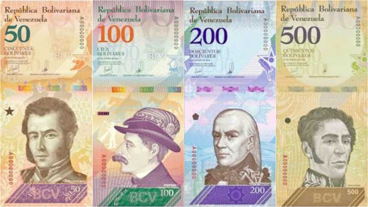
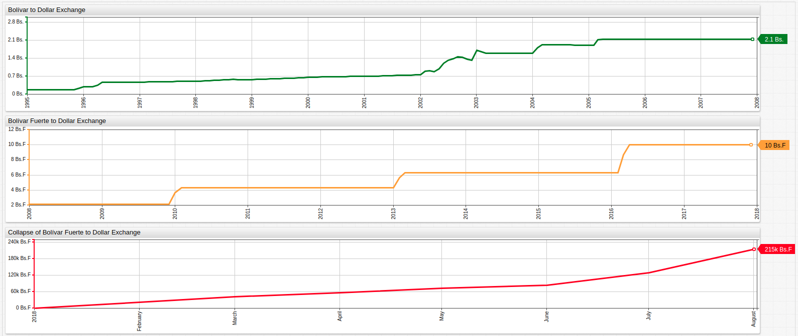
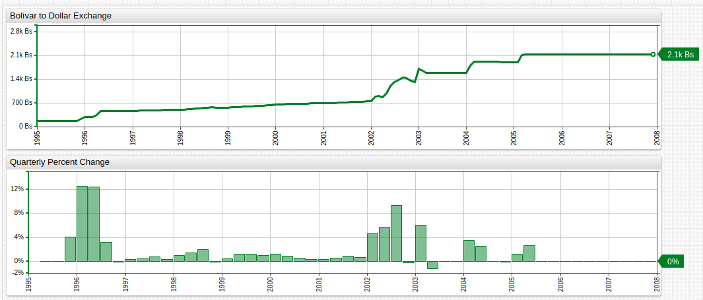
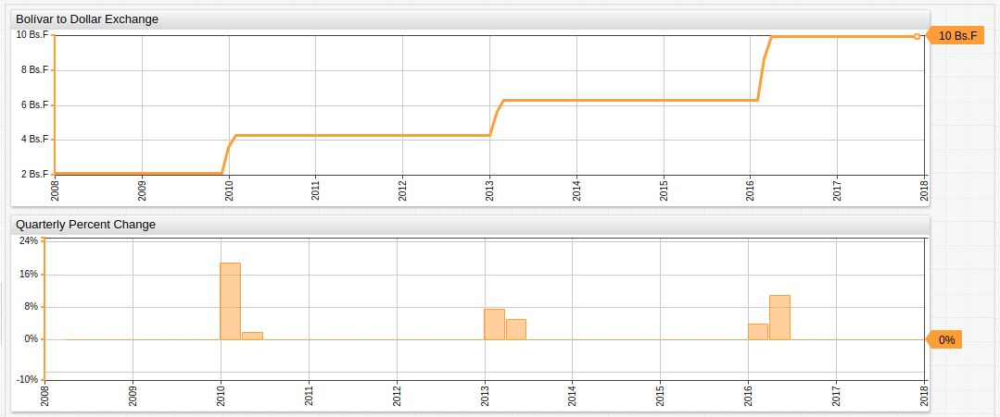
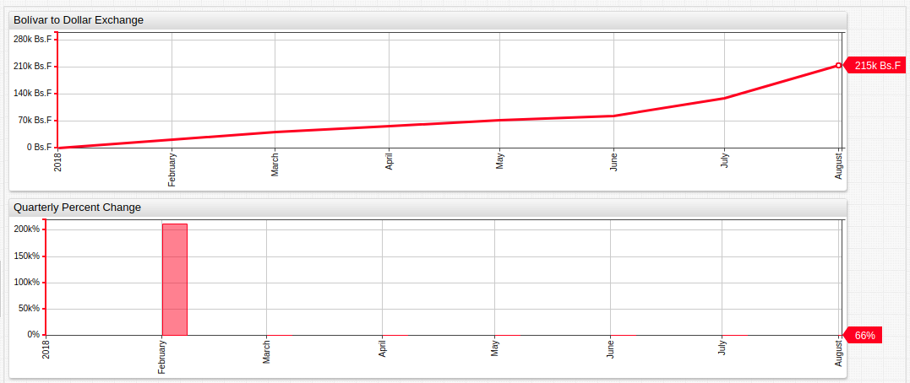
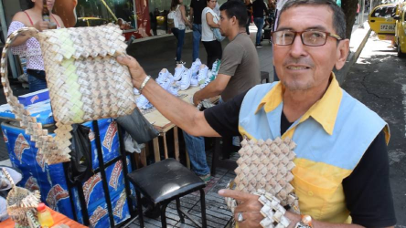
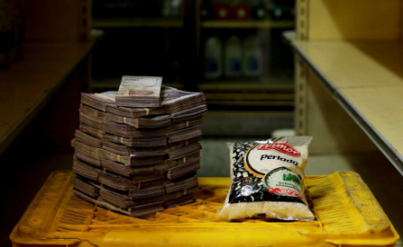
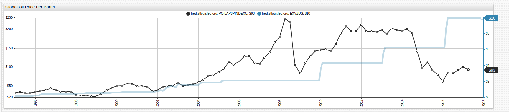

# The Birth of the Bolívar Soberano

> [ATSD](https://axibase.com/docs/atsd/) was used for visualization and data storage tasks related to this article.

## Introduction

After prolonged economic downturn and hyperinflation the likes of which have never been seen since Venezuelan independence from Spain in 1811, the government of President Nicolás Maduro announced on August 20 the creation of a new national currency: the Bolívar Soberano (English: Sovereign Bolivar).

The currency will be introduced to the market at a rate of 100,000 Bs.F to 1 Bs.S, replacing the Bolívar Fuerte (English: Strong Bolivar).

## Inflation Visualized

The portal above tracks the Bolívar during three stages of inflation. The first chart shows the Bolívar (Bs) against the United States Dollar (USD) in Bolívar Fuerte denomination. The Bolívar Fuerte was introduced in at a rate of 1,000 Bs to 1 Bs.F after having previously introduced price controls in 2005 to curb the rapid devaluation which occurred the previous year.

Quarterly percent change is shown alongside the monthly exchange rate in the portal above from 1995 to 2008, highlighting that although inflation was high, it never exceeded more than an average 15% for any given quarter.

Once price controls were established by the Venezuelan Central Bank, the currency was only reappraised in cases the bank deemed worthy. Thus, inflation was confined to six month readjustments, but nonetheless never exceeded 20% in a given quarter, although they did begin to occur at a greater frequency. The currency controls were part of a broader expansion of government authority in the economic sector as part of then President Hugo Chavez' restructuring of the country's financial landscape. This included nationalization of the nation's oil industry to facilitate social works programs like the [Bolivarian missions](https://en.wikipedia.org/wiki/Bolivarian_missions).

Hyperinflation struck Venezuela in early 2018, with the currency deflating in value 200,000%. Since then, inflation has exceeded 30% nearly every month creating a completely untenable exchange rate against the United States Dollar, roughly 220,000:1.

The currency's value has become so trivialized that small denomination bills are commonly [used as confetti during baseball games](https://www.bloomberg.com/news/articles/2018-03-02/venezuelans-are-paying-a-100-premium-for-cash) and street vendors have begun to create resellable crafts with the near-valueless paper notes.

To buy one kilogram of rice requires being a Bolívar millionaire in the formerly most affluent country in South America, as simple bag of the staple food costs around 2,500,000 Bs.F at the moment.

## Dutch Disease Writ Large

The somewhat disparaging name for the casual relationship between development in a specific sector and lack of development in all others, was coined by the publication **The Economist** in the 1970s to describe the slowdown observed in the Netherlands after the discovery of the Gronongin natural gas fields in the late 1950s.

With complete reliance on the price of oil to finance his long-reaching social programs, Hugo Chavez unwittingly signed Venezuela's economic death warrant. Upon the discovery and implementation of new recovery methods such as fracking, sanctions on some of the companies with whom Chavez was known for dealing, and above all, the precipitous fall of oil prices, the seeds of economic collapse have been sown.

As of 2014, Venezuela has the largest proven oil reserves in the world. This announcement came just three years after the ostensibly socialist President Hugo Chavez nationalized the country's oil reserves. Venezuela is one of the largest suppliers of oil to United States, and hosts a number of international oil ventures.

Using a [dual axis](https://github.com/axibase/charts/blob/master/widgets/time-chart/README.md) setting in [ChartLab](../../tutorials/shared/chartlab.md), global crude oil prices are shown alongside the exchange rate of the Bolívar Fuerte to United States Dollar. 2014 marked a steep decline in oil prices which may have even been related to the Venezuelan announcement of its newly proven reserves. FRED data only tracks oil prices as recently as April 2017, but even since then the price has continued to fall, with OPEC announcing on August 17, 2018 that the [overall price basket](https://www.opec.org/opec_web/en/press_room/4749.htm) for fifteen different types of crude oil stood at $70.27.

## Conclusion

Total proven oil reserves of the world notwithstanding, the continued effort by China to declare at least partial independence from its tremendous appetite for oil, coupled with the newfound ability of the United States to produce a record amount of oil locally, alongside perpetual Russian oil autonomy puts Venezuela, and indeed, other oil-dependant nations in a difficult position at the moment.

The hyperinflation leading to near complete devaluation of the Venezuelan currency has starkly underlined the dangers of trying to maintain a completely commodity-driven economy, especially whilst trying to improve social infrastructure with that commodity underwriting its costs.