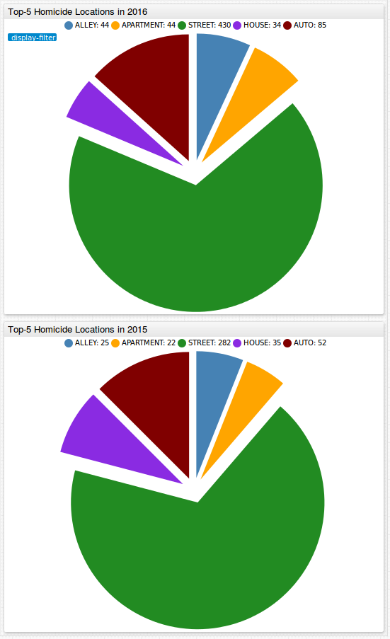
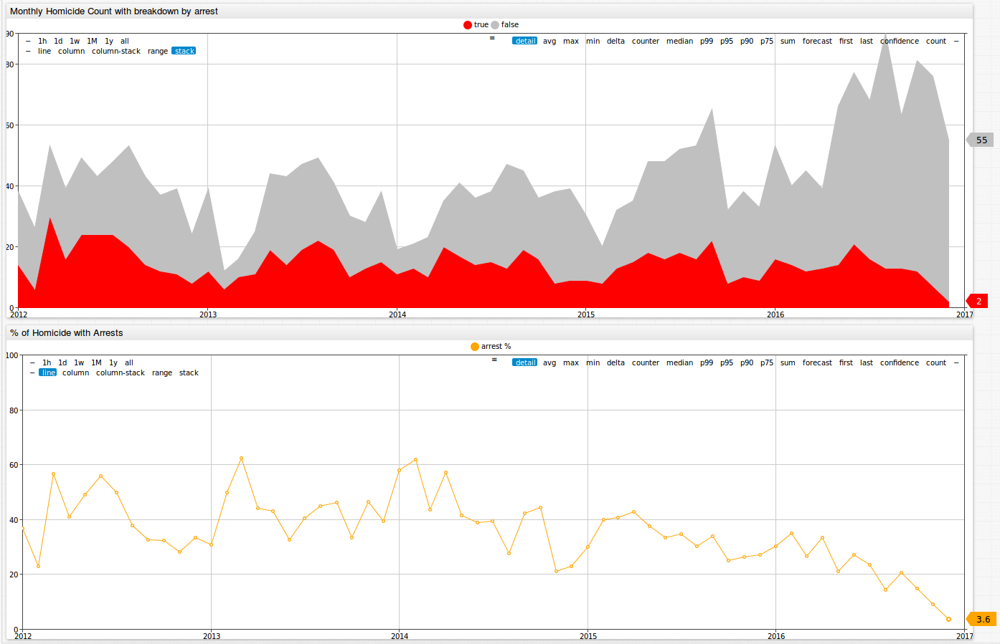
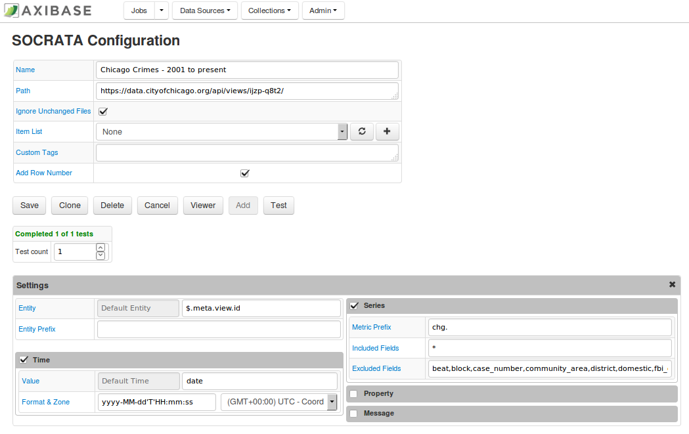
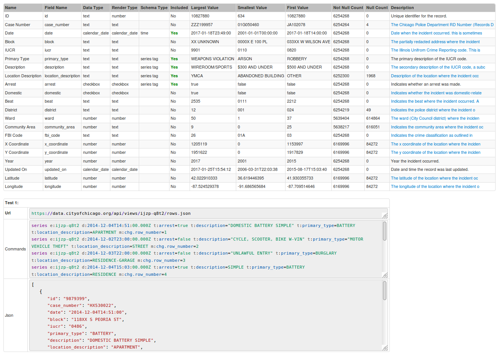

 

# Analyzing Chicago Crime Statistics

## Introduction

Pizza. Michael Jordan. Lake Michigan. Jazz. The Bean. These are some of the great things that Chicago, Illinois, is known for. There is another thing that has defined the city since its birth, and
as of late seems to be all we think about when it comes to Chicago: **crime**. In 2016, Chicago, the 3rd most populous city in the United States, had more homicides
than New York City and Los Angeles **combined**. In 2016, there were 753 murders in the city, a **55% increase** from 486 in 2015. In 2016, there were 4,331 total shooting victims, compared to 2,939
in 2015. From 2004 to 2015, the peak number of murders in the city was under 500. From 2011 to 2015, the city recorded less than 3,000 shooting victims per year. So what is the reason for this alarming
increase in violence in Chicago? Was there an increase in all kinds of crime, or was the rise in murders and shootings an exception? In this article we will analyze a dataset from [data.gov](https://www.data.gov/)
looking at [Chicago crime statistics](https://catalog.data.gov/dataset/crimes-2001-to-present-398a4) from 2001 to the present time. This research article illustrates how publicly available data
from data.gov can be easily loaded into the non-relational [Axibase Time Series Database](https://axibase.com/docs/atsd/) for interactive analysis and graphical
representation of raw data collected by government and private organizations. The article provides both sample queries and charts, as well as instructions on how to install your own ATSD instance
and populate it with the raw data.

## Chicago Crime Statistics Dataset

Let's take a look at the dataset titled **Crimes - 2001 to present** from [data.gov](https://www.data.gov/).

This dataset can be found [here](https://catalog.data.gov/dataset/crimes-2001-to-present-398a4). On the data.gov website, this dataset can be downloaded as a CSV (1.4 GB), RDF, JSON (**2.8 GB**), or a
XML file. This dataset can easily be parsed using the JSON job in Axibase Collector.

This dataset contains crime statistics collected daily from 2001 to the present time. This dataset is continuously updated with a time lag of 7 days. Statistics are available for **32 different crime types**. Furthermore, these crimes may be filtered by the location
where the crime occurred, and by the specific crime type. For example, for the crime type **Narcotics**, you may filter by 96 locations (for example, alley, street, gas station) and 49 specific violations (possession
of cocaine, manufacturing and delivering heroin, soliciting narcotics etc). Each crime type has its own number of locations and specific violations that it may be sorted for.

Given the size of the dataset, you cannot load it in Excel. It is much more convenient to interact with the data once it is loaded into a database. The
[Axibase Time Series Database](https://axibase.com/docs/atsd/) is a powerful tool when it comes to storing, analyzing, and visualizing datasets. We will use two capabilities of ATSD to explore this dataset:

* Interactive graphs from [Chart Lab](../how-to/shared/chartlab.md);

* Tabular outputs from analytical [SQL queries](https://axibase.com/docs/atsd/sql/).

You can load the dataset into an ATSD instance by following the steps provided at the [end of the article](#action-items).

## Homicide Numbers

Below is an image of monthly homicide totals from January 2001 through December 2016, but with a zoomed in screenshot starting with 2008. The month with the highest murder total in 2016 was August, which experienced 90 murders. August 2015 only had 53 murders.
Taking a closer look at this graph, we can see that every year seems to follow a general trend of low numbers to start the year out, with totals increasing in the summer months, and then dropping back
down as winter approaches.


Click on the Chart Lab button below to take a closer look at these numbers, as well as monthly totals for 31 other crime types, including weapons violations, prostitution, robbery, assault, and
domestic violence, among many others.

[](https://apps.axibase.com/chartlab/3f33d4ba#fullscreen)

From the previous figure we can acquire a general understanding of the homicide landscape in Chicago, but it is difficult to tell how monthly totals for 2016 compare to previous years. Looking at the below
line chart, we can see that murder totals were higher almost across the board for 2016 than from 2007 through 2015.


Click on this button to explore this Chart Lab portal:

[](https://apps.axibase.com/chartlab/3f33d4ba/16/#fullscreen)

In addition to looking at graphical outputs, we can also perform [SQL queries](https://axibase.com/docs/atsd/sql/), which can be used to search for specific
information contained in this dataset. For example, we can see that 2016 months totals are greater than the previous years as a whole. But what were the average monthly totals for the last several
years before the city experienced the horrific spike of 2016?

```sql
SELECT date_format(time, 'MMM') AS "month", avg(value)
FROM "cc.cases-by-primary-type"
 WHERE datetime >= '2001-01-01T00:00:00Z' AND datetime < '2016-01-01T00:00:00Z'
 AND tags.primary_type = 'HOMICIDE'
GROUP BY date_format(time, 'MMM')
ORDER BY date_format(time, 'MM')
```

| month  | avg(value) |
|--------|------------|
| Jan    | 30.4       |
| Feb    | 22.9       |
| Mar    | 34.1       |
| Apr    | 38.5       |
| May    | 43.4       |
| Jun    | 48.3       |
| Jul    | 55.1       |
| Aug    | 49.8       |
| Sep    | 47.5       |
| Oct    | 41.7       |
| Nov    | 37.6       |
| Dec    | 36.3       |

How about the deadliest day of the week in Chicago in 2016?

```sql
SELECT date_format(time, 'EEE') AS "day_of_week", count(value)
 FROM "chg.row_number.ijzp-q8t2"
WHERE datetime >= '2016-01-01T00:00:00Z'
 AND tags.primary_type = 'HOMICIDE'
GROUP BY date_format(time, 'EEE')
```

| day_of_week  | count(value) |
|--------------|--------------|
| Mon          | 112          |
| Tue          | 106          |
| Wed          | 105          |
| Thu          | 85           |
| Fri          | 107          |
| Sat          | 123          |
| Sun          | 142          |

Did the most common locations for homicides change from 2015 to 2016? The below pie chart shows the top five locations where homicides were committed in 2015 and 2016. Both years have the same top five
locations for murders (alley, apartment, street, house, auto) and we can see that the greatest number of homicides took place on the street. The percentage of murders on the street in 2015 and 2016
was exactly same at 68%.



Click on this button to explore the Chart Lab portal for the top five locations for homicides in 2015 and 2016:

[](https://apps.axibase.com/chartlab/d5c04002/6/#fullscreen)

With the below SQL query, we can look at the average number of the top locations of murders from 2001 through 2015.

```sql
SELECT tags.location_description, count(value)/15
FROM "chg.row_number.ijzp-q8t2"
WHERE datetime >= '2001-01-01T00:00:00Z' and datetime < '2016-01-01T00:00:00Z'
AND tags.primary_type = 'HOMICIDE'
GROUP BY tags.location_description
--HAVING count(value)/15 >= 5
ORDER BY 2 DESC
LIMIT 20
```

| tags.location_description  | count(value)/15 |
|----------------------------|-----------------|
| STREET                     | 230.1           |
| AUTO                       | 58.3            |
| APARTMENT                  | 41.9            |
| ALLEY                      | 31.5            |
| HOUSE                      | 26.2            |
| PORCH                      | 15.2            |
| YARD                       | 9.9             |
| PARKING LOT                | 8.3             |
| PARK PROPERTY              | 5.9             |
| VACANT LOT                 | 5.5             |
| HALLWAY                    | 5.0             |
| GANGWAY                    | 3.9             |
| RETAIL STORE               | 3.9             |
| GAS STATION DRIVE/PROP.    | 2.7             |
| GARAGE                     | 2.5             |
| CHA GROUNDS                | 2.5             |
| RESTAURANT                 | 2.3             |
| CHA HALLWAY                | 2.3             |
| CHA PARKING LOT            | 2.3             |
| TAVERN                     | 2.0             |

If you would like to see more queries on this Chicago crime dataset, please go to the [Additional SQL Queries](#additional-sql-queries) section at the end of this article.

## A Deeper Look at Crime in Chicago

So, what caused this drastic increase in murders in Chicago in 2016? Did the city experience an overall increase in crime?

There actually has been a long term decrease in crime as a whole in Chicago, as we can see in the figure below.


Click on the button below to explore this Chart Lab portal:

[](https://apps.axibase.com/chartlab/3f33d4ba/4/#fullscreen)

Below is a figure showing the change from 2015 to 2016 for each of the crime types included in this dataset.


Click here to check out these percentage changes in Chicago crime in Chart Lab:

[](https://apps.axibase.com/chartlab/d5c04002/7/#fullscreen)

There were increases for certain crimes in 2016 from 2015. For example, the number of arrests increased for each of the following crime types:

* Robbery: 9,611 to 11,894 (**23.8%**)
* Motor vehicle theft: 9,001 to 10,247 (**13.8%**)
* Assault: 16,885 to 18,580 (**10.0%**)
* Criminal sexual assault: 1,306 to 1,426 (**9.2%**)

The number of arrests decreased for each of the following crime types:

* Narcotics: 25,562 in 2015 to 12,329 (**48.0%**)
* Gambling: (**39%**)
* Liquor Law Violations: (**23%**)

While a decrease in the number of arrests may seem like a good thing, it could possibly mean quite the opposite. Below is a screenshot of narcotics possession arrests from 2011 through 2017. There seems to be
a relative steady decline beginning in 2011. One may think initially that this is because of the eradication of drugs from the city, which would lead to a fewer number of arrests. However, a one
year reduction of 48.0% for narcotics makes one think that there may be something else at play.


Click this button to check out narcotic arrests in Chicago:

[](https://apps.axibase.com/chartlab/3f33d4ba/7/#fullscreen)

According to [an article by the Chicago Tribune](http://www.chicagotribune.com/news/opinion/editorials/ct-chicago-crime-increase-causes-edit-0118-md-20170117-story.html),
the release of a video in November 2015 showing the police fatally shooting of a black teenager ([Laquan McDonald](https://en.wikipedia.org/wiki/Shooting_of_Laquan_McDonald)), the launch of a
[Justice Department investigation](http://www.reuters.com/article/us-usa-police-trump-insight-idUSKBN15E106) of the Chicago Police Department
(which found that the Chicago Police routinely used excessive force and violated the constitutional rights of residents, particularly minorities), and a decline
in the number of street stops by the police resulting from a new policy on street stops between the city of Chicago and the American Civil Liberties Union have had a drastic affect on policing in
Chicago. According to [Vice News](https://news.vice.com/video/with-killings-on-the-rise-in-chicago-police-are-putting-their-hands-up), because of the Laquan McDonald shooting (as well as the other
two points), the police have become afraid of becoming the next "viral video" and are less willing to go out, put themselves on the line, and prevent murders and make narcotics involved arrests.

Can this really be true? Have the police become less engaged in saving the city of Chicago? Below is a figure showing the monthly homicide count in Chicago with breakdown by arrest. The red represents murders that resulted in an arrest at the time of the incident, while grey represents
murders without any arrests made. We can see that December 2016 had 57 murders. Of these murders, 55 had no arrest made and only 2 resulted in an arrest, resulting in a 3.6% arrest rate. What can this
drastically low arrest rate be due to? Is it because there is such a high number of killings that the police are unable to make any arrests? Or have the police become less invested in their work, and
as a result less willing to go out, fight crime, make arrests, and make a difference? Take a look at this dataset on Chicago crime and be the judge for yourself.



Click here to explore this Chart Lab portal:

[](https://apps.axibase.com/chartlab/3f33d4ba/8/#fullscreen)

## Action Items

Below are the summarized steps to follow to install local configurations of ATSD and Axibase Collector and create SQL queries for analyzing Chicago crime statistics:

1. Install [Docker](https://docs.docker.com/engine/installation/linux/ubuntulinux/).
2. Download the [`docker-compose.yml`](https://raw.githubusercontent.com/axibase/atsd-use-cases/master/chicago-crime-stats/resources/docker-compose.yml) file to launch the ATSD / Axibase Collector container bundle.

   ```bash
   curl -o docker-compose.yml https://raw.githubusercontent.com/axibase/atsd-use-cases/master/chicago-crime-stats/resources/docker-compose.yml
   ```

3. Launch containers:

   ```bash
   export C_USER=myuser; export C_PASSWORD=mypassword; docker-compose pull && docker-compose up -d
   ```

4. The dataset is over 3 gigabytes, so give Axibase Collector 15-20 minutes to download, parse, and insert data into ATSD. You can monitor the progress on the Job Statistics page in Axibase Collector.





If you require assistance in installing this software or have any questions, please feel free to [contact us](https://axibase.com/feedback/) and we would be happy to be of assistance!

## Sources

[Title Photo](http://www.zerohedge.com/news/2016-08-23/chicagos-violent-crime-spreading-safe-north-side)

## Additional SQL Queries

Here are some additional SQL queries (along with snippets of their outputs) which take a closer look at some of the crime statistics in Chicago.

Homicide statistics from January 1, 2016, to the present time. All tags from the dataset are included.

```sql
SELECT *
FROM "chg.row_number.ijzp-q8t2"
WHERE datetime >= '2016-01-01T00:00:00Z'
AND tags.primary_type = 'HOMICIDE'
LIMIT 1000
```

| entity     | datetime              | value    | tags.arrest  | tags.description     | tags.primary_type  | tags.location_description |
|------------|-----------------------|----------|--------------|----------------------|--------------------|---------------------------|
| ijzp-q8t2  | 2016-01-01T02:37:00Z  | 3946209  | false        | FIRST DEGREE MURDER  | HOMICIDE           | STREET                    |
| ijzp-q8t2  | 2016-01-01T07:20:00Z  | 3946304  | false        | FIRST DEGREE MURDER  | HOMICIDE           | AUTO                      |
| ijzp-q8t2  | 2016-01-01T22:48:00Z  | 3946386  | true         | FIRST DEGREE MURDER  | HOMICIDE           | AUTO                      |
| ijzp-q8t2  | 2016-01-03T13:17:00Z  | 3946532  | false        | FIRST DEGREE MURDER  | HOMICIDE           | AUTO                      |
| ijzp-q8t2  | 2016-01-04T08:58:00Z  | 3946583  | true         | FIRST DEGREE MURDER  | HOMICIDE           | STREET                    |
| ijzp-q8t2  | 2016-01-05T01:52:00Z  | 3946672  | false        | FIRST DEGREE MURDER  | HOMICIDE           | STREET                    |

Number of arrests made for homicides in 2015 and 2016. When `tags.arrest` is `true`, it means that an arrest was made. When this tag is `false`, no arrest was made.

```sql
SELECT datetime, tags.arrest, count(value)
FROM "chg.row_number.ijzp-q8t2"
WHERE datetime >= '2015-01-01T00:00:00Z' and datetime < '2017-01-01T00:00:00Z'
AND tags.primary_type = 'HOMICIDE'
GROUP BY tags.arrest, period(1 month)
```

| datetime              | tags.arrest  | count(value) |
|-----------------------|--------------|--------------|
| 2015-01-01T00:00:00Z  | false        | 21           |
| 2015-02-01T00:00:00Z  | false        | 12           |
| 2015-03-01T00:00:00Z  | false        | 19           |
| 2015-01-01T00:00:00Z  | true         | 9            |
| 2015-02-01T00:00:00Z  | true         | 8            |
| 2015-03-01T00:00:00Z  | true         | 13           |

Number of arrests made for narcotics possession in 2014.

```sql
SELECT tags.description, count(value)
FROM "chg.row_number.ijzp-q8t2"
WHERE datetime >= '2014-01-01T00:00:00Z' and datetime < '2015-01-01T00:00:00Z'
AND tags.primary_type = 'NARCOTICS'
AND tags.description LIKE 'POSS%'
GROUP BY tags.description
--HAVING count(value)/15 >= 5
ORDER BY 2 DESC
LIMIT 20
```

| tags.description                 | count(value) |
|----------------------------------|------------- |
| POSS: CANNABIS 30GMS OR LESS     | 12732        |
| POSS: HEROIN(WHITE)              | 4476         |
| POSS: CRACK                      | 2318         |
| POSS: COCAINE                    | 943          |
| POSS: CANNABIS MORE THAN 30GMS   | 908          |
| POSSESSION OF DRUG EQUIPMENT     | 412          |
| POSS: SYNTHETIC DRUGS            | 395          |
| POSS: PCP                        | 288          |
| POSS: HALLUCINOGENS              | 209          |
| POSS: HEROIN(BRN/TAN)            | 205          |
| POSS: BARBITUATES                | 130          |
| POSS: METHAMPHETAMINES           | 40           |
| POSS: AMPHETAMINES               | 32           |
| POSSESSION: SYNTHETIC MARIJUANA  | 28           |
| POSS: HEROIN(BLACK TAR)          | 9            |
| POSS: LOOK-ALIKE DRUGS           | 8            |

Total yearly drug possession arrests from 2001 through 2016.

```sql
SELECT datetime, count(value)
FROM "chg.row_number.ijzp-q8t2"
WHERE datetime >= '2001-01-01T00:00:00Z' and datetime < '2017-01-01T00:00:00Z'
AND tags.primary_type = 'NARCOTICS'
AND tags.description LIKE 'POSS%'
GROUP BY period(1 year)
```

| datetime              | count(value) |
|-----------------------|--------------|
| 2001-01-01T00:00:00Z  | 39623        |
| 2002-01-01T00:00:00Z  | 38413        |
| 2003-01-01T00:00:00Z  | 39359        |
| 2004-01-01T00:00:00Z  | 40668        |
| 2005-01-01T00:00:00Z  | 41267        |
| 2006-01-01T00:00:00Z  | 41385        |
| 2007-01-01T00:00:00Z  | 42710        |
| 2008-01-01T00:00:00Z  | 37878        |
| 2009-01-01T00:00:00Z  | 35893        |
| 2010-01-01T00:00:00Z  | 36097        |
| 2011-01-01T00:00:00Z  | 32999        |
| 2012-01-01T00:00:00Z  | 29766        |
| 2013-01-01T00:00:00Z  | 27498        |
| 2014-01-01T00:00:00Z  | 23133        |
| 2015-01-01T00:00:00Z  | 18938        |
| 2016-01-01T00:00:00Z  | 8797         |

Total yearly drug possession arrests from 2001 through 2016, excluding marijuana.

```sql
SELECT datetime, count(value)
FROM "chg.row_number.ijzp-q8t2"
WHERE datetime >= '2001-01-01T00:00:00Z' and datetime < '2017-01-01T00:00:00Z'
AND tags.primary_type = 'NARCOTICS'
AND tags.description LIKE 'POSS%'
AND tags.description NOT LIKE '%CANNAB%'
GROUP BY period(1 year)
```

| datetime              | count(value) |
|-----------------------|--------------|
| 2001-01-01T00:00:00Z  | 24165        |
| 2002-01-01T00:00:00Z  | 22165        |
| 2003-01-01T00:00:00Z  | 21367        |
| 2004-01-01T00:00:00Z  | 21305        |
| 2005-01-01T00:00:00Z  | 21358        |
| 2006-01-01T00:00:00Z  | 20240        |
| 2007-01-01T00:00:00Z  | 19036        |
| 2008-01-01T00:00:00Z  | 16601        |
| 2009-01-01T00:00:00Z  | 14040        |
| 2010-01-01T00:00:00Z  | 13446        |
| 2011-01-01T00:00:00Z  | 12210        |
| 2012-01-01T00:00:00Z  | 11277        |
| 2013-01-01T00:00:00Z  | 10780        |
| 2014-01-01T00:00:00Z  | 9493         |
| 2015-01-01T00:00:00Z  | 8368         |
| 2016-01-01T00:00:00Z  | 4352         |

Total yearly drug manufacturing and distribution arrests from 2001 through 2016, excluding marijuana.

```sql
SELECT datetime, count(value)
FROM "chg.row_number.ijzp-q8t2"
WHERE datetime >= '2001-01-01T00:00:00Z' and datetime < '2017-01-01T00:00:00Z'
AND tags.primary_type = 'NARCOTICS'
AND tags.description LIKE 'MANU%' AND tags.description NOT LIKE '%CANNAB%'
GROUP BY period(1 year)
```

| datetime              | count(value) |
|-----------------------|--------------|
| 2001-01-01T00:00:00Z  | 3859         |
| 2002-01-01T00:00:00Z  | 4355         |
| 2003-01-01T00:00:00Z  | 3792         |
| 2004-01-01T00:00:00Z  | 4739         |
| 2005-01-01T00:00:00Z  | 4065         |
| 2006-01-01T00:00:00Z  | 4465         |
| 2007-01-01T00:00:00Z  | 3346         |
| 2008-01-01T00:00:00Z  | 3059         |
| 2009-01-01T00:00:00Z  | 2620         |
| 2010-01-01T00:00:00Z  | 2711         |
| 2011-01-01T00:00:00Z  | 1907         |
| 2012-01-01T00:00:00Z  | 2130         |
| 2013-01-01T00:00:00Z  | 3057         |
| 2014-01-01T00:00:00Z  | 2764         |
| 2015-01-01T00:00:00Z  | 2258         |
| 2016-01-01T00:00:00Z  | 1526         |

All narcotics arrests made from 2001 through 2016.

```sql
SELECT datetime, count(value)
FROM "chg.row_number.ijzp-q8t2"
WHERE datetime >= '2001-01-01T00:00:00Z' and datetime < '2017-01-01T00:00:00Z'
AND tags.primary_type = 'NARCOTICS'
GROUP BY period(1 year)
```

| datetime              | count(value) |
|-----------------------|--------------|
| 2001-01-01T00:00:00Z  | 49483        |
| 2002-01-01T00:00:00Z  | 50298        |
| 2003-01-01T00:00:00Z  | 51391        |
| 2004-01-01T00:00:00Z  | 55114        |
| 2005-01-01T00:00:00Z  | 54597        |
| 2006-01-01T00:00:00Z  | 54251        |
| 2007-01-01T00:00:00Z  | 53200        |
| 2008-01-01T00:00:00Z  | 45827        |
| 2009-01-01T00:00:00Z  | 42775        |
| 2010-01-01T00:00:00Z  | 42614        |
| 2011-01-01T00:00:00Z  | 37993        |
| 2012-01-01T00:00:00Z  | 35039        |
| 2013-01-01T00:00:00Z  | 33785        |
| 2014-01-01T00:00:00Z  | 28722        |
| 2015-01-01T00:00:00Z  | 23647        |
| 2016-01-01T00:00:00Z  | 12323        |

Yearly homicide totals.

```sql
SELECT datetime, count(value)
FROM "chg.row_number.ijzp-q8t2"
WHERE datetime >= '2001-01-01T00:00:00Z' and datetime < '2017-01-01T00:00:00Z'
AND tags.primary_type = 'HOMICIDE'
GROUP BY period(1 year)
```

| datetime              | count(value) |
|-----------------------|--------------|
| 2001-01-01T00:00:00Z  | 654          |
| 2002-01-01T00:00:00Z  | 650          |
| 2003-01-01T00:00:00Z  | 590          |
| 2004-01-01T00:00:00Z  | 447          |
| 2005-01-01T00:00:00Z  | 451          |
| 2006-01-01T00:00:00Z  | 467          |
| 2007-01-01T00:00:00Z  | 436          |
| 2008-01-01T00:00:00Z  | 495          |
| 2009-01-01T00:00:00Z  | 446          |
| 2010-01-01T00:00:00Z  | 416          |
| 2011-01-01T00:00:00Z  | 427          |
| 2012-01-01T00:00:00Z  | 492          |
| 2013-01-01T00:00:00Z  | 412          |
| 2014-01-01T00:00:00Z  | 418          |
| 2015-01-01T00:00:00Z  | 486          |
| 2016-01-01T00:00:00Z  | 753          |

Monthly homicide totals from 2014 through 2016.

```sql
SELECT date_format(time, 'yyyy-MMM') as "date", count(value)
FROM "chg.row_number.ijzp-q8t2"
WHERE datetime >= '2014-01-01T00:00:00Z' and datetime < '2017-01-01T00:00:00Z'
AND tags.primary_type = 'HOMICIDE'
GROUP BY period(1 month)
```

| date      | count(value) |
|-----------|--------------|
| 2014-Jan  | 19           |
| 2014-Feb  | 21           |
| 2014-Mar  | 23           |
| 2014-Apr  | 35           |
| 2014-May  | 41           |

Yearly weapons violation arrest from 2011 through 2016.

```sql
SELECT date_format(time, 'yyyy-MMM') as "date", count(value)
FROM "chg.row_number.ijzp-q8t2"
WHERE datetime >= '2010-01-01T00:00:00Z' and datetime < '2017-01-01T00:00:00Z'
AND tags.primary_type = 'WEAPONS VIOLATION'
GROUP BY period(1 year)
```

| date      | count(value) |
|-----------|--------------|
| 2010-Jan  | 3695         |
| 2011-Jan  | 3870         |
| 2012-Jan  | 3900         |
| 2013-Jan  | 3240         |
| 2014-Jan  | 3108         |
| 2015-Jan  | 3353         |
| 2016-Jan  | 3423         |

Murders per week, averaged over the 5 year period from 2010 to 2015.

```sql
SELECT date_format(time, 'w') AS "week_in_year", count(value)/5 AS "murders_per_week"
 FROM "chg.row_number.ijzp-q8t2"
WHERE datetime >= '2010-01-01T00:00:00Z' AND datetime < '2016-01-01T00:00:00Z'
 AND tags.primary_type = 'HOMICIDE'
GROUP BY date_format(time, 'w')
 ORDER BY CAST(date_format(time, 'w') as number)
 LIMIT 15
```

| week_in_year  | murders_per_week |
|---------------|------------------|
| 1             | 10.2             |
| 2             | 9.0              |
| 3             | 7.6              |
| 4             | 7.6              |
| 5             | 5.0              |
| 6             | 7.0              |
| 7             | 5.8              |
| 8             | 6.4              |
| 9             | 6.2              |
| 10            | 6.0              |
| 11            | 7.0              |
| 12            | 10.0             |
| 13            | 8.4              |
| 14            | 9.8              |
| 15            | 7.0              |

Murders per week in 2016.

```sql
SELECT date_format(time, 'w') AS "week_in_year", count(value) AS "murders_per_week"
 FROM "chg.row_number.ijzp-q8t2"
WHERE datetime >= '2016-01-01T00:00:00Z' AND datetime < '2016-05-01T00:00:00Z'
 AND tags.primary_type = 'HOMICIDE'
GROUP BY date_format(time, 'w')
 ORDER BY CAST(date_format(time, 'w') as number)
 LIMIT 15
```

| week_in_year  | murders_per_week |
|---------------|------------------|
| 1             | 3                |
| 2             | 14               |
| 3             | 9                |
| 4             | 8                |
| 5             | 19               |
| 6             | 10               |
| 7             | 9                |
| 8             | 11               |
| 9             | 10               |
| 10            | 7                |
| 11            | 11               |
| 12            | 11               |
| 13            | 9                |
| 14            | 8                |
| 15            | 12               |

Murders per week in 2017.

```sql
SELECT date_format(time, 'w') AS "week_in_year", count(value) AS "murders_per_week"
 FROM "chg.row_number.ijzp-q8t2"
WHERE datetime >= '2017-01-01T00:00:00Z' AND datetime < '2017-05-01T00:00:00Z'
 AND tags.primary_type = 'HOMICIDE'
GROUP BY date_format(time, 'w')
 ORDER BY CAST(date_format(time, 'w') as number)
 LIMIT 15
```

| week_in_year  | murders_per_week |
|---------------|------------------|
| 1             | 9                |
| 2             | 12               |
| 3             | 6                |